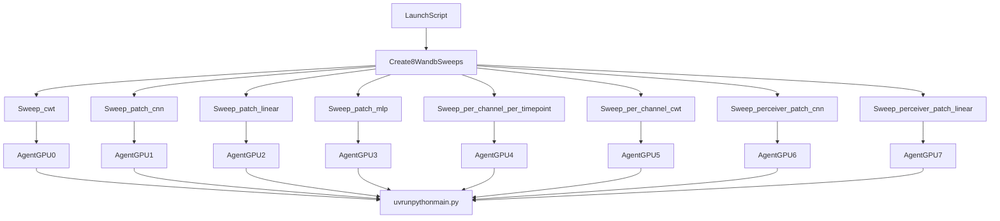

# Plan: 8 Parallel W&B Tokenizer Sweeps

## Goal

Run hyperparameter search on one machine (8xA100) with **one W&B sweep per tokenizer**, using these tokenizer configs:

- `cwt`
- `patch_cnn`
- `patch_linear`
- `patch_mlp`
- `per_channel_per_timepoint`
- `per_channel_cwt`
- `perceiver_patch_cnn`
- `perceiver_patch_linear`

Each sweep varies:

- `hyperparameters.learning_rate`
- `hyperparameters.window_length`
- `hyperparameters.patch_duration`

## Why this setup is best for your case

- One sweep per tokenizer keeps search spaces and results isolated and easy to compare in W&B.
- 8 local W&B agents mapped one-per-GPU (`CUDA_VISIBLE_DEVICES=0..7`) fully utilizes the node without scheduler overhead.
- Existing config wiring already supports these parameters:
  - `module.learning_rate: ${hyperparameters.learning_rate}` in `[/home/nvidia/Foundry/configs/module/default.yaml](/home/nvidia/Foundry/configs/module/default.yaml)`
  - `data.window_length: ${hyperparameters.window_length}` in `[/home/nvidia/Foundry/configs/data/ajile_singlesess.yaml](/home/nvidia/Foundry/configs/data/ajile_singlesess.yaml)`
  - tokenizer `patch_duration: ${hyperparameters.patch_duration}` across tokenizer YAMLs in `[/home/nvidia/Foundry/configs/model/tokenizer/](/home/nvidia/Foundry/configs/model/tokenizer/)`

## Config strategy

1. Add a reusable sweep experiment base for your dataset/task in `[/home/nvidia/Foundry/configs/experiment/](/home/nvidia/Foundry/configs/experiment/)`.
2. Add one lightweight experiment override per tokenizer that only sets:
  - `defaults` model/data selection
  - `model.tokenizer` selection
  - `run.group` and `run.name` template
3. Add one W&B sweep config per tokenizer (or one template + generator script), each with identical search space and command.
4. Add a launcher script that:
  - creates all 8 sweeps
  - starts 8 background agents pinned to GPU index == tokenizer index

## Execution flow

## Key files to add/update

- New experiment configs in `[/home/nvidia/Foundry/configs/experiment/](/home/nvidia/Foundry/configs/experiment/)`
  - base sweep experiment
  - 8 tokenizer-specific experiment overrides
- New W&B sweep YAMLs in a dedicated folder (recommended):
  - `[/home/nvidia/Foundry/configs/wandb_sweeps/](/home/nvidia/Foundry/configs/wandb_sweeps/)`
- New orchestration script (recommended):
  - `[/home/nvidia/Foundry/scripts/run_tokenizer_sweeps.sh](/home/nvidia/Foundry/scripts/run_tokenizer_sweeps.sh)`

## Command pattern (to wire in sweep config)

Use W&B command args to override Hydra parameters directly in `main.py` runs:

- `experiment=<tokenizer_experiment_name>`
- `hyperparameters.learning_rate=${learning_rate}`
- `hyperparameters.window_length=${window_length}`
- `hyperparameters.patch_duration=${patch_duration}`

This keeps `main.py` unchanged and leverages existing Hydra interpolation.

## Runtime safeguards

- Use distinct `run.group` per tokenizer for clean dashboards.
- Keep `run.name` deterministic and include tokenizer + major hyperparameters.
- For tokenizers with `patch_duration: null` defaults (`cwt`, `per_channel_cwt`, `per_channel_per_timepoint`), still pass sweep `patch_duration` as a tracked hyperparameter even if the tokenizer embedding ignores it.
- Start with bounded trial count per sweep to validate stability before scaling.

## Validation checklist

- Single local smoke run for each tokenizer experiment (8 quick runs).
- One mini-sweep (2–3 trials) on one tokenizer to validate W&B command wiring.
- Full 8-sweep launch with one agent per GPU.
- Verify in W&B that:
  - each sweep maps to one tokenizer,
  - hyperparameters are logged,
  - run grouping/naming is correct,
  - GPU utilization is balanced across devices.

