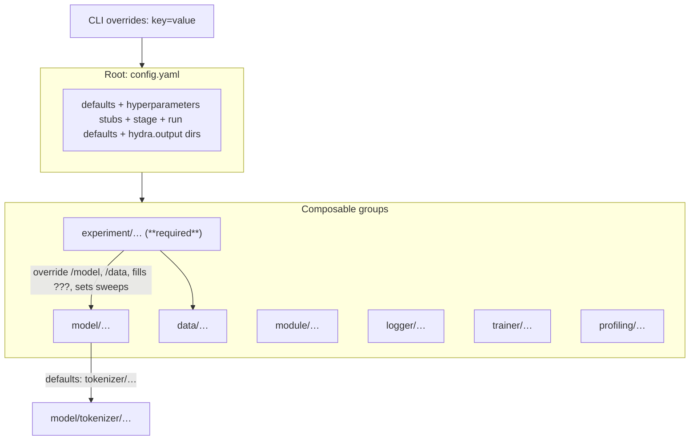

# Foundry configuration reference (`configs/`)

Training is driven by **[Hydra](https://hydra.cc/)**. The CLI entrypoint is `main.py`, which registers the config directory and root file:

```python
@hydra.main(version_base=None, config_path="configs", config_name="config")
```

You **must** select an **`experiment`** config (the root declares `experiment: ???`). Everything else composes around that choice.

---

## How pieces fit together (composition graph)

Hydra merges config **groups** in the order declared in [`config.yaml`](config.yaml). Typical flow for a training run:



- **`config.yaml`** defines the skeleton: which groups exist, **`hyperparameters.*` placeholders**, **`stage.*`**, **`run.*`**, and Hydra runtime directories (`${SCRATCH}` / `./outputs`).
- **`experiment/*.yaml`** is where you assemble a run: **`defaults:`** overrides for `model`, `data`, (optional) `hydra/launcher`, plus concrete **`run`**, **`hyperparameters`**, **`data`**, **`model`**, **`trainer`**, **`hydra.sweeper`**, etc.

---

## Directory tree (what lives where)

```text
configs/
├── README.md                      ← this file
├── config.yaml                    ← Hydra root: defaults list + global keys
├── hydra/
│   └── launcher/
│       ├── local_gpu.yaml          ← optional: parallel local GPU jobs
│       └── slurm_default.yaml    ← SLURM / submitit launcher (packed jobs)
├── experiment/                    ← REQUIRED choice: assemble model+data+hparams
│   ├── auditory_decoding/
│   │   ├── baseline_freqdec_singlesess_multirun.yaml
│   │   └── poyo_onoff_singlesession.yaml
│   └── tokenizer_explore/
│       ├── default.yaml
│       ├── eegnet_ajile_active.yaml
│       ├── poyo_ajile_*.yaml
│       └── …
├── data/                           ← Lightning datamodule + dataset args
│   ├── ajile/
│   │   ├── singlesess.yaml
│   │   ├── multisess.yaml
│   │   └── allsess.yaml
│   ├── neurosoft_minipigs/
│   │   ├── singlesess.yaml
│   │   └── multisess_raw.yaml
│   └── physionet/default.yaml
├── model/                          ← `torch.nn` / Lightning model `_target_`
│   ├── poyo_eeg.yaml               ← nests `tokenizer/` via Hydra defaults
│   ├── eegnet.yaml, linear.yaml, mlp.yaml, gru.yaml
│   ├── shallowcnn.yaml, temporalcnn.yaml
│   └── tokenizer/                  ← EEGTokenizer subtree (many architectures)
├── module/                         ← Lightning `LightningModule` wrapper
│   ├── classification.yaml
│   └── regression.yaml
├── trainer/
│   └── default.yaml               ← Lightning `Trainer` + callbacks
├── logger/
│   ├── wandb.yaml
│   └── csv.yaml
└── profiling/
    └── default.yaml               ← used by profile_training.py (not main wiring)
```

---

## Configurable parameters for `main.py` (mental model)

Everything below ends up on the **`cfg`** object passed to `main()`. You can set these in **`experiment/*.yaml`** or override on the **`python main.py … key=value`** command line.

### Top-level keys (where they are declared)

```text
cfg
├── defaults / composition           → config.yaml + experiment YAML `defaults:` list
├── hyperparameters                   → REQUIRED in experiment (fills ??? from config.yaml)
│   └── (see “Hyperparameter bag” below)
├── run                               → REQUIRED in experiment (name, seed, logging, wandb-ish flags)
├── stage                             → optional; defaults in config.yaml
├── model                             → REQUIRED via experiment (`model: null` at root → choose in experiment)
├── data                              → REQUIRED via experiment (`data: null` at root)
├── module                            → defaults to configs/module/classification.yaml
├── logger                            → defaults to configs/logger/wandb.yaml
├── trainer                           → configs/trainer/default.yaml (+ experiment overrides)
├── profiling                         → configs/profiling/default.yaml (present on cfg; profiling entrypoint reads it)
└── hydra                             → experiment often extends sweeper / launcher
```

---

### Hyperparameter bag (`hyperparameters`)

Declared as **mandatory placeholders** in [`config.yaml`](config.yaml); your **`experiment`** must assign values.

| Key                  | Typical role                                                                 | Consumers (examples) |
|---------------------|-------------------------------------------------------------------------------|----------------------|
| `batch_size`        | Loader batch size                                                             | `data/*.yaml`, sweeps |
| `sequence_length`   | Temporal window length (seconds / code-defined units per datamodule)        | `data/*.yaml`, `model/poyo_eeg.yaml` |
| `patch_duration`    | Tokenizer patch length in time                                                 | `model/tokenizer/*.yaml`, nested overrides in experiments |
| `sampling_rate`     | Hz; used by `${patch_samples:…}` resolver                                   | tokenizers referencing `${hyperparameters.sampling_rate}` |
| `fold_number`       | CV / split fold index                                                         | `data/*.yaml`, sweep grids |
| `num_workers`       | DataLoader workers                                                            | `data/*.yaml`, `hydra/launcher/slurm_default.yaml` (`cpus_per_task`) |
| `learning_rate`     | Optimizer                                                                     | `module/classification.yaml`, `module/regression.yaml` |
| `weight_decay`      | Optimizer                                                                     | same as above |
| `num_channels`      | Max/fixed channels for tokenizers (not in root `???` — add in experiment when needed) | many `model/tokenizer/*.yaml` |
| `session_configs`   | Per-session layouts (often **auto-filled by `main.py`** if omitted)           | spatial-session tokenizers; see below |
| `window_length`     | Used by **multisess_raw** NeuroSoft preset                                    | `data/neurosoft_minipigs/multisess_raw.yaml` |

**Auto-populated in `main.py` (training only)** when missing:

- `hyperparameters.session_configs` — inferred from instantiated `cfg.data`.
- `hyperparameters.num_channels` — max channels from dataset.

So you omit these when the defaults work; spatial tokenizers **need** them resolved before model build.

---

### Run metadata (`run`)

Used throughout `main.py` and logger configs.

| Key                         | Defined in                         | Purpose |
|-----------------------------|------------------------------------|---------|
| `name`                      | experiment YAML                    | Run name (WandB, paths, hashing) |
| `group`                     | experiment YAML                    | WandB group + Hydra `hydra.run.dir` |
| `tags`                      | experiment YAML                    | WandB tags (`logger/wandb.yaml` interpolates `${run.tags}`) |
| `seed`                      | experiment YAML                    | `lightning.seed_everything` |
| `log_level`                 | experiment YAML                    | Logging verbosity |
| `resume_if_checkpoint_exists` | [`config.yaml`](config.yaml)     | Resume `last.ckpt` when **not** a SLURM restart |
| `resume_wandb_if_name_matches` | [`config.yaml`](config.yaml)    | Derive deterministic WandB `id` from `run.name` |
| `float32_matmul_precision`   | [`config.yaml`](config.yaml)     | `torch.set_float32_matmul_precision` |

Hydra stores outputs under **`${oc.env:SCRATCH,./outputs}/runs/${run.group}/${run.name}`** (see `config.yaml`).

---

### Staging (`stage`)

Loaded in `main.py` when **`SLURM_TMPDIR`** is set — copies/processes data locally.

| Key               | Default in config.yaml | Meaning |
|-------------------|-------------------------|---------|
| `skip`            | `false`                 | Skip staging entirely |
| `source_root`     | defaulted in Python     | `../scratch/brainsets/processed` |
| `compressed_root` | defaulted in Python     | `../scratch/brainsets/compressed` |
| `compress`        | defaulted in Python     | `false` |

Override in experiment YAML or CLI: `stage.skip=true`, etc.

---

### Model (`model`)

Pick a **`configs/model/*.yaml`** file via experiment `defaults: - override /model: …`.

- Each file sets **`_target_`** (`hydra.utils.instantiate`) and architecture hyperparameters (`num_channels`, `embed_dim`, …).
- **`poyo_eeg.yaml`** nests **`tokenizer:`** via **`defaults: - tokenizer: …`** under [`configs/model/tokenizer/`](model/tokenizer).
- Experiment YAML can **overlay** nested keys (`model.tokenizer.channel_strategy.num_channels`, `model.zero_output_timestamps`, …).

Representative presets:

```text
model/
├── linear.yaml, mlp.yaml, gru.yaml
├── shallowcnn.yaml, temporalcnn.yaml, eegnet.yaml
└── poyo_eeg.yaml  (+ tokenizer/*.yaml subgraph)
```

---

### Data (`data`)

Pick **`configs/data/<dataset>/<preset>.yaml`**. Common fields:

| Field                     | Typical source        | Notes |
|---------------------------|------------------------|-------|
| `_target_`                | data YAML             | Lightning `DataModule` class |
| `root`                    | data YAML             | Often patched after staging |
| `batch_size`             | `${hyperparameters.batch_size}` | |
| `num_workers`             | `${hyperparameters.num_workers}` | |
| `sequence_length`         | `${hyperparameters.sequence_length}` | singlesess presets |
| `window_length`           | multisess presets     | e.g. `multisess_raw` |
| `split_type`, `task_type` | experiment            | Usually `???` in data YAML |
| `fold_number`             | `${hyperparameters.fold_number}` | |
| `recording_ids`           | data or experiment    | list or sweep index (`.0`) |
| `pin_memory`, `seed`      | data YAML             | |
| Physionet-only            | `physionet/default.yaml` | `transforms`, `fold_type`, `uniquify_channel_ids`, … |

Valid **`task_type`** values come from the datamodule implementation (`get_readout_specs_for_task` in `main.py`).

---

### Lightning module (`module`)

| File                      | `_target_`                             |
|---------------------------|----------------------------------------|
| `module/classification.yaml` | `foundry.training.ClassificationModule` |
| `module/regression.yaml`     | `foundry.training.RegressionModule` |

| Key                    | Meaning |
|------------------------|---------|
| `learning_rate`, `weight_decay` | Wired from `${hyperparameters.*}` |
| `class_weights`        | `null`, `"none"`, `"auto"`, or tensor-like (classification) |
| `class_weight_smoothing` | smoothing when `class_weights: auto` |

---

### Trainer (`trainer`)

[`trainer/default.yaml`](trainer/default.yaml) → **`lightning.Trainer`** with **`logger: ${logger}`** and a **`callbacks:`** mapping.

**Important:** `main.py` converts **`trainer.callbacks`** from a **dict → list** before `instantiate`, so YAML may use keyed callbacks (easier merges in experiments).

Frequently overridden in experiments: **`max_epochs`**, **`precision`**, **`callbacks.early_stopping.monitor`**, **`callbacks.model_checkpoint.*`**.

---

### Logger (`logger`)

| File               | Backend |
|--------------------|---------|
| `logger/wandb.yaml`| `WandbLogger`; `save_dir`, `group`, `tags`, `name` from `run` |
| `logger/csv.yaml` | `CSVLogger` |

`main.py` patches **`logger.save_dir`**, **`logger.id`** (optional), **`trainer.callbacks.model_checkpoint.dirpath`**, **`trainer.default_root_dir`** at runtime using Hydra’s output dir.

---

### Hydra job config (`hydra`)

- **Output dirs** template: [`config.yaml`](config.yaml).
- **`hydra/sweeper`**: define **`params`** for `python main.py -m` multiruns (see `experiment/.../baseline_freqdec_singlesess_multirun.yaml`, `poyo_ajile_sweep.yaml`).
- **`hydra/launcher`**: e.g. `hydra/launcher=slurm_default` or `local_gpu`.

---

### Profiling (`profiling`)

Used by **`profile_training.py`**, same root config. Controls PyTorch profiler schedule and output (**`max_epochs`**, **`output_dir`**, **`schedule.*`**, etc. in [`profiling/default.yaml`](profiling/default.yaml)).

---

## Custom OmegaConf resolvers (usable in YAML)

Registered in **`foundry.config_resolvers.register_resolvers()`** — useful in experiment/datamodule YAML:

| Resolver syntax | Purpose |
|-----------------|---------|
| `${patch_samples:duration,rate}` | Integer patch samples from duration × sampling rate |
| `${int_div:n,d}`                  | Exact integer division (`accumulate_grad_batches` patterns) |
| `${get_num_ecog_channels_by_name:root,id}` | Channel count from an `.h5` recording |
| `${config_list_sweep_choices:path/to.yaml,key}` | Build sweep axis from list in YAML file |
| `${find_checkpoints:…}`, `${get_overrides_from_ckpt:…}` | Checkpoint / rerun utilities |

See [`foundry/config_resolvers.py`](../foundry/config_resolvers.py).

---

## Minimal new experiment checklist

1. **Create** `configs/experiment/<area>/<your_run>.yaml` with `# @package _global_` at the top (matches existing experiments).
2. **`defaults:`** — override at least **`/model`** and **`/data`** (`config.yaml` starts both as **`null`**).
3. **`run:`** — set **`name`, `group`, tags, seed, log_level`**.
4. **`hyperparameters:`** — satisfy every **`???`** from root [`config.yaml`](config.yaml); add **`num_channels`** / **`sampling_rate`** if your tokenizer references them.
5. Set **`data.split_type`** and **`data.task_type`** (and **`recording_ids`** if not fixed in data preset).

**Example invocation:**

```bash
uv run python main.py experiment=auditory_decoding/poyo_onoff_singlesession
```

**Sweep example:**

```bash
uv run python main.py experiment=tokenizer_explore/poyo_ajile_sweep -m
```

---

## Inspect the fully merged config for a command

Hydra prints the composed config when you add **`--cfg job`**.

```bash
uv run python main.py experiment=tokenizer_explore/poyo_ajile_active --cfg job
```

That is the fastest way to see **every resolved key** for a run you are designing.
