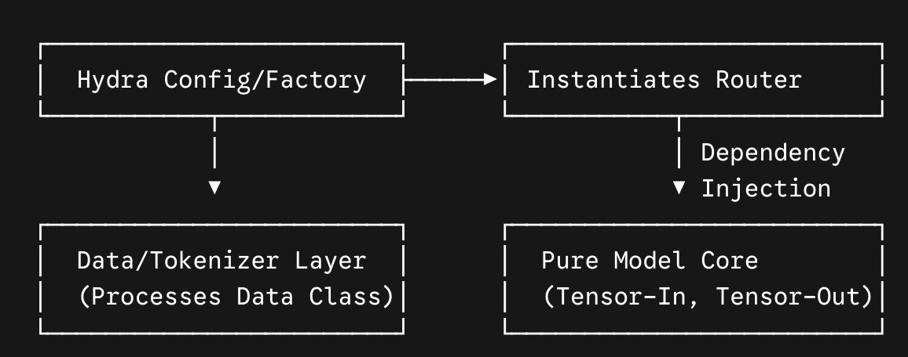

# Architectural Suggestions Report

Architecturally speaking, your v3 design is exceptionally strong. It successfully shifts the project from an anti-pattern (a global, mutable god-registry) to a clean, decoupled, and highly modern architectural lifecycle.

That being said, pushing this from a solid 8.5/10 to a "production-grade, future-proof 10/10" requires addressing a few subtle architectural leakages where layers are still blended.

Here are the four key architectural enhancements needed to achieve true optimality.

## 1. Eliminate Configuration and Data Leakage from the Model Core

### The Flaw
In Sections 7.1 and 7.2, your pure `nn.Module` (`POYOEEGModel`) is still coupled to two external layers:

- **Hydra/Config Layer:** The model constructor accepts raw `TaskConfig` objects and manually parses dictionary keys (e.g., `cfg.head.get(...)`, `pop("_target_")`).
- **Data Layer:** The model contains a `tokenize()` method that directly ingests a CPU-bound data structure (e.g., `temporaldata.Data`) and executes data transforms (`TargetExtractor`).

### The Optimal Refactor
To keep models strictly exportable (ONNX, torch.compile, CoreML) and decoupled from your experimentation framework, the model should only care about tensors and submodules.

- Apply Dependency Injection: Instantiate your ReadoutRouter and ReadoutHeads directly via Hydra or a factory function, then pass the fully constructed router/heads into the model constructor.
- Isolate Tokenization: Move the tokenize() method out of the model class entirely. Create a dedicated POYOTokenizer or data pipeline class.



## 2. Unify the SSL Intermediates Protocol (Fix the Hook Contradiction)

### The Flaw
Your design document proposes an elegant protocol in Section 5.4 (`return_intermediates=True`), but breaks its own encapsulation rule in Section 5.3:

```python
# From Section 5.3: The callback violently reaches deep into the backbone
processor = model.backbone.processor
self._hook_handle = processor.register_forward_hook(self._capture_intermediates)
```

If a future architecture renames `processor` to `encoder_block` or restructures its internals, your `IntermediateMAEStrategy` callback will instantly crash.

### The Optimal Refactor
Enforce strict boundaries. Callbacks should never access nested private attributes of a model backbone. Rely exclusively on the `return_intermediates` dictionary protocol or expose an explicit, public hook-registration interface on the top-level model wrapper.

```python
# The Callback should simply read the protocol output in compute_ssl_loss
def compute_ssl_loss(self, model, batch, model_outputs, backbone_intermediates):
    # Safe, decoupled interface
    pre_mask = backbone_intermediates.get("processor_output")
```

## 3. Scale the Multi-Task Router (Eliminate Python Loops on GPU)

### The Flaw
In Section 4.4, your multi-task `ReadoutRouter` processes active tasks sequentially using a Python loop:

```python
for idx, name in enumerate(self._task_names):
    mask = task_index == idx
    if not mask.any():
        continue
    outputs[name] = self.heads[name](output_embs[mask])
```

### The Optimal Refactor
While this is perfectly fine for 2 or 3 tasks, it will introduce a major GPU starvation bottleneck if your foundational model scales to dozens or hundreds of downstream task readouts simultaneously. Sequential boolean masking forces multiple kernel launches and serializes execution. If your multi-task scaling roadmap grows large, modify the router to leverage Batched/Grouped GEMMs or utilize PyTorch’s native `torch.nested` (Nested Tensors) or `torch.vmap` to evaluate all active heads in parallel without a serialization loop.

### 4. Summary: Architectural Cleanliness Matrix

| Component    | Proposed v3 Status               | Optimal Target                         | Why it Matters                                                    |
|--------------|----------------------------------|----------------------------------------|-------------------------------------------------------------------|
| Model Init   | Parses Hydra Dicts               | Receives ready nn.Modules              | True separation of config and weights.                            |
| Tokenize     | Lives inside the model           | Moved to a Data Pipeline class         | Models remain pure mathematical graphs.                           |
| SSL Hooks    | Direct submodule hacking         | Standardized protocol dict             | Prevents code breakage when model internals change.               |
| Routing      | Python iteration over masks      | Batched execution (long-term)          | Maximizes GPU utilization at scale.                               |

With these refinements applied to your v3 draft, your architecture will be robust, highly scalable, and exceptionally maintainable.