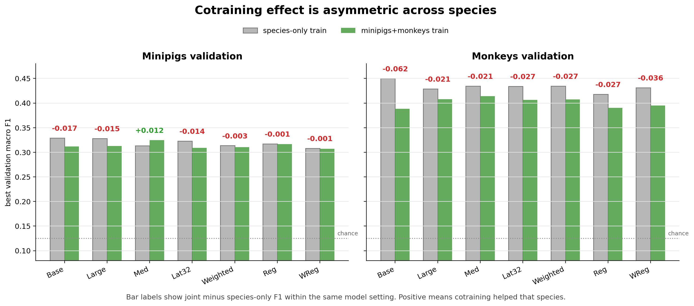
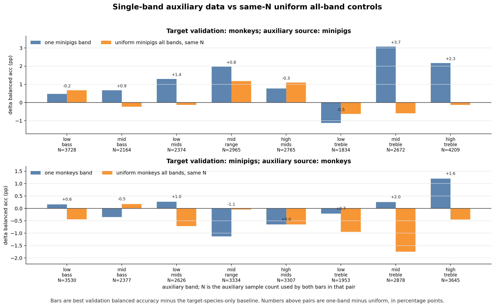
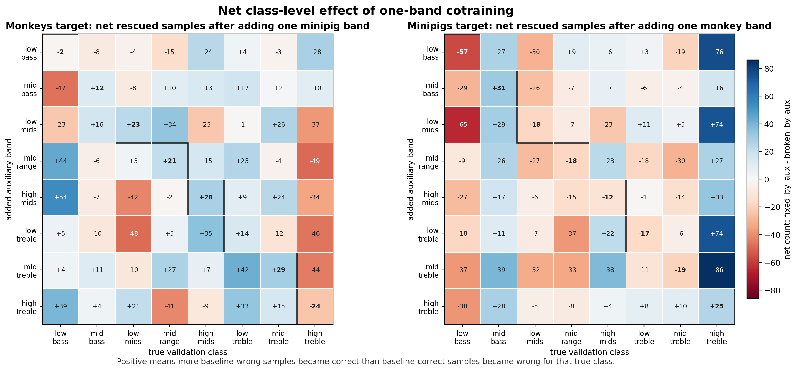
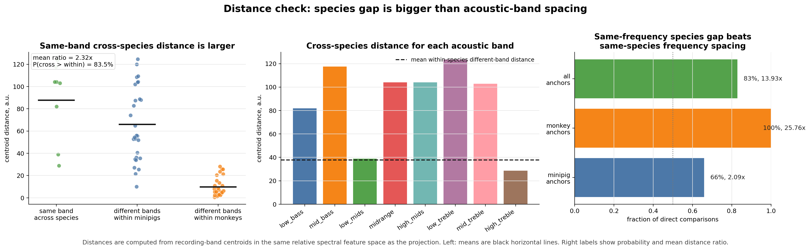

# Neurosoft Cross-Species Frequency Decoding

## Question

Can acoustic-stimulation data from one species improve 8-band decoding in the
other species? The experiments use causal within-session splits and evaluate
minipig and monkey validation samples separately.

The principal result is mixed transfer rather than a general cotraining gain.
Full joint training usually reduced monkey macro F1 and was inconsistent for
minipigs. Some single auxiliary bands improved target-species balanced
accuracy, but equally sized uniform all-band controls usually did not reproduce
the strongest gains. This makes a pure data-volume explanation unlikely, but
the experiments are exploratory single-seed runs and do not establish a causal
band-specific transfer effect.

## Shared Setup

- Split: `intrasession-causal`, fold 0, seed 42.
- Input: 0.5 s windows sampled at 2 kHz.
- Tokenizer: per-channel 1D convolution, 0.1 s non-overlapping signal patches,
  64 filters, 192 signal features concatenated with a 64-dimensional learned
  channel embedding to form 256-dimensional POYO tokens.
- Data quality: recordings with fewer than 8 neural channels are excluded.
- Encoder: learned source-namespaced channel embeddings; no session embedding
  is added to encoder tokens.
- Decoder query: task embedding + source-namespaced session embedding + source
  (species) embedding. Both species use the same task query and shared readout
  head after conditioning.
- Selection in the new configs: early stopping and checkpoints monitor
  `val/loss` with patience 20.
- Reporting: validation metrics and confusion matrices are logged separately
  under `val/minipigs/...` and `val/monkeys/...`.

The class mapping is inherited from
`configs/tasks/neurosoft_acoustic_stim_8band.yaml`:

| Band | Raw frequencies (Hz) |
| --- | --- |
| low bass | 100, 200, 300, 400, 500, 650 |
| mid bass | 800 |
| low mids | 1,000, 1,500 |
| midrange | 2,000, 3,000, 4,000 |
| high mids | 5,000 |
| low treble | 7,700, 8,000, 9,500 |
| mid treble | 10,000, 15,000 |
| high treble | 12,000, 13,000, 16,000, 18,000, 20,000, 30,000, 40,000 |

## Results

### Full cotraining

Across seven preliminary architecture/loss settings, joint training reduced
monkey macro F1 by 2.1 to 6.2 percentage points (pp). Minipig changes ranged
from -1.7 to +1.2 pp; only the medium tokenizer setting improved minipigs
(0.313 to 0.325) while reducing monkeys (0.435 to 0.414).



The underlying values are in
[`full_cotrain_f1_summary.csv`](data/full_cotrain_f1_summary.csv). These runs
span multiple model settings and should be treated as an architecture survey,
not a paired estimate of one fixed training recipe.

### One-band auxiliary controls

The controlled sweep used target-species-only balanced-accuracy baselines of
0.42028 for monkeys and 0.32846 for minipigs. The largest observed gains were:

| Target | Auxiliary data | One-band delta | Same-N uniform delta | One-band minus uniform |
| --- | --- | ---: | ---: | ---: |
| monkeys | minipig mid treble, N=2,672 | +3.07 pp | -0.59 pp | +3.67 pp |
| minipigs | monkey high treble, N=3,645 | +1.20 pp | -0.45 pp | +1.65 pp |

Not every band helped. Minipig low treble reduced monkey balanced accuracy by
1.13 pp, and monkey midrange reduced minipig balanced accuracy by 1.13 pp.
Uniform controls were also mixed. The pattern therefore depends on auxiliary
composition, not only the number of added samples.



All 16 comparisons and exact sample counts are in
[`oneband_vs_uniform_bandmatched_delta.csv`](data/oneband_vs_uniform_bandmatched_delta.csv).
Here, pp means an absolute percentage-point change in balanced accuracy.

### Paired prediction changes

Adding one auxiliary band changed predictions well beyond the corresponding
target class. Among baseline-wrong samples that became correct, 75% to 96% had
a true class different from the added auxiliary band. However, auxiliary runs
also broke samples that the baseline classified correctly. The net heatmap
shows both effects and does not support a simple same-frequency rescue story.



Aggregate fixed/broken counts are in
[`single_band_paired_correctness_summary.csv`](data/single_band_paired_correctness_summary.csv)
and [`oneband_fixed_same_vs_other_counts.csv`](data/oneband_fixed_same_vs_other_counts.csv).
Per-window prediction-transition files are intentionally excluded.

### Decoder-free domain diagnostic

Relative spectral features from 1,012 real validation windows were aggregated
to 344 recording-band medians. In this feature space, the mean distance between
species for the same acoustic band was 2.32 times the mean distance between
different bands within a species. A same-band cross-species distance exceeded
a different-band within-species distance in 83.5% of pairwise comparisons.



The compact aggregate is in
[`relative_spectral_distance_summary.csv`](data/relative_spectral_distance_summary.csv).
These hand-designed spectral features are a diagnostic, not proof that POYO's
learned latent space has identical geometry.

## Reproduction

Run the matched baselines and full joint condition:

```bash
uv run python main.py experiment=auditory_decoding/poyo_neurosoft_freqband8_minipigs_causal
uv run python main.py experiment=auditory_decoding/poyo_neurosoft_freqband8_monkeys_causal
uv run python main.py experiment=auditory_decoding/poyo_neurosoft_freqband8_joint_causal
```

Sweep all one-band auxiliary conditions for monkey validation:

```bash
uv run python main.py -m \
  experiment=auditory_decoding/poyo_neurosoft_freqband8_monkeys_plus_minipig_band_causal \
  auxiliary_band=low_bass,mid_bass,low_mids,midrange,high_mids,low_treble,mid_treble,high_treble
```

Replace the experiment with
`poyo_neurosoft_freqband8_minipigs_plus_monkey_band_causal` for minipig
validation. The two corresponding `*_uniform_causal` configs resolve the
correct per-band matched sample count from `auxiliary_band`.

## Interpretation And Next Steps

The evidence is consistent with species/domain structure being stronger than
the shared frequency-band structure. A source query can tell the shared
decoder which species produced a sample, but it does not force the encoder to
align equivalent acoustic content across species. Extra data can therefore
regularize some decision boundaries while moving others in the wrong
direction.

Before making a stronger claim:

1. Repeat the baseline, full-joint, two strongest one-band, and matched-volume
   controls with at least 3 to 5 seeds.
2. Select one checkpoint per run using `val/loss`, then report all source and
   class metrics at that checkpoint rather than choosing each metric's best
   epoch independently.
3. Check whether gains survive leave-one-session or leave-one-subject
   evaluation and report uncertainty across sessions.
4. Compare explicit domain alignment or small source-specific input adapters
   against the shared-backbone/shared-readout baseline.
5. Sweep window duration separately; longer windows contain more stimulus
   evidence and change the effective label density.

## Limitations

- Current headline comparisons are single-seed exploratory runs.
- Several tables use each run's best validation metric, which can favor noisy
  trajectories and differs from fixed-checkpoint comparison.
- The preliminary full-cotrain figure combines several architecture settings.
- Auxiliary trial counts are band-dependent because all available trials from
  the selected band were used; the uniform controls match each count exactly.
- No result here establishes biological equivalence or causal transfer between
  species.
