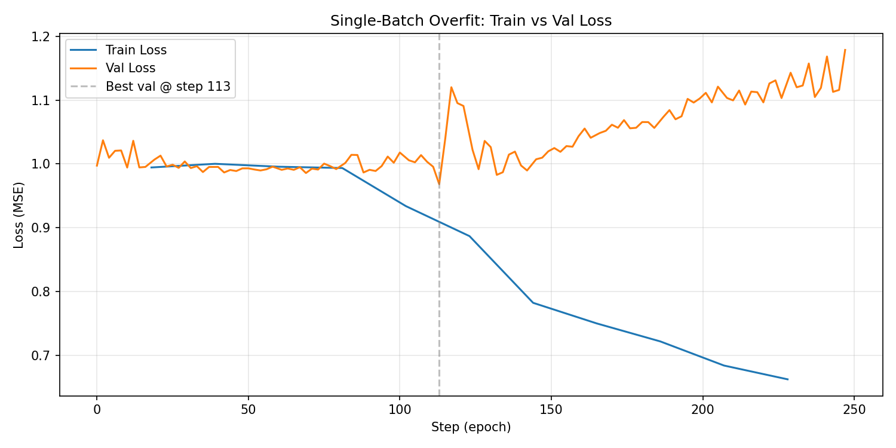

# Single-Batch Overfit Sanity Check

**Status:** Completed
**Date started:** 2026-07-07
**Parent experiment:** None (root)
**Follow-up experiments:** [002 - Overfit Single Session](002-overfit-single-session.md)

## Background

Before investing GPU hours in full pretraining, we need to verify that the
MaskedPOYOEEG model with the ResampleCNN tokenizer has enough capacity to
memorize at least a single batch. This is a standard deep learning sanity check:
if the model cannot overfit one batch, there is likely a bug in the architecture,
loss computation, or data pipeline.

The model uses a Perceiver IO backbone with masked autoencoder (MAE) training:
50% of input tokens are randomly masked, and the model must reconstruct them.
Because the masking is random, even the same batch produces different
inputs/targets each epoch.

## Question

Can the MaskedPOYOEEG model with ResampleCNN tokenizer drive the training loss
toward zero on a single deterministic batch?

## Hypothesis

With a high learning rate (1e-3 vs default 1e-4), no early stopping, and
deterministic sampling of a single train/val batch, the training loss should
decrease steadily across 200 epochs, demonstrating that the model has sufficient
capacity to memorize the batch. Validation loss (same batch, different random
mask) may diverge since the model memorizes specific mask patterns rather than
learning general representations.

## Experiment

### Setup

- **Model:** `MaskedPOYOEEGModel`, embed_dim=256, depth=4, mask_ratio=0.5, tokenizer=`per_channel_resample_cnn`
- **Data:** `OpenNeuroMultiBrainset` (klinzing_sleep_ds005555 + shirazi_hbnr1_ds005505), batch_size=64, num_channels=128
- **Task:** `masked_reconstruction` (MAE, MSE loss)
- **Training:** max_epochs=200, LR=1e-3, bf16-mixed, 1 train batch, 1 val batch, deterministic sampling, no early stopping
- **Hardware:** 1x NVIDIA L40S (Mila cluster, SLURM job 10065808)
- **WandB:** project=`foundry_pretraining`, group=`DEBUGGING`, run=`DEBUGGING_STUFF_OVERFIT_HILR`, id=`gii7gvev`

### Launch command

```bash
uv run python main.py \
  experiment=pretraining/poyo_multi_dataset_pretrain \
  logger=wandb \
  run.name=DEBUGGING_STUFF_OVERFIT_HILR \
  run.group=DEBUGGING \
  hyperparameters.num_workers=0 \
  hyperparameters.learning_rate=0.001 \
  ~trainer.callbacks.early_stopping \
  +trainer.limit_train_batches=1 \
  +trainer.limit_val_batches=1 \
  +trainer.deterministic=true \
  +trainer.callbacks.deterministic_sampler._target_=foundry.training.callbacks.DeterministicSamplerCallback
```

### Key config overrides

| Override | Purpose |
|----------|---------|
| `hyperparameters.learning_rate=0.001` | 10x default LR to accelerate memorization |
| `+trainer.limit_train_batches=1` | Train on exactly 1 batch per epoch |
| `+trainer.limit_val_batches=1` | Validate on exactly 1 batch per epoch |
| `+trainer.deterministic=true` | Reproducible results |
| `~trainer.callbacks.early_stopping` | Disable early stopping to let it run all 200 epochs |
| `+trainer.callbacks.deterministic_sampler` | Same batch every epoch |

## Results

### Summary

The model successfully overfits the single batch. Training loss decreased
monotonically from ~1.006 to ~0.643 over 119 epochs (run was cut short of the
200 epoch target). Validation loss initially improved slightly (best 0.968 at
epoch 54) but then diverged to ~1.179, which is expected: the model is
memorizing specific mask patterns rather than learning generalizable
reconstruction.

### Metrics

| Metric | Value |
|--------|-------|
| Initial train loss (epoch 0) | ~1.006 |
| Final train loss (epoch 118) | ~0.643 |
| Best val loss | ~0.968 (epoch 54) |
| Final val loss (epoch 118) | ~1.179 |
| Best checkpoint | `best-epoch054-val_loss_0.9682.ckpt` |
| Total epochs completed | ~119 / 200 |

### Analysis

Results are extracted programmatically from WandB.

**Analysis script:** `analysis/001_overfit_single_batch.py`

```bash
uv run python analysis/001_overfit_single_batch.py
```

The script fetches the full training history via `wandb.Api()`, prints a summary
table, and saves a train/val loss curve to `analysis/figures/`.

### Figures

After running the analysis script:



## Conclusions

The hypothesis is **confirmed**. The model has sufficient capacity to memorize a
single batch: training loss dropped ~36% (1.006 -> 0.643) and was still
decreasing when the run ended. The diverging validation loss is expected and
healthy — it confirms the model is truly memorizing mask-specific patterns
rather than learning trivially.

This validates that the architecture, loss function, data pipeline, and
tokenizer are wired correctly. We can proceed to more meaningful training
regimes.

## Notes for future experiments

- The train loss was still decreasing at epoch 119 — running longer or using an
  even higher LR would drive it closer to zero.
- The val loss divergence after epoch 54 is purely a masking artifact (different
  random mask on same data). This is not a concern for the overfit test.
- Next step: try overfitting a single full session (many batches) to verify the
  model can learn a coherent reconstruction from a larger slice of data before
  moving to full multi-session pretraining.
- Consider whether `warmup_epochs: 10` (in default config) vs 0 (overridden
  here) matters for convergence speed in the real training regime.
