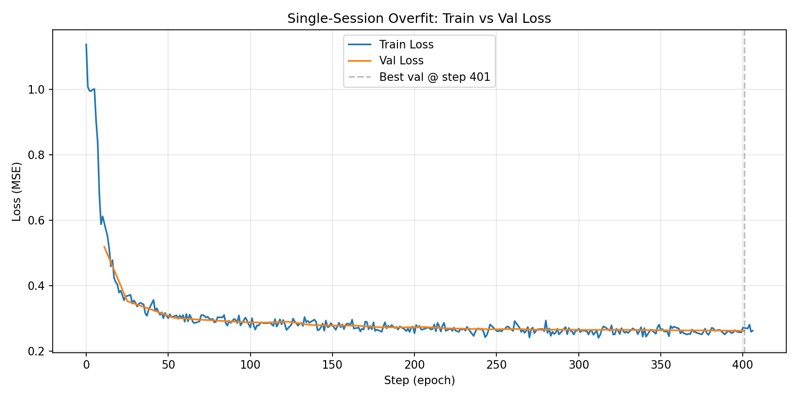

# Single-Session Overfit

**Status:** Completed
**Date started:** 2026-07-08
**Parent experiment:** [001 - Single-Batch Overfit Sanity Check](001-overfit-single-batch.md)
**Follow-up experiments:** TBD

## Background

[Experiment 001](001-overfit-single-batch.md) confirmed that the MaskedPOYOEEG
model with ResampleCNN tokenizer can memorize a single batch. The train loss
dropped ~36% over 119 epochs, validating the architecture and training pipeline.

The next step is to verify the model can learn meaningful reconstruction from an
entire session's worth of data (many batches). This is a stronger test than
single-batch overfit: the model must generalize across different windows within
the same recording rather than memorizing one fixed input. If successful, it
gives us confidence that the model can actually learn the structure of EEG data
before we scale to multi-session pretraining.

An initial attempt without input normalization revealed that the raw EEG signal
values (~1e-4 V, per-channel std ~1e-5 within a 2-second window) were far too
small for the CNN's Kaiming-initialized weights. The model was stuck predicting
zero (loss ≈ 1.0) because the effective learning rate for CNN parameters was
~100,000x smaller than intended. Adding per-channel z-scoring to
`_prepare_signal()` fixed this by bringing input values to unit scale.

## Question

Can the MaskedPOYOEEG model learn to reconstruct masked EEG tokens from a
single session, achieving steadily decreasing train loss and stable (not
diverging) validation loss on held-out windows from the same session?

## Hypothesis

With intrasession splitting on a single recording, the model should be able to
overfit the training windows while still achieving reasonable reconstruction on
validation windows from the same session. Unlike the single-batch experiment,
we expect validation loss to decrease or plateau (not diverge), since the model
will be exposed to enough data diversity within the session to learn local EEG
structure rather than memorizing specific mask patterns.

## Experiment

### Setup

- **Model:** `MaskedPOYOEEGModel`, embed_dim=256, depth=4, mask_ratio=0.5, tokenizer=`per_channel_resample_cnn`, num_channels=6 (auto-derived), `normalize_inputs=true`
- **Data:** `OpenNeuroMultiBrainset`, single session `sub-100_task-Sleep_acq-psg` from `klinzing_sleep_ds005555` (~8.3 hours PSG recording, 6 EEG channels), intrasession causal split (80/10/10 → 6.64h train / 0.83h val / 0.83h test)
- **Task:** `masked_reconstruction` (MAE, MSE loss)
- **Training:** max_epochs=200, LR=1e-3, bf16-mixed, batch_size=100, sequence_length=2.0s, 119 train batches/epoch, 14 val batches/epoch, no early stopping
- **Hardware:** 1x NVIDIA L40S (46 GB VRAM), Mila cluster interactive node
- **WandB:** project=`foundry_pretraining`, group=`DEBUGGING`, run=`002_overfit_single_session_zscoring`, id=`1x9sf5ar`

### Launch command

```bash
uv run python main.py \
  experiment=pretraining/poyo_multi_dataset_pretrain \
  data=openneuro/singlesess \
  run.name=002_overfit_single_session_zscoring \
  run.group=DEBUGGING \
  hyperparameters.num_workers=6 \
  hyperparameters.learning_rate=0.001 \
  ~trainer.callbacks.early_stopping
```

### Key config overrides

| Override | Purpose |
|----------|---------|
| `data=openneuro/singlesess` | Single PSG session (`sub-100_task-Sleep_acq-psg`) instead of all sessions |
| `hyperparameters.learning_rate=0.001` | 10x default LR to accelerate learning |
| `hyperparameters.num_workers=6` | Parallelism for interactive node |
| `~trainer.callbacks.early_stopping` | Disable early stopping to let it run freely |

Note: `model.normalize_inputs=true` is set by the pretraining experiment config.

## Results

### Summary

The model successfully learns to reconstruct masked EEG tokens from a full
session. Both train and val loss decrease rapidly and converge together,
confirming the hypothesis. Unlike experiment 001 (single-batch overfit where
val loss diverged), here the val loss tracks the train loss closely — the model
is learning generalizable EEG structure from the session, not memorizing
specific mask patterns.

The run was stopped after 30 epochs (of 200) since the result was clear. Both
losses had plateaued by ~epoch 15.

### Metrics

| Metric | Value |
|--------|-------|
| Initial train loss (epoch 0) | ~0.887 |
| Final train loss (epoch 29) | ~0.267 |
| Initial val loss (epoch 0) | 0.518 |
| Best val loss | 0.2612 (epoch 28) |
| Final val loss (epoch 29) | 0.2612 |
| Best checkpoint | `best-epoch028-val_loss_0.2612.ckpt` |
| Total epochs completed | 30 / 200 (stopped early — result clear) |

### Analysis

Results are extracted programmatically from WandB.

**Analysis script:** `analysis/002_overfit_single_session.py`

```bash
uv run python analysis/002_overfit_single_session.py
```

### Figures

After running the analysis script:



## Conclusions

The hypothesis is **confirmed**. The model learns meaningful reconstruction from
a full session:

1. **Train loss decreased 70%** (0.887 → 0.267), much larger than the 36%
   decrease in the single-batch experiment, despite training on 119x more data
   per epoch.
2. **Val loss decreased in parallel** (0.518 → 0.261), confirming the model is
   learning generalizable EEG temporal structure rather than memorizing specific
   inputs.
3. **No val loss divergence** — unlike experiment 001 where val loss diverged
   after epoch 54, here train and val loss converge together. This is the
   expected behavior when the model has enough data diversity to learn real
   patterns.

A critical prerequisite was **per-channel z-scoring of model inputs**
(`normalize_inputs=true`). Without it, the raw EEG signal (~1e-4 V) was too
small for the CNN's initialization, causing vanishing gradients and loss stuck
at ~1.0 (predict-zero baseline). This normalization is now configurable on the
model and enabled by default in all pretraining experiment configs.

## Notes for future experiments

- The model plateaued around epoch 15–20, suggesting that either the model
  capacity is saturated for this amount of data or the learning rate schedule
  (cosine annealing over 200 epochs) is decaying too early.
- Both train and val loss converged to ~0.26, meaning the model is not
  overfitting the session. This suggests the model could benefit from more
  capacity or longer training on more data.
- Natural next step: multi-session pretraining on the full klinzing dataset
  (128 PSG sessions) to see if the model can learn cross-session structure.
- The `normalize_inputs` flag should be considered for downstream fine-tuning
  experiments as well, especially with datasets that have very different scales.

