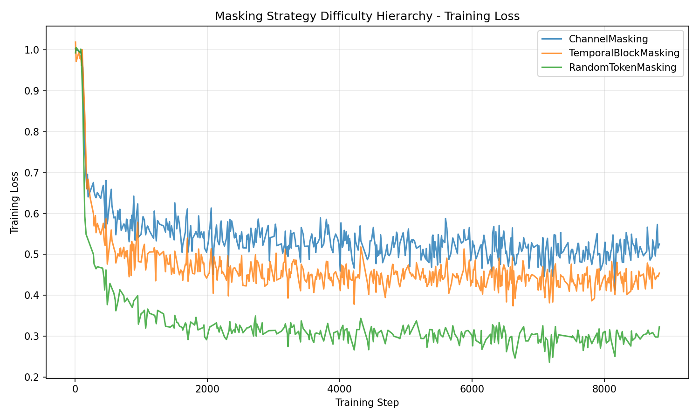

# Masking Strategy Difficulty Hierarchy

**Status:** Completed
**Date started:** 2026-07-09
**Parent experiment:** None (root)
**Follow-up experiments:** [Channel Identity in Reconstruction Decoder Queries](../experiments/004-channel-identity-in-decoder.md)

## Background

In self-supervised pretraining with masked reconstruction, the masking strategy
determines what the model must predict given observed context. Different masking
schemes impose different levels of difficulty: masking entire channels forces
cross-channel generalization, masking contiguous time blocks forces temporal
extrapolation, and random token masking allows the model to interpolate from
nearby observed tokens in both time and channel dimensions. Understanding the
difficulty hierarchy informs curriculum design and helps validate that the
masking implementations behave as expected.

## Question

What is the relative difficulty hierarchy (measured by training loss) of the
three masking strategies: ChannelMasking, TemporalBlockMasking, and
RandomTokenMasking?

## Hypothesis

Time masking (TemporalBlockMasking) should produce the highest training loss
(hardest), followed by channel masking (ChannelMasking), with random token
masking (RandomTokenMasking) being the easiest (lowest loss). Rationale: masking
contiguous temporal blocks removes local temporal context entirely, making
prediction very difficult; channel masking removes all time points for selected
channels but still has temporal continuity within remaining channels; random
masking leaves nearby tokens in both dimensions available for interpolation.

## Experiment

### Setup

- **Model:** MaskedPOYOEEGModel, embed_dim=256, depth=4, 8 cross/self heads, dim_head=128
- **Data:** klinzing_sleep_ds005555 (128 subjects, headband + PSG), intrasession split
- **Task:** Masked reconstruction (MSE loss), mask_ratio=0.5 for all strategies
- **Training:** max 200 epochs, batch_size=100, LR=1e-4, bf16-mixed, gradient_clip=1, NVIDIA L40S
- **WandB:** project=foundry_pretraining, group=PRETRAINING
  - FullChannelMaskingFixed / `j0i9jacr` — ChannelMasking (mask_ratio=0.5)
  - FullTimeMasking10 / `ax19kghy` — TemporalBlockMasking (block_size=10, mask_ratio=0.5)
  - TestingFull / `xcqs9lt5` — RandomTokenMasking (mask_ratio=0.5)

### Launch command

```bash
uv run python main.py experiment=pretraining/poyo_multi_dataset_pretrain run.name=FullChannelMaskingFixed
uv run python main.py experiment=pretraining/poyo_multi_dataset_pretrain run.name=FullTimeMasking10
uv run python main.py experiment=pretraining/poyo_multi_dataset_pretrain run.name=TestingFull
```

### Key config overrides

The only difference between the three runs is the `model.masking` config:
- ChannelMasking: `model.masking._target_=foundry.tasks.masking.ChannelMasking model.masking.mask_ratio=0.5`
- TemporalBlockMasking: `model.masking._target_=foundry.tasks.masking.TemporalBlockMasking model.masking.block_size=10 model.masking.mask_ratio=0.5`
- RandomTokenMasking: `model.masking._target_=foundry.tasks.masking.RandomTokenMasking model.masking.mask_ratio=0.5`

## Results

### Summary

Channel masking produced the highest training loss (hardest), followed by
temporal block masking, with random token masking being easiest. This partially
contradicts the hypothesis which predicted temporal masking would be hardest.

### Metrics

| Masking Strategy      | Mean Train Loss | Final Train Loss | Common Steps |
|-----------------------|-----------------|------------------|--------------|
| ChannelMasking        | 0.5399          | 0.5254           | 460          |
| TemporalBlockMasking  | 0.4673          | 0.4542           | 500          |
| RandomTokenMasking    | 0.3312          | 0.3230           | 298          |

Common training step range: [9, 8829]

### Analysis

Results were extracted programmatically from wandb using the API, limited to the
common step range across all three runs.

**Analysis script:** `analysis/003_masking_difficulty_hierarchy.py`

```bash
uv run python analysis/003_masking_difficulty_hierarchy.py
```

### Figures



## Conclusions

The hypothesis was **partially refuted**. The actual difficulty hierarchy is:

1. **ChannelMasking** (hardest, ~0.525 final loss)
2. **TemporalBlockMasking** (intermediate, ~0.454 final loss)
3. **RandomTokenMasking** (easiest, ~0.323 final loss)

The prediction that random masking would be easiest was confirmed. However,
channel masking turned out harder than temporal block masking, contrary to the
hypothesis. This makes sense in retrospect: when entire channels are masked, the
model has zero observed tokens for those channels and must rely entirely on
cross-channel relationships. With temporal block masking (block_size=10), the
model still has the same channels observed at other time points, providing more
contextual signal.

## Notes for future experiments

- The gap between channel masking and random masking (~0.2 loss units) is
  substantial and suggests these tasks require fundamentally different model
  capabilities.
- Consider a combined/curriculum approach that starts with random masking and
  progressively introduces harder strategies.
- The temporal block_size=10 parameter significantly affects difficulty; larger
  blocks might push temporal masking closer to or above channel masking.
- All runs still in progress at time of analysis (steps limited to common
  range); revisit after full convergence for final conclusions.
