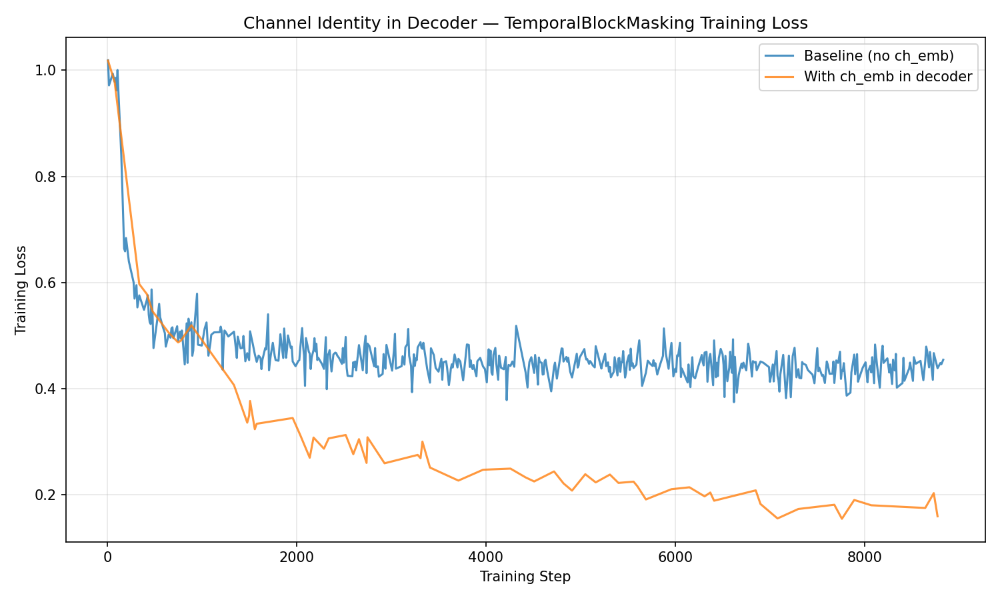

# Channel Identity in Reconstruction Decoder Queries

**Status:** Completed
**Date started:** 2026-07-09
**Parent experiment:** [Masking Strategy Difficulty Hierarchy](../experiments/003-masking-difficulty-hierarchy.md)
**Follow-up experiments:** TBD

## Background

Experiment 003 compared masking strategies and found that channel masking is the
hardest task while random and temporal masking are easier. During inspection of
temporal block masking reconstruction plots, predictions appear nearly identical
across all channels at the same time step — the model outputs a single "temporal
template" rather than per-channel dynamics.

Tracing through the architecture reveals the root cause: reconstruction queries
in the decoder are composed solely of `session_emb + task_emb`, and the rotary
time embeddings use timestamps that are identical across channels at the same
time index (`sample_timestamps.repeat(C)`). Channel identity embeddings, which
are fused into encoder input tokens via `channel_emb_fn`, are never injected
into the decoder queries. Combined with a single shared `MLPReadoutHead`, this
means queries for masked tokens at the same time `t` on different channels are
**architecturally identical** — the model cannot distinguish which channel it is
reconstructing.

This is not a bug in the implementation — the code computes what it is told —
but an architectural gap: the decoder lacks the information needed to produce
channel-specific predictions. The per-channel z-scored targets require
channel-specific outputs, creating a mismatch between model capacity and task
requirements.

## Question

Does injecting channel identity embeddings into the reconstruction decoder
queries enable the model to produce channel-specific predictions and lower
reconstruction loss?

## Hypothesis

Adding channel embeddings to reconstruction queries will:
1. Eliminate the cross-channel prediction collapse (predictions will visually
   differ across channels at the same time step)
2. Reduce reconstruction loss, especially for ChannelMasking and
   TemporalBlockMasking where cross-channel information is critical
3. The improvement will be largest for ChannelMasking (where zero observed tokens
   exist for masked channels, making channel identity the only disambiguating
   signal) and smallest for RandomTokenMasking (where nearby same-channel tokens
   provide some implicit channel context)

## Experiment

### Setup

- **Model:** MaskedPOYOEEGModel, embed_dim=256, depth=4, 8 cross/self heads,
  dim_head=128 — same as experiment 003
- **Data:** klinzing_sleep_ds005555, intrasession split — same as experiment 003
- **Task:** Masked reconstruction (MSE loss), mask_ratio=0.5,
  TemporalBlockMasking (block_size=10) — the strategy where the collapse was
  most clearly observed
- **Training:** Same hyperparameters as experiment 003
- **Change:** In `MaskedPOYOEEGModel.forward()`, add channel identity embedding
  to reconstruction queries:
  ```python
  # After building recon_queries (line ~180)
  masked_channel_idx = mask_indices // N  # (B, num_masked)
  recon_channel_tokens = torch.gather(input_channel_index, 1, masked_channel_idx)
  recon_channel_emb = self.channel_emb(recon_channel_tokens)  # (B, num_masked, D)
  if self.recon_channel_proj is not None:
      recon_channel_emb = self.recon_channel_proj(recon_channel_emb)
  recon_queries = recon_queries + recon_channel_emb
  ```
  A learned linear projection (`recon_channel_proj`: 64 → 256) is needed because
  `channel_fusion="concat"` produces 64-dim channel embeddings while the query
  space is 256-dim.
- **WandB:** project=foundry_pretraining, group=PRETRAINING
  - FullTimeMasking10 / `ax19kghy` — Baseline (no channel emb in decoder), reused from experiment 003
  - TimeMasking_ChannelEmbDecoder / `qgohh6dc` — With channel emb in decoder

### Launch command

```bash
uv run python main.py experiment=pretraining/poyo_multi_dataset_pretrain \
  run.name=TimeMasking_ChannelEmbDecoder \
  model.masking._target_=foundry.tasks.masking.TemporalBlockMasking \
  model.masking.block_size=10 \
  model.masking.mask_ratio=0.5
```

### Key config overrides

Only the code change — no config overrides beyond masking strategy. The channel
embedding injection is a code modification in `masked_poyo_eeg.py`, not a config
parameter.

## Results

### Summary

Adding channel identity embeddings to reconstruction decoder queries produced a
dramatic improvement in training loss. The model with channel embeddings reached
a final loss of 0.159, compared to 0.454 for the baseline — a **65% reduction**.
The curves diverge early (around step 1000) and the gap widens consistently,
confirming that the baseline was fundamentally capacity-limited rather than just
slow to converge.

### Metrics

| Metric | Baseline (no ch_emb) | With ch_emb in decoder |
|--------|---------------------|----------------------|
| Mean train loss | 0.4673 | 0.3041 |
| Final train loss | 0.4542 | 0.1589 |

Common training step range: [9, 8829]

### Analysis

Results were extracted programmatically from wandb using the API, limited to the
common step range across both runs.

**Analysis script:** `analysis/004_channel_identity_decoder.py`

```bash
uv run python analysis/004_channel_identity_decoder.py
```

### Figures



## Conclusions

The hypothesis was **strongly confirmed**. Injecting channel identity embeddings
into the reconstruction decoder queries:

1. **Reduced final training loss by ~65%** (0.454 → 0.159), far exceeding the
   differences between masking strategies in experiment 003 (~0.2 spread).
2. **Curves diverge early and continuously**, indicating this is not a
   convergence speed difference but a fundamental capacity gap — the baseline
   model plateaus around 0.45 because it cannot produce channel-specific
   predictions, while the augmented model continues improving.
3. The architectural gap identified in the Background section was the primary
   bottleneck: without channel identity, decoder queries for different channels
   at the same time step were mathematically identical, forcing the model to
   output a single temporal template for all channels.

This was the single most impactful architectural change found so far, larger
than the difference between any masking strategies.

## Notes for future experiments

- If channel embedding in the decoder helps, consider whether the channel
  embedding should use `add` or `concat` fusion in the decoder (matching the
  encoder's fusion strategy seems natural).
- A follow-up could measure per-channel reconstruction correlation: compute the
  Pearson correlation between predictions on different channels at the same time
  step. Before the fix this should be ~1.0; after it should be significantly
  lower.
- If the fix helps for TemporalBlockMasking, repeat the comparison across all
  three masking strategies from experiment 003 to see if the difficulty hierarchy
  changes.
- Consider whether the `MLPReadoutHead` also needs channel conditioning (e.g.,
  per-channel heads or FiLM conditioning) or if query-level channel embedding is
  sufficient.
