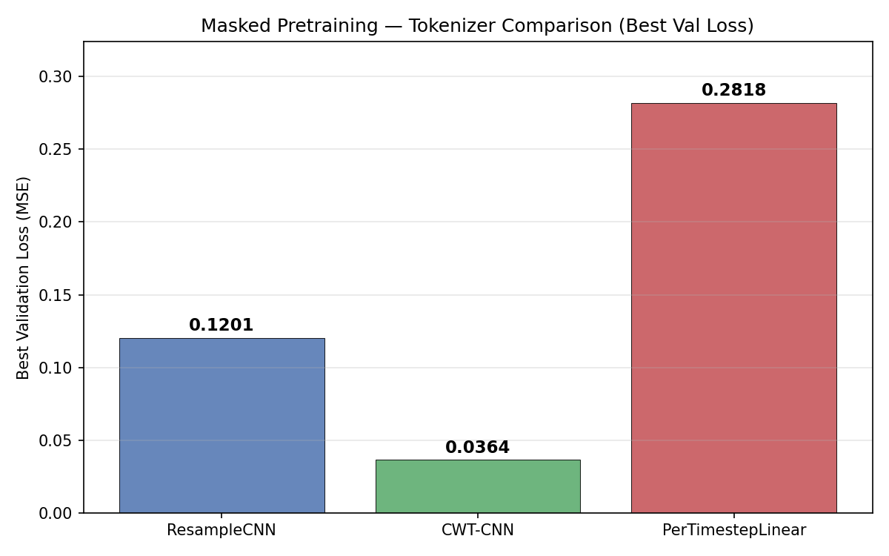
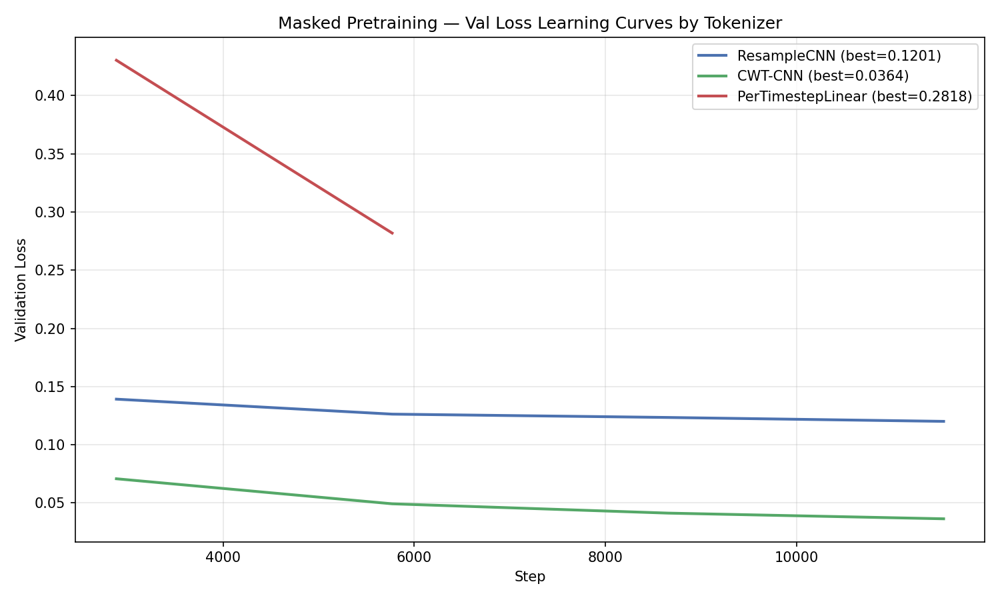
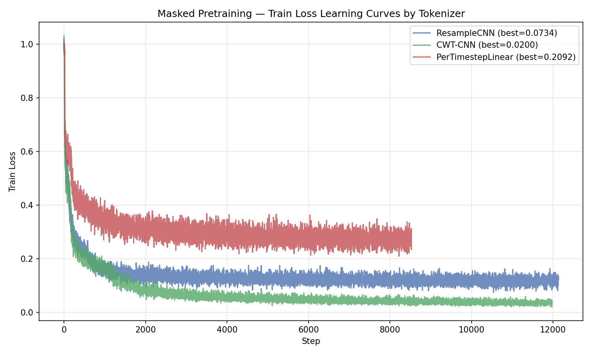

# Tokenizer Architecture Comparison for Masked Pretraining

**Status:** Completed
**Date started:** 2026-07-09
**Parent experiment:** None (root)
**Follow-up experiments:** [Kemp Sleep EDF — Tokenizer Baseline Comparison](../experiments/006-kemp-sleep-tokenizer-baseline.md), [Pretraining Loss vs Downstream Task Performance](../experiments/007-pretraining-loss-vs-downstream.md)

## Background

The EEG tokenizer converts raw per-channel time-series into token embeddings
that feed into the Perceiver backbone. The current default tokenizer
(`per_channel_resample_cnn`) was chosen without a systematic comparison against
alternatives. Three tokenizer architectures are available with comparable
parameter counts:

1. **ResampleCNN** — a 1-D CNN that resamples the raw signal to a fixed token
   rate (100 Hz). Uses 2 conv layers with 12 filters, kernel size 9, and GELU
   activation. Channel identity is concatenated via a 64-dim embedding.

2. **CWT-CNN** — applies a Continuous Wavelet Transform (9 log-spaced
   frequencies, 0.5–30 Hz) before the CNN, giving the network explicit
   time-frequency features. Same CNN backbone (2 layers, 64 filters, kernel 9)
   on top of the CWT coefficients.

3. **PerTimestepLinear** — a simple linear projection of each individual
   timepoint (input_dim=1 → embed_dim), with no temporal context baked into the
   tokenizer. All temporal modelling is left to the Perceiver.

Comparing these on the same masked-reconstruction pretraining task will reveal
whether injecting inductive bias at the tokenizer level (resampling, wavelet
decomposition) helps or whether the Perceiver can learn equivalent
representations from raw per-timepoint features.

## Question

Which tokenizer architecture yields the lowest reconstruction loss when
pretraining with masked reconstruction on multi-session EEG data?

## Hypothesis

The CWT-CNN tokenizer will achieve the lowest reconstruction loss because the
explicit time-frequency decomposition provides richer input features to the
Perceiver. ResampleCNN will be a close second, while PerTimestepLinear will
underperform both because it pushes all temporal modelling onto the Perceiver
without any local signal processing.

## Experiment

### Setup

- **Model:** MaskedPOYOEEGModel, embed_dim=256, depth=4, 8 cross/self heads,
  dim_head=128, TemporalBlockMasking (block_size=10, mask_ratio=0.5)
- **Data:** klinzing_sleep_ds005555 via OpenNeuroMultiBrainset, intrasession
  split, sequence_length=2.0s
- **Task:** Masked reconstruction (MSE loss), mask_ratio=0.5
- **Training:** batch_size=100, lr=1e-4, weight_decay=0.01, max_epochs=200,
  bf16-mixed precision, warmup_epochs=0
- **Hardware:** 1× L40S per run, 6 CPUs, 32 GB RAM (SLURM)
- **WandB:** project=foundry_pretraining, group=PRETRAIN_TOKENIZER_SWEEP
  - `pretrain_tokenizer_per_channel_resample_cnn`: vup5m7er
  - `pretrain_tokenizer_per_channel_cwt_cnn`: wlmobz7y
  - `pretrain_tokenizer_per_channel_per_timepoint_linear`: 092n6bv1

### Launch command

```bash
# SLURM sweep (3 tokenizers in parallel):
uv run python main.py experiment=pretraining/poyo_pretrain_tokenizer_sweep -m
```

### Key config overrides

All overrides are captured in the sweep config
`configs/experiment/pretraining/poyo_pretrain_tokenizer_sweep.yaml`. The Hydra
sweeper varies `model/tokenizer` over:

- `per_channel_resample_cnn`
- `per_channel_cwt_cnn`
- `per_channel_per_timestep`

Notable non-default settings vs the base model config:
- `model.masking` overridden from `RandomTokenMasking` to `TemporalBlockMasking`
  (block_size=10, mask_ratio=0.5)
- `model.zero_output_timestamps: false`
- `model.normalize_inputs: true`
- `module.warmup_epochs: 0`
- `data.split_type: intrasession`, `data.task_type: null`

## Results

### Summary

CWT-CNN dominated the comparison with a best val loss of **0.0364**, over 3×
better than ResampleCNN (0.1201) and nearly 8× better than PerTimestepLinear
(0.2818). The hypothesis is strongly confirmed: the explicit time-frequency
decomposition provides a massive advantage for masked reconstruction.

All runs were time-limited by the SLURM 3-hour wall clock. CWT-CNN and
ResampleCNN both completed 4 full epochs before timing out during epoch 5,
while PerTimestepLinear only completed ~2 epochs due to its slower per-step
throughput (8.37 it/s vs 10–13 it/s for the others). The slower speed is
expected because it produces 512 tokens per 2s window (256 Hz × 2s) compared
to 200 tokens for ResampleCNN (100 Hz × 2s).

The CWT-CNN run initially crashed due to a transient CUDA initialization error
on the allocated node and required resubmission. The final successful run
(`wlmobz7y`) trained cleanly for the full time budget.

### Metrics

| Metric | ResampleCNN | CWT-CNN | PerTimestepLinear |
|--------|-------------|---------|-------------------|
| Best val loss | 0.1201 | 0.0364 | 0.2818 |
| Best val recon MSE | 0.1201 | 0.0364 | 0.2820 |
| Best train loss | 0.0734 | 0.0200 | 0.2092 |
| Epochs completed | 4 | 4 | 2 |
| Global steps | 121,269 | 119,700 | 85,239 |
| Runtime (s) | 10,018 | 10,401 | 10,022 |
| Throughput (it/s) | ~12.6 | ~10.8 | ~8.4 |

### Analysis

Results extracted programmatically from wandb run summaries and SLURM logs.

**Analysis script:** `analysis/005_tokenizer_comparison.py`

```bash
uv run python analysis/005_tokenizer_comparison.py
```

### Figures







## Conclusions

The hypothesis is **confirmed**. CWT-CNN achieves dramatically lower
reconstruction loss (0.0364 vs 0.1201 for ResampleCNN, vs 0.2818 for
PerTimestepLinear). The explicit wavelet time-frequency decomposition provides
a strong inductive bias that benefits masked reconstruction.

The ranking is:
1. **CWT-CNN** — best by a wide margin (3.3× lower val loss than ResampleCNN)
2. **ResampleCNN** — decent but substantially worse than CWT-CNN
3. **PerTimestepLinear** — worst, even accounting for fewer completed epochs

PerTimestepLinear's poor performance suggests the Perceiver's cross-attention
alone is insufficient to learn good temporal representations from per-timepoint
features within this training budget. The local signal processing provided by
CNN-based tokenizers is essential.

The CWT-CNN advantage likely comes from providing the model with
multi-resolution time-frequency features (9 log-spaced frequencies, 0.5–30 Hz)
that align well with physiologically relevant EEG frequency bands (delta,
theta, alpha, beta). This makes reconstruction easier since the model receives
a richer input representation.

## Notes for future experiments

- **Adopt CWT-CNN as default tokenizer** for all future pretraining experiments.
- Experiment with CWT hyperparameters (number of frequencies, frequency range,
  n_cycles) — the wandb summary shows the learned CWT parameters drifted during
  training (freqs_hz ranged 0.55–35.1 Hz, n_cycles ranged 1.38–6.81),
  suggesting the initialization and/or parameterization could be tuned.
- The large gap between CWT-CNN and ResampleCNN (3.3×) is surprising — worth
  investigating whether this advantage transfers to downstream tasks or is
  specific to reconstruction. The follow-up experiment
  [006-kemp-sleep-tokenizer-baseline](../experiments/006-kemp-sleep-tokenizer-baseline.md)
  tests this on sleep staging.
- PerTimestepLinear was penalized by slower throughput (only 2 epochs vs 4).
  To be fully fair, it would need a longer time budget, but the gap at epoch 1
  (val loss 0.43 vs 0.07 for CWT-CNN) already makes the conclusion clear.
- Consider extending the comparison to spatial tokenizer strategies (e.g.,
  `spatial_session_*`) once CWT-CNN's downstream advantage is confirmed.
- All runs were SLURM-time-limited (3h). A longer training run with CWT-CNN
  could reveal whether the loss continues decreasing or plateaus.
