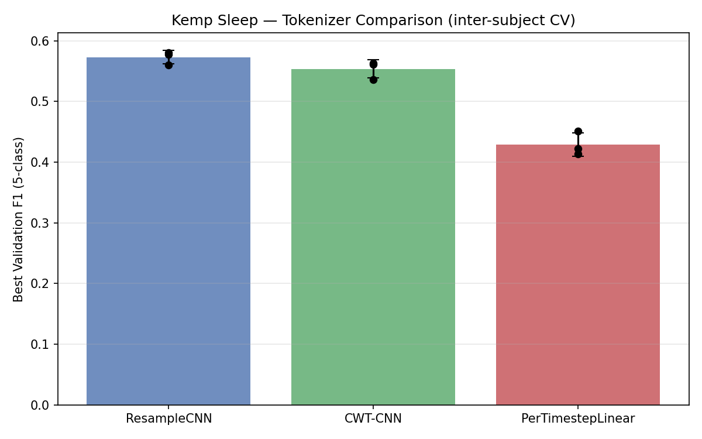
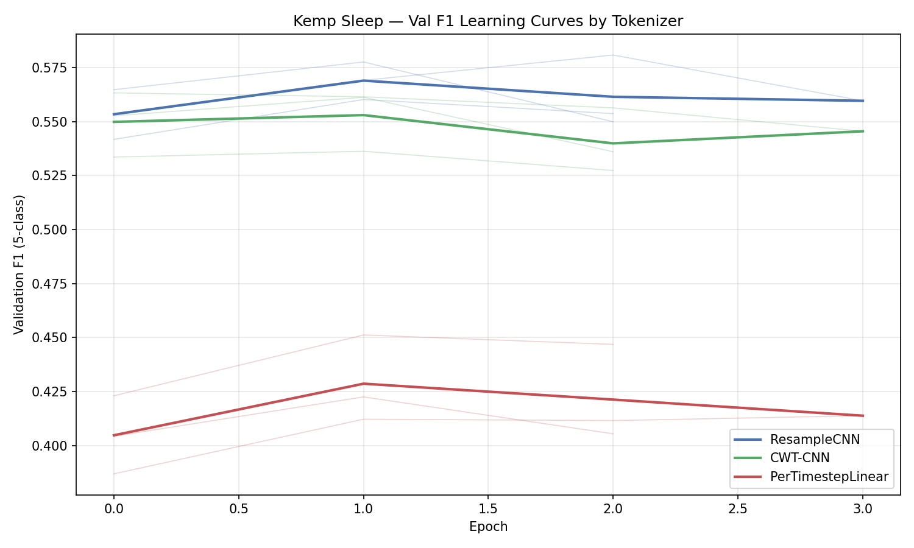

# Kemp Sleep EDF — Tokenizer Baseline Comparison

**Status:** Completed
**Date started:** 2026-07-13
**Parent experiment:** [Tokenizer Architecture Comparison for Masked Pretraining](../experiments/005-tokenizer-comparison.md)
**Follow-up experiments:** [Pretraining Loss vs Downstream Task Performance](../experiments/007-pretraining-loss-vs-downstream.md)

## Background

Experiment 005 compared tokenizer architectures on a masked-reconstruction
pretraining task. This experiment shifts to a downstream evaluation setting:
5-class sleep staging on the Kemp Sleep EDF 2013 dataset. The goal is to
establish a baseline for each of the three tokenizer architectures on a
supervised classification task using inter-subject cross-validation, before
exploring hyperparameter tuning or pretraining → finetuning pipelines.

The three tokenizers under comparison are the same as in 005:

1. **ResampleCNN** — 1-D CNN resampling raw signal to 100 Hz token rate.
2. **CWT-CNN** — Continuous Wavelet Transform front-end (9 log-spaced
   frequencies, 0.5–30 Hz) followed by a CNN.
3. **PerTimestepLinear** — simple linear projection per timepoint; all temporal
   modelling is left to the Perceiver.

Each tokenizer is evaluated across 3 inter-subject cross-validation folds
(fold 0, 1, 2) for a total of 9 runs.

## Question

Which tokenizer architecture yields the best 5-class sleep staging F1 score
when trained from scratch on the Kemp Sleep EDF dataset with inter-subject
cross-validation?

## Hypothesis

ResampleCNN and CWT-CNN will significantly outperform PerTimestepLinear, since
the local temporal processing in the CNN-based tokenizers provides useful
inductive bias for EEG sleep staging. CWT-CNN may edge out ResampleCNN thanks
to its explicit time-frequency decomposition.

## Experiment

### Setup

- **Model:** POYOEEGModel, embed_dim=256, depth=4, 8 cross/self heads,
  dim_head=128, ffn_dropout=0.2, lin_dropout=0.4, atn_dropout=0.2,
  16 latents per 0.1s step, zero_output_timestamps=true, normalize_inputs=true
- **Data:** KempSleepEDF2013, inter-subject split, 3 folds,
  sequence_length=2.0s
- **Task:** 5-class sleep staging (sleep_stage_5class), auto class weights
  (smoothing=1.0)
- **Training:** batch_size=512, lr=1e-4, weight_decay=0.01, max_epochs=1000,
  bf16-mixed precision, gradient_clip_val=1.0, early stopping on
  val/sleep_stage_5class_f1 (patience=20, mode=max)
- **Hardware:** 1× L40S per run, 6 CPUs, 32 GB RAM (SLURM)
- **WandB:** project=foundry_finetuning, group=KEMP_SLEEP_TOKENIZER_BASELINE
  - `kemp_sleep_per_channel_resample_cnn_fold0`: `mj5b3gsu`
  - `kemp_sleep_per_channel_resample_cnn_fold1`: `vzfktdlv`
  - `kemp_sleep_per_channel_resample_cnn_fold2`: `eay0303t`
  - `kemp_sleep_per_channel_cwt_cnn_fold0`: `tm7jvvvs`
  - `kemp_sleep_per_channel_cwt_cnn_fold1`: `7snau2mc`
  - `kemp_sleep_per_channel_cwt_cnn_fold2`: `3c19d512`
  - `kemp_sleep_per_channel_per_timepoint_linear_fold0`: `182pkp6v`
  - `kemp_sleep_per_channel_per_timepoint_linear_fold1`: `hb4n732s`
  - `kemp_sleep_per_channel_per_timepoint_linear_fold2`: `oi7v77lc`

### Launch command

```bash
uv run python main.py experiment=sleep_staging/poyo_kemp_allsess_tokenizer_sweep -m
```

### Key config overrides

All overrides are captured in the sweep config
`configs/experiment/sleep_staging/poyo_kemp_allsess_tokenizer_sweep.yaml`. The
Hydra sweeper varies `model/tokenizer` over:

- `per_channel_resample_cnn`
- `per_channel_cwt_cnn`
- `per_channel_per_timepoint_linear`

and `hyperparameters.fold_number` over `0, 1, 2`.

Notable non-default settings vs the base model config:
- `data.split_type: intersubject`
- `data.task_type: sleep_stage`
- `model.zero_output_timestamps: true`
- `model.normalize_inputs: true`
- `class_weights.mode: auto`, `class_weights.smoothing: 1.0`
- `trainer.callbacks.early_stopping.monitor: val/sleep_stage_5class_f1`

## Results

### Summary

All 9 runs completed successfully. **ResampleCNN is the best tokenizer**,
achieving a mean F1 of 0.5728 ± 0.0111 across the 3 folds. CWT-CNN is close
behind at 0.5536 ± 0.0150, while PerTimestepLinear substantially underperforms
at 0.4291 ± 0.0196. All runs converged quickly (best checkpoint at epoch 3–4)
before early stopping kicked in.

### Metrics

| Tokenizer | Fold | Best Val F1 | Best Val Loss | Final Train Loss | Best Epoch |
|-----------|------|-------------|---------------|------------------|------------|
| ResampleCNN | 0 | 0.5775 | 1.2690 | 0.3631 | 3 |
| ResampleCNN | 1 | 0.5808 | 1.1247 | 0.3567 | 4 |
| ResampleCNN | 2 | 0.5602 | 1.1251 | 0.3632 | 3 |
| CWT-CNN | 0 | 0.5612 | 1.2544 | 0.3796 | 3 |
| CWT-CNN | 1 | 0.5632 | 1.2470 | 0.3339 | 4 |
| CWT-CNN | 2 | 0.5362 | 1.1784 | 0.3607 | 3 |
| PerTimestepLinear | 0 | 0.4225 | 1.6891 | 0.4163 | 3 |
| PerTimestepLinear | 1 | 0.4138 | 1.7633 | 0.3970 | 4 |
| PerTimestepLinear | 2 | 0.4512 | 1.3294 | 0.3878 | 3 |

**Aggregated (mean ± std across folds):**

| Tokenizer | Val F1 | Val Loss | Train Loss |
|-----------|--------|----------|------------|
| ResampleCNN | 0.5728 ± 0.0111 | 1.1729 ± 0.0832 | 0.3610 ± 0.0037 |
| CWT-CNN | 0.5536 ± 0.0150 | 1.2266 ± 0.0419 | 0.3581 ± 0.0230 |
| PerTimestepLinear | 0.4291 ± 0.0196 | 1.5940 ± 0.2321 | 0.4004 ± 0.0146 |

### Analysis

Results were fetched programmatically from WandB using the analysis script.

**Analysis script:** `analysis/006_kemp_sleep_tokenizer_baseline.py`

```bash
uv run python analysis/006_kemp_sleep_tokenizer_baseline.py
```

### Figures





## Conclusions

1. **ResampleCNN is the best tokenizer** for sleep staging on Kemp Sleep EDF,
   with a ~2 percentage point F1 advantage over CWT-CNN and a ~14 pp advantage
   over PerTimestepLinear.
2. **CWT-CNN does not outperform ResampleCNN** on this downstream task, contrary
   to the hypothesis from experiment 005. The explicit time-frequency
   decomposition does not translate into better sleep staging performance here.
3. **PerTimestepLinear substantially underperforms** both CNN-based tokenizers,
   confirming that local temporal processing in the tokenizer is important and
   the Perceiver alone cannot compensate for the lack of inductive bias.
4. All runs converge very quickly (epoch 3–4), suggesting the models plateau
   early. This may indicate that the current learning rate and schedule are not
   well-tuned, or that the model capacity is saturated for this dataset size.

## Notes for future experiments

- ResampleCNN should be the default tokenizer for subsequent Kemp Sleep
  experiments unless a strong reason to change arises.
- The quick convergence and early stopping at epoch 3–4 warrants investigation:
  try learning rate warmup, cosine decay, or a lower initial LR to allow longer
  training.
- Consider evaluating per-class F1 and confusion matrices to understand where
  each tokenizer struggles (e.g., N1 vs N2 discrimination).
- Test whether pretraining (experiment 005) followed by finetuning on Kemp Sleep
  improves over training from scratch.
- The gap between train loss (~0.36) and val loss (~1.17) for ResampleCNN
  suggests overfitting; regularization or data augmentation may help.
