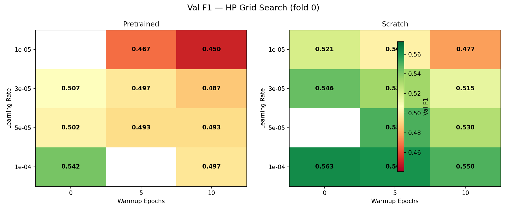
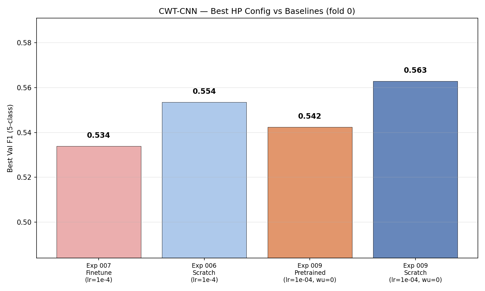
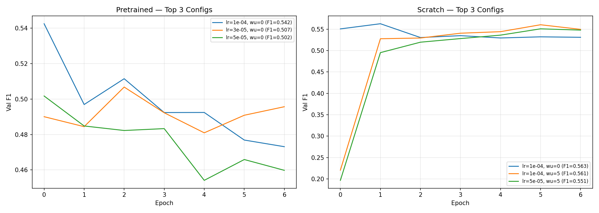

# Finetuning Hyperparameter Search

**Status:** In Progress
**Date started:** 2026-07-22
**Parent experiment:** [Pretraining Loss vs Downstream Task Performance](../experiments/007-pretraining-loss-vs-downstream.md), [Embedding Analysis: t-SNE/PCA and Linear Probing](../experiments/008-embedding-analysis-linear-probing.md)
**Follow-up experiments:** [Discriminative LR Finetuning](../experiments/010-discriminative-lr-finetuning.md)

## Background

Experiment 007 concluded that pretraining provides "no positive transfer" to
downstream sleep staging, with finetuned models performing −2 to −5 pp F1 worse
than from-scratch baselines. However, that experiment used identical
hyperparameters for both finetuning and from-scratch training (lr=1e-4,
warmup=0, patience=20), which is a known methodological flaw — finetuning
and from-scratch training have fundamentally different optimal hyperparameters.

Two observations suggest the conclusion was premature:

1. **Training loss for finetuned models is lower than the from-scratch
  baseline**, indicating the pretrained representations do help the model fit
   training data faster. The gap between train and val performance points to
   overfitting or catastrophic forgetting, not useless representations.
2. **Experiment 008 (linear probing) confirmed the pretrained CWT-CNN backbone
  contains discriminative features for sleep staging** — linear probe F1 of
   0.418 vs 0.267 for random init (+15.0 pp). The pretrained features are
   useful when preserved; full finetuning at lr=1e-4 destroys them.

These two signals point to a classic transfer learning failure mode: the
learning rate is too high, causing catastrophic forgetting of pretrained
features in the first few gradient steps. The model memorizes training data
(low train loss) but loses generalizable structure (poor val F1). Early stopping
at epoch 3–4 confirms the model never recovers.

Standard mitigations from the NLP/vision transfer learning literature include
lower learning rates (10–100× reduction), learning rate warmup, and increased
training patience.

## Question

Can the pretrained CWT-CNN model outperform the from-scratch baseline on Kemp
Sleep 5-class staging when finetuned with properly tuned hyperparameters
(learning rate, warmup schedule, early stopping patience)?

## Hypothesis

Yes — with a lower learning rate (1e-5 to 5e-5 range) and warmup schedule, the
pretrained CWT-CNN model will preserve its useful representations during
finetuning and achieve higher val F1 than both (a) the exp 007 finetuning
result (0.534) and (b) the best from-scratch CWT-CNN baseline (0.554 from
exp 006), after applying equivalent hyperparameter search to the baseline for
fair comparison.

## Experiment


### Setup

- **Model:** POYOEEGModel with CWT-CNN tokenizer (per_channel_cwt_cnn),
embed_dim=256, depth=4, same architecture as experiments 005–008
- **Data:** KempSleepEDF2013, inter-subject split, fold 0 for HP search,
all 3 folds for final validation
- **Task:** 5-class sleep staging (sleep_stage_5class), auto class weights
(smoothing=1.0)
- **Pretrained checkpoint:** CWT-CNN from exp 005 (wandb: `wlmobz7y`,
val_loss=0.0364)
- **Hardware:** 1× L40S per run, 6 CPUs, 32 GB RAM, 6h wall time (SLURM)
- **WandB:** project=foundry_finetuning

**Sweep axes:**


| Hyperparameter | Values                 | Rationale                                                               |
| -------------- | ---------------------- | ----------------------------------------------------------------------- |
| Learning rate  | 1e-5, 3e-5, 5e-5, 1e-4 | Standard finetuning LRs are 10–100× lower than from-scratch             |
| Warmup epochs  | 0, 5, 10               | Prevents large early gradients from destroying pretrained features      |
| ES patience    | 50 (fixed)             | Exp 007 stopped at epoch 3–4 with patience=20; allow more recovery time |


**Conditions:**


| Phase | Condition                     | Group                       | Runs                         | Purpose                          |
| ----- | ----------------------------- | --------------------------- | ---------------------------- | -------------------------------- |
| 1     | Pretrained CWT-CNN finetuning | KEMP_FINETUNE_HP_SEARCH     | 12 (4 lr × 3 warmup)         | Find best finetuning HPs         |
| 2     | From-scratch CWT-CNN          | KEMP_SCRATCH_HP_SEARCH      | 12 (4 lr × 3 warmup)         | Fair baseline with same grid     |
| 3     | 3-fold validation             | KEMP_FINETUNE_HP_VALIDATION | 6 (2 best configs × 3 folds) | Final comparison with error bars |


### Launch command

```bash
# Phase 1 — Pretrained CWT-CNN HP search (12 SLURM jobs, fold 0):
uv run python main.py experiment=sleep_staging/poyo_kemp_finetune_hp_search -m

# Phase 2 — From-scratch baseline HP search (12 SLURM jobs, fold 0):
uv run python main.py experiment=sleep_staging/poyo_kemp_finetune_hp_search \
    run.pretrained_checkpoint=null \
    'run.name=kemp_scratch_hp_lr${hyperparameters.learning_rate}_wu${module.warmup_epochs}' \
    run.group=KEMP_SCRATCH_HP_SEARCH \
    'run.tags=[sleep_staging,poyo,kemp,scratch,hp_search,exp009]' -m

# Phase 3 — 3-fold validation (fill in best LR and warmup from Phase 1 & 2):
# Pretrained best config:
uv run python main.py experiment=sleep_staging/poyo_kemp_finetune_hp_search \
    hyperparameters.learning_rate=<best_lr> module.warmup_epochs=<best_wu> \
    run.group=KEMP_FINETUNE_HP_VALIDATION \
    'run.name=kemp_finetune_val_fold${hyperparameters.fold_number}' \
    'run.tags=[sleep_staging,poyo,kemp,finetuning,validation,exp009]' \
    'hyperparameters.fold_number=0,1,2' -m

# Scratch best config:
uv run python main.py experiment=sleep_staging/poyo_kemp_finetune_hp_search \
    run.pretrained_checkpoint=null \
    hyperparameters.learning_rate=<best_lr> module.warmup_epochs=<best_wu> \
    run.group=KEMP_SCRATCH_HP_VALIDATION \
    'run.name=kemp_scratch_val_fold${hyperparameters.fold_number}' \
    'run.tags=[sleep_staging,poyo,kemp,scratch,validation,exp009]' \
    'hyperparameters.fold_number=0,1,2' -m
```


### Key config overrides

Uses new config
`configs/experiment/sleep_staging/poyo_kemp_finetune_hp_search.yaml`.

Key differences from exp 007 config
(`poyo_kemp_finetune_from_pretrain.yaml`):

- **Tokenizer fixed** to `per_channel_cwt_cnn` (exp 008 showed CWT-CNN has
much stronger pretrained representations than ResampleCNN)
- **LR swept** over {1e-5, 3e-5, 5e-5, 1e-4} instead of fixed 1e-4
- **Warmup swept** over {0, 5, 10} epochs (new; added `warmup_epochs` to
`configs/module/default.yaml`)
- **Patience increased** from 20 → 50 to allow longer training
- **Wall time increased** from 180 → 360 minutes to accommodate longer runs
- **Single fold** (fold 0) for HP search to keep grid tractable
- From-scratch baseline uses same config with
`run.pretrained_checkpoint=null` CLI override


## Results

Phases 1 and 2 completed (21/24 runs; 3 crashed). Phase 3 not yet launched.
All results below are on **fold 0** only.

### Summary

The hyperparameter search **did not resolve negative transfer**. The best
pretrained configuration (lr=1e-4, warmup=0) is identical to experiment 007's
setup, and achieves val F1 0.5425 — within noise of exp 007 fold 0 (0.5419).
The best from-scratch configuration uses the same lr and warmup and achieves
val F1 0.5629, a **−2.0 pp gap** that matches the exp 006/007 pattern.

Lower learning rates and warmup **hurt** pretrained performance rather than
helping: the best pretrained run at lr=1e-4 is +7.5 pp F1 above the best
lr=1e-5 run (0.4671). Across the full grid, pretrained models achieve lower
mean train loss (0.347 vs 0.360) but lower mean val F1 (0.494 vs 0.532),
confirming the train–val divergence observed in exp 007.

Learning curves for the best runs show val F1 **peaking at epoch 0** for
pretrained and epoch 1 for scratch, then monotonically degrading through epoch
6. Increased patience (50 vs 20) allowed longer training but did not change the
optimal stopping point — the best checkpoint is still reached within the first
1–2 epochs.

### Metrics

**Phase 1 — Pretrained CWT-CNN HP search (fold 0, 10/12 runs finished):**

| LR | Warmup | Val F1 | Train Loss | Best Epoch | WandB Run ID |
|----|--------|--------|------------|------------|--------------|
| 1e-4 | 0 | **0.5425** | 0.3076 | 0 | `txqx3q04` |
| 3e-5 | 0 | 0.5068 | 0.3260 | 2 | `t1x3d7fi` |
| 5e-5 | 0 | 0.5017 | 0.3192 | 2 | `3nuuhtf6` |
| 3e-5 | 5 | 0.4970 | 0.3443 | 2 | `suz91i0d` |
| 1e-4 | 10 | 0.4967 | 0.3382 | 0 | `hskjze2n` |
| 5e-5 | 5 | 0.4928 | 0.3408 | 2 | `imiosm08` |
| 5e-5 | 10 | 0.4927 | 0.3497 | 2 | `lopypey8` |
| 3e-5 | 10 | 0.4874 | 0.3666 | 2 | `d1y2i48c` |
| 1e-5 | 5 | 0.4671 | 0.3888 | 2 | `u5mu0pzg` |
| 1e-5 | 10 | 0.4504 | 0.3893 | 2 | `5wsefsdm` |
| 1e-5 | 0 | — | — | — | `jq0ft5t2` (crashed) |
| 1e-4 | 5 | — | — | — | `t4ei9lki` (crashed) |

**Phase 2 — From-scratch CWT-CNN HP search (fold 0, 11/12 runs finished):**

| LR | Warmup | Val F1 | Train Loss | Best Epoch | WandB Run ID |
|----|--------|--------|------------|------------|--------------|
| 1e-4 | 0 | **0.5629** | 0.3176 | 1 | `3pk071u6` |
| 1e-4 | 5 | 0.5605 | 0.3436 | 1 | `f8xx0ykv` |
| 5e-5 | 5 | 0.5510 | 0.3355 | 1 | `f59sbb7t` |
| 1e-4 | 10 | 0.5502 | 0.3363 | 1 | `3o9vieg1` |
| 3e-5 | 0 | 0.5458 | 0.3205 | 1 | `b9sp9xwh` |
| 3e-5 | 5 | 0.5338 | 0.3587 | 1 | `2aillwcy` |
| 5e-5 | 10 | 0.5296 | 0.3683 | 1 | `xaka1w5r` |
| 1e-5 | 0 | 0.5206 | 0.3676 | 1 | `ppgvram2` |
| 3e-5 | 10 | 0.5148 | 0.3798 | 1 | `fj8w6qnu` |
| 1e-5 | 5 | 0.5006 | 0.3965 | 1 | `zhi5ppoi` |
| 1e-5 | 10 | 0.4773 | 0.4373 | 1 | `c26b53bo` |
| 5e-5 | 0 | — | — | — | `9cklsfjc` (crashed) |

**Best config comparison (fold 0):**

| Condition | Best LR | Warmup | Val F1 | Δ vs Exp 006 fold 0 | WandB Run ID |
|-----------|---------|--------|--------|-----------------------|--------------|
| Exp 006 scratch (ref) | 1e-4 | 0 | 0.5612 | — | (exp 006) |
| Exp 007 finetune (ref) | 1e-4 | 0 | 0.5419 | −1.9 pp | `inad6ohi` |
| Exp 009 scratch | 1e-4 | 0 | 0.5629 | +0.2 pp | `3pk071u6` |
| Exp 009 pretrained | 1e-4 | 0 | 0.5425 | −1.9 pp | `txqx3q04` |

**Grid means (all completed runs per condition):**

| Condition | Mean Train Loss | Mean Val F1 |
|-----------|-----------------|-------------|
| Pretrained | 0.347 | 0.494 |
| Scratch | 0.360 | 0.532 |

### Analysis

Results extracted programmatically from WandB project `foundry_finetuning`
groups `KEMP_FINETUNE_HP_SEARCH` and `KEMP_SCRATCH_HP_SEARCH`.

**Analysis script:** `analysis/009_finetuning_hp_search.py`

```bash
uv run python analysis/009_finetuning_hp_search.py
```

Key observations from learning curves (best run per condition):

- **Pretrained** (`txqx3q04`): val F1 peaks at epoch 0 (0.5425) and declines
  monotonically to 0.473 by epoch 6. No later epoch recovers.
- **Scratch** (`3pk071u6`): val F1 improves from 0.551 (epoch 0) to 0.563
  (epoch 1), then declines to 0.531 by epoch 6.

### Figures







## Conclusions

1. **Hypothesis refuted.** Properly tuned hyperparameters do not enable
   pretrained CWT-CNN to beat the from-scratch baseline. The HP grid's optimum
   for finetuning is the same lr=1e-4, warmup=0 used in exp 007, and the
   −2 pp gap persists.
2. **The catastrophic-forgetting mitigation strategy failed.** Lower learning
   rates and warmup were predicted to preserve pretrained features, but they
   uniformly degraded val F1. The pretrained model is most sensitive to LR:
   reducing from 1e-4 to 1e-5 drops val F1 by ~7.5 pp. This suggests the
   problem is not large early gradients destroying features, but rather that
   the pretrained representation manifold is a poor starting point for
   classification — lower LR traps the model there without sufficient
   adaptation.
3. **Train–val divergence confirms a representation mismatch, not a tuning
   problem.** Pretrained models fit training data better (lower mean train
   loss across the grid) but generalize worse (lower mean val F1). At the best
   configs, pretrained also has slightly lower train loss (0.308 vs 0.318) but
   2 pp lower val F1. Combined with exp 008's linear probe result (+15 pp
   pretrained advantage with frozen backbone), this points to a specific
   failure mode: pretrained features contain sleep-stage information, but
   full finetuning **destroys** it faster than it can adapt the head and
   backbone jointly.
4. **Early stopping is critical and insufficient.** Val F1 peaks at epoch 0–1
   for both conditions; continued training only hurts. Patience=50 did not
   help because the model never recovers after the initial decline. Even
   stopping at the optimal epoch, pretrained (0.543) still trails scratch
   (0.563).
5. **Phase 3 is unlikely to change the conclusion.** Both conditions' best
   configs use lr=1e-4, warmup=0 — the same HPs already validated across
   3 folds in exp 006/007. Phase 3 would confirm error bars but is not
   expected to reverse the ranking.

## Notes for future experiments

- **Discriminative (layerwise) learning rates** are the most promising
  remaining mitigation within the finetuning paradigm: freeze or use very low
  LR for the pretrained backbone, higher LR for the task head. Exp 008 showed
  the frozen backbone alone achieves F1 0.418; the challenge is adapting the
  head without overwriting backbone features. Requires extending
  `FoundryModule._build_param_groups()` to split by
  `transferable_components()`.
- **Gradual unfreezing / two-stage finetuning:** Train linear probe (exp 008
  config) to convergence, then unfreeze backbone with very low LR. This
  directly addresses the epoch-0 peak finding — the model may need a stable
  head before backbone adaptation.
- **Brief finetuning with aggressive early stopping:** Val F1 peaks at epoch
  0 for pretrained. Consider stopping after 1–2 epochs or monitoring
  backbone representation drift (e.g., CKA distance from pretrained checkpoint).
- **Pivot pretraining objective:** If layerwise LR also fails, the
  reconstruction objective is likely fundamentally misaligned with sleep
  staging. Consider contrastive, temporal prediction, or multi-task objectives
  that incorporate sleep-stage structure.
- **ResampleCNN:** This experiment focuses on CWT-CNN. The same HP search on
  ResampleCNN is lower priority given exp 008's weak linear probe (+2.2 pp).
- **Re-run crashed grid points** (lr=1e-5/wu=0, lr=1e-4/wu=5 pretrained;
  lr=5e-5/wu=0 scratch) if completeness matters, but the missing cells are
  unlikely to change the best config.

