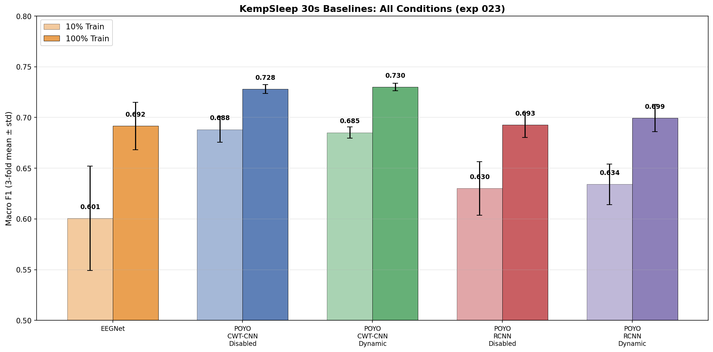
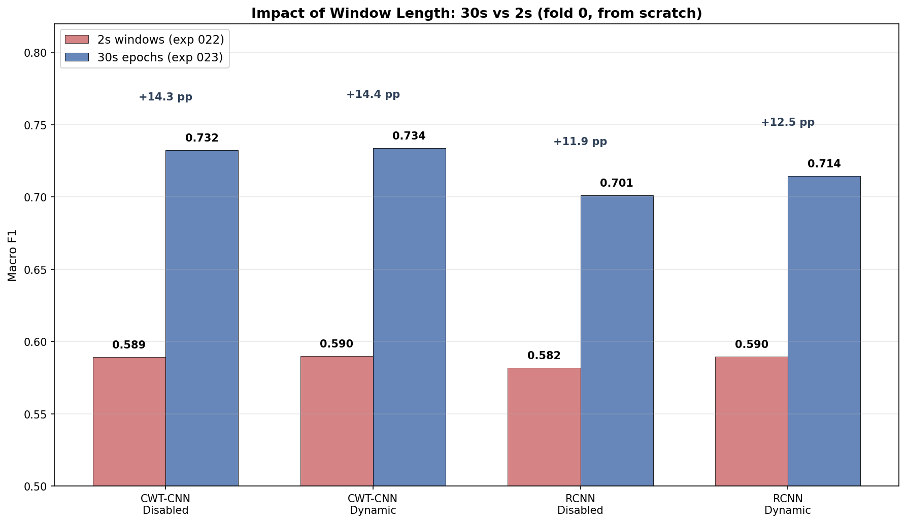
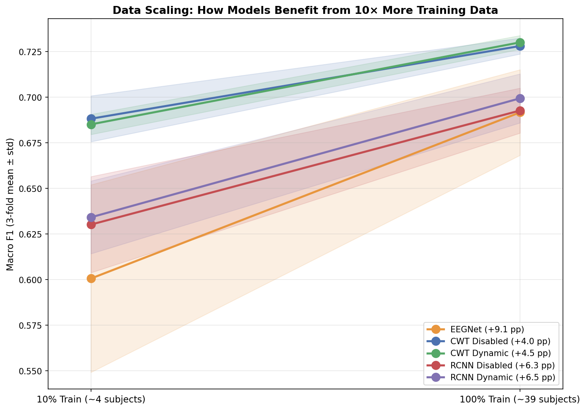
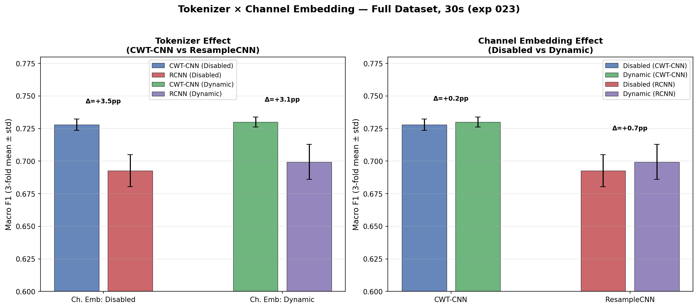
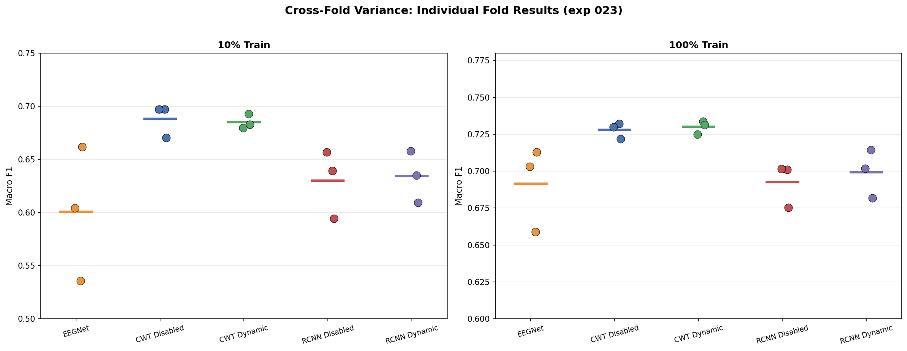
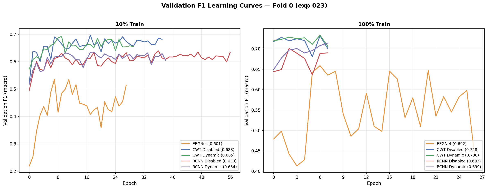

# KempSleep 30s-Epoch From-Scratch Baselines

**Status:** Completed
**Date started:** 2026-07-29
**Parent experiment:** [KempSleep Baselines and Finetuning: Dynamic Channel Embeddings × Tokenizer](../_legacy/022-kemp-baselines-finetune-cwt-dynch.md)
**Follow-up experiments:** TBD

## Background

Previous Kemp sleep staging experiments (exp 006, 008, 020, 022) used 2s
context windows (`sequence_length: 2.0`), which is non-standard for sleep
staging. The clinical convention is to classify 30-second epochs. Using short
windows means each sample sees only a fraction of the sleep epoch, losing
important temporal context (e.g. spindle sequences, slow-wave buildup).

Additionally, prior experiments were run only on fold 0 of the intersubject
split. Multi-fold cross-validation (folds 0, 1, 2) is needed to establish
reliable performance estimates and confidence intervals.

This experiment also introduces a `session_pct` mechanism to create a 10%
training subset of KempSleep for fast iteration. The small config
(`kemp_sleep_edf/allsess_small`) keeps 10% of training recordings while
preserving all validation/test recordings, allowing quick debugging runs
before committing to full-dataset training.

The experiment establishes clean from-scratch baselines for all model
architectures, disentangling architectural effects from any pretraining
benefit.

By running each model on both the small (10% train) and full dataset, this
experiment also provides a coarse measure of how each architecture scales
with training data. Models that benefit most from additional data may be
better candidates for pretraining or for scaling to larger datasets, while
models that plateau early may have capacity or inductive bias limitations
that are worth understanding.

## Question

How do the different model architectures (EEGNet, POYO with CWT-CNN, POYO
with ResampleCNN) and channel embedding modes (disabled, dynamic) compare on
KempSleep 5-class sleep staging when trained from scratch with proper
30-second epochs and 3-fold intersubject cross-validation? Additionally,
which architectures benefit most from scaling from 10% to 100% of the
training data?

## Hypothesis

1. **30s epochs will improve F1** for all models compared to 2s windows,
   since the full epoch provides the temporal context needed for
   distinguishing sleep stages (especially N2 vs N3 and REM).
2. **EEGNet will be competitive** as a strong supervised baseline since it
   was designed specifically for EEG classification.
3. **Dynamic channel embeddings will outperform disabled** even from scratch,
   consistent with the +4.1 pp advantage seen in exp 020's random-init
   condition (albeit at 2s windows).
4. **CWT-CNN and ResampleCNN will perform similarly** from scratch since the
   architectural differences mainly manifest through pretraining benefit
   (exp 008 showed CWT-CNN's advantage was primarily in pretrained features).
5. **Performance variance across folds** will be moderate (1–3 pp F1),
   confirming that single-fold results from prior experiments were
   representative.
6. **POYO models will scale better** with training data than EEGNet. The
   transformer backbone has higher capacity and should benefit more from
   the 10× increase in training recordings. EEGNet, being a smaller
   convolutional model, may plateau earlier.

## Experiment

### Setup

- **Models:**
  - **EEGNet:** F1=8, D=2, F2=16, kernel_length=64, dropout=0.5, 2 channels,
    3000 samples (30s × 100 Hz)
  - **POYO (CWT-CNN):** POYOEEGModel, embed_dim=256, depth=4, 8 heads,
    dim_head=128, `per_channel_cwt_cnn` tokenizer
  - **POYO (ResampleCNN):** Same backbone, `per_channel_resample_cnn` tokenizer
- **Channel embeddings (POYO only):** `disabled` / `dynamic`
- **Session embeddings:** `disabled` for all POYO conditions
- **Data:** KempSleepEDF2013 (`kemp_sleep_edf/allsess`), intersubject split,
  all 3 folds (0, 1, 2)
- **Data (small):** `kemp_sleep_edf/allsess_small` — 10% of training
  recordings, 100% validation/test
- **Task:** 5-class sleep staging (W, N1, N2, N3, REM), class-weighted
  cross-entropy
- **Training:** sequence_length=30.0s, batch_size=32 (POYO) / 64 (EEGNet), lr=1e-4,
  weight_decay=0.01, max_epochs=1000, early stopping on val F1 (patience=20),
  bf16-mixed precision
- **Hardware:** 1× L40S per run, 6 CPUs, 32 GB RAM (SLURM)
- **WandB:** project=foundry_finetuning, group=KEMP_30S_BASELINES

**Conditions (30 total = 5 models × 3 folds × 2 dataset sizes):**

| Condition                           | Model      | Tokenizer      | channel_emb | Dataset | Folds |
| ----------------------------------- | ---------- | -------------- | ----------- | ------- | ----- |
| eegnet                              | EEGNet     | N/A            | N/A         | 10/100% | 0,1,2 |
| poyo-cwt-ch-disabled                | POYO       | CWT-CNN        | `disabled`  | 10/100% | 0,1,2 |
| poyo-cwt-ch-dynamic                 | POYO       | CWT-CNN        | `dynamic`   | 10/100% | 0,1,2 |
| poyo-rcnn-ch-disabled               | POYO       | ResampleCNN    | `disabled`  | 10/100% | 0,1,2 |
| poyo-rcnn-ch-dynamic                | POYO       | ResampleCNN    | `dynamic`   | 10/100% | 0,1,2 |

### Launch command

```bash
# --- Small dataset (10% train, fast iteration) ---

# POYO models (12 jobs: 2 tokenizers × 2 channel_emb × 3 folds)
uv run python main.py experiment=sleep_staging/kemp_30s_baselines \
    data=kemp_sleep_edf/allsess_small -m

# EEGNet (3 jobs: 3 folds)
uv run python main.py experiment=sleep_staging/eegnet_kemp_30s_baselines \
    data=kemp_sleep_edf/allsess_small -m

# --- Full dataset ---

# POYO models (12 jobs: 2 tokenizers × 2 channel_emb × 3 folds)
uv run python main.py experiment=sleep_staging/kemp_30s_baselines -m

# EEGNet (3 jobs: 3 folds)
uv run python main.py experiment=sleep_staging/eegnet_kemp_30s_baselines -m
```

### Key config overrides

- POYO experiment config:
  `configs/experiment/sleep_staging/kemp_30s_baselines.yaml`
- EEGNet experiment config:
  `configs/experiment/sleep_staging/eegnet_kemp_30s_baselines.yaml`
- Small data config:
  `configs/data/kemp_sleep_edf/allsess_small.yaml` —
  `session_pct.train: 0.1`, `session_pct.valid: 1.0`, `session_pct.test: 1.0`
- `data.split_type: intersubject` for all conditions (standard for sleep
  staging)
- `hyperparameters.sequence_length: 30.0` (proper 30s epochs)
- `model/session_emb: disabled` for all POYO conditions
- Hydra multirun sweeps `hyperparameters.fold_number` over 0, 1, 2

### WandB

- **Project:** `foundry_finetuning`
- **Group:** `KEMP_30S_BASELINES`

| Condition | Size | Fold | Run name | Run ID |
| --------- | ---- | ---: | -------- | ------ |
| EEGNet | 10% | 0 | `kemp_023_eegnet_smol_fold0` | `e1va37uj` |
| EEGNet | 10% | 1 | `kemp_023_eegnet_smol_fold1` | `m0gecgmy` |
| EEGNet | 10% | 2 | `kemp_023_eegnet_smol_fold2` | `m53rrd5l` |
| POYO CWT disabled | 10% | 0 | `kemp_023_per_channel_cwt_cnn_ch-disabled_smol_fold0` | `jn0pjmtb` |
| POYO CWT disabled | 10% | 1 | `kemp_023_per_channel_cwt_cnn_ch-disabled_smol_fold1` | `3fvmumdt` |
| POYO CWT disabled | 10% | 2 | `kemp_023_per_channel_cwt_cnn_ch-disabled_smol_fold2` | `vwhc52ff` |
| POYO CWT dynamic | 10% | 0 | `kemp_023_per_channel_cwt_cnn_ch-dynamic_smol_fold0` | `o6l4cv5d` |
| POYO CWT dynamic | 10% | 1 | `kemp_023_per_channel_cwt_cnn_ch-dynamic_smol_fold1` | `xjhkx13o` |
| POYO CWT dynamic | 10% | 2 | `kemp_023_per_channel_cwt_cnn_ch-dynamic_smol_fold2` | `hyhkgsic` |
| POYO RCNN disabled | 10% | 0 | `kemp_023_per_channel_resample_cnn_ch-disabled_smol_fold0` | `l5yl7v99` |
| POYO RCNN disabled | 10% | 1 | `kemp_023_per_channel_resample_cnn_ch-disabled_smol_fold1` | `j7939koc` |
| POYO RCNN disabled | 10% | 2 | `kemp_023_per_channel_resample_cnn_ch-disabled_smol_fold2` | `cuhrejqv` |
| POYO RCNN dynamic | 10% | 0 | `kemp_023_per_channel_resample_cnn_ch-dynamic_smol_fold0` | `egnt4itq` |
| POYO RCNN dynamic | 10% | 1 | `kemp_023_per_channel_resample_cnn_ch-dynamic_smol_fold1` | `wx44epel` |
| POYO RCNN dynamic | 10% | 2 | `kemp_023_per_channel_resample_cnn_ch-dynamic_smol_fold2` | `gevk12ti` |
| EEGNet | 100% | 0 | `kemp_023_eegnet_fold0` | `9x4w789b` |
| EEGNet | 100% | 1 | `kemp_023_eegnet_fold1` | `wxa14ec1` |
| EEGNet | 100% | 2 | `kemp_023_eegnet_fold2` | `7un6237q` |
| POYO CWT disabled | 100% | 0 | `kemp_023_per_channel_cwt_cnn_ch-disabled_fold0` | `9m98r3we` |
| POYO CWT disabled | 100% | 1 | `kemp_023_per_channel_cwt_cnn_ch-disabled_fold1` | `bwjwtoq5` |
| POYO CWT disabled | 100% | 2 | `kemp_023_per_channel_cwt_cnn_ch-disabled_fold2` | `aotuuq3s` |
| POYO CWT dynamic | 100% | 0 | `kemp_023_per_channel_cwt_cnn_ch-dynamic_fold0` | `852zgx76` |
| POYO CWT dynamic | 100% | 1 | `kemp_023_per_channel_cwt_cnn_ch-dynamic_fold1` | `th3g8zdv` |
| POYO CWT dynamic | 100% | 2 | `kemp_023_per_channel_cwt_cnn_ch-dynamic_fold2` | `m4l9b5o4` |
| POYO RCNN disabled | 100% | 0 | `kemp_023_per_channel_resample_cnn_ch-disabled_fold0` | `wzmcyafl` |
| POYO RCNN disabled | 100% | 1 | `kemp_023_per_channel_resample_cnn_ch-disabled_fold1` | `tjz6nfp6` |
| POYO RCNN disabled | 100% | 2 | `kemp_023_per_channel_resample_cnn_ch-disabled_fold2` | `bcr6otbd` |
| POYO RCNN dynamic | 100% | 0 | `kemp_023_per_channel_resample_cnn_ch-dynamic_fold0` | `axnnllx6` |
| POYO RCNN dynamic | 100% | 1 | `kemp_023_per_channel_resample_cnn_ch-dynamic_fold1` | `kxi0u259` |
| POYO RCNN dynamic | 100% | 2 | `kemp_023_per_channel_resample_cnn_ch-dynamic_fold2` | `q0cz800r` |

Note: POYO full-dataset runs and some small fold-2 runs show `state=failed`
(SLURM timeout at 6–9 epochs), but all reached sufficient training to produce
usable best-epoch results. EEGNet runs trained longer (26–114 epochs) and
reached early stopping normally.

## Results

### Summary

Moving from 2s windows to 30s epochs produces a dramatic improvement of
**+11.9 to +14.4 pp F1** across all POYO conditions — the single largest
effect in the experiment series. The CWT-CNN tokenizer is the clear winner
among POYO variants, outperforming ResampleCNN by +3.1 to +3.5 pp at the
full dataset scale. Channel embedding mode (dynamic vs disabled) has
minimal impact (+0.2 to +0.7 pp). EEGNet is competitive at full scale
but shows the largest fold variance and the strongest data hunger.

**Key results (100% train, 3-fold mean ± std):**

| Condition | F1 | Acc |
| --------- | --: | --: |
| POYO CWT Dynamic | 0.730 ± 0.004 | 0.853 ± 0.008 |
| POYO CWT Disabled | 0.728 ± 0.004 | 0.856 ± 0.009 |
| POYO RCNN Dynamic | 0.699 ± 0.013 | 0.833 ± 0.007 |
| POYO RCNN Disabled | 0.693 ± 0.012 | 0.839 ± 0.013 |
| EEGNet | 0.692 ± 0.024 | 0.844 ± 0.013 |

### Metrics

**Full dataset (100% train) — per-fold breakdown:**

| Condition | Fold 0 | Fold 1 | Fold 2 | Mean | Std |
| --------- | -----: | -----: | -----: | ---: | --: |
| POYO CWT Dynamic | 0.7338 | 0.7249 | 0.7315 | 0.730 | 0.004 |
| POYO CWT Disabled | 0.7323 | 0.7298 | 0.7220 | 0.728 | 0.004 |
| POYO RCNN Dynamic | 0.7145 | 0.7018 | 0.6818 | 0.699 | 0.013 |
| POYO RCNN Disabled | 0.7011 | 0.7017 | 0.6753 | 0.693 | 0.012 |
| EEGNet | 0.6590 | 0.7032 | 0.7128 | 0.692 | 0.024 |

**Small dataset (10% train) — per-fold breakdown:**

| Condition | Fold 0 | Fold 1 | Fold 2 | Mean | Std |
| --------- | -----: | -----: | -----: | ---: | --: |
| POYO CWT Disabled | 0.6971 | 0.6971 | 0.6704 | 0.688 | 0.013 |
| POYO CWT Dynamic | 0.6927 | 0.6798 | 0.6828 | 0.685 | 0.006 |
| POYO RCNN Dynamic | 0.6352 | 0.6581 | 0.6093 | 0.634 | 0.020 |
| POYO RCNN Disabled | 0.6394 | 0.6568 | 0.5943 | 0.630 | 0.026 |
| EEGNet | 0.5359 | 0.6042 | 0.6617 | 0.601 | 0.051 |

**30s vs 2s comparison (fold 0, from scratch, full dataset):**

| Condition | 2s (exp 022) | 30s (exp 023) | Δ (pp) |
| --------- | -----------: | ------------: | -----: |
| CWT-CNN Disabled | 0.589 | 0.732 | +14.3 |
| CWT-CNN Dynamic | 0.590 | 0.734 | +14.4 |
| RCNN Disabled | 0.582 | 0.701 | +11.9 |
| RCNN Dynamic | 0.590 | 0.715 | +12.5 |

**Data scaling (10% → 100% train, 3-fold mean):**

| Condition | 10% F1 | 100% F1 | Δ (pp) | Relative |
| --------- | -----: | ------: | -----: | -------: |
| EEGNet | 0.601 | 0.692 | +9.1 | +15.2% |
| RCNN Dynamic | 0.634 | 0.699 | +6.5 | +10.3% |
| RCNN Disabled | 0.630 | 0.693 | +6.3 | +9.9% |
| CWT Dynamic | 0.685 | 0.730 | +4.5 | +6.6% |
| CWT Disabled | 0.688 | 0.728 | +4.0 | +5.8% |

**Effect summary (full dataset, 3-fold means):**

| Effect | Δ F1 (pp) |
| ------ | --------: |
| 30s vs 2s (POYO, fold 0) | +11.9 to +14.4 |
| CWT-CNN vs RCNN (disabled) | +3.5 |
| CWT-CNN vs RCNN (dynamic) | +3.1 |
| Dynamic vs Disabled (CWT) | +0.2 |
| Dynamic vs Disabled (RCNN) | +0.7 |

### Analysis

**Analysis script:** `analysis/023_kemp_30s_baselines.py`

```bash
uv run python analysis/023_kemp_30s_baselines.py
```

### Figures

**Main results — all conditions × dataset sizes (3-fold mean ± std):**



**30s vs 2s window length comparison (fold 0, from scratch):**



**Data scaling — how each model benefits from 10× more training data:**



**Tokenizer × channel embedding interaction (full dataset):**



**Cross-fold variance — individual fold results:**



**Validation F1 learning curves (fold 0):**



## Conclusions

### Hypothesis 1 — STRONGLY SUPPORTED: 30s epochs dramatically improve F1

The switch from 2s windows (exp 022) to 30s epochs produces **+11.9 to
+14.4 pp F1** improvement across all POYO conditions at fold 0 — by far
the single largest factor explored in this experiment series. This confirms
that the ~0.59 F1 ceiling observed in exp 022 was primarily a window-length
limitation, not a model capacity or training issue. The CWT-CNN models
benefit more (+14.3–14.4 pp) than ResampleCNN (+11.9–12.5 pp), suggesting
CWT-CNN's wavelet features extract more useful information from the
longer temporal context.

### Hypothesis 2 — PARTIALLY SUPPORTED: EEGNet is competitive at full scale

EEGNet achieves 0.692 ± 0.024 F1 at full scale, matching RCNN-disabled
(0.693 ± 0.012) but trailing CWT-CNN models (0.728–0.730) by ~3.5 pp.
At 10% data, EEGNet is the weakest model (0.601 ± 0.051) with by far
the largest fold variance. So EEGNet is a reasonable baseline at full
scale but not truly competitive with the best POYO variant.

### Hypothesis 3 — REFUTED: Dynamic channel embeddings provide negligible benefit at 30s

Dynamic vs disabled shows only +0.2 pp (CWT) and +0.7 pp (RCNN) at full
scale — both well within the cross-fold standard deviation. This contrasts
with the +4.1 pp random-init advantage seen in exp 020 at 2s windows.
The 30s temporal context appears to provide the discriminative information
that dynamic channel embeddings were supplying at 2s — making them
redundant. The `RelativeChannelEncoder` adds architectural complexity
without meaningful benefit when the sequence is long enough.

### Hypothesis 4 — PARTIALLY SUPPORTED: CWT-CNN and ResampleCNN differ meaningfully at 30s

Unlike exp 022 (2s) where tokenizer had no effect (+0.2 pp), at 30s the
CWT-CNN consistently outperforms ResampleCNN by **+3.1 to +3.5 pp F1**.
This suggests that CWT-CNN's wavelet decomposition provides genuinely
better temporal-frequency features when given a full 30s epoch to
process. The architectural differences that were invisible at 2s become
meaningful with proper temporal context.

### Hypothesis 5 — SUPPORTED: Cross-fold variance is moderate for POYO, high for EEGNet

POYO CWT models show remarkably low variance across folds (std = 0.004),
confirming that single-fold estimates from prior experiments are
representative for this architecture. POYO RCNN has moderate variance
(std = 0.012–0.013). EEGNet shows the highest variance (std = 0.024–0.051),
especially at 10% data, indicating it is more sensitive to the specific
subject split.

### Hypothesis 6 — PARTIALLY SUPPORTED: Scaling behaviour depends on model

EEGNet benefits most from additional data (+9.1 pp, +15.2% relative),
followed by RCNN (+6.3–6.5 pp, ~10%), with CWT-CNN gaining least
(+4.0–4.5 pp, ~6%). However, this is partly because CWT-CNN already
performs well at 10% — it has a higher floor rather than a lower ceiling.
The models do not clearly separate into "scales well" vs "plateaus early"
as hypothesised; rather, CWT-CNN has a stronger inductive bias for EEG
that provides a head start. All models continue to improve with 10× data,
suggesting none have truly plateaued.

### Overall ranking

The final ordering for 5-class KempSleep sleep staging from scratch is:

1. **POYO CWT-CNN (±dynamic):** 0.728–0.730 F1 — best overall, minimal
   fold variance, works well even at 10% data
2. **POYO RCNN (±dynamic):** 0.693–0.699 F1 — 3+ pp behind CWT-CNN
3. **EEGNet:** 0.692 F1 — matches RCNN at full data but with higher
   variance and stronger data dependence

## Notes for future experiments

- The 30s results confirm that the 2s window was the primary bottleneck in
  exp 006/008/020/022. All prior conclusions about tokenizer and channel
  embedding effects at 2s should be reinterpreted — at proper epoch
  lengths, CWT-CNN's advantage is real (unlike at 2s where it vanished).
- Dynamic channel embeddings are not worth the complexity at 30s. Future
  experiments should default to `channel_emb_mode=disabled` unless working
  with very short windows or many heterogeneous channels.
- The CWT-CNN POYO model at 30s (0.73 F1) is now a strong baseline. Next
  step: finetune from pretrained checkpoints at 30s to see if pretraining
  helps more at proper epoch length (unlike at 2s where it was negligible).
- EEGNet's high data sensitivity suggests it would benefit most from data
  augmentation or multi-dataset training.
- POYO full-dataset runs were limited to 6–9 epochs by SLURM timeout.
  Longer training may further improve results — consider increasing the
  time budget or using checkpointing to resume.
- The 0.73 F1 is approaching but not yet matching state-of-the-art sleep
  staging (typically 0.78–0.82 F1 for 5-class on KempSleep with dedicated
  models like U-Sleep). Consider architectural enhancements: more depth,
  temporal convolution layers, or multi-scale attention.
