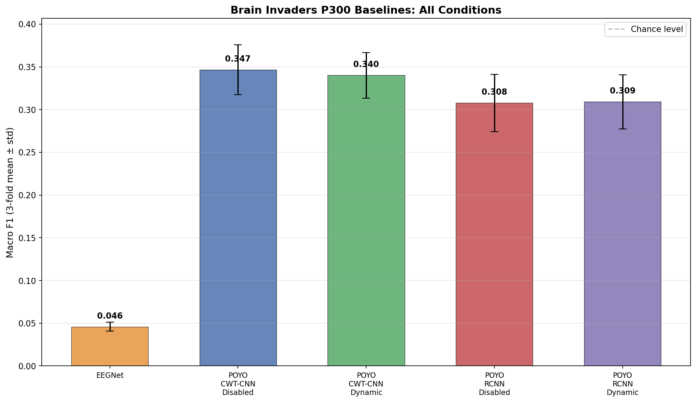
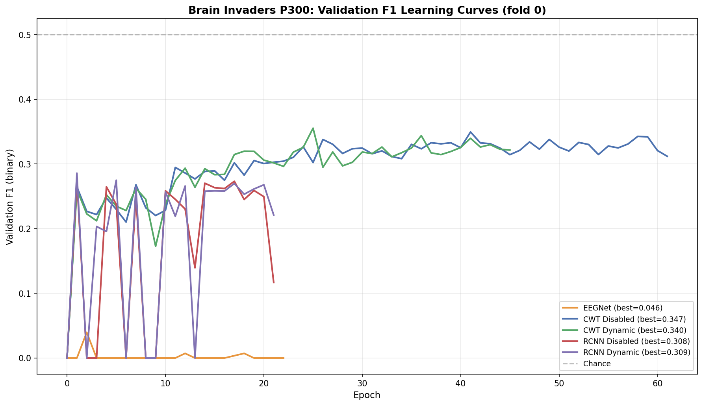
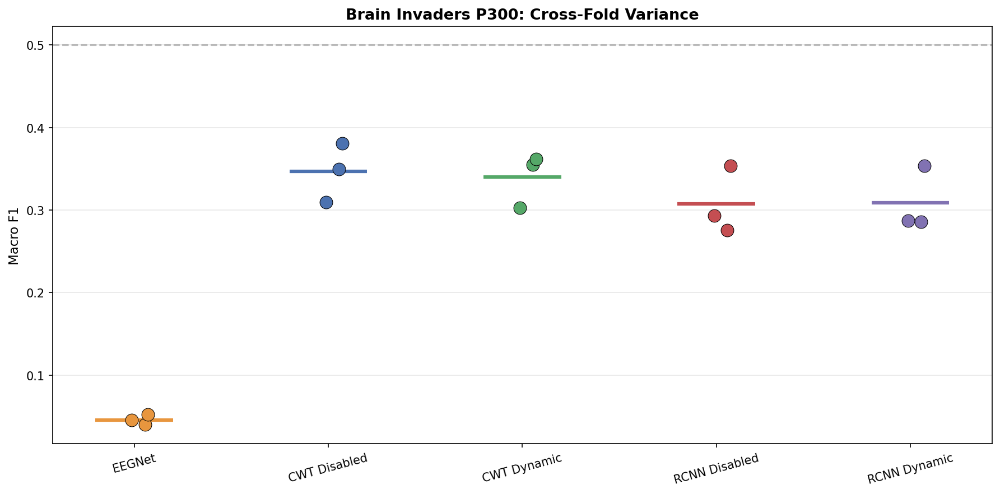

# Brain Invaders P300 From-Scratch Baselines

**Status:** Completed
**Date started:** 2026-07-31
**Parent experiment:** [KempSleep 30s-Epoch From-Scratch Baselines](./023-kemp-30s-baselines.md)
**Follow-up experiments:** [Brain Invaders P300 HP Search](20260731-MS-brain-invaders-p300-hp-search.md)
**Tags:** p300, brain_invaders, baseline, from_scratch, eegnet, poyo, cwt_cnn, resample_cnn

## Background

Experiment 023 established strong from-scratch baselines for KempSleep 5-class
sleep staging, showing that POYO CWT-CNN is the best architecture (0.730 F1),
followed by POYO ResampleCNN (0.699) and EEGNet (0.692). Dynamic channel
embeddings provided negligible benefit at 30s epochs.

This experiment extends the same baseline methodology to the Brain Invaders
2014a P300 dataset — a binary classification task (Target vs NonTarget) with
16 EEG channels at 512 Hz. P300 differs fundamentally from sleep staging:
trials are short (~1s), event-locked, and the discriminative signal is a
transient ERP component rather than sustained oscillatory patterns. This will
test whether the architectural rankings from sleep staging transfer to an
event-related potential paradigm.

## Question

How do the different model architectures (EEGNet, POYO CWT-CNN, POYO
ResampleCNN) and channel embedding modes (disabled, dynamic) compare on
Brain Invaders P300 binary classification when trained from scratch with
3-fold intersubject cross-validation?

## Hypothesis

1. **EEGNet may be more competitive here** than on sleep staging, since it was
   designed for short-window BCI tasks and P300 trials are ~1s.
2. **CWT-CNN will still outperform ResampleCNN** since wavelet decomposition
   should capture the P300 component's time-frequency signature well.
3. **Dynamic channel embeddings may matter more** for P300 than for 30s sleep
   staging, since the spatial distribution of the P300 is informative and
   the 16-channel montage provides meaningful topographic structure.
4. **Class imbalance will be a factor** — P300 datasets are typically ~80/20
   NonTarget/Target, making F1 a more informative metric than accuracy.

## Experiment

### Setup

- **Models:**
  - **EEGNet:** F1=8, D=2, F2=16, kernel_length=64, dropout=0.5,
    17 channels (auto-detected), 512 samples (1s × 512 Hz)
  - **POYO (CWT-CNN):** POYOEEGModel, embed_dim=256, depth=4, 8 heads,
    dim_head=128, `per_channel_cwt_cnn` tokenizer
  - **POYO (ResampleCNN):** Same backbone, `per_channel_resample_cnn` tokenizer
- **Channel embeddings (POYO only):** `disabled` / `dynamic`
- **Session embeddings:** `disabled` for all POYO conditions
- **Data:** BrainInvadersP300 (`brain_invaders_p300/allsess`), intersubject
  split, all 3 folds (0, 1, 2)
- **Task:** Binary P300 classification (Target vs NonTarget), class-weighted
  cross-entropy
- **Training:** sequence_length=1.0s, batch_size=64, lr=1e-4,
  weight_decay=0.01, max_epochs=1000, early stopping on val F1 (patience=20),
  bf16-mixed precision
- **Hardware:** 1× L40S per run, 6 CPUs, 32 GB RAM (SLURM)
- **WandB:** project=foundry_finetuning, group=BI_P300_BASELINES

**Conditions (15 total = 5 models × 3 folds):**

| Condition                           | Model      | Tokenizer      | channel_emb | Folds |
| ----------------------------------- | ---------- | -------------- | ----------- | ----- |
| eegnet                              | EEGNet     | N/A            | N/A         | 0,1,2 |
| poyo-cwt-ch-disabled                | POYO       | CWT-CNN        | `disabled`  | 0,1,2 |
| poyo-cwt-ch-dynamic                 | POYO       | CWT-CNN        | `dynamic`   | 0,1,2 |
| poyo-rcnn-ch-disabled               | POYO       | ResampleCNN    | `disabled`  | 0,1,2 |
| poyo-rcnn-ch-dynamic                | POYO       | ResampleCNN    | `dynamic`   | 0,1,2 |

### Launch command

```bash
# POYO models (12 jobs: 2 tokenizers × 2 channel_emb × 3 folds)
uv run python main.py experiment=p300/brain_invaders_baselines -m

# EEGNet (3 jobs: 3 folds)
uv run python main.py experiment=p300/eegnet_brain_invaders_baselines -m
```

### Key config overrides

- POYO experiment config:
  `configs/experiment/p300/brain_invaders_baselines.yaml`
- EEGNet experiment config:
  `configs/experiment/p300/eegnet_brain_invaders_baselines.yaml`
- `data.split_type: intersubject` for all conditions
- `hyperparameters.sequence_length: 1.0` (P300 trial windows)
- `hyperparameters.sampling_rate: 512`
- `model/session_emb: disabled` for all POYO conditions
- Hydra multirun sweeps `hyperparameters.fold_number` over 0, 1, 2

## Results

### Summary

All 15 runs (5 conditions × 3 folds) completed. Performance is poor across
the board, with EEGNet essentially failing completely and POYO models only
marginally above trivial baselines.

### Metrics

| Condition | Mean F1 | Std | Fold 0 | Fold 1 | Fold 2 |
|-----------|---------|-----|--------|--------|--------|
| EEGNet | 0.046 | 0.005 | 0.040 | 0.045 | 0.053 |
| CWT Disabled | 0.347 | 0.029 | 0.350 | 0.310 | 0.381 |
| CWT Dynamic | 0.340 | 0.027 | 0.355 | 0.303 | 0.362 |
| RCNN Disabled | 0.308 | 0.033 | 0.276 | 0.293 | 0.354 |
| RCNN Dynamic | 0.309 | 0.032 | 0.286 | 0.288 | 0.354 |

**Tokenizer comparison:**
- CWT-CNN > ResampleCNN by +3.9pp (disabled ch. emb) and +3.1pp (dynamic)

**Channel embedding effect:**
- Negligible: −0.7pp for CWT-CNN, +0.1pp for ResampleCNN

**EEGNet failure analysis:** Confusion matrix shows [[2734, 0], [550, 0]] —
the model predicts ALL samples as NonTarget. Zero recall, zero precision on
Target class. AUROC=0.56 (barely above chance). Early stopped at epoch 2.

**POYO CWT-CNN (best model):** Confusion matrix [[2234, 500], [356, 194]].
Detects some Targets (recall≈0.35, precision≈0.28) but with many false
positives. AUROC=0.68.

### Analysis

```bash
uv run python analysis/024_brain_invaders_p300_baselines.py
```

### Figures

- 
- 
- 

## Conclusions

1. **Hypothesis 1 (EEGNet competitive) — REFUTED.** EEGNet completely
   collapsed on P300. It converged to predicting all-NonTarget within 2
   epochs. The default hyperparameters (lr=1e-4, kernel_length=64) are
   clearly unsuitable for this task/dataset.

2. **Hypothesis 2 (CWT > RCNN) — CONFIRMED.** CWT-CNN outperforms
   ResampleCNN by ~3.5pp consistently across both channel embedding modes.

3. **Hypothesis 3 (dynamic ch. emb matters more for P300) — REFUTED.**
   Channel embeddings have negligible effect (< 1pp), similar to the sleep
   staging findings. The 16-channel P300 montage doesn't provide enough
   spatial diversity to benefit from dynamic embeddings.

4. **Hypothesis 4 (class imbalance is a factor) — CONFIRMED.** The ~83/17
   NonTarget/Target imbalance dominates. EEGNet collapsed entirely into
   majority-class prediction. Even with class-weighted loss, models struggle
   to learn the minority class.

**Overall:** All models underperform substantially. The best result (CWT-CNN
at 0.35 F1) is far below literature baselines for Brain Invaders P300
(typically 0.5–0.7 F1). The default hyperparameters from sleep staging do not
transfer to this task. A hyperparameter search is needed, particularly:
learning rate, weight decay, class weight smoothing, and model-specific
parameters (EEGNet kernel_length, POYO embed_dim/depth).

## Notes for future experiments

- EEGNet needs much more aggressive hyperparameter tuning for P300 — the
  default lr=1e-4 with patience=20 leads to immediate collapse on imbalanced
  short-window tasks.
- Consider higher learning rates (1e-3), different class weight smoothing,
  or focal loss for the imbalance problem.
- POYO models may benefit from smaller architectures (fewer layers/heads)
  given the short 1s window and simple binary task.
- The ResampleCNN tokenizer consistently underperforms CWT-CNN — may not be
  worth including in HP search unless we test different resampling configs.
- Data augmentation (time jitter, channel dropout) could help with the small
  effective dataset size per class.
