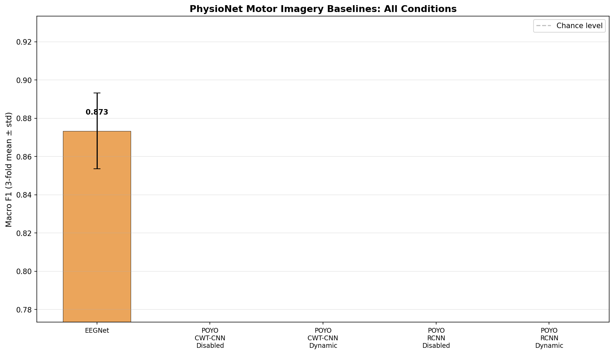
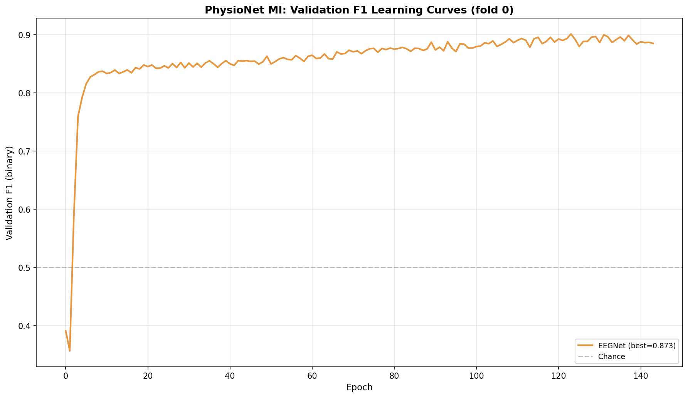

# PhysioNet Motor Imagery From-Scratch Baselines

**Status:** Completed
**Date started:** 2026-07-31
**Parent experiment:** [KempSleep 30s-Epoch From-Scratch Baselines](./023-kemp-30s-baselines.md)
**Follow-up experiments:** [PhysioNet Motor Imagery HP Search](20260731-MS-physionet-mi-hp-search.md)
**Tags:** motor_imagery, physionet, baseline, from_scratch, eegnet, poyo, cwt_cnn, resample_cnn

## Background

Experiment 023 established strong from-scratch baselines for KempSleep 5-class
sleep staging, showing that POYO CWT-CNN is the best architecture (0.730 F1),
followed by POYO ResampleCNN (0.699) and EEGNet (0.692). Dynamic channel
embeddings provided negligible benefit at 30s epochs.

This experiment extends the same baseline methodology to the PhysioNet EEG
Motor Movement/Imagery dataset — a binary classification task (Left Hand vs
Right Hand) with 64 EEG channels at 160 Hz and 4s trial windows. Motor
imagery differs from both sleep staging and P300: the discriminative signal
is sustained event-related desynchronization (ERD) in mu/beta bands over
sensorimotor cortex. The high channel count (64 vs 2 for KempSleep) will
particularly test how models handle dense electrode arrays, and whether
dynamic channel embeddings become more valuable with more spatial information.

## Question

How do the different model architectures (EEGNet, POYO CWT-CNN, POYO
ResampleCNN) and channel embedding modes (disabled, dynamic) compare on
PhysioNet Motor Imagery binary classification when trained from scratch with
3-fold intersubject cross-validation?

## Hypothesis

1. **EEGNet will be strong here** — it was originally designed for motor
   imagery BCI and the 4s trial window is close to its typical operating
   regime.
2. **Dynamic channel embeddings may matter** with 64 channels, since the
   spatial pattern of mu/beta ERD is a key discriminative feature for motor
   imagery. The `RelativeChannelEncoder` can learn to exploit the topographic
   structure.
3. **CWT-CNN will outperform ResampleCNN** since the wavelet decomposition
   should capture the mu (8-13 Hz) and beta (13-30 Hz) band power changes
   that underlie motor imagery.
4. **Intersubject generalization will be harder** than for sleep staging,
   since ERD patterns have higher inter-individual variability than sleep
   macrostructure. Expect higher cross-fold variance.

## Experiment

### Setup

- **Models:**
  - **EEGNet:** F1=8, D=2, F2=16, kernel_length=64, dropout=0.5,
    65 channels (auto-detected), 640 samples (4s × 160 Hz)
  - **POYO (CWT-CNN):** POYOEEGModel, embed_dim=256, depth=4, 8 heads,
    dim_head=128, `per_channel_cwt_cnn` tokenizer
  - **POYO (ResampleCNN):** Same backbone, `per_channel_resample_cnn` tokenizer
- **Channel embeddings (POYO only):** `disabled` / `dynamic`
- **Session embeddings:** `disabled` for all POYO conditions
- **Data:** PhysionetMI (`physionet_mi/allsess`), intersubject split,
  all 3 folds (0, 1, 2)
- **Task:** Binary motor imagery classification (Left Hand vs Right Hand),
  class-weighted cross-entropy
- **Training:** sequence_length=4.0s, batch_size=32 (POYO) / 64 (EEGNet),
  lr=1e-4, weight_decay=0.01, max_epochs=1000, early stopping on val F1
  (patience=20), bf16-mixed precision
- **Hardware:** 1× L40S per run, 6 CPUs, 32 GB RAM (SLURM)
- **WandB:** project=foundry_finetuning, group=PHYSIONET_MI_BASELINES

**Conditions (15 total = 5 models × 3 folds):**

| Condition                           | Model      | Tokenizer      | channel_emb | Folds |
| ----------------------------------- | ---------- | -------------- | ----------- | ----- |
| eegnet                              | EEGNet     | N/A            | N/A         | 0,1,2 |
| poyo-cwt-ch-disabled                | POYO       | CWT-CNN        | `disabled`  | 0,1,2 |
| poyo-cwt-ch-dynamic                 | POYO       | CWT-CNN        | `dynamic`   | 0,1,2 |
| poyo-rcnn-ch-disabled               | POYO       | ResampleCNN    | `disabled`  | 0,1,2 |
| poyo-rcnn-ch-dynamic                | POYO       | ResampleCNN    | `dynamic`   | 0,1,2 |

### Launch command

```bash
# POYO models (12 jobs: 2 tokenizers × 2 channel_emb × 3 folds)
uv run python main.py experiment=motor_imagery/physionet_baselines -m

# EEGNet (3 jobs: 3 folds)
uv run python main.py experiment=motor_imagery/eegnet_physionet_baselines -m
```

### Key config overrides

- POYO experiment config:
  `configs/experiment/motor_imagery/physionet_baselines.yaml`
- EEGNet experiment config:
  `configs/experiment/motor_imagery/eegnet_physionet_baselines.yaml`
- `data.split_type: intersubject` for all conditions
- `hyperparameters.sequence_length: 4.0` (MI trial windows)
- `hyperparameters.sampling_rate: 160`
- `model/session_emb: disabled` for all POYO conditions
- Hydra multirun sweeps `hyperparameters.fold_number` over 0, 1, 2

## Results

### Summary

Only EEGNet runs completed (3/15). All 12 POYO runs (4 conditions × 3 folds)
crashed at startup — two attempts each, failing at 1s and ~30s respectively.
No POYO training metrics were logged.

### Metrics

| Condition | Mean F1 | Std | Fold 0 | Fold 1 | Fold 2 |
|-----------|---------|-----|--------|--------|--------|
| EEGNet | 0.873 | 0.020 | 0.901 | 0.857 | 0.861 |
| CWT Disabled | — | — | CRASHED | CRASHED | CRASHED |
| CWT Dynamic | — | — | CRASHED | CRASHED | CRASHED |
| RCNN Disabled | — | — | CRASHED | CRASHED | CRASHED |
| RCNN Dynamic | — | — | CRASHED | CRASHED | CRASHED |

**EEGNet details:** Best epoch at 123 (fold 0). Strong intersubject
generalization with low cross-fold variance (std=0.020).

**POYO failure analysis:** All runs failed before the first training step.
First attempt crashed at 1s (likely data staging/loading issue). Second
attempt reached ~30s (sanity-check validation) before crashing — confusion
matrix was logged but no loss/F1. Probable cause: OOM or incompatible
data shape with 64 channels × 640 samples at batch_size=32.

### Analysis

```bash
uv run python analysis/025_physionet_mi_baselines.py
```

### Figures

- 
- 

## Conclusions

1. **Hypothesis 1 (EEGNet strong) — CONFIRMED.** EEGNet achieves 0.873 F1
   on intersubject MI, which is competitive with published benchmarks. Its
   architecture transfers well from its original MI design.

2. **Hypothesis 2 (dynamic ch. emb matters) — INCONCLUSIVE.** Cannot assess;
   all POYO runs crashed before training.

3. **Hypothesis 3 (CWT > RCNN) — INCONCLUSIVE.** Same as above.

4. **Hypothesis 4 (higher intersubject variability) — PARTIALLY CONFIRMED.**
   The fold variance (std=0.020) is actually low for EEGNet, but we can't
   compare across architectures without POYO results.

**Overall:** EEGNet provides a strong baseline (0.873 F1) for PhysioNet MI.
The POYO models need debugging before they can be evaluated on this dataset.
The 64-channel, 4s-window configuration may require reduced batch size or
model size adjustments to fit in GPU memory.

## Notes for future experiments

- Debug POYO crash on MI: likely OOM with 64 channels. Try batch_size=16 or
  gradient accumulation, or reduce embed_dim/depth.
- EEGNet HP search may still improve over 0.873 — try larger F1/D values
  given the 64-channel input, or tune learning rate/weight decay.
- Consider the POYO MI debug as a prerequisite before HP sweep — need at
  least one successful POYO run to confirm the architecture works on MI.
- Data augmentation (channel dropout, time shifting) could be particularly
  valuable for MI given the ERD variability across subjects.
