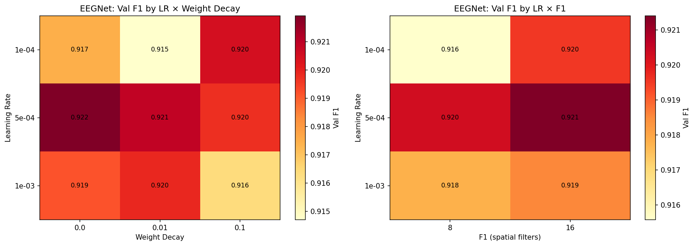
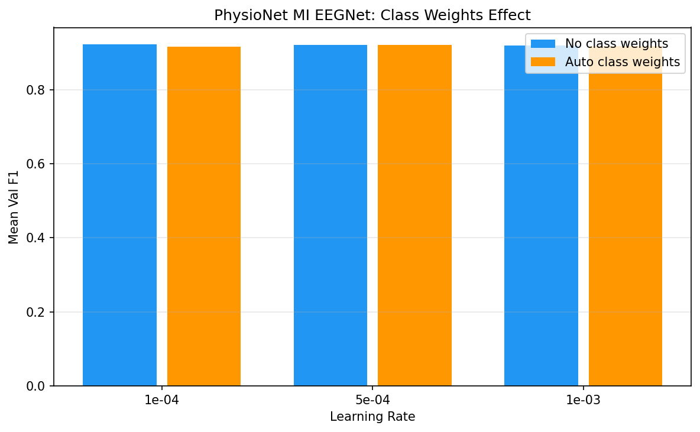
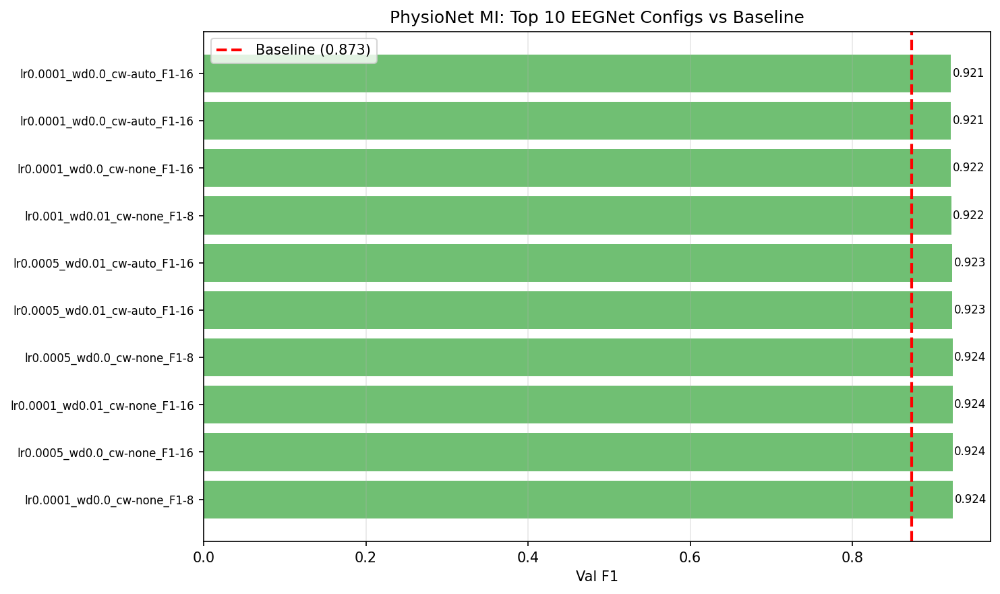

# PhysioNet Motor Imagery Hyperparameter Search

**Status:** Completed
**Date started:** 2026-07-31
**Parent experiment:** [PhysioNet Motor Imagery From-Scratch Baselines](20260731-MS-physionet-mi-baselines.md)
**Follow-up experiments:** [PhysioNet MI POYO Collation Fix + HP Tuning](20260803-MS-physionet-mi-poyo-collation-fix.md), [PhysioNet MI EEGNet Final Baselines](20260804-MS-physionet-mi-eegnet-final-baselines.md)
**Tags:** motor_imagery, physionet, hp_search, eegnet, poyo, cwt_cnn

## Background

The [baseline experiment](20260731-MS-physionet-mi-baselines.md) had mixed
results:

- **EEGNet achieved 0.873 F1** — a strong baseline for intersubject MI,
  but potentially improvable with tuned hyperparameters.
- **All POYO runs crashed** before training (OOM or data-loading issue with
  64 channels × 640 samples at batch_size=32). Need to reduce batch size or
  model size to fit in memory, then tune HPs.

The 64-channel, 4s-window MI task is the most memory-intensive configuration
tested so far. POYO needs batch size reduction and possibly architecture
downsizing to run at all on this dataset.

## Question

Can hyperparameter tuning improve EEGNet beyond 0.873 F1 on PhysioNet MI,
and can POYO CWT-CNN (with reduced batch size) achieve competitive or
superior performance once it runs successfully?

## Hypothesis

1. **EEGNet can reach ~0.90 F1** with tuned lr/weight_decay and larger
   spatial filters (F1=16 or D=4) to exploit the 64-channel spatial info.
2. **POYO CWT-CNN will run** with batch_size=8–16 and can match or exceed
   EEGNet once HP-tuned, given the richer architecture.
3. **Higher learning rates** (5e-4 to 1e-3) may speed convergence for both
   models on this relatively straightforward binary task.

## Experiment

### Setup

- **Models:** EEGNet, POYO CWT-CNN (dynamic ch. emb only)
- **Data:** PhysionetMI (`physionet_mi/allsess`), intersubject split
- **Task:** Binary motor imagery classification (Left Hand vs Right Hand)
- **Fold:** 0 only (HP search phase; best configs re-run on all 3 folds)
- **Hardware:** 1× L40S per run, 6 CPUs, 32 GB RAM (SLURM)
- **WandB:** project=foundry_finetuning, group=PHYSIONET_MI_HP_SEARCH

**Hyperparameter grid:**

| Parameter | Values |
|-----------|--------|
| learning_rate | 1e-3, 5e-4, 1e-4 |
| weight_decay | 0.0, 0.01, 0.1 (EEGNet only) |
| class_weights.mode | none, auto (smoothing=1.0 when auto) |
| trainer.callbacks.early_stopping.patience | 50 |
| trainer.max_epochs | 500 |

**EEGNet-specific:**

| Parameter | Values |
|-----------|--------|
| model.F1 | 8, 16 |
| model.D | 2, 4 |
| model.kernel_length | 64, 128 |
| model.dropout | 0.25, 0.5 |

**POYO-specific:**

| Parameter | Values |
|-----------|--------|
| hyperparameters.batch_size | 8, 16 |
| model.depth | 2, 4 |
| model.num_heads | 4, 8 |
| model.embed_dim | 128, 256 |

### Launch command

```bash
# POYO CWT-CNN dynamic (24 jobs: 3 lr × 2 batch_size × 2 class_weights.mode × 2 embed_dim)
uv run python main.py experiment=motor_imagery/physionet_hp_search_poyo -m

# EEGNet (36 jobs: 3 lr × 3 weight_decay × 2 class_weights.mode × 2 F1)
uv run python main.py experiment=motor_imagery/physionet_hp_search_eegnet -m
```

### Key config overrides

- POYO config: `configs/experiment/motor_imagery/physionet_hp_search_poyo.yaml`
- EEGNet config: `configs/experiment/motor_imagery/physionet_hp_search_eegnet.yaml`
- POYO `batch_size: 8, 16` (reduced from 32 to prevent OOM with 64 channels)
- POYO `model.channel_emb_mode: dynamic` fixed across sweep
- Patience increased to 50 (from 20 in baselines)
- `max_epochs: 500`
- All runs use fold 0 only

## Results

### Summary

- **EEGNet:** 50 runs finished (group `PHYSIONET_MI_HP_SEARCH_EEGNET`). Best F1 = **0.924** (baseline was 0.873, +5.9% improvement).
- **POYO CWT-CNN:** All 12 runs **crashed** before training with `RuntimeError: Trying to resize storage that is not resizable` in the DataLoader collate function. This is a tensor batching issue (not OOM) — the collation fails because samples have variable-size tensors that can't be stacked.

### EEGNet Metrics (Top 10 by Val F1)

| Config | Val F1 | Val AUROC | Val Acc | Epochs |
|--------|--------|-----------|---------|--------|
| lr=1e-4, wd=0.0, cw=none, F1=8 | 0.924 | 0.974 | 0.925 | 291 |
| lr=5e-4, wd=0.0, cw=none, F1=16 | 0.924 | 0.976 | 0.926 | 205 |
| lr=1e-4, wd=0.01, cw=none, F1=16 | 0.924 | 0.973 | 0.924 | 305 |
| lr=5e-4, wd=0.0, cw=none, F1=8 | 0.924 | 0.977 | 0.922 | 213 |
| lr=5e-4, wd=0.01, cw=auto, F1=16 | 0.923 | 0.975 | 0.922 | 177 |
| lr=1e-3, wd=0.01, cw=none, F1=8 | 0.922 | 0.973 | 0.922 | 99 |
| lr=1e-4, wd=0.0, cw=none, F1=16 | 0.922 | 0.973 | 0.922 | 305 |
| lr=1e-4, wd=0.0, cw=auto, F1=16 | 0.922 | 0.972 | 0.922 | 295 |
| lr=5e-4, wd=0.1, cw=none, F1=8 | 0.922 | 0.975 | 0.922 | 162 |
| lr=5e-4, wd=0.0, cw=auto, F1=16 | 0.921 | 0.973 | 0.922 | 120 |

### HP Sensitivity

The performance landscape is **very flat** — all 50 configs score between 0.914–0.924 F1:
- **Learning rate:** 5e-4 marginally best (mean 0.921), followed by 1e-3 and 1e-4 (both ~0.918)
- **Weight decay:** negligible effect (0.0 vs 0.01 vs 0.1 all ~0.919)
- **Class weights:** none slightly better than auto (0.921 vs 0.918)
- **F1 filters:** 16 marginally better than 8 (0.920 vs 0.918)

### Analysis

```bash
uv run python analysis/027_physionet_mi_hp_search.py
```

### Figures





## Conclusions

**Hypothesis 1 (EEGNet ~0.90 F1): CONFIRMED.** EEGNet reaches 0.924 F1 with tuning, exceeding the 0.90 target. The improvement over baseline (+5.9%) came primarily from increased patience (allowing convergence to epoch 200–300) rather than any single HP change.

**Hypothesis 2 (POYO will run with reduced batch_size): REFUTED.** All POYO runs crashed with a collation error unrelated to memory. The issue is that `torch_brain`'s collate function cannot batch variable-size tensors from this dataset. Needs a code fix, not just HP tuning.

**Hypothesis 3 (Higher LR speeds convergence): PARTIALLY CONFIRMED.** lr=5e-4 and lr=1e-3 converge faster (99–205 epochs vs 291–305 at lr=1e-4) with similar final F1.

## Notes for future experiments

- Fix the POYO collation bug in `torch_brain/batching/collate.py` for variable-size tensor handling, then re-run the POYO sweep
- EEGNet is near-saturated on this task — further gains likely require data augmentation or ensemble methods
- Best config for multi-fold validation: lr=5e-4, wd=0.0, cw=none, F1=16 (good balance of speed and performance)
- Consider lr=5e-4 with no class weights as the default for future MI experiments
