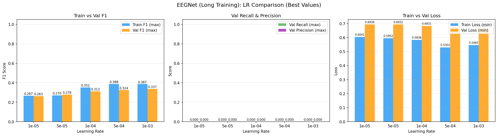
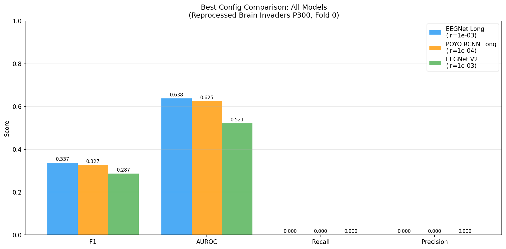

# Brain Invaders EEGNet Reprocessed — Long Training (No Early Stopping)

**Status:** Completed
**Date started:** 2026-08-04
**Parent experiment:** [Brain Invaders EEGNet HP Search (Reprocessed Data)](20260804-MS-brain-invaders-eegnet-reprocessed-hp.md)
**Follow-up experiments:** [Brain Invaders P300 Reprocessed 3-Fold Baselines](20260804-MS-brain-invaders-p300-reprocessed-3fold.md)
**Tags:** p300, brain_invaders, eegnet, reprocessed, long_training

## Background

The [parent HP search](20260804-MS-brain-invaders-eegnet-reprocessed-hp.md) ran
EEGNet with patience=50 on the reprocessed Brain Invaders P300 data. Since that
run was launched, two critical fixes were committed to the dataset class
(`foundry/data/datasets/brain_invaders_p300.py`):

1. **Z-score normalization** (`_ensure_normalized`) — EEG signals are now
   globally normalized per recording before any sampling, which was missing in
   the parent run.
2. **Anchor-trial filtering** (`_keep_anchor_trial`) — When `epoch_duration`
   causes windows to overlap multiple stimuli, only the anchor trial is
   retained. Without this, the model received contradictory labels per window
   (e.g. one Target + two NonTargets), which prevented learning entirely.

An overfitting debug run on a single session (sub001, intrasession) confirmed
that EEGNet *can* learn P300 with these fixes, but showed a notable plateau in
loss before the model eventually improves. With patience=50, the parent
experiment likely terminates during this plateau before the model has a chance
to descend.

## Question

With the normalization and anchor-trial fixes in place, can EEGNet achieve
good baseline P300 classification (F1 ≥ 0.5) if given sufficient training
time (no early stopping, 1000 epochs)?

## Hypothesis

The combination of proper normalization and single-trial-per-window filtering
removes the two main blockers from the parent experiment. Given enough training
time to push through the initial plateau, EEGNet should reach F1 ≥ 0.5 on at
least one learning rate configuration — entering the literature-reported range
of 0.5–0.7 F1 for P300 on this dataset.

## Experiment

### Setup

- **Model:** EEGNet (F1=8, D=2, F2=16, kernel_length=128, dropout=0.5)
- **Data:** BrainInvadersP300 (`brain_invaders_p300/allsess`), reprocessed, intersubject split
- **Task:** Binary P300 classification (Target vs NonTarget)
- **Fold:** 0 only (HP search phase)
- **Class weights:** auto (smoothing=1.0)
- **Early stopping:** Disabled
- **Max epochs:** 1000
- **Hardware:** 1× L40S per run, 6 CPUs, 32 GB RAM (SLURM)
- **WandB:** project=foundry_finetuning, group=BI_P300_EEGNET_REPROC_LONG

**Hyperparameter grid (5 jobs):**

| Parameter | Values |
|-----------|--------|
| learning_rate | 1e-3, 5e-4, 1e-4, 5e-5, 1e-5 |
| class_weights.mode | auto (smoothing=1.0) |
| trainer.max_epochs | 1000 |
| early_stopping | disabled |

### Launch command

```bash
uv run python main.py experiment=p300/brain_invaders_eegnet_reprocessed_long -m
```

### Key config overrides

- Config: `configs/experiment/p300/brain_invaders_eegnet_reprocessed_long.yaml`
- Based on parent `brain_invaders_hp_eegnet_reprocessed.yaml`
- Early stopping removed entirely (model trains for full 1000 epochs)
- max_epochs increased from 500 → 1000
- Same LR sweep: 1e-3, 5e-4, 1e-4, 5e-5, 1e-5
- All other settings identical to parent

## Results

### Summary

All 5 LR configurations ran for ~94 epochs before being manually cancelled
due to clear overfitting. WandB group: `BI_P300_EEGNET_REPROC_LONG`.

Long training did help EEGNet escape the plateau that caused early stopping
in the parent experiment (patience=50), improving best val F1 from 0.287 to
0.337 (+5pp). However, performance remains far below literature targets
(0.5–0.7 F1).

### Metrics

| LR    | Val F1 | AUROC  | Train F1 | Overfit Gap | Epochs | Train Loss | Val Loss |
|-------|--------|--------|----------|-------------|--------|------------|----------|
| 1e-3  | 0.337  | 0.638  | 0.387    | +0.050      | 94     | 0.546      | 0.665    |
| 5e-4  | 0.324  | 0.615  | 0.388    | +0.063      | 93     | 0.530      | 0.675    |
| 1e-4  | 0.313  | 0.600  | 0.352    | +0.039      | 94     | 0.584      | 0.683    |
| 5e-5  | 0.278  | 0.514  | 0.270    | −0.008      | 94     | 0.595      | 0.693    |
| 1e-5  | 0.263  | 0.497  | 0.267    | +0.004      | 91     | 0.604      | 0.694    |

**Best config: lr=1e-3, val F1=0.337, AUROC=0.638.**

### Comparison with parent (patience=50)

| Experiment | Best Val F1 | Best LR | Epochs |
|-----------|-------------|---------|--------|
| Parent (V2, patience=50) | 0.287 | 1e-3 | 54 |
| Long (1000 epochs) | 0.337 | 1e-3 | 94 |
| Delta | +0.050 | — | +40 |

Long training allowed EEGNet to push through the initial plateau and learn
some Target-class features, but the gain is modest.

### Analysis

```bash
uv run python analysis/031_brain_invaders_reproc_long_hp.py
```

### Figures




## Conclusions

**Hypothesis partially confirmed.** Long training did improve EEGNet beyond
the patience=50 results (0.287 → 0.337 F1), confirming that the plateau
issue was real and early stopping was premature. However, no LR configuration
reached the target of F1 ≥ 0.5. The best result (0.337) is only marginally
better than the original pre-reprocessing HP search (0.328), suggesting
that the data pipeline fixes (normalization + anchor-trial filtering) had
limited impact for EEGNet at the intersubject level.

The model shows mild overfitting at higher LRs (gap of +0.05 to +0.06 at
lr=1e-3 and 5e-4) but not catastrophic — EEGNet's smaller capacity prevents
the extreme memorization seen with POYO.

**Best HP for follow-up: lr=1e-3** with class_weights=auto (smoothing=1.0).

## Notes for future experiments

- CWT-CNN may outperform ResampleCNN on this task (it did in the original
  baselines by +3.5pp F1). The 3-fold experiment will test this.
- Try intrasession splits first to verify EEGNet can learn P300 at all on
  this data when train/val share the same subjects — poor intersubject
  performance may reflect cross-subject variability rather than model failure.
