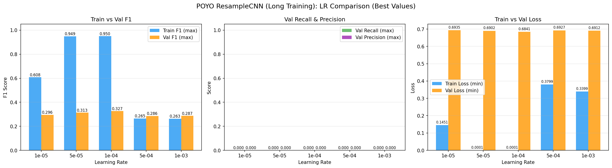

# Brain Invaders POYO ResampleCNN HP Search (Reprocessed, Long Training)

**Status:** Completed
**Date started:** 2026-08-04
**Parent experiment:** [Brain Invaders P300 HP Search](20260731-MS-brain-invaders-p300-hp-search.md)
**Follow-up experiments:** [Brain Invaders P300 Reprocessed 3-Fold Baselines](20260804-MS-brain-invaders-p300-reprocessed-3fold.md)
**Tags:** p300, brain_invaders, hp_search, poyo, resample_cnn, reprocessed, long_training

## Background

The [parent HP search](20260731-MS-brain-invaders-p300-hp-search.md) swept
hyperparameters across EEGNet and POYO CWT-CNN on Brain Invaders P300. The
best POYO result was F1=0.402 (CWT-CNN) and ResampleCNN scored 0.308 in the
[baselines](20260731-MS-brain-invaders-p300-baselines.md) — both far below
literature targets (~0.5–0.7 F1).

The root cause was a **data pipeline issue**: with `sequence_length=1.0s` and
`drop_short=True`, 90% of trials were dropped. The data has since been
**reprocessed** to fix this, and two additional critical fixes were applied to
the dataset class (`foundry/data/datasets/brain_invaders_p300.py`):

1. **Z-score normalization** (`_ensure_normalized`) — EEG signals are globally
   normalized per recording before sampling.
2. **Anchor-trial filtering** (`_keep_anchor_trial`) — When `epoch_duration`
   causes windows to overlap multiple stimuli, only the anchor trial is
   retained, preventing contradictory labels per window.

The [EEGNet reprocessed HP search](20260804-MS-brain-invaders-eegnet-reprocessed-hp.md)
and its [long training follow-up](20260804-MS-brain-invaders-eegnet-reprocessed-long.md)
are testing EEGNet on this corrected pipeline. This experiment extends the
investigation to POYO with the ResampleCNN tokenizer, using long training
(1000 epochs, no early stopping) to avoid the plateau issue observed in the
EEGNet overfitting debug runs.

## Question

With the reprocessed Brain Invaders data and dataset fixes (normalization +
anchor-trial filtering), can POYO ResampleCNN achieve reasonable P300
classification (F1 > 0.5) when given sufficient training time?

## Hypothesis

With access to the full trial set (instead of ~10%) and proper normalization,
POYO ResampleCNN should substantially exceed the original baseline of F1=0.308.
Long training (1000 epochs) will prevent premature stopping during loss
plateaus. The optimal learning rate is expected to be 1e-4 (consistent with
POYO's behavior on the original data and PhysioNet MI), potentially reaching
the literature range of 0.5–0.7 F1.

## Experiment

### Setup

- **Model:** POYO EEG (embed_dim=256, depth=4, ResampleCNN tokenizer, dynamic channel embeddings)
- **Data:** BrainInvadersP300 (`brain_invaders_p300/allsess`), reprocessed, intersubject split
- **Task:** Binary P300 classification (Target vs NonTarget)
- **Fold:** 0 only (HP search phase; best config re-run on all 3 folds later)
- **Class weights:** auto (smoothing=1.0)
- **Early stopping:** Disabled (patience=1000 = effectively off)
- **Max epochs:** 1000
- **Hardware:** 1× L40S per run, 6 CPUs, 32 GB RAM (SLURM)
- **WandB:** project=foundry_finetuning, group=BI_P300_POYO_RCNN_REPROC_LONG

**Hyperparameter grid (5 jobs):**

| Parameter | Values |
|-----------|--------|
| learning_rate | 1e-3, 5e-4, 1e-4, 5e-5, 1e-5 |
| class_weights.mode | auto (smoothing=1.0) |
| trainer.max_epochs | 1000 |
| early_stopping | disabled (patience=1000) |

### Launch command

```bash
uv run python main.py experiment=p300/brain_invaders_hp_poyo_rcnn_reprocessed_long -m
```

### Key config overrides

- Config: `configs/experiment/p300/brain_invaders_hp_poyo_rcnn_reprocessed_long.yaml`
- Tokenizer: `per_channel_resample_cnn` (instead of `per_channel_cwt_cnn`)
- Channel embedding: `dynamic` (fixed, not swept)
- class_weights.mode fixed to `auto` (POYO originally preferred smoothing=0.1, but aligning with EEGNet reprocessed for comparability)
- LR range extended downward (5e-5, 1e-5) to test if larger dataset benefits from slower learning
- No early stopping — trains for full 1000 epochs
- timeout_min increased to 1440 (24h) to accommodate long training
- All other settings match the original POYO HP search (embed_dim=256, depth=4, batch_size=64)

## Results

### Summary

All 5 LR configurations ran for ~44 epochs before being manually cancelled
due to extreme overfitting. WandB group: `BI_P300_POYO_RCNN_REPROC_LONG`.

POYO ResampleCNN shows **catastrophic overfitting** at lower learning rates:
train loss drops to near-zero (0.00008) with train F1=0.950 while val F1
stagnates at ~0.327. Higher LRs (5e-4, 1e-3) hadn't converged yet at 44
epochs. The model memorizes the training set completely but learns nothing
generalizable for the validation set.

### Metrics

| LR    | Val F1 | AUROC  | Train F1 | Overfit Gap | Epochs | Train Loss | Val Loss |
|-------|--------|--------|----------|-------------|--------|------------|----------|
| 1e-4  | 0.327  | 0.625  | 0.950    | +0.624      | 43     | 0.000078   | 0.684    |
| 5e-5  | 0.313  | 0.606  | 0.949    | +0.636      | 43     | 0.000112   | 0.690    |
| 1e-5  | 0.296  | 0.575  | 0.608    | +0.312      | 44     | 0.145      | 0.694    |
| 1e-3  | 0.287  | 0.516  | 0.263    | −0.024      | 43     | 0.340      | 0.691    |
| 5e-4  | 0.286  | 0.535  | 0.265    | −0.020      | 44     | 0.380      | 0.693    |

**Best config: lr=1e-4, val F1=0.327, AUROC=0.625.**

### Overfitting Analysis

The overfitting is extreme for lr ≤ 1e-4:
- **lr=1e-4**: train loss=0.00008 (effectively zero), val loss=0.684 (barely moved from init ~0.693)
- **lr=5e-5**: nearly identical pattern
- The model has enough capacity (embed_dim=256, depth=4) to perfectly memorize
  the training set in ~40 epochs, but the learned representations don't transfer
  to unseen subjects at all.

Higher LRs (5e-4, 1e-3) haven't collapsed yet at 44 epochs but show no
signs of learning the minority class (train F1 ≈ 0.263, near majority-class
baseline).

### Analysis

```bash
uv run python analysis/031_brain_invaders_reproc_long_hp.py
```

### Figures




## Conclusions

**Hypothesis partially confirmed, partially refuted.** POYO ResampleCNN did
improve over the original baseline (0.308 → 0.327 F1), but falls far short
of the 0.5 F1 target and the literature range of 0.5–0.7. The optimal LR
is 1e-4 (consistent with the prediction), but the improvement is marginal
and accompanied by extreme overfitting.

The model has more than enough capacity to fit the training data (train
F1=0.950 in 43 epochs) but fails to generalize across subjects. This
suggests the bottleneck is not model capacity or data quantity, but rather
the intersubject variability in P300 morphology that POYO ResampleCNN cannot
bridge.

**Best HP for follow-up: lr=1e-4** with class_weights=auto (smoothing=1.0).

## Notes for future experiments

- CWT-CNN may outperform ResampleCNN on this task (it did in the original
  baselines by +3.5pp F1). The 3-fold experiment will test whether this
  gap persists with reprocessed data.
- Try intrasession splits first to verify POYO can learn P300 when train/val
  share the same subjects — if intrasession also fails, the issue is deeper
  than cross-subject variability.
