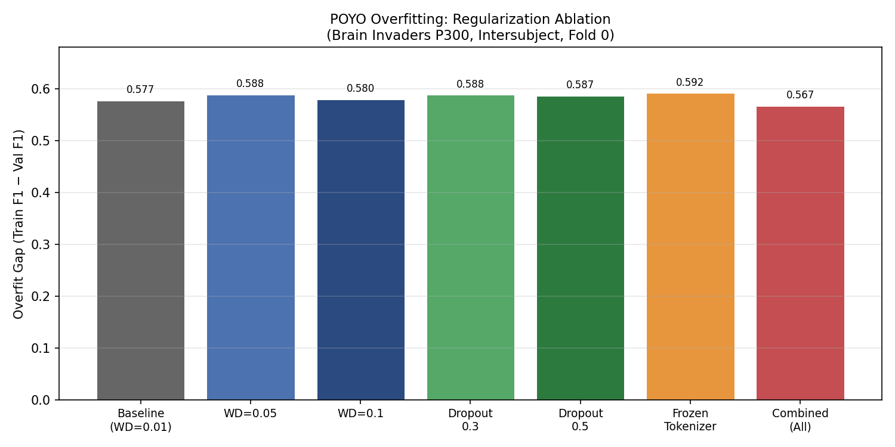
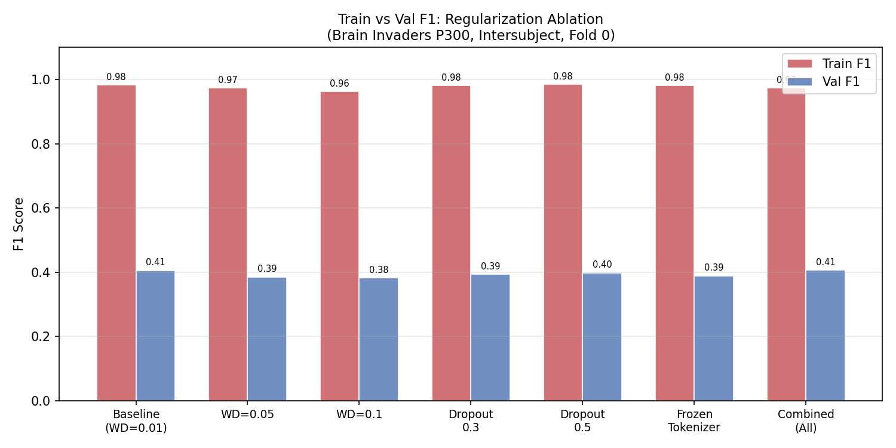
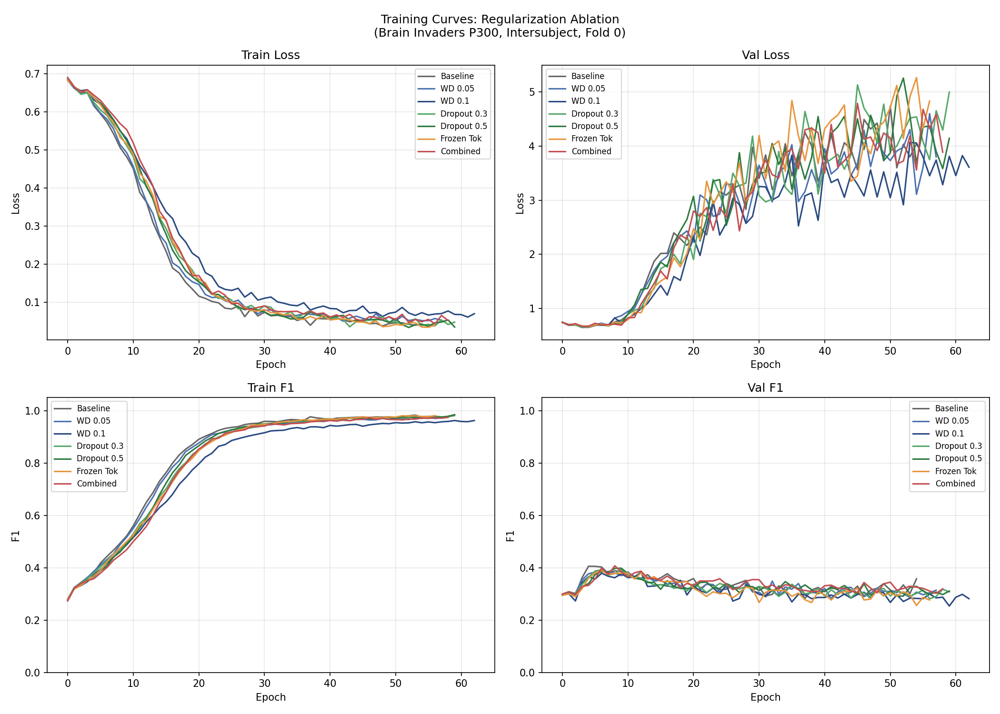
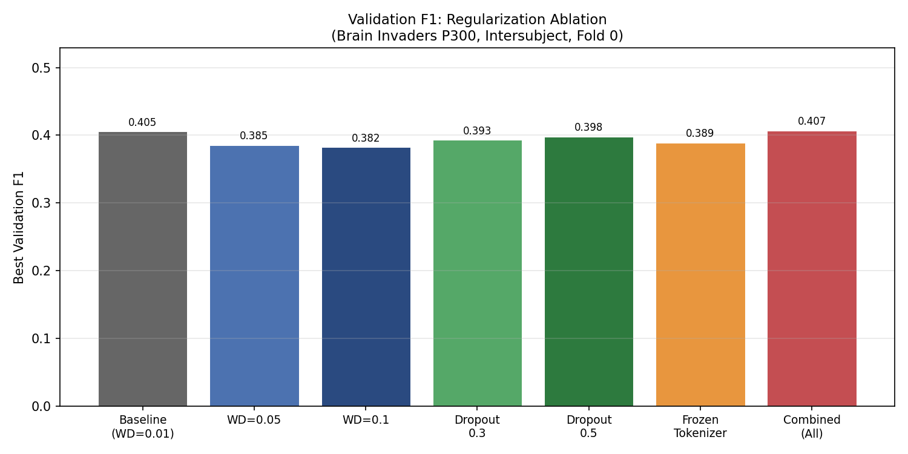

# POYO Overfitting Diagnosis — Regularization & Frozen Tokenizer Ablation

**Status:** Completed
**Date started:** 2026-08-05
**Parent experiment:** [Brain Invaders P300 Reprocessed — 3-Fold Baselines](20260804-MS-brain-invaders-p300-reprocessed-3fold.md)
**Follow-up experiments:** TBD
**Tags:** p300, brain_invaders, poyo, overfitting, regularization, weight_decay, dropout, frozen_tokenizer, ablation

## Background

The [3-fold baselines experiment](20260804-MS-brain-invaders-p300-reprocessed-3fold.md)
revealed a striking divergence between POYO and EEGNet on Brain Invaders P300:
both achieve similar validation F1 (~0.32–0.40), but POYO memorises training
data completely (train F1 0.95–0.98, overfit gap +0.60–0.64) while EEGNet shows
zero overfitting (train ≈ val F1). This happens consistently across all POYO
variants (CWT-CNN / ResampleCNN × disabled / dynamic channel embeddings),
all 3 folds, and both intersubject and intrasession splits.

EEGNet uses aggressive built-in regularization (depthwise separable convolutions,
dropout=0.5 on all layers) and has far fewer parameters. POYO (embed_dim=256,
depth=4) uses relatively mild regularization (weight_decay=0.01, ffn/atn
dropout=0.2, lin_dropout=0.4) and has substantially more capacity distributed
across both its transformer backbone and CWT-CNN tokenizer.

This experiment systematically tests whether the overfitting is due to:
1. **Insufficient weight regularization** — the 0.01 weight decay is too low
   for POYO's parameter count
2. **Insufficient dropout** — the 0.2/0.4 dropout rates leave too much
   memorization capacity
3. **Tokenizer memorization** — the CWT-CNN tokenizer itself learns to
   memorise training patterns rather than extracting generalisable features

## Question

Which source of excess capacity drives POYO's extreme overfitting on Brain
Invaders P300: insufficient weight decay, insufficient dropout, or tokenizer
co-adaptation with training data?

## Hypothesis

1. **Weight decay alone will be insufficient** — increasing from 0.01 to 0.1
   will modestly reduce the overfit gap (by ~0.1–0.2) but not eliminate it,
   because L2 regularization does not prevent feature co-adaptation.
2. **Heavy dropout will have the largest single effect** — setting all dropouts
   to 0.5 (matching EEGNet's level) will substantially reduce the gap (by
   ~0.2–0.4) because it directly prevents neuron co-adaptation, which is the
   mechanism most likely responsible for memorization in transformers.
3. **Frozen tokenizer will reveal partial memorization** — freezing the CWT-CNN
   will reduce the gap somewhat (by ~0.1–0.2) because the tokenizer contributes
   memorization capacity, but the transformer backbone alone still has enough
   capacity to overfit.
4. **The combined condition (all three) will approach EEGNet's dynamics** —
   near-zero overfit gap — confirming that POYO's overfitting is a capacity/
   regularization problem rather than a fundamental architectural deficiency.

## Experiment

### Setup

- **Model:** POYO (embed_dim=256, depth=4, CWT-CNN tokenizer, dynamic channel embeddings)
- **Data:** BrainInvadersP300 (`brain_invaders_p300/allsess`), reprocessed
- **Task:** Binary P300 classification (Target vs NonTarget)
- **Split:** Intersubject, fold 0 only
- **Class weights:** auto (smoothing=1.0)
- **Early stopping:** patience=50, monitor=val/p300_binary_f1
- **Max epochs:** 500
- **Hardware:** 1× L40S, 6 CPUs, 32 GB RAM (SLURM)
- **WandB:** project=foundry_finetuning, group=BI_P300_OVERFIT_REGULARIZATION

**Conditions (7 total):**

| # | Condition        | weight_decay | ffn_dropout | lin_dropout | atn_dropout | cwt_lr_mult |
|---|------------------|--------------|-------------|-------------|-------------|-------------|
| 1 | Baseline         | 0.01         | 0.2         | 0.4         | 0.2         | 1.0         |
| 2 | WD 0.05          | 0.05         | 0.2         | 0.4         | 0.2         | 1.0         |
| 3 | WD 0.1           | 0.1          | 0.2         | 0.4         | 0.2         | 1.0         |
| 4 | Dropout 0.3      | 0.01         | 0.3         | 0.3         | 0.3         | 1.0         |
| 5 | Dropout 0.5      | 0.01         | 0.5         | 0.5         | 0.5         | 1.0         |
| 6 | Frozen tokenizer | 0.01         | 0.2         | 0.4         | 0.2         | 0.0         |
| 7 | Combined         | 0.1          | 0.5         | 0.5         | 0.5         | 0.0         |

### Launch command

```bash
# Submit all 7 conditions to SLURM
bash scripts/launch_overfit_regularization.sh

# Or run locally for debugging (single condition runs in-process)
bash scripts/launch_overfit_regularization.sh local
```

### Key config overrides

- Config: `configs/experiment/p300/brain_invaders_poyo_overfit_regularization.yaml`
- Launch script: `scripts/launch_overfit_regularization.sh` (7 explicit CLI calls)
- Base: POYO CWT-CNN Dynamic from 3-fold experiment, restricted to fold 0 intersubject
- Each condition passes explicit overrides for weight_decay, dropout, and cwt_lr_multiplier
- `cwt_lr_multiplier: 0` freezes the CWT-CNN tokenizer (lr=0 for all `.cwt.` parameters)
- All other settings match the parent experiment exactly

## Results

### Summary

**Regularization has no meaningful effect on POYO's overfitting.** All 7
conditions — from baseline through aggressive combined regularization —
produce an overfit gap of ~0.57–0.59. Neither weight decay (up to 10×),
dropout (up to 0.5 everywhere), nor freezing the tokenizer reduces
memorization. The model saturates train F1 to 0.96–0.98 in all conditions
while val F1 remains flat at 0.38–0.41.

### Metrics

| # | Condition     | Val F1 | Val AUROC | Train F1 | Overfit Gap | Δ Gap vs BL | Epochs |
|---|---------------|--------|-----------|----------|-------------|-------------|--------|
| 1 | Baseline      | 0.4054 | 0.7109    | 0.9829   | +0.5775     | —           | 54     |
| 2 | WD 0.05       | 0.3855 | 0.7027    | 0.9737   | +0.5883     | -1.9%       | 57     |
| 3 | WD 0.1        | 0.3824 | 0.6945    | 0.9621   | +0.5797     | -0.4%       | 62     |
| 4 | Dropout 0.3   | 0.3930 | 0.7039    | 0.9809   | +0.5879     | -1.8%       | 59     |
| 5 | Dropout 0.5   | 0.3979 | 0.7197    | 0.9844   | +0.5865     | -1.6%       | 59     |
| 6 | Frozen Tok    | 0.3890 | 0.6970    | 0.9806   | +0.5916     | -2.4%       | 56     |
| 7 | Combined      | 0.4070 | 0.7249    | 0.9739   | +0.5670     | +1.8%       | 58     |

**WandB runs (group: BI_P300_OVERFIT_REGULARIZATION):**
- baseline: `bi_p300_overfit_reg_baseline` (tgdsltb8)
- wd005: `bi_p300_overfit_reg_wd005` (xexnb7y4)
- wd01: `bi_p300_overfit_reg_wd01` (ks0rhjoh)
- drop03: `bi_p300_overfit_reg_drop03` (u7q1xaqe)
- drop05: `bi_p300_overfit_reg_drop05` (7wjrubwn)
- frozen_tok: `bi_p300_overfit_reg_frozen_tok` (416ok3zk)
- combined: `bi_p300_overfit_reg_combined` (p3ka1z3b)

### Analysis

```bash
uv run python analysis/033_poyo_overfit_regularization.py
```

### Figures









## Conclusions

**All hypotheses refuted.** The overfitting is NOT caused by insufficient
regularization (weight decay or dropout) nor by tokenizer co-adaptation.

Specifically:
1. **Weight decay alone insufficient** — CONFIRMED trivially, but WD also
   has *zero* effect rather than the predicted modest ~0.1–0.2 reduction.
   10× WD barely touches train F1 (0.98→0.96) and doesn't improve val F1.
2. **Heavy dropout has largest effect** — REFUTED. Dropout 0.5 produces
   an identical overfit gap (+0.587 vs +0.577 baseline). The model
   memorises just as effectively with 50% dropout everywhere.
3. **Frozen tokenizer reveals partial memorization** — REFUTED. Freezing
   the CWT-CNN actually *increases* the gap slightly (+0.592), ruling out
   tokenizer co-adaptation as a meaningful contributor.
4. **Combined approaches EEGNet dynamics** — REFUTED. The combined
   condition shows the same gap (+0.567) — nowhere near EEGNet's zero
   overfitting.

**The overfitting is structural, not a capacity/regularization problem.**
The model memorises training patterns through a mechanism that is robust
to all standard regularization techniques. The most likely explanation is
that POYO learns subject-specific or session-specific patterns during
training that do not transfer across subjects in the intersubject split —
this is a generalisation failure at the representation level, not a
capacity problem.

## Notes for future experiments

- **Investigate class imbalance memorization**: Val recall = 0 in all
  conditions is highly suspicious — the model may be learning to predict
  the majority class (NonTarget) with high confidence while achieving
  train F1 through memorization of the training subjects' target patterns.
  Next step: examine per-class predictions, confusion matrices, and
  whether the model ever predicts Target at validation time.
