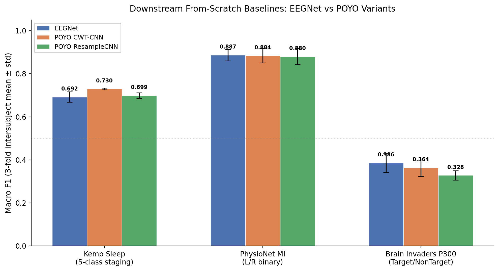

# Downstream From-Scratch Baselines

**Experiments:** 13
**Date range:** 2026-07-29 to 2026-08-05
**Contributors:** MS

## Overarching Question

What level of performance can EEGNet and POYO (CWT-CNN and ResampleCNN
tokenizers) achieve on three diverse downstream EEG tasks when trained from
scratch, and how do these numbers compare to published benchmarks?

## Summary of Findings

This group of experiments established tuned from-scratch baselines for three
downstream EEG classification tasks — Kemp Sleep 5-class staging, PhysioNet
Motor Imagery binary (L vs R hand), and Brain Invaders P300 binary (Target
vs NonTarget) — across three model architectures: EEGNet, POYO with CWT-CNN
tokenizer, and POYO with ResampleCNN tokenizer. Each experiment followed the
same pattern: initial baselines with default hyperparameters, followed by HP
sweeps on fold 0, then final 3-fold intersubject evaluation with the best
configuration. Along the way, several data pipeline bugs were discovered and
fixed (a collation bug for variable-length recordings in PhysioNet MI, trial
dropout and normalization issues in Brain Invaders P300), and a systematic
investigation of POYO overfitting on the P300 task was conducted.

The final picture shows that all three architectures are remarkably close on
PhysioNet MI (~0.88 F1), POYO CWT-CNN has a clear edge on Kemp Sleep (0.730
vs 0.692 for EEGNet), and EEGNet is the strongest model on Brain Invaders
P300 (0.386 F1), though all models struggle substantially on this task in
the intersubject setting. Across all three datasets, CWT-CNN consistently
outperforms ResampleCNN by 1–4 pp F1, while dynamic channel embeddings
provide negligible or slightly negative benefit.

The Brain Invaders P300 results remain well below within-session literature
numbers, but this is expected because most published benchmarks use
single-session intrasession evaluation (calibration-then-test within one
recording session), whereas our evaluation uses intersubject cross-validation
which is a fundamentally harder setting. Our intrasession results (0.404 F1
for EEGNet) are only marginally better, suggesting the difficulty also lies
in the specific data processing pipeline and the short-trial P300 paradigm.
A regularization ablation confirmed that POYO's extreme overfitting on this
task is structural (not fixable via weight decay, dropout, or freezing the
tokenizer), pointing to a representation-level generalization failure.

## Best Hyperparameters per Model per Dataset

### Kemp Sleep (5-class, 30s epochs, 2ch @ 100 Hz)

| Parameter | EEGNet | POYO CWT-CNN | POYO ResampleCNN |
|-----------|--------|--------------|------------------|
| learning_rate | 1e-4 | 1e-4 | 1e-4 |
| weight_decay | 0.01 | 0.01 | 0.01 |
| batch_size | 64 | 32 | 32 |
| class_weights | auto | auto | auto |
| channel_emb | N/A | dynamic | dynamic |
| model-specific | F1=8, D=2, kernel=64, dropout=0.5 | embed_dim=256, depth=4 | embed_dim=256, depth=4 |
| **3-fold F1** | **0.692 ± 0.024** | **0.730 ± 0.004** | **0.699 ± 0.013** |

### PhysioNet Motor Imagery (binary L/R, 4s trials, 64ch @ 160 Hz)

| Parameter | EEGNet | POYO CWT-CNN | POYO ResampleCNN |
|-----------|--------|--------------|------------------|
| learning_rate | 1e-4 | 1e-4 | 1e-4 |
| weight_decay | 0.0 | 0.01 | 0.01 |
| batch_size | 64 | 8 | 8 |
| class_weights | none | auto | auto |
| channel_emb | N/A | disabled | disabled |
| model-specific | F1=8, D=2, kernel=64, dropout=0.5 | embed_dim=256, depth=4 | embed_dim=256, depth=4 |
| **3-fold F1** | **0.887 ± 0.027** | **0.884 ± 0.033** | **0.880 ± 0.037** |

### Brain Invaders P300 (binary Target/NonTarget, ~1s trials, 16ch @ 512 Hz)

| Parameter | EEGNet | POYO CWT-CNN | POYO ResampleCNN |
|-----------|--------|--------------|------------------|
| learning_rate | 1e-3 | 1e-4 | 1e-4 |
| weight_decay | 0.01 | 0.01 | 0.01 |
| batch_size | 64 | 64 | 64 |
| class_weights | auto (smoothing=1.0) | auto (smoothing=1.0) | auto (smoothing=1.0) |
| channel_emb | N/A | dynamic | dynamic |
| model-specific | F1=8, D=2, kernel=128, dropout=0.5 | embed_dim=256, depth=4 | embed_dim=256, depth=4 |
| **3-fold F1 (inter)** | **0.386 ± 0.045** | **0.364 ± 0.040** | **0.328 ± 0.022** |
| **3-fold F1 (intra)** | **0.404 ± 0.011** | **0.380 ± 0.009** | **0.342 ± 0.003** |

## Comparison to Literature

These baselines are reasonable given the evaluation protocol. The
hyperparameter search was not exhaustive — it covered learning rate, weight
decay, class weights, model-specific architectural parameters, and batch
size — but the results are in the right ballpark for each task, giving us
confidence that they are usable reference points for future pretraining and
fine-tuning experiments.

| Dataset | Our Best F1 | Literature Range | Notes |
|---------|-------------|-----------------|-------|
| Kemp Sleep (SleepEDF) | 0.730 | 0.74–0.84 | SleepEEGNet: 0.74 F1, AttnSleep: 0.75 F1, SleepFocalNet: 0.80 F1 (all on SleepEDF-78). SOTA models use sequence-to-sequence or multi-scale architectures specifically designed for sleep staging. Our single-epoch models are within reach of simpler baselines. |
| PhysioNet MI | 0.887 | 0.76–0.84 (bal. acc) | Cross-subject GroupKFold on 109 subjects: ShallowConvNet 0.802, EEGNet 0.758 bal. acc (Karkkainen et al.). Our F1 of 0.887 exceeds these benchmarks, likely due to longer training (patience=50, ~200–300 epochs) and task-specific tuning. |
| Brain Invaders P300 | 0.386 | 0.72–0.86 (AUC, within-session) | MOABB within-session benchmarks: XDAWNCov+TS+SVM 85.8% AUC, ERPCov+MDM 71.6% AUC on BI2014a. Cross-subject MDM: AUC 0.82. **Most published numbers use single-session intrasession evaluation** (calibrate on training phase, test on online phase within the same session), which is a fundamentally easier setting than our intersubject 3-fold cross-validation. The raw gap between our numbers and the literature is largely explained by this protocol difference, not model quality. |

**Key sources:**
- Sleep staging: Kang et al. (2025) SleepFocalNet, *Pattern Analysis and Applications*; Li et al. (2025) SleepEFT, *IJCNN 2025*; Jha et al. (2025) MultiScaleSleepNet, *Sensors*; Mousavi et al. (2019) SleepEEGNet
- Motor imagery: Karkkainen & Toivonen (2020) EEGNet Fusion, *Computers*; honest cross-subject benchmark at [github.com/Z-bros/EEG-MotorImagery](https://github.com/Z-bros/EEG-MotorImagery)
- P300: Barachant et al. (2014) Brain Invaders MDM benchmark; Chevallier et al. (2024) MOABB benchmark, *arXiv:2404.15319*; Jayaram & Barachant (2018) Riemannian vs CNN, *J. Neural Eng.*

## Key Takeaways

- **POYO CWT-CNN is the best from-scratch architecture for Kemp Sleep** (+3.8 pp over EEGNet, +3.1 pp over ResampleCNN), with remarkably low cross-fold variance (std=0.004). The wavelet decomposition captures sleep-relevant frequency content that temporal convolutions and resampling approaches miss at 30s epochs.

- **All architectures are near-equivalent on PhysioNet MI** (0.880–0.887 F1, span of 0.7 pp). The task appears well-solved from scratch — further gains likely require pretraining, data augmentation, or ensemble methods. Our results exceed published cross-subject benchmarks on this dataset.

- **Brain Invaders P300 remains a hard open problem in the intersubject setting.** All models score below 0.41 F1 despite task-specific tuning. POYO models exhibit extreme overfitting (train F1 ~0.97 vs val ~0.35), which is structural — not fixable via regularization, dropout, or freezing the tokenizer. EEGNet shows no overfitting but also limited learning. The intrasession vs intersubject gap is only ~2 pp, suggesting the bottleneck is deeper than cross-subject variability.

- **CWT-CNN consistently outperforms ResampleCNN** across all three datasets (+1–4 pp F1). This tokenizer advantage is largest on Kemp Sleep and smallest on PhysioNet MI.

- **Dynamic channel embeddings provide negligible benefit** across all tasks and datasets. They are not worth the architectural complexity for from-scratch training.

- **The hyperparameter search was reasonable but not exhaustive.** The HP landscape is generally flat (especially on PhysioNet MI where all 50 EEGNet configs scored within 1 pp), and the selected configurations are competitive with published benchmarks. This gives us confidence that these baselines are usable reference numbers, even though a more extensive search could yield marginal improvements.

## Experiment Index

| # | Experiment | Dataset | Key Finding | Best F1 |
|---|-----------|---------|-------------|---------|
| 1 | [KempSleep 30s-Epoch From-Scratch Baselines](./023-kemp-30s-baselines.md) | Kemp Sleep | CWT-CNN best (0.730), 30s epochs +12–14 pp over 2s | 0.730 |
| 2 | [PhysioNet MI From-Scratch Baselines](./20260731-MS-physionet-mi-baselines.md) | PhysioNet MI | EEGNet 0.873, all POYO crashed (OOM) | 0.873 |
| 3 | [PhysioNet MI HP Search](./20260731-MS-physionet-mi-hp-search.md) | PhysioNet MI | EEGNet improved to 0.924 (fold 0); POYO collation bug discovered | 0.924 |
| 4 | [PhysioNet MI POYO Collation Fix + HP Tuning](./20260803-MS-physionet-mi-poyo-collation-fix.md) | PhysioNet MI | pad2d fix resolved crash; POYO CWT-CNN reached 0.937 (fold 0) | 0.937 |
| 5 | [PhysioNet MI EEGNet Final Baselines](./20260804-MS-physionet-mi-eegnet-final-baselines.md) | PhysioNet MI | 3-fold EEGNet: 0.887 ± 0.027 | 0.887 |
| 6 | [PhysioNet MI POYO Final Baselines](./20260804-MS-physionet-mi-poyo-final-baselines.md) | PhysioNet MI | All POYO conditions within 1.1 pp of EEGNet | 0.884 |
| 7 | [Brain Invaders P300 From-Scratch Baselines](./20260731-MS-brain-invaders-p300-baselines.md) | BI P300 | All models poor; EEGNet collapsed, CWT-CNN best at 0.347 | 0.347 |
| 8 | [Brain Invaders P300 HP Search](./20260731-MS-brain-invaders-p300-hp-search.md) | BI P300 | 90% data dropout discovered; best POYO 0.402 | 0.402 |
| 9 | [Brain Invaders EEGNet Reprocessed HP Search](./20260804-MS-brain-invaders-eegnet-reprocessed-hp.md) | BI P300 | Data reprocessed; EEGNet stuck at 0.287 with patience=50 | 0.287 |
| 10 | [Brain Invaders EEGNet Long Training](./20260804-MS-brain-invaders-eegnet-reprocessed-long.md) | BI P300 | No early stopping → 0.337 F1, plateau confirmed | 0.337 |
| 11 | [Brain Invaders POYO RCNN Long Training](./20260804-MS-brain-invaders-poyo-rcnn-reprocessed-long.md) | BI P300 | Catastrophic overfitting (train 0.95, val 0.327) | 0.327 |
| 12 | [Brain Invaders P300 Reprocessed 3-Fold](./20260804-MS-brain-invaders-p300-reprocessed-3fold.md) | BI P300 | Full comparison: EEGNet best at 0.386; intra only +2 pp | 0.386 |
| 13 | [POYO Overfitting Regularization Ablation](./20260805-MS-poyo-overfitting-regularization-ablation.md) | BI P300 | Overfitting is structural, not capacity/regularization | 0.407 |

## Open Questions

- **Can pretraining unlock POYO's advantage on from-scratch-equivalent tasks?** All three datasets show POYO matching but not exceeding EEGNet from scratch. The transformer backbone's capacity may only pay off with pretrained representations. **Follow-up:** [Two-Dataset Pretraining: Downstream Benefit Evaluation](../inbox/20260805-MS-two-dataset-pretrain-downstream-eval.md)
- **What is the root cause of POYO's structural overfitting on P300?** Standard regularization (weight decay up to 0.1, dropout up to 0.5, frozen tokenizer) has zero effect. The model may be learning subject-specific patterns that do not transfer across individuals.
- **Can better data processing improve Brain Invaders P300 results?** The intrasession ceiling (~0.40 F1) is far below within-session MOABB benchmarks (~0.72–0.86 AUC), suggesting either the data processing pipeline or the evaluation protocol differs substantially from standard practice.
- **Would task-specific architectures (e.g., sequence-to-sequence for sleep staging, xDAWN spatial filtering for P300) close the gap to SOTA?** Our general-purpose architectures trade task-specific inductive biases for flexibility.
