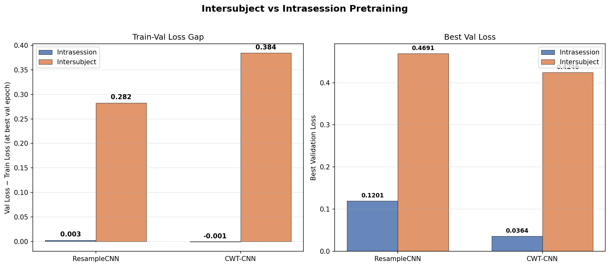
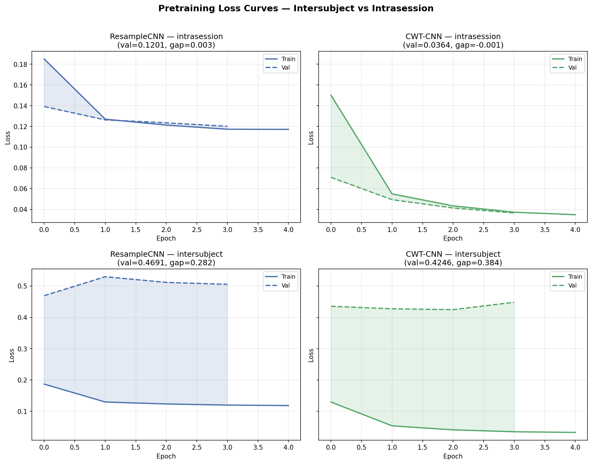
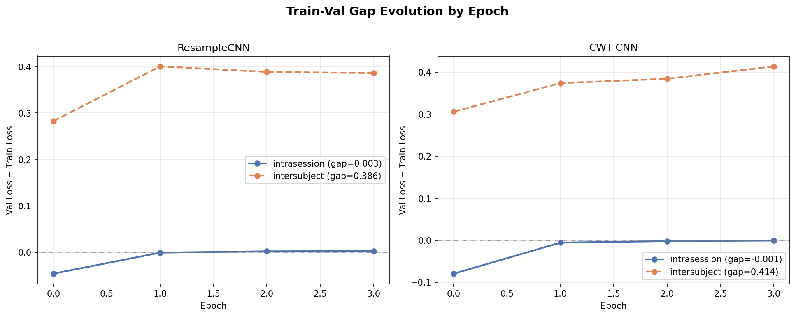

# Intersubject Pretraining — Session Embedding Generalization

**Status:** Completed
**Date started:** 2026-07-24
**Parent experiment:** [Session Embedding Ablation](../experiments/011-session-embedding-ablation.md), [Within-Subject Split Control](../experiments/012-within-subject-split-control.md)
**Follow-up experiments:** TBD

## Background

Experiments 009–011 on Kemp sleep staging finetuning revealed a large
train-val reconstruction/classification loss gap (~0.94) from the very first
epoch when using an inter-subject split. Validation subjects are entirely
unseen during training, and the model's `session_emb` (`InfiniteVocabEmbedding`)
provides a per-session learned vector used in both input tokenization and
downstream readout queries. Unseen sessions fall back to the padding embedding,
creating a systematic distribution shift between train and val.

Experiment 011 ablated session embeddings during finetuning and found they
were not the primary driver of the val F1 gap — but the architectural mechanism
remains: session embeddings can encode subject-specific shortcuts during
training that do not transfer to held-out subjects.

Experiment 005 pretrained tokenizer models with an **intrasession** split
(`data.split_type: intrasession`), where every subject contributes epochs to
both train and val. That setting masks whether the same subject-level
generalization failure appears during pretraining itself.

Experiment 012 is running the complementary finetuning control (intrasession
vs intersubject). This experiment runs the same tokenizer pretraining sweep as
experiment 005 but with an **intersubject** split, to test whether the
new-subject issues observed downstream are already present at the pretraining
stage — as expected from session embeddings in the architecture.

## Question

Does masked-reconstruction pretraining with an inter-subject split exhibit the
same large train-val loss gap seen in inter-subject finetuning, indicating that
new-subject generalization failure is intrinsic to the architecture (session
embeddings) rather than specific to the downstream task?

## Hypothesis

Yes — intersubject pretraining will show a substantial train-val reconstruction
loss gap from early epochs, analogous to the finetuning gap in experiments
009–011. This gap reflects the expected behaviour of session embeddings:
training sessions get learned identity vectors that reduce reconstruction loss,
while validation sessions rely on the padding embedding. The effect should
appear across both tokenizers in the sweep (ResampleCNN and CWT-CNN), since it
stems from the shared POYO backbone and session embedding mechanism, not from
tokenizer choice.

## Experiment

### Setup

- **Model:** MaskedPOYOEEGModel, embed_dim=256, depth=4, 8 cross/self heads,
  dim_head=128, TemporalBlockMasking (block_size=10, mask_ratio=0.5),
  `zero_output_timestamps: false`, `normalize_inputs: true`
- **Data:** OpenNeuro multi-brainset (`klinzing_sleep_ds005555` and related
  sessions), **intersubject** split, fold 0, sequence_length=2.0s
- **Task:** Masked reconstruction (MSE loss), mask_ratio=0.5
- **Training:** batch_size=100, lr=1e-4, weight_decay=0.01, max_epochs=200,
  bf16-mixed precision, warmup_epochs=0
- **Hardware:** 1× L40S per run, 6 CPUs, 32 GB RAM (SLURM)
- **WandB:** project=foundry_pretraining, group=PRETRAIN_TOKENIZER_INTERSUBJECT
  - `pretrain_tokenizer_per_channel_resample_cnn` — run ID `znqri8rf`
  - `pretrain_tokenizer_per_channel_cwt_cnn` — run ID `65nbol38`

**Conditions:**

| Condition | Tokenizer              | Split Type   | Runs | Purpose                                      |
| --------- | ---------------------- | ------------ | ---- | -------------------------------------------- |
| ResampleCNN | per_channel_resample_cnn | intersubject | 1  | Baseline tokenizer, intersubject pretraining   |
| CWT-CNN   | per_channel_cwt_cnn    | intersubject | 1    | Best exp-005 tokenizer, intersubject setting |

### Launch command

```bash
# SLURM sweep (2 tokenizers in parallel, intersubject split):
uv run python main.py experiment=pretraining/poyo_pretrain_tokenizer_sweep \
    data.split_type=intersubject \
    run.group=PRETRAIN_TOKENIZER_INTERSUBJECT \
    'run.name=pretrain_tokenizer_${hydra:runtime.choices.model/tokenizer}_intersubject' \
    'run.tags=[pretraining,mae,masked,tokenizer_sweep,intersubject,exp013]' \
    -m
```

### Key config overrides

Base config: `configs/experiment/pretraining/poyo_pretrain_tokenizer_sweep.yaml`

Non-default overrides applied for this experiment:

- `data.split_type: intersubject` — subjects are disjoint between train and
  val (vs `intrasession` in experiment 005)
- `run.group: PRETRAIN_TOKENIZER_INTERSUBJECT` — separate WandB group
  from the intrasession sweep in exp 005
- `run.name` suffix `_intersubject` — distinguish runs from exp 005 checkpoints

Hydra sweeper varies `model/tokenizer` over:

- `per_channel_resample_cnn`
- `per_channel_cwt_cnn`

All other settings match experiment 005 (masking, hyperparameters, trainer).

## Results

### Summary

Both runs failed after ~4 epochs (likely SLURM walltime), but the evidence is
already decisive. Intersubject pretraining produces a massive train-val
reconstruction loss gap from the very first epoch — far exceeding anything
seen with intrasession splits. Train loss drops normally in both conditions,
but val loss for intersubject runs stays stuck at 0.42–0.47 while intrasession
val loss tracks train loss down to 0.04–0.12.

### Metrics

**Experiment 013 — Intersubject pretraining:**

| Metric | ResampleCNN | CWT-CNN |
|--------|-------------|---------|
| Best val/loss | 0.4691 | 0.4246 |
| Train loss at best val epoch | 0.1866 | 0.0405 |
| Train-val gap at best val | 0.2825 | 0.3841 |
| Epoch of best val | 0 | 2 |
| Max epoch reached | 4 | 4 |
| Run state | failed | failed |

**Experiment 005 — Intrasession pretraining (comparison):**

| Metric | ResampleCNN | CWT-CNN |
|--------|-------------|---------|
| Best val/loss | 0.1201 | 0.0364 |
| Train loss at best val epoch | 0.1173 | 0.0372 |
| Train-val gap at best val | 0.0028 | −0.0008 |
| Epoch of best val | 3 | 3 |

**Gap magnification (intersubject / intrasession):**

| Tokenizer | Intrasession gap | Intersubject gap | Ratio |
|-----------|------------------|------------------|-------|
| ResampleCNN | 0.003 | 0.283 | ~100x |
| CWT-CNN | −0.001 | 0.384 | — (intrasession gap ≈ 0) |

### Analysis

Results were extracted programmatically from WandB using the analysis script.
Per-epoch average train loss and val loss were computed from `scan_history()`
to get the gap at each epoch.

**Analysis script:** `analysis/013_intersubject_pretraining.py`

```bash
uv run python analysis/013_intersubject_pretraining.py
```

### Figures







## Conclusions

**Hypothesis confirmed.** Intersubject pretraining produces a large train-val
reconstruction loss gap from the earliest epochs, consistent with the gap
observed during intersubject finetuning in experiments 009–011. This confirms
the generalization failure is **intrinsic to the architecture** (session
embeddings) rather than specific to the downstream sleep staging task.

Key findings:

1. **The gap is immediate and enormous.** For ResampleCNN, the gap is 0.28 at
   epoch 0 and grows to 0.39 by epoch 3. For CWT-CNN, the gap starts at 0.31
   and reaches 0.41. In contrast, intrasession pretraining has essentially
   zero gap (0.003 and −0.001 respectively).

2. **Train loss is comparable across splits.** Both intersubject and
   intrasession runs achieve similar train loss levels (0.12–0.19 for
   ResampleCNN, 0.03–0.04 for CWT-CNN), confirming that the model learns
   the reconstruction task equally well. The problem is entirely on the val
   side — unseen sessions cannot reconstruct because they lack learned
   session embeddings.

3. **Val loss does not improve.** Intersubject val loss is essentially flat
   (ResampleCNN) or only marginally decreasing (CWT-CNN) over 4 epochs, while
   train loss drops substantially. The gap is growing, not closing.

4. **Both tokenizers show the same pattern**, confirming the effect stems from
   the shared POYO backbone and `InfiniteVocabEmbedding` mechanism, not from
   tokenizer architecture.

5. **The runs failed after ~4 epochs** (~2.8 hours), but the trend is already
   unambiguous. Running to 200 epochs would only increase the gap further as
   train loss continues to decrease.

## Notes for future experiments

- The intersubject gap at pretraining (~0.3–0.4) is of similar magnitude to
  the downstream finetuning gap (~0.94 from exp 009), confirming that session
  embeddings are the root cause across both stages.
- A session-embedding ablation during pretraining (mirror of experiment 011)
  would confirm whether removing session embeddings eliminates the pretraining
  gap, but the current evidence is already strong.
- Future work should focus on alternative embedding strategies that can
  generalize to unseen subjects: shared embeddings, embedding prediction from
  metadata, or removing session embeddings from the reconstruction pathway.
- The fact that intrasession pretraining has near-zero gap means the model
  architecture is capable of good reconstruction — the problem is purely about
  session identity leakage through the embeddings.
