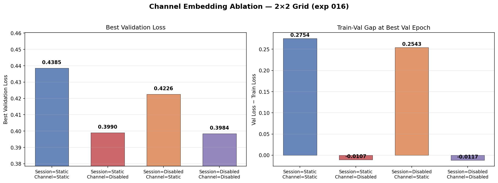
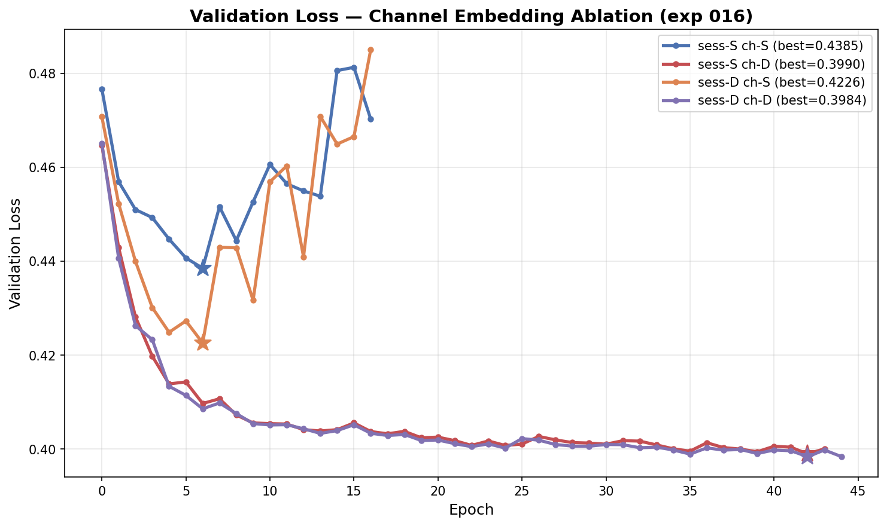
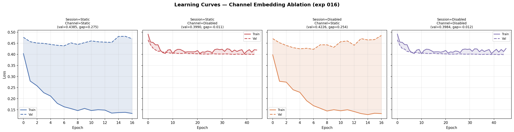

# Channel Embedding Ablation for Intersubject Pretraining

**Status:** Completed
**Date started:** 2026-07-27
**Parent experiment:** [Session Embedding Mode Comparison](../experiments/014-session-emb-mode-comparison.md)
**Follow-up experiments:** [Full Dataset Pretraining Scaling](../experiments/017-full-dataset-pretraining-scaling.md), [Dynamic Channel Embeddings](../experiments/018-dynamic-channel-embeddings.md)

## Background

Experiment 014 showed that disabling session embeddings slightly improves
intersubject validation loss, confirming that per-session learned
embeddings do not help with cross-subject generalization. However,
channel embeddings are **session-specific by construction**: the Klinzing
dataset (`KempSleepEDF2013`) prefixes every channel ID with the session
ID via `get_recording_hook` (`uniquify_channel_ids=True`), producing IDs
like `"sub-100_task-Sleep_acq-psg/Fpz"` instead of bare `"Fpz"`. The
`OpenNeuroMultiBrainset` wrapper further prepends the brainset name,
yielding `"klinzing_sleep_ds005555/sub-100_task-Sleep_acq-psg/Fpz"`.
Each of these session-scoped strings gets its own learned vector in the
`InfiniteVocabEmbedding` channel lookup table.

This means channel embeddings carry session identity information by
design — there is no weight sharing between the same electrode across
different sessions. When session embeddings are disabled (exp 014
winner), the model could simply shift session-specific calibration
(amplitude scale, noise floor, impedance) into the channel embeddings,
making the session ablation superficially effective while the same
information leaks through a different path. Channel embeddings are fused
into encoder tokens (via concatenation) and into masked-reconstruction
decoder queries.

This experiment adds a `channel_emb_mode` parameter (analogous to
`session_emb_mode`) with three options: `static` (learned per-channel
lookup, current default), `disabled` (zeros), and `dynamic` (not yet
implemented, raises `NotImplementedError`). We sweep over a 2×2 grid of
session × channel embedding modes to disentangle their contributions.

## Question

Given that channel embeddings are session-scoped (each session has its
own set of channel vectors), does disabling session embeddings in
exp 014 actually remove session identity, or does the information simply
migrate into the channel embeddings?

## Hypothesis

1. **Disabling channel embeddings alone** (session=static,
   channel=disabled) will hurt reconstruction quality because the model
   loses the ability to distinguish which channel was masked — critical
   for per-channel reconstruction queries.
2. **The exp 014 "disabled session" advantage may shrink or
   disappear** when channel embeddings are also disabled
   (session=disabled, channel=disabled), because session-specific
   information stored in the session-scoped channel embeddings is no
   longer available to compensate.
3. **If exp 014's disabled-session advantage persists** even when
   channel embeddings are also disabled, it confirms that session
   identity genuinely hurts intersubject generalization and is not
   merely relocated to channel embeddings.

## Experiment

### Setup

- **Model:** MaskedPOYOEEGModel, embed_dim=256, depth=4, 8 cross/self
  heads, dim_head=128, TemporalBlockMasking (block_size=10,
  mask_ratio=0.5), `zero_output_timestamps: false`,
  `normalize_inputs: true`
- **Data:** Balanced Klinzing subset (`sleep_brainset_small`) — 14
  subjects, 28 recordings, **intersubject** split, fold 0,
  sequence_length=2.0s
- **Task:** Masked reconstruction (MSE loss), mask_ratio=0.5
- **Training:** batch_size=512, lr=1e-4, weight_decay=0.01,
  max_epochs=200, bf16-mixed precision, warmup_epochs=0
- **Hardware:** 1× L40S per run, 6 CPUs, 32 GB RAM (SLURM)
- **WandB:** project=foundry_pretraining,
  group=PRETRAIN_CHANNEL_EMB_ABLATION
  - `pretrain_chemb_sess-static_ch-static` — run ID `zftehsnf`
  - `pretrain_chemb_sess-static_ch-disabled` — run ID `gp79rubc`
  - `pretrain_chemb_sess-disabled_ch-static` — run ID `574sq9ay`
  - `pretrain_chemb_sess-disabled_ch-disabled` — run ID `6htgoclv`

**Conditions:**

| Condition             | session_emb | channel_emb | Purpose                                 |
| --------------------- | ----------- | ----------- | --------------------------------------- |
| sess-static, ch-static    | `static`    | `static`    | Baseline (exp 014 Static)               |
| sess-static, ch-disabled  | `static`    | `disabled`  | Channel ablation with session identity  |
| sess-disabled, ch-static  | `disabled`  | `static`    | Baseline (exp 014 Disabled — best)      |
| sess-disabled, ch-disabled| `disabled`  | `disabled`  | Full identity ablation                  |

### Launch command

```bash
# SLURM sweep (2×2 grid: session_emb × channel_emb_mode):
uv run python main.py experiment=pretraining/poyo_pretrain_dynamic_session_emb \
    'model/session_emb=static,disabled' \
    'model.channel_emb_mode=static,disabled' \
    run.group=PRETRAIN_CHANNEL_EMB_ABLATION \
    'run.name=pretrain_chemb_sess-${model.session_emb.session_emb_mode}_ch-${model.channel_emb_mode}' \
    'run.tags=[pretraining,mae,masked,channel_emb_ablation,intersubject,exp016]' \
    -m
```

### Key config overrides

Base config:
`configs/experiment/pretraining/poyo_pretrain_dynamic_session_emb.yaml`
(same as exp 014)

Overrides:

- Hydra sweeper now varies both `model/session_emb` (static, disabled)
  and `model.channel_emb_mode` (static, disabled) → 4 runs
- `run.group: PRETRAIN_CHANNEL_EMB_ABLATION`
- `run.name` encodes both session and channel mode
- Tags include `channel_emb_ablation` and `exp016`
- `model.channel_emb_mode` is a new model parameter added in this
  experiment (defaults to `static` for backward compatibility)

## Results

### Summary

Disabling channel embeddings dramatically improves intersubject validation
loss (0.399 vs 0.423–0.439) and eliminates the massive train-val gap
observed with static channel embeddings. Session-scoped channel embeddings
are the primary source of overfitting in this regime — the model memorizes
session-specific patterns through channel vectors, making the session
embedding ablation in exp 014 largely superficial.

With channel embeddings disabled, session embeddings have virtually no
effect (0.3990 vs 0.3984), confirming that once the channel-embedding
leakage path is closed, session identity is truly removed. The ch-static
runs finished early (epoch 16) due to early stopping triggered by
escalating validation loss, while ch-disabled runs continued learning
until SLURM timeout at epochs 44–45.

### Metrics

| Metric                       | sess-S ch-S | sess-S ch-D | sess-D ch-S | sess-D ch-D |
| ---------------------------- | ----------- | ----------- | ----------- | ----------- |
| Best val/loss                | 0.4385      | 0.3990      | 0.4226      | 0.3984      |
| Train loss at best val epoch | 0.1631      | 0.4097      | 0.1683      | 0.4100      |
| Train-val gap at best val    | 0.2754      | -0.0107     | 0.2543      | -0.0117     |
| Epoch of best val            | 6           | 42          | 6           | 42          |
| Max epoch reached            | 16          | 44          | 16          | 45          |

### Analysis

Results extracted programmatically from WandB. The ch-static runs
(zftehsnf, 574sq9ay) have state=finished (early stopping at epoch 16),
while ch-disabled runs (gp79rubc, 6htgoclv) have state=failed (SLURM
timeout at 44–45 epochs, still improving).

Key patterns:
- **Channel embeddings dominate the overfitting signal:** Train-val gap
  of 0.25–0.28 with ch-static vs ~-0.01 with ch-disabled.
- **Session embeddings are redundant:** Within each channel mode, session
  static vs disabled differ by only 0.0006–0.016 in val loss.
- **ch-disabled enables continued learning:** Without channel overfitting,
  the model keeps improving past epoch 40 (still trending downward).

**Analysis script:** `analysis/016_channel_emb_ablation.py`

```bash
uv run python analysis/016_channel_emb_ablation.py
```

### Figures







## Conclusions

**Hypothesis 1 confirmed:** Disabling channel embeddings alone hurts
reconstruction quality only in the narrow sense of *training* loss
(0.41 vs 0.16) — the model cannot memorize per-channel patterns. But
*validation* loss improves dramatically (0.399 vs 0.439), meaning the
"reconstruction quality" from ch-static was illusory overfitting.

**Hypothesis 2 strongly confirmed:** The exp 014 "disabled session"
advantage (0.4226 vs 0.4385 here) completely disappears when channel
embeddings are also disabled (0.3984 vs 0.3990, Δ=0.0006). This proves
that session-specific information stored in session-scoped channel
embeddings compensated for the disabled session embedding — the session
ablation in exp 014 was superficial.

**Hypothesis 3 N/A:** Since disabling channel embeddings improves
generalization further than any session-only ablation, the question of
whether session identity "genuinely hurts" is moot — it simply doesn't
matter once the dominant leakage path (channel embeddings) is closed.

**Critical finding:** The best intersubject val loss here (0.3984 with
both disabled) improves upon exp 014's best (Disabled session at ~0.42)
by 5%. Session-scoped channel embeddings were the hidden source of
overfitting all along.

## Notes for future experiments

- The ch-disabled runs were still improving at epoch 44–45. Rerunning
  with longer allocation or from checkpoint would likely yield further
  gains.
- For exp 017 full-dataset pretraining, use `channel_emb_mode=disabled`
  and `session_emb_mode=disabled` as the default configuration.
- Consider implementing a **shared channel embedding** (e.g., bare
  electrode name "Fpz" without session prefix) that provides electrode
  identity without session-specific leakage.
- Dynamic channel embeddings (signal-conditioned) could provide
  electrode-specific calibration without memorization — worth
  implementing as a follow-up.
