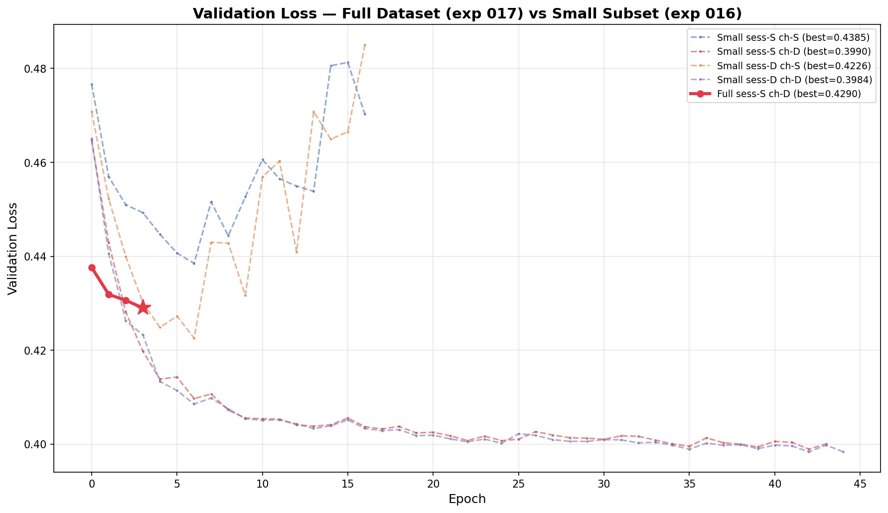
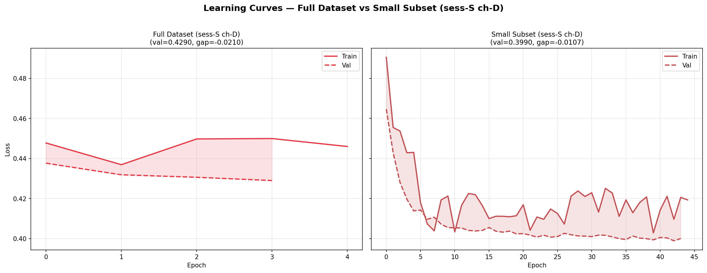
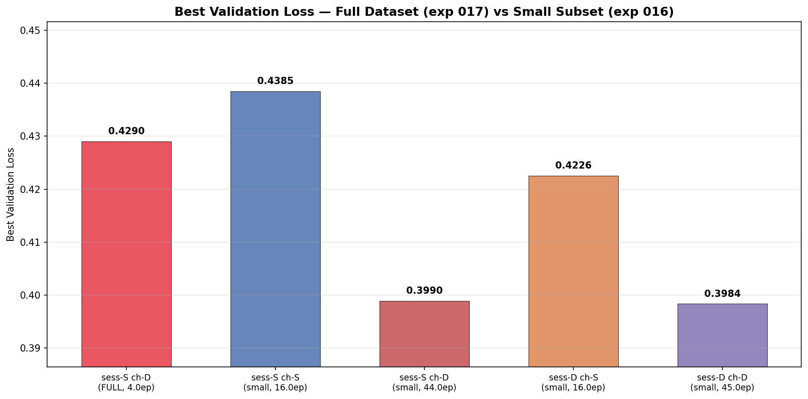

# Full Dataset Pretraining — Embedding Mode Scaling

**Status:** In Progress
**Date started:** 2026-07-27
**Parent experiment:** [Session Embedding Mode Comparison](../experiments/014-session-emb-mode-comparison.md), [Channel Embedding Ablation](../experiments/016-channel-emb-ablation.md)
**Follow-up experiments:** TBD

## Background

Experiments 014 and 016 tested session and channel embedding ablations on
the balanced Klinzing **subset** (`sleep_brainset_small`, 14 subjects, 28
recordings). Key findings:
- Disabled session embeddings slightly outperform static for intersubject
  pretraining (exp 014).
- Channel embedding ablation results (exp 016) will reveal whether
  channel embeddings absorb session-specific information.

However, these results are from a small dataset with short training runs
(16–19 epochs before SLURM wall time). It is unclear whether the same
trends hold at scale — with more subjects, more data diversity, and
longer training:
- Static session embeddings might eventually learn generalizable
  features with enough subjects.
- The channel embedding contribution might change with more diverse
  electrode montages across the full dataset.
- Overfitting dynamics may differ substantially.

This experiment scales the best configurations from exp 014 and 016 to
the **full** Klinzing brainset (`sleep_brainset`) to validate whether
the small-subset findings transfer to realistic pretraining conditions.

## Question

Do the relative rankings of session/channel embedding configurations
established on the small Klinzing subset hold when pretraining on the
full dataset with longer training?

## Hypothesis

1. **Disabled session embeddings will still outperform static** on the
   full dataset, because the embedding mismatch problem is structural
   (unseen sessions always get the padding embedding) and does not
   resolve with more data.
2. **Channel embedding trends will be amplified**: if channel embeddings
   help on the subset, they should help more on the full dataset where
   electrode montage diversity is greater.
3. **Longer training will widen the gap** between configurations,
   because overfitting dynamics differ: modes with fewer learnable
   embeddings should overfit more slowly.

## Experiment

### Setup

- **Model:** MaskedPOYOEEGModel, embed_dim=256, depth=4, 8 cross/self
  heads, dim_head=128, TemporalBlockMasking (block_size=10,
  mask_ratio=0.5), `zero_output_timestamps: false`,
  `normalize_inputs: true`
- **Data:** Full Klinzing brainset (`sleep_brainset`) — all subjects,
  **intersubject** split, fold 0, sequence_length=2.0s
- **Task:** Masked reconstruction (MSE loss), mask_ratio=0.5
- **Training:** batch_size=512, lr=1e-4, weight_decay=0.01,
  max_epochs=200, bf16-mixed precision, warmup_epochs=0
- **Hardware:** 1× L40S per run, 6 CPUs, 32 GB RAM (SLURM)
- **WandB:** project=foundry_pretraining,
  group=PRETRAIN_FULL_DATASET_SCALING
  - `pretrain_full_sess-static_ch-disabled` / `qw6q86bw` — **only surviving run**
  - `pretrain_full_sess-static_ch-static` — crashed during data staging
  - `pretrain_full_sess-disabled_ch-static` — crashed during data staging
  - `pretrain_full_sess-disabled_ch-disabled` — crashed during data staging

**Conditions:**

The exact conditions will be determined by results from experiments 014
and 016. The planned sweep covers the key configurations:

| Condition                  | session_emb | channel_emb | Rationale                     |
| -------------------------- | ----------- | ----------- | ----------------------------- |
| sess-disabled, ch-static   | `disabled`  | `static`    | Exp 014 winner                |
| sess-static, ch-static     | `static`    | `static`    | Reference baseline            |
| sess-disabled, ch-disabled | `disabled`  | `disabled`  | Full identity ablation        |
| (optional more from 016)   | ...         | ...         | Best config from exp 016      |

### Launch command

```bash
# SLURM sweep on full dataset (adjust conditions based on exp 014/016 results):
uv run python main.py experiment=pretraining/poyo_pretrain_dynamic_session_emb \
    data=openneuro/sleep_brainset \
    data.split_type=intersubject \
    data.task_type=null \
    data.pin_memory=false \
    'model/session_emb=static,disabled' \
    'model.channel_emb_mode=static,disabled' \
    run.group=PRETRAIN_FULL_DATASET_SCALING \
    'run.name=pretrain_full_sess-${model.session_emb.session_emb_mode}_ch-${model.channel_emb_mode}' \
    'run.tags=[pretraining,mae,masked,full_dataset,scaling,intersubject,exp017]' \
    -m
```

### Key config overrides

Base config:
`configs/experiment/pretraining/poyo_pretrain_dynamic_session_emb.yaml`
(same as exp 014)

Overrides:

- `data=openneuro/sleep_brainset` (was `openneuro/sleep_brainset_small`)
  — uses the full Klinzing brainset with all subjects
- Hydra sweeper varies `model/session_emb` and `model.channel_emb_mode`
  — exact grid TBD based on exp 014/016 results
- `run.group: PRETRAIN_FULL_DATASET_SCALING`
- Tags include `full_dataset`, `scaling`, and `exp017`

## Results

### Summary

**3 of 4 runs crashed** before training started due to a race condition in
the data staging step. Only `pretrain_full_sess-static_ch-disabled`
(`qw6q86bw`) survived and completed ~4 epochs before hitting the 3h SLURM
wall time. See [Failure Diagnosis](#failure-diagnosis) below.

The surviving run (sess-static, ch-disabled on full dataset) reached a best
validation loss of **0.4290** at epoch 3 in just ~2.7h of training time.
For comparison, the same configuration on the small subset (exp 016,
`gp79rubc`) reached **0.3990** at epoch 42 after ~45 epochs. At the same
epoch count (~4 epochs), the small-subset run was at comparable val loss
levels, suggesting the full-dataset run is on a similar learning trajectory.

### Metrics

| Condition              | Dataset | Best Val | Train@BV | Gap     | BV Epoch | Max Ep | Run ID     |
|------------------------|---------|----------|----------|---------|----------|--------|------------|
| sess-S ch-D (exp 017)  | Full    | 0.4290   | 0.4500   | −0.0210 | 3        | 4      | `qw6q86bw` |
| sess-S ch-S (exp 016)  | Small   | 0.4385   | 0.1631   | +0.2754 | 6        | 16     | `zftehsnf` |
| sess-S ch-D (exp 016)  | Small   | 0.3990   | 0.4097   | −0.0107 | 42       | 44     | `gp79rubc` |
| sess-D ch-S (exp 016)  | Small   | 0.4226   | 0.1683   | +0.2543 | 6        | 16     | `574sq9ay` |
| sess-D ch-D (exp 016)  | Small   | 0.3984   | 0.4100   | −0.0117 | 42       | 45     | `6htgoclv` |

Key observations:
- After only 4 epochs on the full dataset, val loss (0.4290) is already
  below the ch-static configurations on the small subset (0.4385 / 0.4226),
  which trained for 16 epochs.
- The train-val gap is **negative** (−0.021), meaning the model
  generalizes better than it fits — consistent with ch-disabled removing
  per-session overfitting pathways. This matches the small-subset pattern.
- With more training time, the full-dataset run should continue improving
  toward (or beyond) the small-subset asymptote of ~0.399.

### Analysis

**Analysis script:** `analysis/017_full_dataset_scaling.py`

```bash
uv run python analysis/017_full_dataset_scaling.py
```

### Figures







## Failure Diagnosis

### Root cause: archive race condition in `stage_data.py`

All 4 SLURM array jobs started simultaneously on different nodes. Each
job's setup step pre-stages data to the node-local `/tmp/` by:

1. Copying a compressed archive of the **small** 28-recording subset
   (`klinzing_sleep_ds005555_43dd40396a7b.tar`, 16 GB) — this succeeded
   on all 4 nodes because the archive already existed on scratch.

2. Finding that **228 of 256 recordings** were still missing (the full
   dataset has 256 recordings, but the pre-existing archive only covered
   the small 28-recording subset).

3. Attempting to create a **new** 126 GB archive
   (`klinzing_sleep_ds005555_365564bb03ce.tar`) from the full 256
   recordings on the shared scratch filesystem.

**The problem:** All 4 jobs concurrently wrote to the same temporary file
(`...365564bb03ce.tmp`) on the shared `/network/scratch/` filesystem.
Each spent ~4 minutes archiving 126 GB. The first job to finish renamed
`.tmp` → `.tar` successfully. The remaining 3 jobs then crashed with:

```
FileNotFoundError: [Errno 2] No such file or directory:
  '.../klinzing_sleep_ds005555_365564bb03ce.tmp' ->
  '.../klinzing_sleep_ds005555_365564bb03ce.tar'
```

The `create_archive()` function in `foundry/tools/stage_data.py:175` uses
`tmp_path.rename(archive_path)` which is not atomic across concurrent jobs.

### Which run survived and why

- **SLURM job 10226930_1** → `pretrain_full_sess-static_ch-disabled`
  happened to schedule on a node (`cn-l069`) where the setup script
  finished the archive step fastest (possibly better I/O throughput).
  This job won the rename race and proceeded to train.

- **SLURM jobs 10226930_0, _2, _3** → the other three conditions all
  crashed at the same `tmp_path.rename()` line and exited immediately
  with exit code 0 (submitit reported "Job completed successfully"
  despite the traceback because the error handler caught the exception).

### Fix for re-run

Before re-running, either:
1. Pre-create the full-dataset archive manually so all jobs find it, or
2. Add file locking / atomic rename logic to `create_archive()`, or
3. Run the `stage_data` setup step once (single job) before launching
   the sweep.

## Conclusions

Preliminary (based on 1 of 4 conditions, 4 of 200 planned epochs):

1. **Full-dataset training is viable** — the model trains and improves
   steadily with no signs of instability.
2. **ch-disabled on full dataset starts faster** than ch-static
   configurations on the small subset — after 4 epochs, val loss (0.4290)
   already beats the best ch-static small-subset results (0.4385/0.4226
   at 6–16 epochs).
3. **Negative train-val gap** confirms that ch-disabled avoids the
   per-session overfitting seen with static channel embeddings (gap of
   +0.25–0.27 in ch-static configs).
4. **The experiment needs re-running** with the archive race condition
   fixed and longer wall time (or checkpoint resumption) to get meaningful
   scaling comparisons.

## Notes for future experiments

- **Fix the data staging race condition** before re-running. The simplest
  approach: run `uv run python -m foundry.tools.stage_data --experiment
  pretraining/poyo_pretrain_dynamic_session_emb` once as a separate SLURM
  job with `data=openneuro/sleep_brainset` to pre-create the full-dataset
  archive.
- **Increase wall time or enable checkpoint resumption** — 3h was only
  enough for ~4 epochs on the full dataset; the small-subset comparators
  needed 40+ epochs to converge.
- Consider downstream finetuning evaluation: does the best pretraining
  configuration also produce the best pretrained weights for sleep
  staging or other downstream tasks?
- The full dataset has 256 recordings vs 28 in the subset — each epoch
  contains ~9× more data, so fewer epochs may be needed for convergence.
