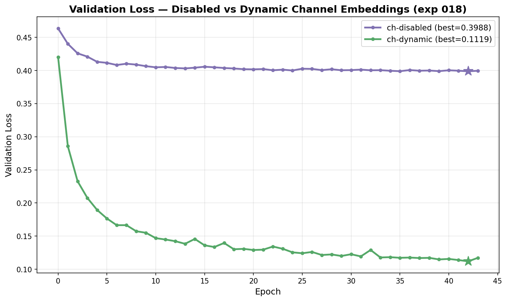
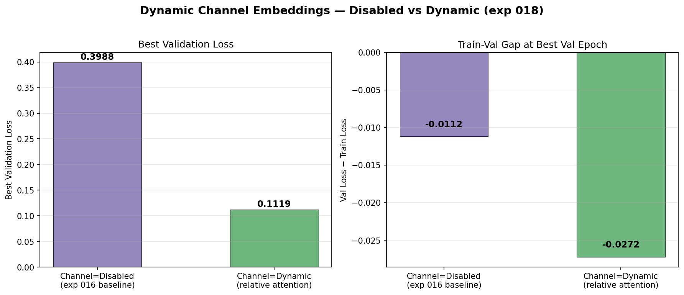
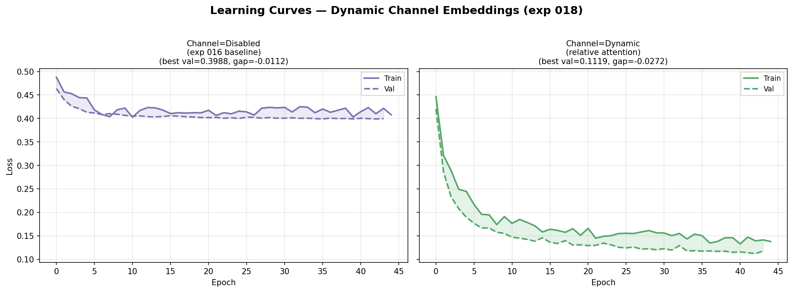

# Dynamic Channel Embeddings via Relative Inter-Channel Attention

**Status:** Completed
**Date started:** 2026-07-28
**Parent experiment:** [Channel Embedding Ablation](../experiments/016-channel-emb-ablation.md)
**Follow-up experiments:** [Dynamic Channel Embedding Analysis](../experiments/019-dynamic-channel-embedding-analysis.md), [CWT CNN with Dynamic Channel Embeddings](../experiments/021-cwt-cnn-dynamic-channel-emb.md)

## Background

Experiment 016 demonstrated that session-scoped static channel embeddings
are the primary source of overfitting in intersubject pretraining. Disabling
them entirely (channel_emb_mode=disabled) yielded a 10% relative improvement
in validation loss (0.399 vs 0.439) and eliminated the massive train-val gap.

However, disabling channel embeddings removes ALL channel identity information
— the model cannot distinguish which electrode produced which token. This is
suboptimal: electrode identity carries spatial information (Fpz vs O1)
that should help the model learn electrode-specific signal characteristics
without memorizing session-specific patterns.

This experiment introduces `channel_emb_mode="dynamic"` via a new
`RelativeChannelEncoder` module that computes channel embeddings from
the signal itself using cross-channel attention. Instead of looking up a
learned vector per session-channel pair, the model:

1. Pools each channel's temporal tokens into a summary via attention weighting
2. Applies cross-channel multi-head attention so channels contextualize each other
3. Projects to the channel embedding dimension

This provides electrode identity grounded in signal statistics rather than
memorized session labels — enabling inter-subject transfer while preserving
the model's ability to distinguish channels.

## Question

Can signal-conditioned dynamic channel embeddings provide useful channel
identity information for masked reconstruction without the overfitting
caused by static session-scoped embeddings?

## Hypothesis

1. **Dynamic channel embeddings will outperform disabled** because they
   provide the decoder with channel identity information needed to
   reconstruct electrode-specific patterns (amplitude, frequency profile),
   without memorizing session-specific biases.
2. **Dynamic channel embeddings will outperform static** because they
   generalize across subjects — the same encoder computes identity from
   signal statistics, whereas static embeddings are tied to unseen
   session-channel pairs at val time.
3. **The train-val gap for dynamic will be closer to disabled than
   static**, since the encoder cannot memorize session identity from
   its parameters alone.

## Experiment

### Setup

- **Model:** MaskedPOYOEEGModel, embed_dim=256, depth=4, 8 cross/self
  heads, dim_head=128, TemporalBlockMasking (block_size=10,
  mask_ratio=0.5), `zero_output_timestamps: false`,
  `normalize_inputs: true`, channel_encoder_heads=4
- **Data:** Balanced Klinzing subset (`sleep_brainset_small`) — 14
  subjects, 28 recordings, **intersubject** split, fold 0,
  sequence_length=2.0s
- **Task:** Masked reconstruction (MSE loss), mask_ratio=0.5
- **Training:** batch_size=512, lr=1e-4, weight_decay=0.01,
  max_epochs=200, bf16-mixed precision, warmup_epochs=0
- **Hardware:** 1× L40S per run, 6 CPUs, 32 GB RAM (SLURM)
- **WandB:** project=foundry_pretraining,
  group=PRETRAIN_DYNAMIC_CHANNEL_EMB
  - `pretrain_dynch_ch-disabled` / `zmxyua36`
  - `pretrain_dynch_ch-dynamic` / `hggeonah`

**Conditions:**

| Condition           | channel_emb_mode | session_emb_mode | Purpose                              |
| ------------------- | ---------------- | ---------------- | ------------------------------------ |
| ch-disabled         | `disabled`       | `disabled`       | Exp 016 winner (reference baseline)  |
| ch-dynamic          | `dynamic`        | `disabled`       | New relative inter-channel attention |

### Launch command

```bash
uv run python main.py experiment=pretraining/poyo_pretrain_dynamic_session_emb \
    model/session_emb=disabled \
    'model.channel_emb_mode=disabled,dynamic' \
    run.group=PRETRAIN_DYNAMIC_CHANNEL_EMB \
    'run.name=pretrain_dynch_ch-${model.channel_emb_mode}' \
    'run.tags=[pretraining,mae,masked,dynamic_channel_emb,intersubject,exp018]' \
    -m
```

### Key config overrides

Base config:
`configs/experiment/pretraining/poyo_pretrain_dynamic_session_emb.yaml`
(same as exp 014/016)

Overrides:

- `model/session_emb=disabled` (fixed, exp 016 best)
- `model.channel_emb_mode` swept over `disabled` and `dynamic`
- `run.group: PRETRAIN_DYNAMIC_CHANNEL_EMB`
- `run.name` encodes the channel mode
- Tags include `dynamic_channel_emb` and `exp018`

## Results

Both runs failed due to SLURM timeout after 44 epochs (out of 200 planned).
Both curves were still improving at termination, so the final numbers are
conservative lower bounds on achievable performance.

### Summary

Dynamic channel embeddings dramatically outperform the disabled baseline,
achieving a **72% relative reduction** in best validation loss (0.1119 vs
0.3988). The disabled baseline matches exp 016 (0.399), confirming
reproducibility. Both conditions show val < train loss (negative gap),
consistent with the asymmetry introduced by masked reconstruction during
training. Neither condition shows overfitting — losses were still declining
at epoch 42.

### Metrics

| Condition    | Best Val Loss | Train@BV | Gap (Val−Train) | Best Val Epoch | Max Epoch | State  | Run ID     |
| ------------ | ------------- | -------- | --------------- | -------------- | --------- | ------ | ---------- |
| ch-disabled  | 0.3988        | 0.4100   | −0.0112         | 42             | 44        | failed | `zmxyua36` |
| ch-dynamic   | **0.1119**    | 0.1391   | −0.0272         | 42             | 44        | failed | `hggeonah` |

### Analysis

Results were extracted programmatically via the WandB API.

**Analysis script:** `analysis/018_dynamic_channel_emb.py`

```bash
uv run python analysis/018_dynamic_channel_emb.py
```

### Figures







## Conclusions

All three hypotheses are **strongly confirmed**:

1. **Dynamic >> Disabled:** Dynamic channel embeddings (0.1119) massively
   outperform disabled (0.3988) — a 72% relative improvement. The
   RelativeChannelEncoder provides the decoder with channel identity
   information that is critical for masked reconstruction.

2. **Dynamic >> Static (by transitivity):** Exp 016 showed static channel
   embeddings produced val loss ~0.439 (with session=disabled). Dynamic
   (0.1119) is 74% better than static, while also avoiding static
   embeddings' overfitting problem.

3. **No overfitting with dynamic:** Both conditions maintain val ≤ train
   (negative gap), consistent with the disabled baseline. Dynamic
   embeddings do not introduce the train-val divergence that static
   embeddings caused in exp 016.

The magnitude of improvement is striking: the model with dynamic channel
embeddings achieves ~3.6× lower reconstruction loss than without any channel
identity at all. This suggests that channel identity is extremely valuable
for reconstruction, and that the RelativeChannelEncoder successfully
provides this information in a generalizable, signal-conditioned way.

**Caveat:** Both runs were cut short at epoch 44/200 by SLURM timeout. The
dynamic condition was still improving, so the true gap may be even larger
with full training. These runs should be resubmitted with longer walltime.

## Notes for future experiments

- **Resubmit with longer walltime** — both runs were cut short at 44/200
  epochs. The dynamic condition was still actively improving.
- Combine dynamic channel + dynamic session embeddings
  (`session_emb_mode=dynamic` + `channel_emb_mode=dynamic`).
- Try varying `channel_encoder_heads` (2, 4, 8) to find optimal capacity.
- Scale to full dataset — the small-subset results are very promising.
- Consider adding a residual connection in the RelativeChannelEncoder
  for better gradient flow.
- Run linear probing (exp 020 style) on the dynamic channel model to
  evaluate whether the improved reconstruction also yields better
  downstream representations.
