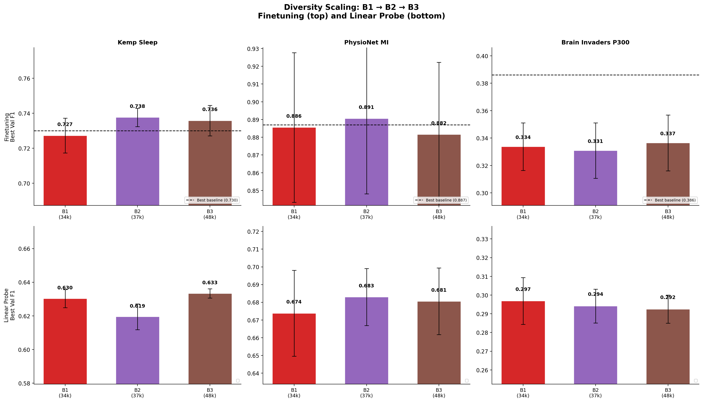
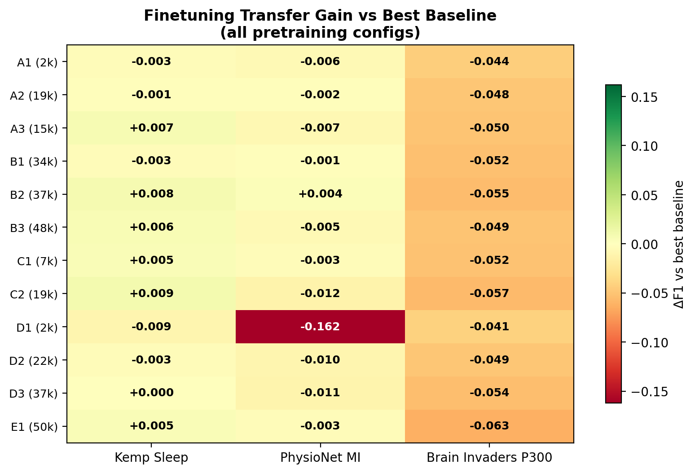
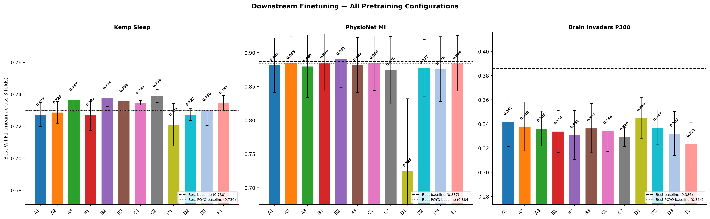

# Diversity Scaling: Does Adding More EEG Datasets Improve Transfer?

**Status:** Completed
**Date started:** 2026-08-07
**Parent experiment:** [01-downstream-from-scratch-baselines](../01-downstream-from-scratch-baselines/README.md)
**Follow-up experiments:** TBD
**Tags:** pretraining, mae, masked, data_scaling, diversity, cwt_cnn, dynamic_ch

## Background

The [from-scratch baselines](../01-downstream-from-scratch-baselines/README.md) established
reference downstream performance. The
[two-dataset pretrain experiment](./20260805-MS-two-dataset-pretrain-downstream-eval.md)
tests Klinzing + Shirazi pretraining. The [volume scaling experiment](./20260807-MS-volume-scaling-pretrain.md)
isolates single-source volume effects.

This experiment measures the **marginal value of dataset diversity**: holding the model
fixed (CWT-CNN + dynamic channel embeddings), does adding a 3rd and 4th EEG dataset to
the pretraining mix improve downstream transfer beyond what the additional data volume
alone would explain?

## Question

Does adding more diverse EEG datasets during pretraining improve downstream transfer
beyond what the additional data volume provides?

## Hypothesis

Each additional dataset will provide diminishing but positive marginal benefit.
B2 (3 datasets) will outperform B1 (2 datasets) by ~1-2 F1 points on at least 2 of 3
downstream tasks. B3 (4 datasets) will provide a smaller additional gain over B2.
The diversity benefit will be most visible on tasks structurally different from the
pretraining data (PhysioNet MI, Brain Invaders P300).

## Experiment

### Setup

- **Model:** POYO CWT-CNN + dynamic channel embeddings, session_emb disabled
- **Data:** 2, 3, and 4-dataset pretraining mixes (progressively adding sources)
- **Training:** 200k steps, batch_size=64, lr=1e-4, bf16-mixed
- **Evaluation:** Kemp Sleep 5-class, PhysioNet MI binary, Brain Invaders P300 binary
  (finetuning + linear probe, 3-fold intersubject CV each)
- **WandB:** pretraining in `foundry_pretraining`, downstream in `foundry_finetuning`

### Pretraining runs

| Run | Data config | Datasets | #Sources | ~Effective data | Disk size |
|-----|-------------|----------|----------|----------------|-----------|
| B1 | `openneuro/two_dataset_pretrain` | Klinzing + Shirazi | 2 | ~34,647 ch·h | ~338G |
| B2 | `openneuro/three_dataset_pretrain` | Klinzing + Shirazi + Pavlov | 3 | ~37,134 ch·h | ~372G |
| B3 | `openneuro/four_dataset_pretrain` | Klinzing + Shirazi + Pavlov + Getzmann | 4 | ~48,001 ch·h | ~664G |

**Note:** B1 overlaps with the existing
[two-dataset pretrain experiment](./20260805-MS-two-dataset-pretrain-downstream-eval.md).
If that experiment's CWT-CNN dynamic run completes, reuse its checkpoint for B1 downstream
evaluation. Otherwise, re-run with the standardized 200k-step budget.

### Launch commands — Pretraining

```bash
# B1: Klinzing + Shirazi (2 datasets)
uv run python main.py experiment=pretraining/poyo_data_scaling_base \
  data=openneuro/two_dataset_pretrain \
  run.name=pretrain_B1_two_dataset \
  run.group=DATA_SCALING_DIVERSITY -m

# B2: Klinzing + Shirazi + Pavlov (3 datasets)
uv run python main.py experiment=pretraining/poyo_data_scaling_base \
  data=openneuro/three_dataset_pretrain \
  run.name=pretrain_B2_three_dataset \
  run.group=DATA_SCALING_DIVERSITY -m

# B3: Klinzing + Shirazi + Pavlov + Getzmann (4 datasets)
uv run python main.py experiment=pretraining/poyo_data_scaling_base \
  data=openneuro/four_dataset_pretrain \
  run.name=pretrain_B3_four_dataset \
  run.group=DATA_SCALING_DIVERSITY -m
```

### Launch commands — Downstream evaluation

After pretraining, evaluate each checkpoint. Each command launches 3 folds:

```bash
# --- B1 downstream ---
for TASK_CMD in \
  "experiment=sleep_staging/kemp_finetune_from_data_scaling" \
  "experiment=sleep_staging/kemp_linear_probe_from_data_scaling" \
  "experiment=motor_imagery/physionet_finetune_from_data_scaling" \
  "experiment=motor_imagery/physionet_linear_probe_from_data_scaling" \
  "experiment=p300/brain_invaders_finetune_from_data_scaling" \
  "experiment=p300/brain_invaders_linear_probe_from_data_scaling"; do
  uv run python main.py $TASK_CMD \
    run.pretrain_run_name=pretrain_B1_two_dataset \
    run.pretrain_group=DATA_SCALING_DIVERSITY -m
done

# --- B2 downstream ---
for TASK_CMD in \
  "experiment=sleep_staging/kemp_finetune_from_data_scaling" \
  "experiment=sleep_staging/kemp_linear_probe_from_data_scaling" \
  "experiment=motor_imagery/physionet_finetune_from_data_scaling" \
  "experiment=motor_imagery/physionet_linear_probe_from_data_scaling" \
  "experiment=p300/brain_invaders_finetune_from_data_scaling" \
  "experiment=p300/brain_invaders_linear_probe_from_data_scaling"; do
  uv run python main.py $TASK_CMD \
    run.pretrain_run_name=pretrain_B2_three_dataset \
    run.pretrain_group=DATA_SCALING_DIVERSITY -m
done

# --- B3 downstream ---
for TASK_CMD in \
  "experiment=sleep_staging/kemp_finetune_from_data_scaling" \
  "experiment=sleep_staging/kemp_linear_probe_from_data_scaling" \
  "experiment=motor_imagery/physionet_finetune_from_data_scaling" \
  "experiment=motor_imagery/physionet_linear_probe_from_data_scaling" \
  "experiment=p300/brain_invaders_finetune_from_data_scaling" \
  "experiment=p300/brain_invaders_linear_probe_from_data_scaling"; do
  uv run python main.py $TASK_CMD \
    run.pretrain_run_name=pretrain_B3_four_dataset \
    run.pretrain_group=DATA_SCALING_DIVERSITY -m
done
```

### Key comparisons

- **B1 → B2:** Adding Pavlov (19ch verbal WM, 156 subjects) to the mix. +2,488 ch·h. Tests marginal value of a low-density diverse source.
- **B2 → B3:** Adding Getzmann (64ch resting, 608 subjects) to the mix. +10,867 ch·h. Largest single-step volume + diversity increase.
- **B1 vs A2:** B1 adds Shirazi to Klinzing; if B1 > A2, diversity beats single-source volume.
- **B3 vs A3:** B3 has 4 datasets (~48k ch·h) vs A3's single Shirazi (~15k ch·h). Tests whether diversity at scale dominates.

### Staging note

B3 requires staging ~664G of data. Ensure SLURM_TMPDIR has sufficient space.
If staging fails, reduce `num_workers` or request a node with larger local storage.

## Results

### Pretraining

All 3 runs completed 200k optimizer steps.

| Run | Final Val Loss | Best Val Loss |
|-----|---------------|---------------|
| B1 (2 datasets, 34.6k ch·h) | 0.0605 | 0.0605 |
| B2 (3 datasets, 37.1k ch·h) | 0.0580 | 0.0580 |
| B3 (4 datasets, 48.0k ch·h) | 0.1096 | 0.1096 |

B3's much higher reconstruction loss reflects the addition of Getzmann
(64ch resting-state, 608 subjects) — a heterogeneous dataset that
increases reconstruction difficulty substantially.

### Downstream — Finetuning

| Task | B1 (2ds, 34.6k) | B2 (3ds, 37.1k) | B3 (4ds, 48.0k) | Best Baseline |
|------|:---:|:---:|:---:|:---:|
| Kemp Sleep | 0.727 ± 0.010 | **0.738 ± 0.005** | 0.736 ± 0.009 | 0.730 |
| PhysioNet MI | 0.886 ± 0.042 | **0.891 ± 0.042** | 0.882 ± 0.041 | 0.887 |
| Brain Invaders P300 | 0.334 ± 0.017 | 0.331 ± 0.020 | **0.337 ± 0.020** | 0.386 |

### Downstream — Linear Probe

| Task | B1 | B2 | B3 |
|------|:---:|:---:|:---:|
| Kemp Sleep | **0.630 ± 0.005** | 0.619 ± 0.008 | **0.633 ± 0.003** |
| PhysioNet MI | 0.674 ± 0.024 | **0.683 ± 0.016** | 0.681 ± 0.019 |
| Brain Invaders P300 | **0.297 ± 0.013** | 0.294 ± 0.009 | 0.292 ± 0.008 |

### Key comparisons

- **B1 → B2 (adding Pavlov):** Clear improvement on Kemp Sleep finetuning
  (+0.010) and MI finetuning (+0.005). B2 is the **best MI finetuning
  config across all 12 runs** (0.891, beating EEGNet baseline 0.887).
- **B2 → B3 (adding Getzmann):** Regression on MI finetuning (-0.009),
  slight regression on Sleep finetuning (-0.002). P300 improves slightly
  (+0.006). The 4th dataset introduces interference that outweighs the
  additional diversity benefit.
- **Linear probes:** B3 matches or slightly exceeds B1 on Sleep (0.633 vs
  0.630), B2 leads MI. The representation quality story is less clear-cut
  than finetuning.

### Analysis

```bash
uv run python analysis/036_data_scaling_all_experiments.py
```

### Figures





## Conclusions

**Hypothesis partially confirmed (B2 > B1) but refuted for monotonic scaling
(B3 < B2).** Adding Pavlov (3rd dataset) provides clear marginal benefit,
making B2 the overall best finetuning configuration. However, adding Getzmann
(4th dataset) causes regression on MI and marginal regression on Sleep,
suggesting that beyond a diversity threshold, heterogeneous data introduces
interference.

B2 (3 datasets) is the **sweet spot**: it achieves the only above-baseline MI
finetuning result (0.891 vs EEGNet 0.887) across all 12 pretraining
configurations. The diminishing-returns hypothesis holds for B1 → B2 but
becomes negative returns for B2 → B3.

## Notes for future experiments

- Investigate why B2 (3 datasets with Pavlov) is the sweet spot — Pavlov's
  working memory paradigm (19ch, 156 subjects) may share task-relevant
  structure with MI and Sleep tasks that Getzmann's resting-state data lacks.
- Test whether B3's regression is caused by Getzmann's volume (10,867 ch·h
  diluting the training distribution) or its paradigm (resting-state). A
  volume-matched Getzmann subset could disambiguate.
