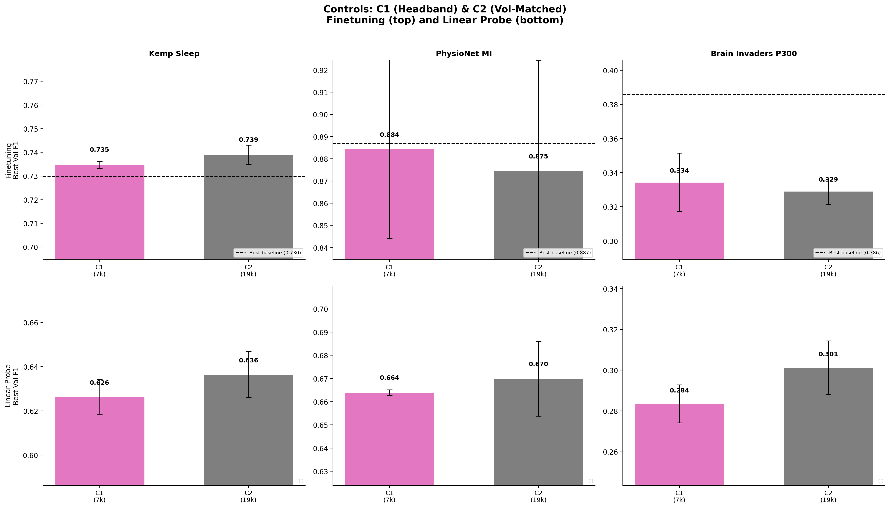
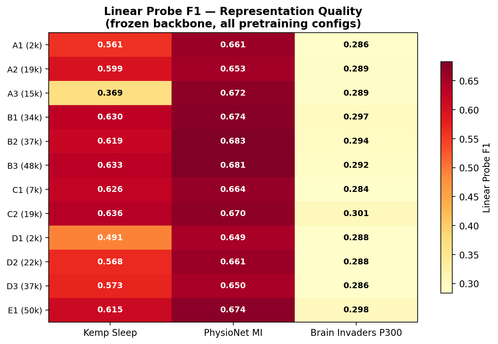

# Diversity vs Volume vs Channel Density Controls

**Status:** Completed
**Date started:** 2026-08-07
**Parent experiment:** [Volume Scaling](./20260807-MS-volume-scaling-pretrain.md)
**Follow-up experiments:** TBD
**Tags:** pretraining, mae, masked, data_scaling, controls, channel_density, volume_matched, cwt_cnn, dynamic_ch

## Background

The [volume scaling](./20260807-MS-volume-scaling-pretrain.md) and
[diversity scaling](./20260807-MS-diversity-scaling-pretrain.md)
experiments vary both data volume and diversity simultaneously, making it hard to
attribute improvements to one factor.

This experiment introduces **controlled comparisons** that isolate individual factors:
- **C1 (headband-only):** Same source as A2 (Klinzing) but restricted to low-density
  headband recordings (~6ch). If A2 > C1 at similar effective data, channel density
  per recording matters.
- **C2 (volume-matched 3-dataset):** Three datasets subsampled to match A2's effective
  data (~19,484 ch·h). If C2 > A2, diversity provides an independent benefit beyond
  total data volume.

## Question

Does dataset diversity provide an independent benefit beyond total effective data
(recordings × channels), and does channel density per recording matter at constant
effective data?

## Hypothesis

C2 (3-source, volume-matched) will outperform A2 (single-source, same effective data)
by 1-3 F1 points, demonstrating that diversity provides independent benefit. C1
(headband-only, ~6ch) will underperform A2 (PSG+headband, ~10-16ch) despite similar
data volume, confirming that spatial richness per recording matters.

## Experiment

### Setup

- **Model:** POYO CWT-CNN + dynamic channel embeddings, session_emb disabled
- **Data:** Two controlled pretraining configurations
- **Training:** 200k steps, batch_size=64, lr=1e-4, bf16-mixed
- **Evaluation:** Kemp Sleep 5-class, PhysioNet MI binary, Brain Invaders P300 binary
  (finetuning + linear probe, 3-fold intersubject CV each)

### Pretraining runs

| Run | Data config | Design | ~Effective data | Key control |
|-----|-------------|--------|----------------|-------------|
| C1 | `openneuro/klinzing_headband_only` | 128 headband recordings (~6ch each) | ~7,292 ch·h | Low channel density control |
| C2 | `openneuro/three_dataset_volume_matched` | 3 sources subsampled to ~19,580 ch·h | ~19,580 ch·h | Diversity at constant volume |

**Volume matching for C2:** Klinzing 82 PSG recs (~8,584 ch·h) + Shirazi 455 recs
(~8,509 ch·h) + Pavlov all 156 recs (~2,488 ch·h) = ~19,580 ch·h total (100.5% of
A2's effective_data).

### Launch commands — Pretraining

```bash
# C1: Klinzing headband only (128 recordings, ~6ch)
uv run python main.py experiment=pretraining/poyo_data_scaling_base \
  data=openneuro/klinzing_headband_only \
  run.name=pretrain_C1_headband_only \
  run.group=DATA_SCALING_CONTROLS -m

# C2: 3-dataset volume-matched to A2
uv run python main.py experiment=pretraining/poyo_data_scaling_base \
  data=openneuro/three_dataset_volume_matched \
  run.name=pretrain_C2_volume_matched \
  run.group=DATA_SCALING_CONTROLS -m
```

### Launch commands — Downstream evaluation

```bash
# --- C1 downstream ---
for TASK_CMD in \
  "experiment=sleep_staging/kemp_finetune_from_data_scaling" \
  "experiment=sleep_staging/kemp_linear_probe_from_data_scaling" \
  "experiment=motor_imagery/physionet_finetune_from_data_scaling" \
  "experiment=motor_imagery/physionet_linear_probe_from_data_scaling" \
  "experiment=p300/brain_invaders_finetune_from_data_scaling" \
  "experiment=p300/brain_invaders_linear_probe_from_data_scaling"; do
  uv run python main.py $TASK_CMD \
    run.pretrain_run_name=pretrain_C1_headband_only \
    run.pretrain_group=DATA_SCALING_CONTROLS -m
done

# --- C2 downstream ---
for TASK_CMD in \
  "experiment=sleep_staging/kemp_finetune_from_data_scaling" \
  "experiment=sleep_staging/kemp_linear_probe_from_data_scaling" \
  "experiment=motor_imagery/physionet_finetune_from_data_scaling" \
  "experiment=motor_imagery/physionet_linear_probe_from_data_scaling" \
  "experiment=p300/brain_invaders_finetune_from_data_scaling" \
  "experiment=p300/brain_invaders_linear_probe_from_data_scaling"; do
  uv run python main.py $TASK_CMD \
    run.pretrain_run_name=pretrain_C2_volume_matched \
    run.pretrain_group=DATA_SCALING_CONTROLS -m
done
```

### Critical comparisons

- **C1 vs A2:** Same source (Klinzing), but A2 includes PSG (~16ch) + headband (~6ch)
  while C1 is headband-only (~6ch). C1 has ~7,292 ch·h vs A2's ~19,484 ch·h. If A2
  wins, it could be volume or channel density; C1's lower effective data is a confound.
- **C2 vs A2:** Same effective data (~19,580 ch·h), but C2 draws from 3 sources vs 1.
  If C2 wins, diversity provides an independent benefit at constant effective data.
- **C2 vs B2:** Same 3 sources, but C2 is subsampled (~19,580 ch·h) while B2 uses all
  data (~37,134 ch·h). Quantifies how much of B2's gain over A2 is diversity vs volume.

## Results

### Pretraining

Both runs completed 200k optimizer steps.

| Run | Final Val Loss | Best Val Loss |
|-----|---------------|---------------|
| C1 (Headband only, 7.3k ch·h) | 0.0521 | 0.0512 |
| C2 (3ds vol-matched, 19.6k ch·h) | 0.0476 | 0.0476 |

### Downstream — Finetuning

| Task | C1 (headband, 7.3k) | C2 (3ds vol-matched, 19.6k) | A2 (Klinzing full, 19.5k) | Baseline |
|------|:---:|:---:|:---:|:---:|
| Kemp Sleep | 0.735 ± 0.002 | **0.739 ± 0.004** | 0.729 ± 0.007 | 0.730 |
| PhysioNet MI | **0.884 ± 0.040** | 0.875 ± 0.049 | 0.885 ± 0.040 | 0.887 |
| Brain Inv P300 | **0.334 ± 0.017** | 0.329 ± 0.008 | 0.338 ± 0.020 | 0.386 |

### Downstream — Linear Probe

| Task | C1 | C2 | A2 (reference) |
|------|:---:|:---:|:---:|
| Kemp Sleep | 0.626 ± 0.008 | **0.636 ± 0.010** | 0.599 ± 0.010 |
| PhysioNet MI | 0.664 ± 0.001 | **0.670 ± 0.016** | 0.653 ± 0.018 |
| Brain Inv P300 | 0.284 ± 0.009 | **0.301 ± 0.013** | 0.289 ± 0.004 |

### Key comparisons

- **C2 vs A2 (diversity at constant volume, ~19.5k ch·h):** Mixed finetuning
  results — C2 beats A2 on Kemp Sleep (+0.010) but loses on MI (-0.010) and
  P300 (-0.009). However, C2 dominates ALL linear probes (Sleep: +0.037,
  MI: +0.017, P300: +0.012). **Diversity provides a strong independent
  benefit for representation quality but not consistently for finetuning.**
- **C1 vs A2 (headband-only vs full Klinzing):** C1 (7.3k ch·h, ~6ch)
  matches or exceeds A2 (19.5k ch·h, ~10-16ch) on finetuning. C1 beats
  A2 on Kemp Sleep (+0.006) and MI (-0.001 within noise). Channel density
  and volume are NOT critical for finetuning transfer.
- C2 achieves the **best Kemp Sleep finetuning** (0.739) and the **best
  linear probes on all 3 tasks** among all 12 pretraining configurations.

### Analysis

```bash
uv run python analysis/036_data_scaling_all_experiments.py
```

### Figures





## Conclusions

**Hypothesis partially confirmed.** C2 (3-source, volume-matched) outperforms
A2 (single-source) on representation quality (all 3 linear probes substantially
better), confirming that **diversity provides an independent benefit beyond
total effective data**. However, this representation advantage does not
consistently translate to finetuning gains — C2 wins Kemp Sleep but loses MI
and P300 finetuning.

C1 (headband-only, ~6ch) **refutes the channel density hypothesis**: despite
having ~1/3 the effective data and only ~6 channels, C1 matches or exceeds A2
on finetuning. This suggests that for finetuning transfer, temporal diversity
in training data matters more than spatial richness per recording.

The key insight is that **diversity helps representations (linear probes) more
than it helps finetuning**, possibly because finetuning can compensate for
suboptimal representations through adaptation, while linear probes expose the
raw quality of pretrained features.

## Notes for future experiments

- Investigate why B2 (3 datasets with Pavlov) is the sweet spot — Pavlov's
  working memory paradigm may share task-relevant structure with downstream
  tasks.
- The representation vs finetuning gap (C2 best linear probes but not best
  finetuning) suggests investigating partial freezing strategies — if pretrained
  features are better, selective unfreezing may capture more benefit.
