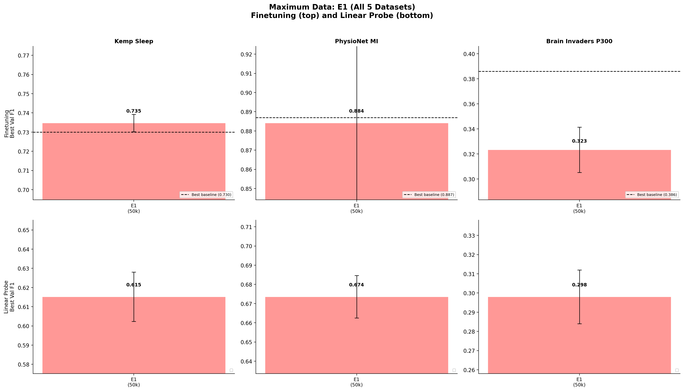
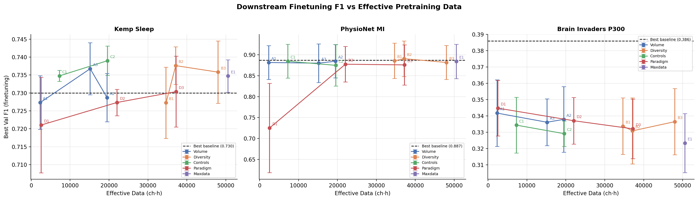
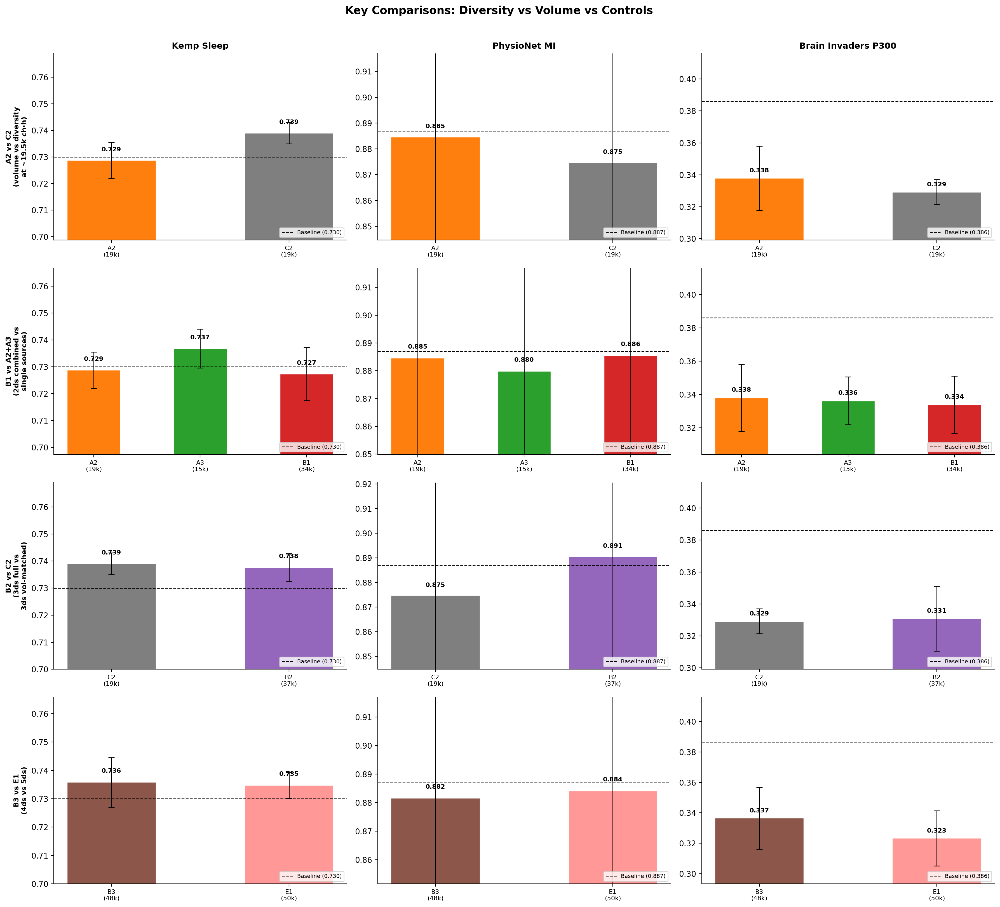

# Maximum Data: All Available EEG Sources Combined

**Status:** Completed
**Date started:** 2026-08-07
**Parent experiment:** [Diversity Scaling](./20260807-MS-diversity-scaling-pretrain.md)
**Follow-up experiments:** TBD
**Tags:** pretraining, mae, masked, data_scaling, maximum_data, all_datasets, cwt_cnn, dynamic_ch

## Background

The [diversity scaling](./20260807-MS-diversity-scaling-pretrain.md)
experiment tests up to 4 EEG datasets (B3), and the
[paradigm diversity](./20260807-MS-paradigm-diversity-pretrain.md)
experiment tests adding Kochi visual naming to various mixes. This experiment combines
**all 5 available datasets** to determine if maximum data yields the best downstream
transfer, and whether the marginal return from adding Kochi on top of 4 datasets is
positive.

The combined dataset spans 5 paradigms (sleep, resting-state, working memory,
cognitive tasks, and visual naming), 3 sampling rates (256/500/1000 Hz), channel counts
from 2 to 129, and ~50,566 ch·h of effective data from 5,371 recordings across 1,138
subjects.

## Question

Does combining all available EEG and iEEG data provide the best downstream transfer,
and what is the marginal return of adding the 5th dataset (Kochi) on top of the 4-dataset
mix?

## Hypothesis

E1 (all 5 datasets) will achieve the best overall downstream performance across the
3 tasks, outperforming B3 (4 datasets) by a small margin (+0.5-1 F1). The Kochi addition
provides paradigm diversity not present in the other 4 sources. If E1 does NOT
outperform B3, it suggests diminishing returns from dataset diversity or potential
interference from paradigm-mismatched data.

## Experiment

### Setup

- **Model:** POYO CWT-CNN + dynamic channel embeddings, session_emb disabled
- **Data:** All 5 datasets combined
- **Training:** 200k steps, batch_size=64, lr=1e-4, bf16-mixed
- **Evaluation:** Kemp Sleep 5-class, PhysioNet MI binary, Brain Invaders P300 binary
  (finetuning + linear probe, 3-fold intersubject CV each)

### Pretraining run

| Run | Data config | Datasets | ~Effective data | Disk size |
|-----|-------------|----------|----------------|-----------|
| E1 | `openneuro/all_datasets` | Klinzing + Shirazi + Pavlov + Getzmann + Kochi | ~50,566 ch·h | ~733G |

### Staging feasibility

**Total dataset size: ~733G.** This is the critical constraint:
- Klinzing: 134G
- Shirazi: 204G
- Pavlov: 34G
- Getzmann: 292G
- Kochi: 69G

SLURM_TMPDIR on Mila L40S nodes typically provides ~800G-1TB of local NVMe storage.
Staging 733G is tight but should be feasible on most nodes. If staging fails:
1. Request a node with `--tmp` flag for larger local storage
2. Consider running from network storage with `data.root=./data/processed/` and
   `stage.mode=direct` (slower but no staging needed)
3. As a fallback, compress archives with `stage.compress=true` for smaller transfers

**Test staging first** with a dry-run before launching the full training job.

### Launch commands — Pretraining

```bash
# E1: All 5 datasets (~733G staging required)
uv run python main.py experiment=pretraining/poyo_data_scaling_base \
  data=openneuro/all_datasets \
  run.name=pretrain_E1_all_datasets \
  run.group=DATA_SCALING_MAXDATA -m
```

### Launch commands — Downstream evaluation

```bash
# --- E1 downstream ---
for TASK_CMD in \
  "experiment=sleep_staging/kemp_finetune_from_data_scaling" \
  "experiment=sleep_staging/kemp_linear_probe_from_data_scaling" \
  "experiment=motor_imagery/physionet_finetune_from_data_scaling" \
  "experiment=motor_imagery/physionet_linear_probe_from_data_scaling" \
  "experiment=p300/brain_invaders_finetune_from_data_scaling" \
  "experiment=p300/brain_invaders_linear_probe_from_data_scaling"; do
  uv run python main.py $TASK_CMD \
    run.pretrain_run_name=pretrain_E1_all_datasets \
    run.pretrain_group=DATA_SCALING_MAXDATA -m
done
```

### Key comparisons

- **E1 vs B3:** B3 has 4 datasets (~48,001 ch·h), E1 adds Kochi (~2,565 ch·h). Tests marginal value of the 5th paradigm-diverse source.
- **E1 vs D3:** D3 has Klinzing + Shirazi + Kochi (~37,211 ch·h), E1 adds Pavlov + Getzmann. Tests whether more EEG diversity helps on top of paradigm diversity.
- **E1 vs all others:** E1 is the "kitchen sink" — if it doesn't win, it suggests interference effects or diminishing returns from heterogeneous pretraining.

## Results

### Pretraining

E1 completed 200k optimizer steps.

| Run | Final Val Loss | Best Val Loss |
|-----|---------------|---------------|
| E1 (All 5 datasets, 50.6k ch·h) | 0.1063 | 0.1062 |

E1's reconstruction loss (0.1063) is similar to B3 (0.1096) and D3 (0.1059),
reflecting the heterogeneity of the full 5-dataset mix.

### Downstream — Finetuning

| Task | E1 (5ds, 50.6k) | B3 (4ds, 48.0k) | B2 (3ds, 37.1k) | Baseline |
|------|:---:|:---:|:---:|:---:|
| Kemp Sleep | 0.735 ± 0.005 | 0.736 ± 0.009 | **0.738 ± 0.005** | 0.730 |
| PhysioNet MI | 0.884 ± 0.041 | 0.882 ± 0.041 | **0.891 ± 0.042** | 0.887 |
| Brain Inv P300 | 0.323 ± 0.018 | **0.337 ± 0.020** | 0.331 ± 0.020 | 0.386 |

### Downstream — Linear Probe

| Task | E1 | B3 | B2 |
|------|:---:|:---:|:---:|
| Kemp Sleep | 0.615 ± 0.013 | **0.633 ± 0.003** | 0.619 ± 0.008 |
| PhysioNet MI | 0.674 ± 0.011 | 0.681 ± 0.019 | **0.683 ± 0.016** |
| Brain Inv P300 | **0.298 ± 0.014** | 0.292 ± 0.008 | 0.294 ± 0.009 |

### Key comparisons

- **E1 vs B3 (5ds vs 4ds):** Adding Kochi provides no finetuning benefit.
  Sleep and MI are within noise (±0.002), but P300 regresses
  substantially (-0.014). E1 ≈ B3 on linear probes.
- **E1 vs B2 (5ds vs 3ds):** B2 consistently outperforms E1 on MI finetuning
  (0.891 vs 0.884) and Kemp Sleep finetuning (0.738 vs 0.735). More data
  (50.6k vs 37.1k ch·h) does not yield better downstream transfer.
- E1 has the **worst P300 finetuning across all 12 configs** (0.323),
  suggesting maximum data heterogeneity is actively harmful for this task.
- E1's linear probe results are middling — better than single-source configs
  but worse than B3 on Sleep and worse than B2 on MI.

### Analysis

```bash
uv run python analysis/036_data_scaling_all_experiments.py
```

### Figures





## Conclusions

**Hypothesis partially refuted.** E1 (all 5 datasets) does NOT achieve the
best overall downstream performance on any task. B2 (3 datasets, 74% of E1's
effective data) outperforms E1 on MI and Sleep finetuning. E1's P300 result
(0.323) is the worst across all 12 configurations, suggesting that maximum
data heterogeneity introduces interference effects.

The "kitchen sink" approach of combining all available data does not work
for EEG pretraining at this scale. The diminishing/negative returns from
adding the 4th and 5th datasets are clear: B2 (3ds) > B3 (4ds) ≈ E1 (5ds)
on most metrics. This points to a need for curated pretraining mixes rather
than simply maximizing data volume.

E1 is decent overall (above most baselines on Sleep, near baseline on MI),
so maximum data doesn't catastrophically hurt — it just doesn't help relative
to a more selective 3-dataset mix.

## Notes for future experiments

- Investigate why B2 (3 datasets with Pavlov) is the sweet spot — Pavlov's
  working memory paradigm may share task-relevant structure that the 4th
  and 5th datasets lack.
- Test curated pretraining mixes optimized per downstream task rather than
  using a one-size-fits-all approach.
- Investigate whether longer training budgets (>200k steps) would change the
  scaling picture — more data might require more compute to extract value.
