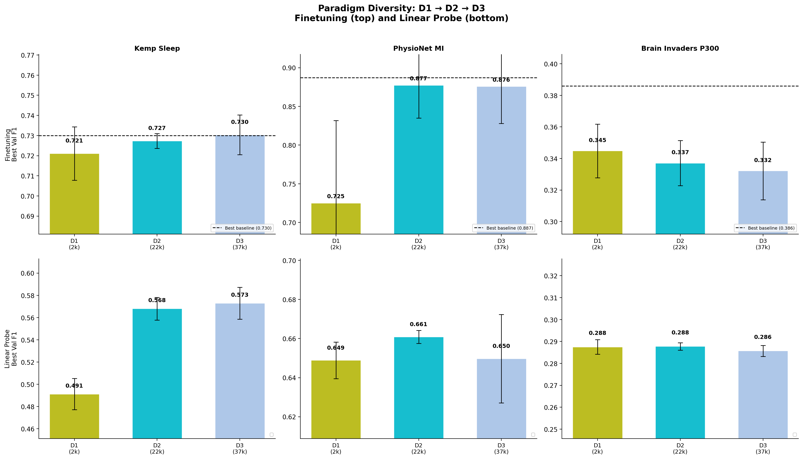

# Paradigm Diversity: Does Visual Naming EEG Help Transfer?

**Status:** Completed
**Date started:** 2026-08-07
**Parent experiment:** [01-downstream-from-scratch-baselines](../01-downstream-from-scratch-baselines/README.md)
**Follow-up experiments:** TBD
**Tags:** pretraining, mae, masked, data_scaling, paradigm_diversity, kochi, visual_naming, cwt_cnn, dynamic_ch

## Background

The [volume scaling](./20260807-MS-volume-scaling-pretrain.md) and
[diversity scaling](./20260807-MS-diversity-scaling-pretrain.md)
experiments test within-modality diversity (all EEG, varying datasets). This experiment
introduces **paradigm diversity** by adding Kochi Visual Naming (ds006914) — an iEEG
dataset from a fundamentally different cognitive paradigm (visual object naming vs
sleep/resting-state/working memory).

Kochi visual naming is a scalp EEG dataset registered as "ieeg" in the system due to its
variable electrode configurations (2-66ch, mean 50ch). It provides ~2,565 ch·h from 353
recordings across 110 subjects performing picture naming tasks.

## Question

Does adding a paradigm-diverse EEG source (visual naming) during pretraining improve
downstream transfer on sleep, motor imagery, and P300 tasks, even though the pretraining
paradigm differs substantially from all downstream tasks?

## Hypothesis

Adding Kochi to the pretraining mix will provide modest improvement (+0.5-1.5 F1) on
tasks that benefit from general neural representations (PhysioNet MI, Brain Invaders P300)
but may not help sleep staging, since sleep-specific temporal dynamics are absent in
visual naming data. D3 (Klinzing + Shirazi + Kochi) should outperform B1 (Klinzing +
Shirazi) if paradigm diversity adds value on top of dataset diversity.

## Experiment

### Setup

- **Model:** POYO CWT-CNN + dynamic channel embeddings, session_emb disabled
- **Data:** Three configurations isolating the effect of paradigm-diverse Kochi data
- **Training:** 200k steps, batch_size=64, lr=1e-4, bf16-mixed
- **Evaluation:** Kemp Sleep 5-class, PhysioNet MI binary, Brain Invaders P300 binary
  (finetuning + linear probe, 3-fold intersubject CV each)

### Pretraining runs

| Run | Data config | Datasets | ~Effective data | Disk size |
|-----|-------------|----------|----------------|-----------|
| D1 | `openneuro/kochi_only` | Kochi visual naming (353 recordings) | ~2,565 ch·h | ~69G |
| D2 | `openneuro/klinzing_kochi` | Klinzing + Kochi | ~22,049 ch·h | ~203G |
| D3 | `openneuro/klinzing_shirazi_kochi` | Klinzing + Shirazi + Kochi | ~37,211 ch·h | ~407G |

### Launch commands — Pretraining

```bash
# D1: Kochi visual naming only
uv run python main.py experiment=pretraining/poyo_data_scaling_base \
  data=openneuro/kochi_only \
  run.name=pretrain_D1_kochi_only \
  run.group=DATA_SCALING_PARADIGM -m

# D2: Klinzing + Kochi
uv run python main.py experiment=pretraining/poyo_data_scaling_base \
  data=openneuro/klinzing_kochi \
  run.name=pretrain_D2_klinzing_kochi \
  run.group=DATA_SCALING_PARADIGM -m

# D3: Klinzing + Shirazi + Kochi
uv run python main.py experiment=pretraining/poyo_data_scaling_base \
  data=openneuro/klinzing_shirazi_kochi \
  run.name=pretrain_D3_klinzing_shirazi_kochi \
  run.group=DATA_SCALING_PARADIGM -m
```

### Launch commands — Downstream evaluation

```bash
# --- D1 downstream ---
for TASK_CMD in \
  "experiment=sleep_staging/kemp_finetune_from_data_scaling" \
  "experiment=sleep_staging/kemp_linear_probe_from_data_scaling" \
  "experiment=motor_imagery/physionet_finetune_from_data_scaling" \
  "experiment=motor_imagery/physionet_linear_probe_from_data_scaling" \
  "experiment=p300/brain_invaders_finetune_from_data_scaling" \
  "experiment=p300/brain_invaders_linear_probe_from_data_scaling"; do
  uv run python main.py $TASK_CMD \
    run.pretrain_run_name=pretrain_D1_kochi_only \
    run.pretrain_group=DATA_SCALING_PARADIGM -m
done

# --- D2 downstream ---
for TASK_CMD in \
  "experiment=sleep_staging/kemp_finetune_from_data_scaling" \
  "experiment=sleep_staging/kemp_linear_probe_from_data_scaling" \
  "experiment=motor_imagery/physionet_finetune_from_data_scaling" \
  "experiment=motor_imagery/physionet_linear_probe_from_data_scaling" \
  "experiment=p300/brain_invaders_finetune_from_data_scaling" \
  "experiment=p300/brain_invaders_linear_probe_from_data_scaling"; do
  uv run python main.py $TASK_CMD \
    run.pretrain_run_name=pretrain_D2_klinzing_kochi \
    run.pretrain_group=DATA_SCALING_PARADIGM -m
done

# --- D3 downstream ---
for TASK_CMD in \
  "experiment=sleep_staging/kemp_finetune_from_data_scaling" \
  "experiment=sleep_staging/kemp_linear_probe_from_data_scaling" \
  "experiment=motor_imagery/physionet_finetune_from_data_scaling" \
  "experiment=motor_imagery/physionet_linear_probe_from_data_scaling" \
  "experiment=p300/brain_invaders_finetune_from_data_scaling" \
  "experiment=p300/brain_invaders_linear_probe_from_data_scaling"; do
  uv run python main.py $TASK_CMD \
    run.pretrain_run_name=pretrain_D3_klinzing_shirazi_kochi \
    run.pretrain_group=DATA_SCALING_PARADIGM -m
done
```

### Key comparisons

- **D1 alone:** Kochi-only pretraining on a small, paradigm-diverse source. Baseline for Kochi's intrinsic value.
- **D2 vs A2:** Both include Klinzing; D2 adds Kochi. If D2 > A2, paradigm diversity helps on top of sleep data.
- **D3 vs B1:** Both include Klinzing + Shirazi; D3 adds Kochi. Direct test of Kochi's marginal value in a multi-source setting.
- **D3 vs B2:** B2 adds Pavlov (same-domain WM), D3 adds Kochi (cross-paradigm). Compares paradigm diversity vs within-domain diversity.

## Results

### Pretraining

All 3 runs completed 200k optimizer steps.

| Run | Final Val Loss | Best Val Loss |
|-----|---------------|---------------|
| D1 (Kochi only, 2.6k ch·h) | 0.1599 | 0.1599 |
| D2 (Klinzing+Kochi, 22.0k ch·h) | 0.1003 | 0.1003 |
| D3 (Klinzing+Shirazi+Kochi, 37.2k ch·h) | 0.1059 | 0.1059 |

D1 has the highest reconstruction loss across all 12 pretraining runs,
reflecting Kochi's high variability (2-66ch, variable electrode configs,
visual naming paradigm).

### Downstream — Finetuning

| Task | D1 (Kochi, 2.6k) | D2 (Klin+Kochi, 22k) | D3 (Klin+Shir+Kochi, 37.2k) | Baseline |
|------|:---:|:---:|:---:|:---:|
| Kemp Sleep | 0.721 ± 0.013 | 0.727 ± 0.004 | **0.730 ± 0.010** | 0.730 |
| PhysioNet MI | 0.725 ± 0.107 | 0.877 ± 0.043 | **0.876 ± 0.048** | 0.887 |
| Brain Inv P300 | **0.345 ± 0.017** | 0.337 ± 0.014 | 0.332 ± 0.018 | 0.386 |

### Downstream — Linear Probe

| Task | D1 | D2 | D3 |
|------|:---:|:---:|:---:|
| Kemp Sleep | 0.491 ± 0.014 | 0.568 ± 0.010 | **0.573 ± 0.014** |
| PhysioNet MI | 0.649 ± 0.009 | **0.661 ± 0.003** | 0.650 ± 0.023 |
| Brain Inv P300 | 0.288 ± 0.003 | 0.288 ± 0.002 | 0.286 ± 0.002 |

### Key comparisons

- **D1 (Kochi only):** Catastrophic MI failure (0.725 ± 0.107, fold0/fold1
  stuck near chance at ~0.66). Visual naming pretraining alone is insufficient
  for MI. Paradoxically, D1 has the best P300 finetuning among D runs (0.345),
  suggesting Kochi's event-related temporal structure partially aligns with P300.
- **D2 vs A2 (adding Kochi to Klinzing):** Essentially identical — Kochi
  provides no benefit on any task (Sleep: -0.001, MI: -0.007, P300: -0.001).
- **D3 vs B1 (adding Kochi to Klinzing+Shirazi):** D3 matches B1 on Sleep
  (+0.003) but is worse on MI (-0.010). Kochi adds negligible value in a
  multi-source setting.
- All Kochi-containing configs (D1-D3) have the **weakest Kemp Sleep linear
  probes** among all experiments, suggesting paradigm-mismatched pretraining
  corrupts sleep-relevant representations.

### Analysis

```bash
uv run python analysis/036_data_scaling_all_experiments.py
```

### Figures




## Conclusions

**Hypothesis partially confirmed for P300 but refuted for MI and Sleep.**
Kochi provides a small P300 benefit (D1 has the best P300 among D runs),
consistent with shared event-related processing between visual naming and P300.
However, Kochi provides no benefit for MI and slightly hurts all tasks when
added to multi-source mixes (D2 ≈ A2, D3 ≈ B1).

The paradigm-diversity hypothesis — that cross-paradigm pretraining helps
build general neural representations — is not supported. Instead, Kochi's
visual naming data appears to either dilute useful representations or
introduce conflicting features. D1's catastrophic MI failure (0.725 with
enormous variance) particularly illustrates this: visual naming pretraining
alone is insufficient for motor imagery.

## Notes for future experiments

- Investigate why B2 (3 datasets with Pavlov) is the sweet spot — Pavlov's
  working memory paradigm may share task-relevant structure that Kochi lacks.
- D1's P300 advantage deserves follow-up: is the benefit from Kochi's
  event-related processing or just from its small data size (avoiding
  overfitting to reconstruction)?
- Test whether Kochi helps on downstream tasks with similar cognitive demands
  (e.g., visual ERP classification, language processing).
