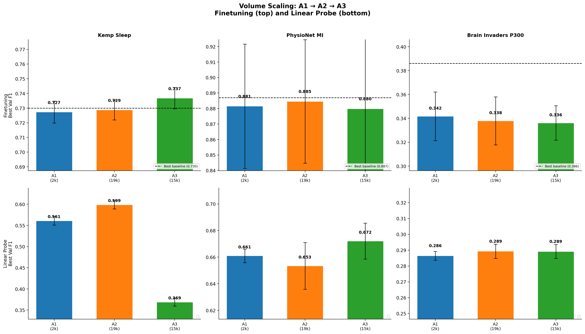
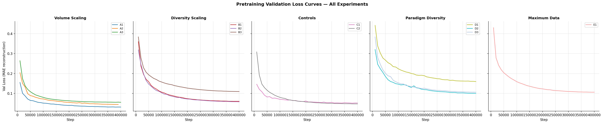

# Volume Scaling: Does More Data from a Single Source Improve Transfer?

**Status:** Completed
**Date started:** 2026-08-07
**Parent experiment:** [01-downstream-from-scratch-baselines](../01-downstream-from-scratch-baselines/README.md)
**Follow-up experiments:** TBD
**Tags:** pretraining, mae, masked, data_scaling, volume, cwt_cnn, dynamic_ch

## Background

The [from-scratch baselines](../01-downstream-from-scratch-baselines/README.md) established
reference performance for POYO CWT-CNN across three downstream EEG tasks (Kemp Sleep F1=0.730,
PhysioNet MI F1=0.884, Brain Invaders P300 F1=0.364). The
[two-dataset pretrain experiment](./20260805-MS-two-dataset-pretrain-downstream-eval.md)
is testing whether pretraining on Klinzing + Shirazi can beat these baselines.

This experiment isolates the **volume scaling** axis: holding the model fixed (CWT-CNN +
dynamic channel embeddings), how does increasing data volume from a single source affect
downstream transfer? It also compares a high-channel-count source (Shirazi, 129ch) against
a lower-channel-count source (Klinzing, ~10ch avg) to test whether channel richness
provides additional benefit.

## Question

Does pretraining on more data from a single EEG source monotonically improve downstream
transfer, and does a higher-channel-density source provide more benefit per recording?

## Hypothesis

Downstream F1 will increase from A1 → A2 (small → full Klinzing, ~10x volume increase),
and A3 (Shirazi, 129ch, ~1300 recordings) will outperform A2 despite being a different
domain, because its higher channel density provides richer spatial representations per
recording. Expected ordering: A1 < A2 < A3 on at least 2 of 3 downstream tasks.

## Experiment

### Setup

- **Model:** POYO CWT-CNN + dynamic channel embeddings, session_emb disabled
- **Data:** Three single-source pretraining runs at increasing scale
- **Training:** 200k steps, batch_size=64, lr=1e-4, bf16-mixed
- **Evaluation:** Kemp Sleep 5-class, PhysioNet MI binary, Brain Invaders P300 binary
  (finetuning + linear probe, 3-fold intersubject CV each)
- **WandB:** pretraining in `foundry_pretraining`, downstream in `foundry_finetuning`

### Pretraining runs

| Run | Data config | Datasets | ~Effective data | Disk size |
|-----|-------------|----------|----------------|-----------|
| A1 | `openneuro/klinzing_small` | Klinzing 28 recordings (14 subjects) | ~2,338 ch·h | ~15G |
| A2 | `openneuro/sleep_brainset` | Klinzing full 256 recordings (128 subjects) | ~19,484 ch·h | ~134G |
| A3 | `openneuro/shirazi_only` | Shirazi HBN 1,342 recordings (136 subjects) | ~15,163 ch·h | ~204G |

### Launch commands — Pretraining

Each run uses the base config with data/name/group overrides:

```bash
# A1: Klinzing small (28 recordings)
uv run python main.py experiment=pretraining/poyo_data_scaling_base \
  data=openneuro/klinzing_small \
  run.name=pretrain_A1_klinzing_small \
  run.group=DATA_SCALING_VOLUME -m

# A2: Klinzing full (256 recordings)
uv run python main.py experiment=pretraining/poyo_data_scaling_base \
  data=openneuro/sleep_brainset \
  run.name=pretrain_A2_klinzing_full \
  run.group=DATA_SCALING_VOLUME -m

# A3: Shirazi only (1,342 recordings, 129ch)
uv run python main.py experiment=pretraining/poyo_data_scaling_base \
  data=openneuro/shirazi_only \
  run.name=pretrain_A3_shirazi_only \
  run.group=DATA_SCALING_VOLUME -m
```

### Launch commands — Downstream evaluation

After pretraining completes, evaluate each checkpoint on all 3 tasks.
Each command launches 3 folds:

```bash
# --- A1 downstream ---
# Kemp Sleep finetuning (3 folds)
uv run python main.py experiment=sleep_staging/kemp_finetune_from_data_scaling \
  run.pretrain_run_name=pretrain_A1_klinzing_small \
  run.pretrain_group=DATA_SCALING_VOLUME -m

# Kemp Sleep linear probe (3 folds)
uv run python main.py experiment=sleep_staging/kemp_linear_probe_from_data_scaling \
  run.pretrain_run_name=pretrain_A1_klinzing_small \
  run.pretrain_group=DATA_SCALING_VOLUME -m

# PhysioNet MI finetuning (3 folds)
uv run python main.py experiment=motor_imagery/physionet_finetune_from_data_scaling \
  run.pretrain_run_name=pretrain_A1_klinzing_small \
  run.pretrain_group=DATA_SCALING_VOLUME -m

# PhysioNet MI linear probe (3 folds)
uv run python main.py experiment=motor_imagery/physionet_linear_probe_from_data_scaling \
  run.pretrain_run_name=pretrain_A1_klinzing_small \
  run.pretrain_group=DATA_SCALING_VOLUME -m

# Brain Invaders P300 finetuning (3 folds)
uv run python main.py experiment=p300/brain_invaders_finetune_from_data_scaling \
  run.pretrain_run_name=pretrain_A1_klinzing_small \
  run.pretrain_group=DATA_SCALING_VOLUME -m

# Brain Invaders P300 linear probe (3 folds)
uv run python main.py experiment=p300/brain_invaders_linear_probe_from_data_scaling \
  run.pretrain_run_name=pretrain_A1_klinzing_small \
  run.pretrain_group=DATA_SCALING_VOLUME -m

# --- A2 downstream (replace pretrain_run_name) ---
# Kemp Sleep finetuning
uv run python main.py experiment=sleep_staging/kemp_finetune_from_data_scaling \
  run.pretrain_run_name=pretrain_A2_klinzing_full \
  run.pretrain_group=DATA_SCALING_VOLUME -m

# Kemp Sleep linear probe
uv run python main.py experiment=sleep_staging/kemp_linear_probe_from_data_scaling \
  run.pretrain_run_name=pretrain_A2_klinzing_full \
  run.pretrain_group=DATA_SCALING_VOLUME -m

# PhysioNet MI finetuning
uv run python main.py experiment=motor_imagery/physionet_finetune_from_data_scaling \
  run.pretrain_run_name=pretrain_A2_klinzing_full \
  run.pretrain_group=DATA_SCALING_VOLUME -m

# PhysioNet MI linear probe
uv run python main.py experiment=motor_imagery/physionet_linear_probe_from_data_scaling \
  run.pretrain_run_name=pretrain_A2_klinzing_full \
  run.pretrain_group=DATA_SCALING_VOLUME -m

# Brain Invaders P300 finetuning
uv run python main.py experiment=p300/brain_invaders_finetune_from_data_scaling \
  run.pretrain_run_name=pretrain_A2_klinzing_full \
  run.pretrain_group=DATA_SCALING_VOLUME -m

# Brain Invaders P300 linear probe
uv run python main.py experiment=p300/brain_invaders_linear_probe_from_data_scaling \
  run.pretrain_run_name=pretrain_A2_klinzing_full \
  run.pretrain_group=DATA_SCALING_VOLUME -m

# --- A3 downstream (replace pretrain_run_name) ---
# Kemp Sleep finetuning
uv run python main.py experiment=sleep_staging/kemp_finetune_from_data_scaling \
  run.pretrain_run_name=pretrain_A3_shirazi_only \
  run.pretrain_group=DATA_SCALING_VOLUME -m

# Kemp Sleep linear probe
uv run python main.py experiment=sleep_staging/kemp_linear_probe_from_data_scaling \
  run.pretrain_run_name=pretrain_A3_shirazi_only \
  run.pretrain_group=DATA_SCALING_VOLUME -m

# PhysioNet MI finetuning
uv run python main.py experiment=motor_imagery/physionet_finetune_from_data_scaling \
  run.pretrain_run_name=pretrain_A3_shirazi_only \
  run.pretrain_group=DATA_SCALING_VOLUME -m

# PhysioNet MI linear probe
uv run python main.py experiment=motor_imagery/physionet_linear_probe_from_data_scaling \
  run.pretrain_run_name=pretrain_A3_shirazi_only \
  run.pretrain_group=DATA_SCALING_VOLUME -m

# Brain Invaders P300 finetuning
uv run python main.py experiment=p300/brain_invaders_finetune_from_data_scaling \
  run.pretrain_run_name=pretrain_A3_shirazi_only \
  run.pretrain_group=DATA_SCALING_VOLUME -m

# Brain Invaders P300 linear probe
uv run python main.py experiment=p300/brain_invaders_linear_probe_from_data_scaling \
  run.pretrain_run_name=pretrain_A3_shirazi_only \
  run.pretrain_group=DATA_SCALING_VOLUME -m
```

### Key comparisons

- **A1 → A2:** ~10x volume increase (same source, same channel density). Isolates pure volume effect.
- **A2 vs A3:** Similar effective data (~19k vs ~15k ch·h) but Shirazi has 129ch/recording vs Klinzing ~10ch. Tests channel richness effect.
- **A3 vs A2:** Shirazi has fewer recording-hours but more channels. If A3 > A2, spatial richness matters more than temporal volume.

### Config files used

| Config | Purpose |
|--------|---------|
| `configs/experiment/pretraining/poyo_data_scaling_base.yaml` | Base pretraining config |
| `configs/data/openneuro/klinzing_small.yaml` | A1 data (28 recordings) |
| `configs/data/openneuro/sleep_brainset.yaml` | A2 data (256 recordings) |
| `configs/data/openneuro/shirazi_only.yaml` | A3 data (1,342 recordings) |
| `configs/experiment/sleep_staging/kemp_finetune_from_data_scaling.yaml` | Downstream finetuning (Kemp) |
| `configs/experiment/sleep_staging/kemp_linear_probe_from_data_scaling.yaml` | Downstream linear probe (Kemp) |
| `configs/experiment/motor_imagery/physionet_finetune_from_data_scaling.yaml` | Downstream finetuning (PhysioNet MI) |
| `configs/experiment/motor_imagery/physionet_linear_probe_from_data_scaling.yaml` | Downstream linear probe (PhysioNet MI) |
| `configs/experiment/p300/brain_invaders_finetune_from_data_scaling.yaml` | Downstream finetuning (P300) |
| `configs/experiment/p300/brain_invaders_linear_probe_from_data_scaling.yaml` | Downstream linear probe (P300) |

## Results

### Pretraining

All 3 runs completed 200k optimizer steps (400k total steps with val checks).

| Run | Final Val Loss | Best Val Loss |
|-----|---------------|---------------|
| A1 (Klinzing small, 2.3k ch·h) | 0.0317 | 0.0315 |
| A2 (Klinzing full, 19.5k ch·h) | 0.0446 | 0.0446 |
| A3 (Shirazi, 15.2k ch·h) | 0.0557 | 0.0557 |

A1 has the lowest reconstruction loss — expected since it trains on the
smallest, most homogeneous data. Higher loss reflects more complex/diverse
data to reconstruct, not worse learning.

### Downstream — Finetuning

Best val F1 per fold (max across all epochs), mean ± std across 3 folds.

| Task | A1 (2.3k ch·h) | A2 (19.5k ch·h) | A3 (15.2k ch·h) | Best Baseline |
|------|:---:|:---:|:---:|:---:|
| Kemp Sleep | 0.727 ± 0.007 | 0.729 ± 0.007 | **0.737 ± 0.007** | 0.730 |
| PhysioNet MI | 0.881 ± 0.040 | **0.885 ± 0.040** | 0.880 ± 0.046 | 0.887 |
| Brain Invaders P300 | **0.342 ± 0.020** | 0.338 ± 0.020 | 0.336 ± 0.014 | 0.386 |

### Downstream — Linear Probe (representation quality)

| Task | A1 | A2 | A3 |
|------|:---:|:---:|:---:|
| Kemp Sleep | 0.561 ± 0.010 | **0.599 ± 0.010** | 0.369 ± 0.009 |
| PhysioNet MI | 0.661 ± 0.005 | 0.653 ± 0.018 | **0.672 ± 0.014** |
| Brain Invaders P300 | 0.286 ± 0.003 | 0.289 ± 0.004 | **0.289 ± 0.004** |

### Key comparisons

- **A1 → A2 (10x volume):** Negligible finetuning gains (+0.001 Kemp, +0.003 MI,
  -0.004 P300). But large linear probe improvement on Kemp Sleep
  (0.561 → 0.599), confirming better sleep representations with more data.
- **A2 vs A3 (channel richness):** A3 wins Kemp Sleep finetuning (+0.008 over A2,
  above baseline) but has catastrophically poor Kemp Sleep linear probe (0.369
  vs 0.599). Shirazi's 129ch representations encode sleep structure poorly
  despite strong finetuning — the model can adapt during finetuning but the
  pretrained features aren't sleep-relevant.
- No volume-scaling config beats EEGNet on MI or P300.

### Analysis

```bash
uv run python analysis/036_data_scaling_all_experiments.py
```

### Figures





## Conclusions

**Hypothesis partially confirmed.** A1 → A2 (10x volume) shows minimal finetuning
improvement but meaningful representation quality gains (Kemp Sleep LP +0.038).
A2 vs A3 shows the expected channel richness effect on Kemp Sleep finetuning
(A3 > A2 > baseline), but A3's representations are poor — the domain gap between
Shirazi's 129ch developmental EEG and Kemp's sleep EEG is too large for the
frozen backbone to bridge.

Volume scaling within a single source has **diminishing returns for finetuning**
after moderate amounts (~2k vs ~19k ch·h gives only +0.001-0.003 F1). The
benefit is more visible in linear probes (representation quality) than in
finetuning (where the model can compensate for poor representations).

## Notes for future experiments

- Investigate why B2 (3 datasets with Pavlov) is the sweet spot for downstream
  performance — Pavlov's working memory paradigm may share task-relevant structure
  with downstream tasks.
- A3's finetuning vs linear probe gap (good FT, terrible LP) deserves investigation
  — what features does the model learn to ignore during finetuning that were
  encoded during pretraining?
