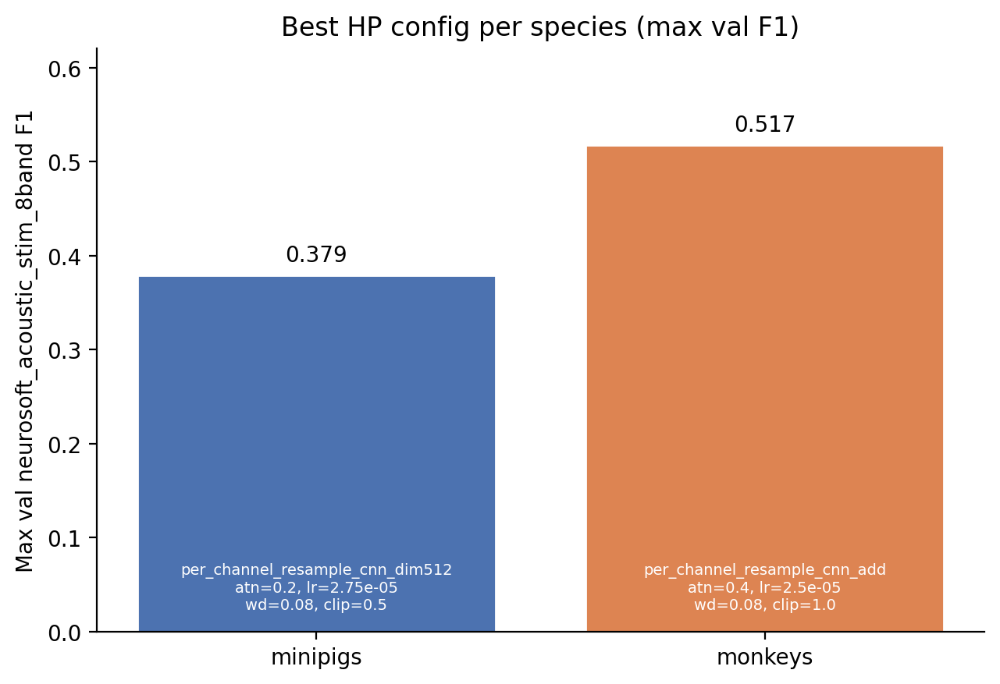
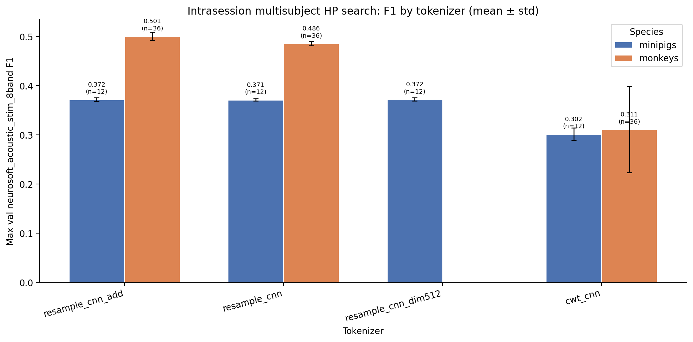

# Intrasession Multisubject HP Search (Minipigs vs Monkeys)

**Status:** Completed
**Date started:** 2026-08-12
**Parent experiment:** None (root)
**Follow-up experiments:** [Intrasession Optimal-HP Training Paradigm Baselines](20260727-LS-intrasession-opt-baselines.md), TBD (multispecies co-training / cross-species transfer)
**Tags:** sweep, minipigs, monkeys, neurosoft, 8band, hp_search, intrasession, multisubject, tokenizer, auditory_decoding

## Background

This is the first stage of an auditory decoding program that will later
include multispecies co-training. Before co-training, we need
species-specific baselines: a hyperparameter search for POYO-EEG on
8-band NeuroSoft acoustic-stimulus decoding when **multiple subjects are
pooled** and evaluation is **intrasession** (`intrasession-block`).

Paired WandB grid sweeps were run independently for minipigs and monkeys
under the same group so optima can be compared and carried into later
co-training work.

## Question

What hyperparameters maximize validation F1 for multisubject
intrasession 8-band auditory decoding, when searched independently for
minipigs and for monkeys?

## Hypothesis

None (exploratory hyperparameter search).

## Experiment

### Setup

- **Project:** `auditory_decoding`
- **Group:** `NEUROSOFT_INTRASESSION_MULTISUBJ`
- **Sweep IDs:** `9cr4zl3u` (minipigs), `meu5wgw5` (monkeys)
- **Species detection:** WandB run tags (`minipigs` / `monkeys`)
- **Model:** POYO-EEG (`poyo_eeg`)
- **Task / metric prefix:** `val/neurosoft_acoustic_stim_8band_*`
- **Split:** `intrasession-block` (fixed)
- **Fold:** `0` (fixed; not a scientific factor)
- **Finished runs:** 48 minipigs + 108 monkeys = 156

**Varied parameters:**

| Parameter | Minipigs | Monkeys |
|-----------|----------|---------|
| `model/tokenizer` | `per_channel_cwt_cnn`, `per_channel_resample_cnn`, `per_channel_resample_cnn_add`, `per_channel_resample_cnn_dim512` | `per_channel_cwt_cnn`, `per_channel_resample_cnn`, `per_channel_resample_cnn_add` |
| `model.atn_dropout` | 0.2, 0.4 | 0.2, 0.4 |
| `hyperparameters.learning_rate` | 2.5e-5, 2.75e-5, 3e-5 | 2.5e-5, 2.75e-5, 3e-5 |
| `hyperparameters.weight_decay` | 0.08, 0.1 | 0.08, 0.1, 0.3 |
| `trainer.gradient_clip_val` | 0.5 (fixed) | 0.5, 1.0 |

**Fixed context:** `batch_size=128`, no LR warmup/decay/hold (`0`),
`intrasession-block`.

Grid mismatch note: monkeys additionally sweep `gradient_clip_val` and
`weight_decay=0.3`; minipigs additionally include
`per_channel_resample_cnn_dim512`. Comparison focuses on overlapping
factors plus each species' best config.

### Launch command

```bash
# Minipigs
wandb agent <entity>/auditory_decoding/9cr4zl3u

# Monkeys
wandb agent <entity>/auditory_decoding/meu5wgw5
```

### Key config overrides

See sweep grids above; experiment base:
`configs/experiment/auditory_decoding/poyo_neurosoft_8band_intrasession_multisubj.yaml`
(species data config differs per sweep).

## Results

### Summary

Monkeys achieve substantially higher max val F1 than minipigs
(**0.517** vs **0.379**). Best hyperparameters are **not identical**
across species: minipigs prefer `resample_cnn_dim512` with
`atn_dropout=0.2`, while monkeys prefer `resample_cnn_add` with
`atn_dropout=0.4`. On the overlapping tokenizer set,
`resample_cnn_add` is best or near-best for both; `cwt_cnn` is clearly
worse. Weight decay and gradient clip have smaller effects within the
top monkey configs (all `resample_cnn_add` + `atn_dropout=0.4`).

### Metrics

#### Best configuration per species

| Species | Tokenizer | atn_dropout | lr | weight_decay | grad_clip | F1 | AUROC | Precision | Recall | Balanced acc | Run |
|---------|-----------|-------------|-----|--------------|-----------|------|-------|-----------|--------|--------------|-----|
| minipigs | per_channel_resample_cnn_dim512 | 0.2 | 2.75e-5 | 0.08 | 0.5 | 0.3785 | 0.7808 | 0.3852 | 0.3752 | 0.3752 | poyo_eeg_neurosoft_8band (`skj451el`) |
| monkeys | per_channel_resample_cnn_add | 0.4 | 2.5e-5 | 0.08 | 1.0 | 0.5172 | 0.8844 | 0.5204 | 0.5176 | 0.5176 | poyo_eeg_neurosoft_8band (`vrye18ce`) |

Metrics are **max** validation values. WandB summary only stored `max`
for F1/AUROC; precision/recall/balanced_acc maxima were taken from run
history.

#### F1 by species × tokenizer (mean ± std / max)

| Species | Tokenizer | n | Mean F1 | Std | Max F1 |
|---------|-----------|---|---------|-----|--------|
| minipigs | per_channel_resample_cnn_dim512 | 12 | 0.3723 | 0.0034 | 0.3785 |
| minipigs | per_channel_resample_cnn_add | 12 | 0.3719 | 0.0036 | 0.3779 |
| minipigs | per_channel_resample_cnn | 12 | 0.3712 | 0.0022 | 0.3754 |
| minipigs | per_channel_cwt_cnn | 12 | 0.3016 | 0.0130 | 0.3148 |
| monkeys | per_channel_resample_cnn_add | 36 | 0.5005 | 0.0083 | 0.5172 |
| monkeys | per_channel_resample_cnn | 36 | 0.4858 | 0.0043 | 0.4937 |
| monkeys | per_channel_cwt_cnn | 36 | 0.3111 | 0.0889 | 0.4148 |

#### Top-5 configurations per species

| Species | Tokenizer | atn_dropout | lr | weight_decay | grad_clip | F1 | AUROC | Run |
|---------|-----------|-------------|-----|--------------|-----------|------|-------|-----|
| minipigs | resample_cnn_dim512 | 0.2 | 2.75e-5 | 0.08 | 0.5 | 0.3785 | 0.7808 | `skj451el` |
| minipigs | resample_cnn_add | 0.2 | 2.75e-5 | 0.10 | 0.5 | 0.3779 | 0.7833 | `g3ju582a` |
| minipigs | resample_cnn_dim512 | 0.2 | 2.75e-5 | 0.10 | 0.5 | 0.3778 | 0.7811 | `wibu76bp` |
| minipigs | resample_cnn_add | 0.2 | 3e-5 | 0.08 | 0.5 | 0.3771 | 0.7862 | `2pnannb5` |
| minipigs | resample_cnn_add | 0.2 | 2.75e-5 | 0.08 | 0.5 | 0.3766 | 0.7830 | `aej9a8j9` |
| monkeys | resample_cnn_add | 0.4 | 2.5e-5 | 0.08 | 1.0 | 0.5172 | 0.8844 | `vrye18ce` |
| monkeys | resample_cnn_add | 0.4 | 2.5e-5 | 0.30 | 1.0 | 0.5164 | 0.8850 | `quq6x3po` |
| monkeys | resample_cnn_add | 0.4 | 2.5e-5 | 0.30 | 0.5 | 0.5137 | 0.8823 | `bequ84io` |
| monkeys | resample_cnn_add | 0.4 | 2.5e-5 | 0.08 | 0.5 | 0.5129 | 0.8841 | `2nh8hmzc` |
| monkeys | resample_cnn_add | 0.4 | 2.75e-5 | 0.30 | 0.5 | 0.5125 | 0.8840 | `3lwd82bd` |

### Analysis

```bash
uv run python analysis/20260717-LS-intrasession-multisubj-hp.py
```

### Figures





## Conclusions

Exploratory search found usable species-specific HP settings for
multisubject intrasession 8-band decoding. Absolute performance is higher
in monkeys than minipigs. Prefer resample CNN tokenizers over CWT; carry
the per-species best configs above into co-training follow-ups rather than
forcing a single shared HP set.

## Notes for future experiments

- Use these HPs as defaults for multispecies co-training follow-ups.
- Optionally re-check `per_channel_resample_cnn_dim512` on monkeys if that
  tokenizer is added to the monkey grid later.
