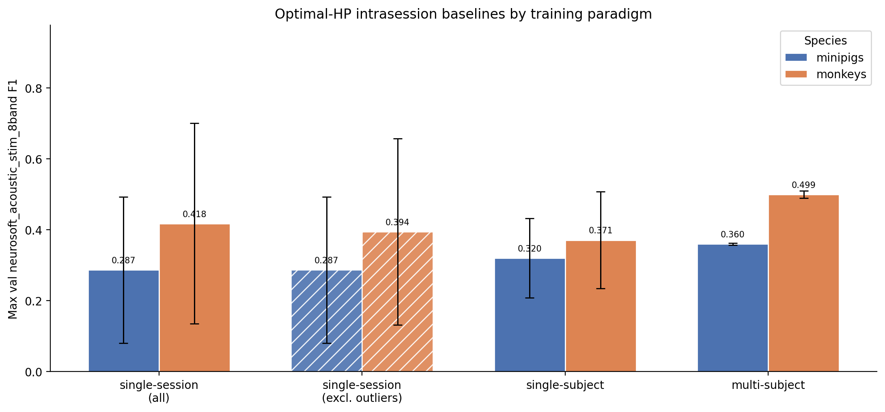
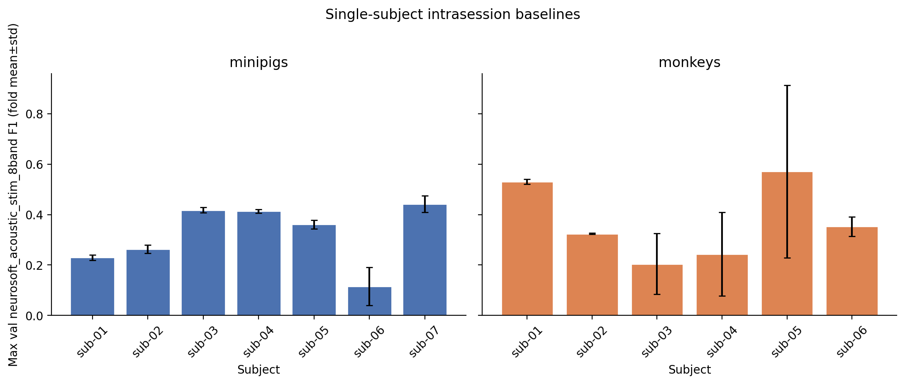

# Intrasession Optimal-HP Training Paradigm Baselines

**Status:** Completed
**Date started:** 2026-08-12
**Parent experiment:** [Intrasession Multisubject HP Search (Minipigs vs Monkeys)](20260717-LS-intrasession-multisubj-hp.md)
**Follow-up experiments:** [Class-Weight Smoothing (Intrasession Multisubject)](20260729-LS-class-weight-smoothing.md), [Post-CNN Sampling Rate (Intrasession Multisubject)](20260803-LS-sampling-rate.md), [Causal vs Block Split (Intrasession Multisubject)](20260805-LS-causal-split.md), [Model Capacity / Size Ablation (Intrasession Multisubject)](20260805-LS-model-capacity.md), TBD (multispecies co-training / cross-species transfer)
**Tags:** sweep, minipigs, monkeys, neurosoft, 8band, intrasession, singlesession, singlesubject, multisubject, baseline, auditory_decoding

## Background

The [parent HP search](20260717-LS-intrasession-multisubj-hp.md) identified
species-specific optimal hyperparameters for multisubject intrasession
8-band decoding. This follow-up freezes those HPs and measures a first
“optimal” baseline under three training paradigms:

1. **Single-session** — train/eval within one recording
2. **Single-subject** — pool sessions within one subject
3. **Multi-subject** — pool all subjects

Minipigs use `per_channel_resample_cnn` (equivalent to the parent’s
`per_channel_resample_cnn_dim512`; configs were identical aside from the
name). Monkeys keep `per_channel_resample_cnn_add`.

## Question

With each species’ optimal hyperparameters held fixed, how does max val
F1 for intrasession 8-band auditory decoding compare across
single-session, single-subject, and multi-subject training — and does
the ranking transfer between minipigs and monkeys?

## Hypothesis

Pooling more training data improves mean max val F1 (single-session <
single-subject < multi-subject) for both species; absolute F1 remains
higher in monkeys than minipigs at every paradigm.

## Experiment

### Setup

- **Project:** `auditory_decoding`
- **Species detection:** WandB run tags (`minipigs` / `monkeys`)
- **Task / metric prefix:** `val/neurosoft_acoustic_stim_8band_*`
- **Split:** `intrasession-block` (fixed)
- **Folds:** 0, 1, 2 (report mean±std; not a scientific factor)
- **Finished runs:** 249

| Paradigm | Minipigs sweep | Monkeys sweep | Group | Finished |
|----------|----------------|---------------|-------|----------|
| single-session | `hiyb4224` | `h5gf9jn1` | `NEUROSOFT_INTRASESSION_SINGLESESS` | 123 / 81 |
| single-subject | `4k9zt970` | `aycfxm9b` | `NEUROSOFT_INTRASESSION_SINGLESUBJ` | 21 / 18 |
| multi-subject | `47jd29ds` | `bvcgw95o` | `NEUROSOFT_INTRASESSION_MULTISUBJ` | 3 / 3 |

**Fixed HPs (from parent optima):**

| Species | Tokenizer | atn_dropout | lr | weight_decay | grad_clip |
|---------|-----------|-------------|-----|--------------|-----------|
| minipigs | `per_channel_resample_cnn` | 0.2 | 2.75e-5 | 0.08 | 0.5 |
| monkeys | `per_channel_resample_cnn_add` | 0.4 | 2.5e-5 | 0.08 | 1.0 |

**Varied (scientific):** training paradigm (and session/subject identity
within single-session / single-subject grids).

### Launch command

```bash
# Minipigs: singlesess / singlesub / multisub
wandb agent <entity>/auditory_decoding/hiyb4224
wandb agent <entity>/auditory_decoding/4k9zt970
wandb agent <entity>/auditory_decoding/47jd29ds

# Monkeys: singlesess / singlesub / multisub
wandb agent <entity>/auditory_decoding/h5gf9jn1
wandb agent <entity>/auditory_decoding/aycfxm9b
wandb agent <entity>/auditory_decoding/bvcgw95o
```

### Key config overrides

Species-optimal HPs above; paradigm-specific experiment YAMLs under
`configs/experiment/auditory_decoding/poyo_neurosoft_8band_intrasession_{singlesess,singlesubj,multisubj}.yaml`.

## Results

### Summary

**Multi-subject is best for both species** (minipigs F1 0.360±0.003;
monkeys 0.499±0.010). Minipigs follow the hypothesized ordering
(single-session < single-subject < multi-subject).

For monkeys, raw single-session mean F1 (0.418±0.283) exceeds
single-subject (0.371±0.136), inflated by pathological sessions. After
excluding outliers (fold-mean F1 ≥ 0.99 or missing metrics — 2 monkey
sessions; none for minipigs), single-session F1 falls to **0.394±0.263**,
still slightly above single-subject on F1, while AUROC continues to rise
with pooling (0.50 → 0.59 → 0.88). Absolute multi-subject performance
remains higher for monkeys than minipigs.

### Metrics

#### Paradigm summary

Aggregation: single-session/subject = mean±std **across units** of
fold-mean metrics; multi-subject = mean±std **across folds**.
Single-session is reported **both** with all sessions and after outlier
exclusion (missing F1 or fold-mean F1 ≥ 0.99).

| Species | Paradigm | n_units | F1 | AUROC | Precision | Recall | Balanced acc |
|---------|----------|---------|-----|-------|-----------|--------|--------------|
| minipigs | single-session (all) | 41 | 0.2866±0.2061 | 0.6061±0.1369 | 0.3280±0.2226 | 0.3292±0.1833 | 0.3292±0.1833 |
| minipigs | single-session (excl. outliers) | 41 | 0.2866±0.2061 | 0.6061±0.1369 | 0.3280±0.2226 | 0.3292±0.1833 | 0.3292±0.1833 |
| minipigs | single-subject | 7 | 0.3203±0.1124 | 0.7054±0.0908 | 0.3752±0.1154 | 0.3274±0.1033 | 0.3274±0.1033 |
| minipigs | multi-subject | 1 | 0.3597±0.0028 | 0.7756±0.0048 | 0.3792±0.0025 | 0.3595±0.0041 | 0.3595±0.0041 |
| monkeys | single-session (all) | 27 | 0.4177±0.2830 | 0.4828±0.2723 | 0.4657±0.2855 | 0.4601±0.2556 | 0.4601±0.2556 |
| monkeys | single-session (excl. outliers) | 25 | 0.3944±0.2630 | 0.5021±0.2597 | 0.4443±0.2700 | 0.4385±0.2362 | 0.4385±0.2362 |
| monkeys | single-subject | 6 | 0.3710±0.1364 | 0.5878±0.2215 | 0.4465±0.1396 | 0.4105±0.1189 | 0.4105±0.1189 |
| monkeys | multi-subject | 1 | 0.4993±0.0102 | 0.8806±0.0023 | 0.4978±0.0096 | 0.5095±0.0105 | 0.5095±0.0105 |

#### Excluded single-session outliers

| Species | Session | F1 | AUROC | n_folds | Reason |
|---------|---------|-----|-------|---------|--------|
| monkeys | `sub-02_ses-04_task-AcousStim_acq-RH_desc-raw` | 1.0000 | 0.0000 | 3 | f1≥0.99 |
| monkeys | `sub-02_ses-05_task-AcousStim_acq-RH_desc-raw` | — | — | 0 | missing_f1 |

Minipigs: no single-session outliers under this rule.

#### Multi-subject fold-wise

| Species | Fold | F1 | AUROC | Precision | Recall | Balanced acc | Run |
|---------|------|------|-------|-----------|--------|--------------|-----|
| minipigs | 0 | 0.3627 | 0.7825 | 0.3791 | 0.3648 | 0.3648 | `skkz2nec` |
| minipigs | 1 | 0.3560 | 0.7723 | 0.3822 | 0.3548 | 0.3548 | `lalohvan` |
| minipigs | 2 | 0.3604 | 0.7721 | 0.3761 | 0.3588 | 0.3588 | `wczgrx86` |
| monkeys | 0 | 0.4964 | 0.8800 | 0.4967 | 0.5060 | 0.5060 | `ljqfklu4` |
| monkeys | 1 | 0.4887 | 0.8782 | 0.4866 | 0.4989 | 0.4989 | `tnspfvt2` |
| monkeys | 2 | 0.5130 | 0.8836 | 0.5100 | 0.5237 | 0.5237 | `tpln4yqa` |

#### Single-subject fold-means (by subject)

| Species | Subject | F1 (fold mean±std) | n_folds |
|---------|---------|--------------------|---------|
| minipigs | sub-07 | 0.4424±0.0328 | 3 |
| minipigs | sub-03 | 0.4180±0.0111 | 3 |
| minipigs | sub-04 | 0.4133±0.0073 | 3 |
| minipigs | sub-05 | 0.3607±0.0165 | 3 |
| minipigs | sub-02 | 0.2628±0.0160 | 3 |
| minipigs | sub-01 | 0.2301±0.0106 | 3 |
| minipigs | sub-06 | 0.1149±0.0753 | 3 |
| monkeys | sub-05 | 0.5709±0.3421 | 3 |
| monkeys | sub-01 | 0.5298±0.0100 | 3 |
| monkeys | sub-06 | 0.3528±0.0381 | 3 |
| monkeys | sub-02 | 0.3243±0.0022 | 3 |
| monkeys | sub-04 | 0.2432±0.1652 | 3 |
| monkeys | sub-03 | 0.2047±0.1205 | 3 |

### Analysis

```bash
uv run python analysis/20260727-LS-intrasession-opt-baselines.py
# optional: reuse cached run CSV
uv run python analysis/20260727-LS-intrasession-opt-baselines.py --cached
```

### Figures





## Conclusions

Freezing species-optimal HPs, multi-subject training is the strongest
intrasession baseline for both species (minipigs 0.360±0.003 F1; monkeys
0.499±0.010). The “more data is better” ranking holds cleanly for minipigs.
For monkeys, raw single-session mean F1 is inflated by pathological
sessions (notably F1=1.0 with AUROC=0); after excluding those outliers,
single-session F1 drops (0.418 → 0.394) but remains slightly above
single-subject on F1, while AUROC still favors pooling
(0.50 → 0.59 → 0.88). Use multi-subject optima as the reference baseline
for co-training, and prefer outlier-aware single-session summaries when
comparing paradigms.

## Notes for future experiments

- Treat multi-subject as the primary baseline for multispecies co-training.
- When citing single-session numbers, report both all-session and
  outlier-excluded summaries (missing F1 or fold-mean F1 ≥ 0.99).
- Subject-level heterogeneity is large enough that co-training should track
  per-subject outcomes.
- Investigate / QC sessions like monkey `sub-02_ses-04` (perfect F1, zero
  AUROC) and `sub-02_ses-05` (missing metrics) before trusting session-level
  means.
