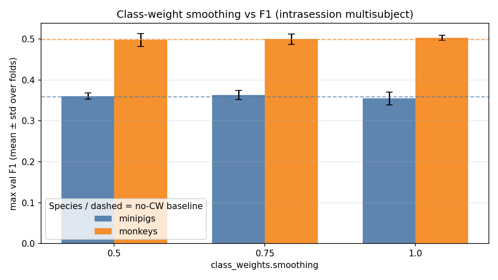
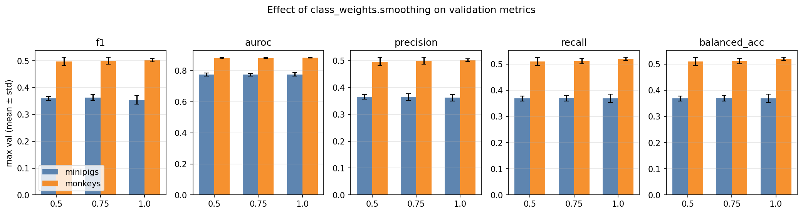

# Class-Weight Smoothing (Intrasession Multisubject)

**Status:** Completed
**Date started:** 2026-07-29
**Parent experiment:** [Intrasession Optimal-HP Training Paradigm Baselines](20260727-LS-intrasession-opt-baselines.md) ([HP search](20260717-LS-intrasession-multisubj-hp.md))
**Follow-up experiments:** [Post-CNN Sampling Rate (Intrasession Multisubject)](20260803-LS-sampling-rate.md), [Pure-Frequency Labels vs Multi-Frequency Bands](20260805-LS-pure-frequency-labels.md), [Model Capacity / Size Ablation (Intrasession Multisubject)](20260805-LS-model-capacity.md)
**Tags:** sweep, minipigs, monkeys, neurosoft, 8band, intrasession, multisubject, class_weights, smoothing, auditory_decoding

## Background

Species-specific optimal hyperparameters from the [multisubject HP
search](20260717-LS-intrasession-multisubj-hp.md) were frozen and used as
baselines for [training-paradigm comparisons](20260727-LS-intrasession-opt-baselines.md).
This follow-up keeps those optima fixed under **multisubject +
intrasession-block** evaluation and varies inverse-frequency class-weight
smoothing (`class_weights.mode=auto`) to probe sensitivity to class
imbalance in 8-band acoustic-stimulus decoding.

Smoothing enters the weight formula as
`(N / (C · n_c))^smoothing`: `0.5` / `0.75` partially reweight; `1.0` is
full inverse-frequency weighting.

## Question

With species-optimal hyperparameters fixed for multisubject intrasession
8-band decoding, how does varying `class_weights.smoothing` (0.5 / 0.75 /
1.0) under `mode=auto` affect max val F1, AUROC, precision, and recall
(and how do those compare to the no-CW optimal-HP baseline)?

## Hypothesis

Applying inverse-frequency class weights will improve performance (as measured by max val F1, AUROC, precision, and recall) compared to training without class weighting. However, the extent of any improvement and the optimal value of class-weight smoothing (0.5, 0.75, or 1.0) remains to be determined and will be empirically explored.

## Experiment

### Setup

- **Project:** `auditory_decoding`
- **Group:** `NEUROSOFT_INTRASESSION_MULTISUBJ`
- **Sweep IDs:** `w74jfier` (minipigs), `nxx4a4pn` (monkeys)
- **Baseline sweeps (no CW):** `47jd29ds` (minipigs), `bvcgw95o` (monkeys)
- **Species detection:** WandB run tags (`minipigs` / `monkeys`); also
  dataset class path
- **Task / metric prefix:** `val/neurosoft_acoustic_stim_8band_*`
  (report **max** summary / history values)
- **Split:** `intrasession-block` (fixed)
- **Folds:** 0, 1, 2 (report mean±std; not a scientific factor)
- **Finished runs:** 9 + 9 CW; 3 + 3 no-CW baselines

**Varied (scientific):** `class_weights.smoothing` ∈ {0.5, 0.75, 1.0}
with `class_weights.mode=auto` (set in the cluster experiment YAML).

**Fixed HPs (from parent optima):**

| Species | Tokenizer | atn_dropout | lr | weight_decay | grad_clip |
|---------|-----------|-------------|-----|--------------|-----------|
| minipigs | `per_channel_resample_cnn` | 0.2 | 2.75e-5 | 0.08 | 0.5 |
| monkeys | `per_channel_resample_cnn_add` | 0.4 | 2.5e-5 | 0.08 | 1.0 |

### Launch command

```bash
# Minipigs
wandb agent <entity>/auditory_decoding/w74jfier

# Monkeys
wandb agent <entity>/auditory_decoding/nxx4a4pn
```

### Key config overrides

Species-optimal HPs above; `class_weights.mode=auto` and sweep over
`class_weights.smoothing`. Base experiment on cluster:
`auditory_decoding/minipigs_multisubj` /
`auditory_decoding/monkeys_multisubj`.

## Results

### Summary

Monkeys remain well above minipigs on every metric (~0.50 vs ~0.36 mean
F1). Within each species, smoothing effects are small relative to fold
variance and close to the no-CW baseline. **Peak single-run F1 and
fold-averaged F1 do not always pick the same smoothing** (notably in
monkeys: max at 0.5, mean best at 1.0).

### Metrics

#### Best configuration per species (max single-run val F1)

| Species | smoothing | fold | F1 | AUROC | Precision | Recall | Balanced acc | Run |
|---------|-----------|------|----|-------|-----------|--------|--------------|-----|
| minipigs | 0.75 | 0 | 0.3765 | 0.7849 | 0.3780 | 0.3829 | 0.3829 | poyo_eeg_neurosoft_8band (`wj09rzw3`) |
| monkeys | 0.50 | 2 | 0.5143 | 0.8863 | 0.5120 | 0.5272 | 0.5272 | poyo_eeg_neurosoft_8band (`px7ssgp0`) |

#### Best smoothing by fold-mean val F1

| Species | Best mean smoothing | F1 (mean±std) | AUROC | Precision | Recall | Balanced acc |
|---------|---------------------|---------------|-------|-----------|--------|--------------|
| minipigs | **0.75** | 0.3633±0.0116 | 0.7754±0.0085 | 0.3646±0.0120 | 0.3701±0.0111 | 0.3701±0.0111 |
| monkeys | **1.0** | 0.5029±0.0062 | 0.8838±0.0026 | 0.5013±0.0050 | 0.5200±0.0059 | 0.5200±0.0059 |

#### Fold mean ± std (incl. no-CW baseline)

| Species | smoothing | n | F1 | AUROC | Precision | Recall | Balanced acc |
|---------|-----------|---|----|-------|-----------|--------|--------------|
| minipigs | none (baseline) | 3 | 0.3597±0.0034 | 0.7756±0.0059 | 0.3792±0.0030 | 0.3595±0.0051 | 0.3595±0.0051 |
| minipigs | 0.5 | 3 | 0.3607±0.0072 | 0.7759±0.0095 | 0.3652±0.0085 | 0.3686±0.0091 | 0.3686±0.0091 |
| minipigs | 0.75 | 3 | 0.3633±0.0116 | 0.7754±0.0085 | 0.3646±0.0120 | 0.3701±0.0111 | 0.3701±0.0111 |
| minipigs | 1.0 | 3 | 0.3547±0.0155 | 0.7762±0.0107 | 0.3622±0.0120 | 0.3687±0.0162 | 0.3687±0.0162 |
| monkeys | none (baseline) | 3 | 0.4993±0.0124 | 0.8806±0.0028 | 0.4978±0.0117 | 0.5095±0.0128 | 0.5095±0.0128 |
| monkeys | 0.5 | 3 | 0.4976±0.0154 | 0.8810±0.0047 | 0.4957±0.0150 | 0.5096±0.0158 | 0.5096±0.0158 |
| monkeys | 0.75 | 3 | 0.4998±0.0129 | 0.8819±0.0025 | 0.4995±0.0125 | 0.5116±0.0104 | 0.5116±0.0104 |
| monkeys | 1.0 | 3 | 0.5029±0.0062 | 0.8838±0.0026 | 0.5013±0.0050 | 0.5200±0.0059 | 0.5200±0.0059 |

#### Full grid (CW runs)

| Species | smoothing | fold | F1 | AUROC | Precision | Recall | Balanced acc | Run |
|---------|-----------|------|----|-------|-----------|--------|--------------|-----|
| minipigs | 0.50 | 0 | 0.3690 | 0.7868 | 0.3749 | 0.3791 | 0.3791 | `t4pf8pyr` |
| minipigs | 0.50 | 1 | 0.3557 | 0.7707 | 0.3590 | 0.3632 | 0.3632 | `4st4nl9g` |
| minipigs | 0.50 | 2 | 0.3574 | 0.7701 | 0.3617 | 0.3633 | 0.3633 | `43nvupdm` |
| minipigs | 0.75 | 0 | 0.3765 | 0.7849 | 0.3780 | 0.3829 | 0.3829 | `wj09rzw3` |
| minipigs | 0.75 | 1 | 0.3548 | 0.7727 | 0.3550 | 0.3627 | 0.3627 | `srby6m1h` |
| minipigs | 0.75 | 2 | 0.3585 | 0.7685 | 0.3607 | 0.3647 | 0.3647 | `4xee5g6m` |
| minipigs | 1.00 | 0 | 0.3725 | 0.7885 | 0.3734 | 0.3874 | 0.3874 | `vxtomyo3` |
| minipigs | 1.00 | 1 | 0.3442 | 0.7709 | 0.3494 | 0.3586 | 0.3586 | `qkuu79uh` |
| minipigs | 1.00 | 2 | 0.3474 | 0.7691 | 0.3637 | 0.3600 | 0.3600 | `u3l01kya` |
| monkeys | 0.50 | 0 | 0.4943 | 0.8794 | 0.4926 | 0.5050 | 0.5050 | `bxy6sm7l` |
| monkeys | 0.50 | 1 | 0.4842 | 0.8773 | 0.4824 | 0.4967 | 0.4967 | `l8dk1lip` |
| monkeys | 0.50 | 2 | 0.5143 | 0.8863 | 0.5120 | 0.5272 | 0.5272 | `px7ssgp0` |
| monkeys | 0.75 | 0 | 0.4970 | 0.8809 | 0.4973 | 0.5102 | 0.5102 | `nplojx6d` |
| monkeys | 0.75 | 1 | 0.4886 | 0.8801 | 0.4883 | 0.5021 | 0.5021 | `m0h2hnhv` |
| monkeys | 0.75 | 2 | 0.5139 | 0.8847 | 0.5129 | 0.5227 | 0.5227 | `5r6ho2rd` |
| monkeys | 1.00 | 0 | 0.5041 | 0.8847 | 0.5019 | 0.5190 | 0.5190 | `vv4a5uv7` |
| monkeys | 1.00 | 1 | 0.4962 | 0.8809 | 0.4960 | 0.5146 | 0.5146 | `sm9y8hg1` |
| monkeys | 1.00 | 2 | 0.5085 | 0.8857 | 0.5060 | 0.5263 | 0.5263 | `5up66nyf` |

### Analysis

```bash
uv run python analysis/20260729-LS-class-weight-smoothing.py
```

### Figures





## Conclusions

Exploratory: class-weight smoothing has only a **small** effect on
multisubject intrasession metrics relative to fold noise and the no-CW
baseline. Report both peak and average optima:

- **Minipigs — max F1:** `smoothing=0.75`, fold 0 → F1 **0.3765**
  (`wj09rzw3`). **Best on average:** also `smoothing=0.75`
  (0.3633±0.0116), slightly above baseline (0.3597±0.0034); `1.0` is
  worst on mean F1 (0.3547±0.0155).
- **Monkeys — max F1:** `smoothing=0.5`, fold 2 → F1 **0.5143**
  (`px7ssgp0`). **Best on average:** `smoothing=1.0`
  (0.5029±0.0062), ahead of 0.75 (0.4998±0.0129), 0.5 (0.4976±0.0154),
  and baseline (0.4993±0.0124); full inverse-frequency weighting also
  yields the highest mean recall (0.5200±0.0059).

AUROC is essentially flat across smoothing for both species. Prefer
**fold-mean** when choosing a default smoothing for later work; treat
single-run maxima as noisy.

## Notes for future experiments

- Test whether the same smoothing preference **transfers across
  species** (or whether a shared default is viable for co-training).
- Optionally add `smoothing=0` (uniform weights with `mode=auto`) or an
  explicit `mode=none` cell inside the same sweep for a cleaner ablation.
- If adopting CW for monkeys, default to `smoothing=1.0` on mean-F1
  grounds; for minipigs, `0.75` is the mean and peak pick in this grid.
