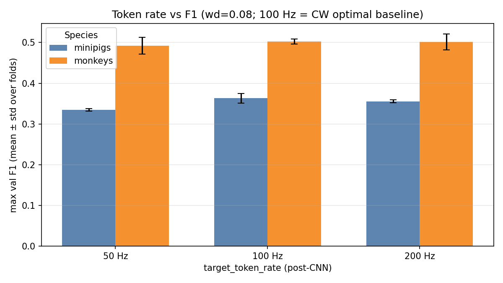
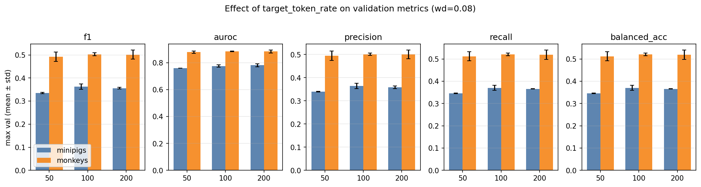

# Post-CNN Sampling Rate (Intrasession Multisubject)

**Status:** Completed
**Date started:** 2026-08-03
**Parent experiment:** [Class-Weight Smoothing (Intrasession Multisubject)](20260729-LS-class-weight-smoothing.md) ([optimal-HP baselines](20260727-LS-intrasession-opt-baselines.md))
**Follow-up experiments:** TBD
**Tags:** sweep, minipigs, monkeys, neurosoft, 8band, intrasession, multisubject, sampling_rate, target_token_rate, auditory_decoding

## Background

After freezing species-optimal hyperparameters and selecting class-weight
smoothing ([CW report](20260729-LS-class-weight-smoothing.md): minipigs
`0.75`, monkeys `1.0`), this follow-up varies the ResampleCNN
**post-CNN token rate**
(`model.tokenizer.temporal_embedding.target_token_rate`) under
multisubject + `intrasession-block` evaluation.

Tokenizer defaults use **100 Hz**. This sweep tests **50 Hz** and
**200 Hz** against that 100 Hz CW baseline (same HPs / smoothing /
`weight_decay=0.08`).

## Question

With species-optimal hyperparameters fixed for multisubject intrasession
8-band decoding, how does post-CNN `target_token_rate` (50 vs 200 Hz, vs
the 100 Hz optimal baseline) affect max val F1, AUROC, precision, and
recall?

## Hypothesis

Higher token rate retains more temporal information and improves
validation metrics; lower rate (50 Hz) degrades them relative to the
100 Hz baseline (for both species).

## Experiment

### Setup

- **Project:** `auditory_decoding`
- **Group:** `NEUROSOFT_INTRASESSION_MULTISUBJ`
- **Sweep IDs:** `04jorgw5` (minipigs), `eh63y1v7` (monkeys)
- **100 Hz CW baselines:** `w74jfier` (minipigs, smoothing=0.75),
  `nxx4a4pn` (monkeys, smoothing=1.0)
- **Species detection:** WandB run tags (`minipigs` / `monkeys`)
- **Task / metric prefix:** `val/neurosoft_acoustic_stim_8band_*`
  (report **max** summary / history values)
- **Split:** `intrasession-block` (fixed)
- **Folds:** 0, 1, 2 (mean±std; not a scientific factor)
- **Primary analysis:** `weight_decay=0.08` only (species optima)

**Varied (scientific):** `target_token_rate` ∈ {50, 200}
(baseline = 100 from CW sweeps).

**Also in grid (secondary):** `weight_decay` ∈ {0.08, 0.10} (minipigs)
or {0.08, 0.30} (monkeys) — not used for primary claims.

**Fixed:** species-optimal tokenizer / dropout / lr / grad clip;
`class_weights.mode=auto` with species-optimal smoothing.

**Coverage note:** minipigs crashed fold 1 at `wd=0.08` for both 50 and
200 Hz (`oa7vr5mf`, `le2od1o9`), so those rates use folds **0,2** only;
100 Hz baseline still has folds 0–2.

### Launch command

```bash
# Minipigs
wandb agent <entity>/auditory_decoding/04jorgw5

# Monkeys
wandb agent <entity>/auditory_decoding/eh63y1v7
```

### Key config overrides

Species optima + CW smoothing; sweep
`model.tokenizer.temporal_embedding.target_token_rate` ∈ {50, 200}.

## Results

### Summary

**50 Hz hurts** both species relative to 100 Hz. **200 Hz does not beat
100 Hz on fold-mean F1** for either species (monkeys: 200 ≈ 100; minipigs:
200 still below 100, including on fold-matched 0+2). Among the swept
rates alone, **200 Hz wins max single-run F1** for both species. Hypothesis
is **partially supported**: lower rate degrades; higher rate does not
clearly improve over the 100 Hz baseline.

### Metrics

#### Best configuration per species (max single-run val F1 among 50/200)

| Species | rate (Hz) | fold | F1 | AUROC | Precision | Recall | Balanced acc | Run |
|---------|-----------|------|----|-------|-----------|--------|--------------|-----|
| minipigs | 200 | 0 | 0.3587 | 0.7892 | 0.3623 | 0.3666 | 0.3666 | poyo_eeg_neurosoft_8band (`b1z8irey`) |
| monkeys | 200 | 2 | 0.5162 | 0.8918 | 0.5164 | 0.5357 | 0.5357 | poyo_eeg_neurosoft_8band (`d29xvtky`) |

#### Best rate by fold-mean val F1 (incl. 100 Hz baseline)

| Species | Best mean rate | F1 (mean±std) | n folds | AUROC | Precision | Recall | Balanced acc |
|---------|----------------|---------------|---------|-------|-----------|--------|--------------|
| minipigs | **100** | 0.3633±0.0116 | 3 | 0.7754±0.0085 | 0.3646±0.0120 | 0.3701±0.0111 | 0.3701±0.0111 |
| monkeys | **100** | 0.5029±0.0062 | 3 | 0.8838±0.0026 | 0.5013±0.0050 | 0.5200±0.0059 | 0.5200±0.0059 |

#### Fold mean ± std (`wd=0.08`)

| Species | rate (Hz) | n | folds | F1 | AUROC | Precision | Recall | Balanced acc |
|---------|-----------|---|-------|----|-------|-----------|--------|--------------|
| minipigs | 50 | 2 | 0,2 | 0.3349±0.0028 | 0.7598±0.0008 | 0.3396±0.0014 | 0.3455±0.0012 | 0.3455±0.0012 |
| minipigs | 100 | 3 | 0,1,2 | 0.3633±0.0116 | 0.7754±0.0085 | 0.3646±0.0120 | 0.3701±0.0111 | 0.3701±0.0111 |
| minipigs | 200 | 2 | 0,2 | 0.3558±0.0040 | 0.7808±0.0118 | 0.3583±0.0057 | 0.3657±0.0012 | 0.3657±0.0012 |
| monkeys | 50 | 3 | 0,1,2 | 0.4925±0.0206 | 0.8785±0.0089 | 0.4950±0.0207 | 0.5122±0.0198 | 0.5122±0.0198 |
| monkeys | 100 | 3 | 0,1,2 | 0.5029±0.0062 | 0.8838±0.0026 | 0.5013±0.0050 | 0.5200±0.0059 | 0.5200±0.0059 |
| monkeys | 200 | 3 | 0,1,2 | 0.5011±0.0197 | 0.8831±0.0103 | 0.5002±0.0189 | 0.5191±0.0206 | 0.5191±0.0206 |

Fold-matched check (minipigs folds 0+2 only): 100 Hz mean F1 ≈ **0.3675**
still above 200 Hz (0.3558) and 50 Hz (0.3349).

#### Full primary grid (`wd=0.08`)

| Species | rate | fold | source | F1 | AUROC | Precision | Recall | Balanced acc | Run |
|---------|------|------|--------|----|-------|-----------|--------|--------------|-----|
| minipigs | 50 | 0 | sampling_rate | 0.3329 | 0.7592 | 0.3386 | 0.3464 | 0.3464 | `2tbx6b2k` |
| minipigs | 50 | 2 | sampling_rate | 0.3368 | 0.7604 | 0.3406 | 0.3447 | 0.3447 | `xxptsf3n` |
| minipigs | 100 | 0 | baseline_100hz | 0.3765 | 0.7849 | 0.3780 | 0.3829 | 0.3829 | `wj09rzw3` |
| minipigs | 100 | 1 | baseline_100hz | 0.3548 | 0.7727 | 0.3550 | 0.3627 | 0.3627 | `srby6m1h` |
| minipigs | 100 | 2 | baseline_100hz | 0.3585 | 0.7685 | 0.3607 | 0.3647 | 0.3647 | `4xee5g6m` |
| minipigs | 200 | 0 | sampling_rate | 0.3587 | 0.7892 | 0.3623 | 0.3666 | 0.3666 | `b1z8irey` |
| minipigs | 200 | 2 | sampling_rate | 0.3530 | 0.7725 | 0.3542 | 0.3649 | 0.3649 | `2d8cd3iz` |
| monkeys | 50 | 0 | sampling_rate | 0.4862 | 0.8725 | 0.4828 | 0.5030 | 0.5030 | `j6zq7gyu` |
| monkeys | 50 | 1 | sampling_rate | 0.4757 | 0.8742 | 0.4832 | 0.4987 | 0.4987 | `hghwy7ii` |
| monkeys | 50 | 2 | sampling_rate | 0.5155 | 0.8887 | 0.5188 | 0.5350 | 0.5350 | `x3nc079n` |
| monkeys | 100 | 0 | baseline_100hz | 0.5041 | 0.8847 | 0.5019 | 0.5190 | 0.5190 | `vv4a5uv7` |
| monkeys | 100 | 1 | baseline_100hz | 0.4962 | 0.8809 | 0.4960 | 0.5146 | 0.5146 | `sm9y8hg1` |
| monkeys | 100 | 2 | baseline_100hz | 0.5085 | 0.8857 | 0.5060 | 0.5263 | 0.5263 | `5up66nyf` |
| monkeys | 200 | 0 | sampling_rate | 0.5082 | 0.8857 | 0.5048 | 0.5256 | 0.5256 | `afpfb432` |
| monkeys | 200 | 1 | sampling_rate | 0.4789 | 0.8718 | 0.4795 | 0.4961 | 0.4961 | `nz81n9j0` |
| monkeys | 200 | 2 | sampling_rate | 0.5162 | 0.8918 | 0.5164 | 0.5357 | 0.5357 | `d29xvtky` |

### Analysis

```bash
uv run python analysis/20260803-LS-sampling-rate.py
```

### Figures





## Conclusions

Hypothesis **partially supported**.

- **Lower rate (50 Hz):** clear drop vs 100 Hz for both species (minipigs
  mean F1 0.335 vs 0.363; monkeys 0.492 vs 0.503).
- **Higher rate (200 Hz):** does **not** improve fold-mean F1 over 100 Hz
  (minipigs 0.356 < 0.363; monkeys 0.501 ≈ 0.503). On fold-matched
  minipigs folds 0+2, 100 Hz remains ahead (~0.368 vs 0.356).
- **Max vs mean:** among swept rates, max single-run F1 is at **200 Hz**
  for both species (`b1z8irey`, `d29xvtky`); on average the **100 Hz**
  CW baseline remains best. Prefer **100 Hz** as the default going
  forward.

## Notes for future experiments

- Re-run crashed minipigs fold-1 cells at `wd=0.08` for a complete
  3-fold comparison at 50/200 Hz.
- Test whether rate preference **transfers across species** (or a shared
  default for co-training).
- Optional: denser grid around 100 Hz (e.g. 75 / 125) if further tuning
  is warranted; secondary `weight_decay` cells did not change the
  50 < 200 ordering.
