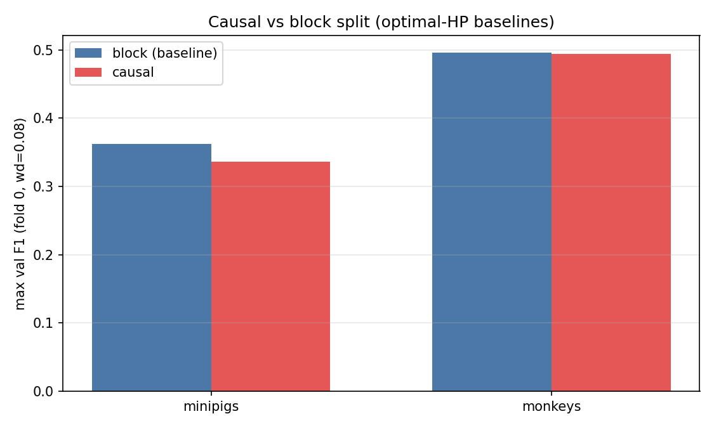
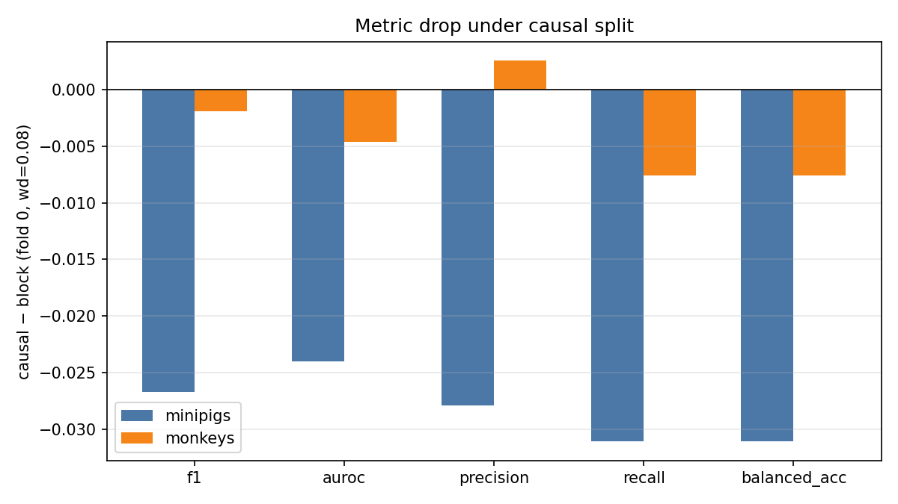

# Causal vs Block Split (Intrasession Multisubject)

**Status:** Completed
**Date started:** 2026-08-05
**Parent experiment:** [Intrasession Optimal-HP Training Paradigm Baselines](20260727-LS-intrasession-opt-baselines.md)
**Follow-up experiments:** TBD
**Tags:** sweep, minipigs, monkeys, neurosoft, 8band, intrasession, multisubject, causal, split_type, auditory_decoding

## Background

The [optimal-HP baselines](20260727-LS-intrasession-opt-baselines.md) use
`intrasession-block` splits under multisubject training. This follow-up
keeps the same species-optimal hyperparameters and asks how much harder
an **`intrasession-causal`** split is, quantifying the performance drop
relative to those block baselines.

## Question

With species-optimal hyperparameters fixed for multisubject intrasession
8-band decoding, how much does switching from `intrasession-block` to
`intrasession-causal` decrease max val F1, AUROC, precision, and recall?

## Hypothesis

Causal splits are a harder decoding setting, so validation metrics
decrease relative to the block-split baseline; the goal is to quantify
that drop.

## Experiment

### Setup

- **Project:** `auditory_decoding`
- **Group:** `NEUROSOFT_INTRASESSION_MULTISUBJ`
- **Causal sweep IDs:** `5t68w2o3` (minipigs), `83o9h925` (monkeys)
- **Block baseline sweeps:** `47jd29ds` (minipigs), `bvcgw95o` (monkeys)
- **Species detection:** WandB run tags (`minipigs` / `monkeys`)
- **Task / metric prefix:** `val/neurosoft_acoustic_stim_8band_*`
  (report **max** summary / history values)
- **Primary analysis:** `weight_decay=0.08`; **fold-0 matched** causal vs
  block
- **Finished causal runs:** 2 per species (wd variants); primary uses
  wd=0.08 only

**Varied (scientific):** `data.split_type` —
`intrasession-causal` vs `intrasession-block` baseline.

**Also in causal grid (secondary):** `weight_decay` ∈ {0.08, 0.10}
(minipigs) or {0.08, 0.30} (monkeys).

**Fixed:** species-optimal tokenizer / dropout / lr / grad clip /
`batch_size=128`.

**Note:** causal runs used `class_weights.mode=auto` (set in the cluster
experiment YAML) with default `class_weights.smoothing=0.5` (not
overridden in the sweep). The block baselines above were not part of the
class-weight follow-ups; this is recorded for provenance, not as a
matched CW ablation.

**Limitation:** causal sweeps did **not** grid folds (fold 0 only).
Block baselines have folds 0–2; primary deltas use fold 0 only. Block
3-fold means are reported as context, not for the causal−block delta.

### Launch command

```bash
# Minipigs
wandb agent <entity>/auditory_decoding/5t68w2o3

# Monkeys
wandb agent <entity>/auditory_decoding/83o9h925
```

### Key config overrides

Species-optimal HPs; `data.split_type=intrasession-causal`;
`class_weights.mode=auto` with `smoothing=0.5` (default).

## Results

### Summary

Hypothesis is **supported for minipigs** and **weakly / not clearly for
monkeys** on fold-0 matched F1: minipigs drop **−0.027 (−7.4%)**; monkeys
only **−0.002 (−0.4%)**, within typical fold noise of the block baseline
(std ≈ 0.012). Causal remains much easier to read in monkeys than
minipigs in absolute terms (~0.49 vs ~0.34 F1).

### Metrics

#### Fold-0 matched comparison (`wd=0.08`)

| Species | Block F1 | Causal F1 | ΔF1 | ΔAUROC | ΔPrecision | ΔRecall | Block run | Causal run |
|---------|----------|-----------|-----|--------|------------|---------|-----------|------------|
| minipigs | 0.3627 | 0.3360 | −0.0268 (−7.4%) | −0.0240 (−3.1%) | −0.0279 (−7.4%) | −0.0311 (−8.5%) | `skkz2nec` | `js7t8cz1` |
| monkeys | 0.4964 | 0.4944 | −0.0019 (−0.4%) | −0.0046 (−0.5%) | +0.0025 (+0.5%) | −0.0076 (−1.5%) | `ljqfklu4` | `kzcuokcp` |

#### Best causal config per species (by F1; includes secondary wd)

| Species | wd | fold | F1 | AUROC | Precision | Recall | Balanced acc | Run |
|---------|-----|------|----|-------|-----------|--------|--------------|-----|
| minipigs | 0.10 | 0 | 0.3416 | 0.7587 | 0.3555 | 0.3423 | 0.3423 | `s9ax8gn7` |
| monkeys | 0.30 | 0 | 0.4994 | 0.8728 | 0.5009 | 0.5063 | 0.5063 | `91zht5i1` |

(Primary claims use wd=0.08 to match optimal baselines.)

#### Block baseline fold mean ± std (context only)

| Species | n | F1 | AUROC | Precision | Recall | Balanced acc |
|---------|---|----|-------|-----------|--------|--------------|
| minipigs | 3 | 0.3597±0.0034 | 0.7756±0.0059 | 0.3792±0.0030 | 0.3595±0.0051 | 0.3595±0.0051 |
| monkeys | 3 | 0.4993±0.0124 | 0.8806±0.0028 | 0.4978±0.0117 | 0.5095±0.0128 | 0.5095±0.0128 |

#### Full primary grid (`wd=0.08`)

| Species | split | fold | F1 | AUROC | Precision | Recall | Balanced acc | Run |
|---------|-------|------|----|-------|-----------|--------|--------------|-----|
| minipigs | causal | 0 | 0.3360 | 0.7585 | 0.3513 | 0.3337 | 0.3337 | `js7t8cz1` |
| minipigs | block | 0 | 0.3627 | 0.7825 | 0.3791 | 0.3648 | 0.3648 | `skkz2nec` |
| minipigs | block | 1 | 0.3560 | 0.7723 | 0.3822 | 0.3548 | 0.3548 | `lalohvan` |
| minipigs | block | 2 | 0.3604 | 0.7721 | 0.3761 | 0.3588 | 0.3588 | `wczgrx86` |
| monkeys | causal | 0 | 0.4944 | 0.8754 | 0.4993 | 0.4984 | 0.4984 | `kzcuokcp` |
| monkeys | block | 0 | 0.4964 | 0.8800 | 0.4967 | 0.5060 | 0.5060 | `ljqfklu4` |
| monkeys | block | 1 | 0.4887 | 0.8782 | 0.4866 | 0.4989 | 0.4989 | `tnspfvt2` |
| monkeys | block | 2 | 0.5130 | 0.8836 | 0.5100 | 0.5237 | 0.5237 | `tpln4yqa` |

### Analysis

```bash
uv run python analysis/20260805-LS-causal-split.py
```

### Figures





## Conclusions

Causal vs block at optimal HPs (`wd=0.08`, fold 0):

- **Minipigs:** clear drop — F1 **0.336 vs 0.363 (−7.4%)**, with similar
  relative drops in precision/recall; AUROC −3.1%. Hypothesis supported.
- **Monkeys:** negligible F1 change — **0.494 vs 0.496 (−0.4%)**, well
  inside block fold std (~0.012). Hypothesis not clearly supported on
  this single fold.

Quantified decrease is **species-dependent** under the current
single-fold causal design. Treat monkey near-parity as provisional
until multi-fold causal runs exist.

## Notes for future experiments

- Re-run causal with **folds 0–2** (and fixed wd=0.08) for a proper
  mean±std comparison to block baselines.
- Optional: test whether the minipigs causal penalty **transfers** (or
  shrinks) under co-training / shared models.
