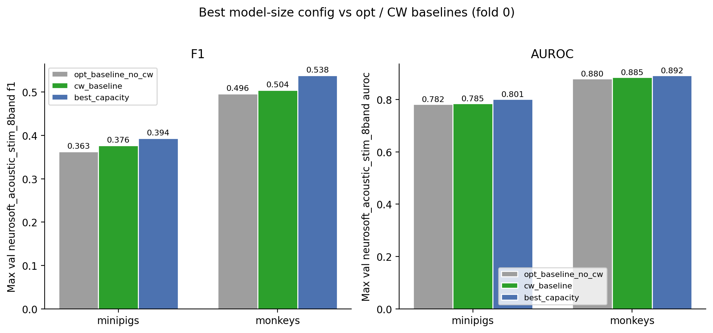
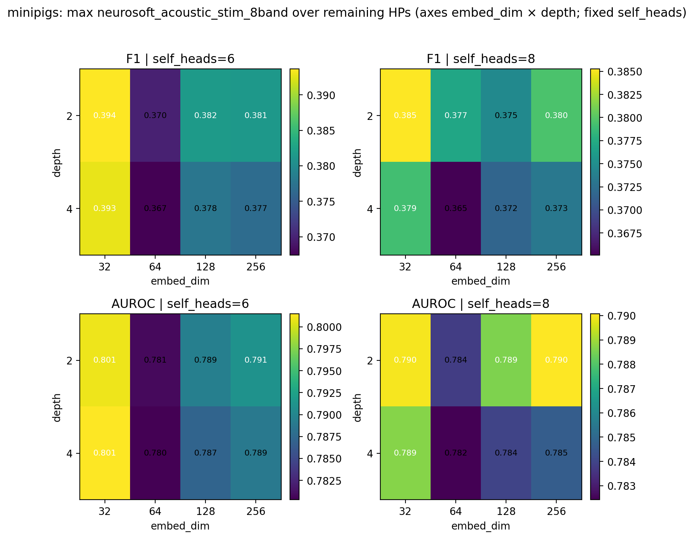
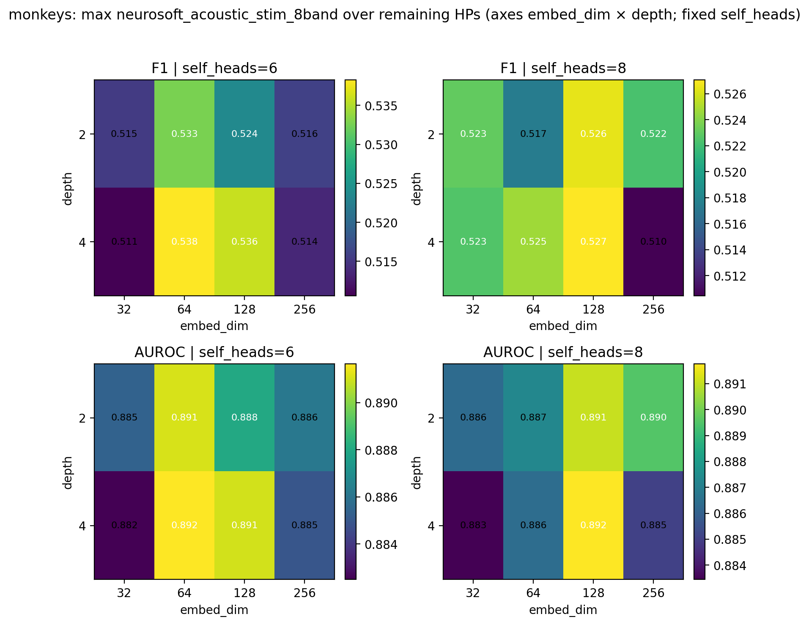
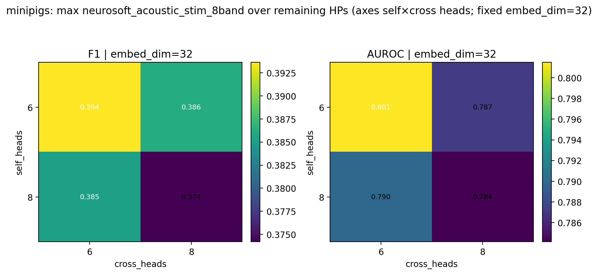
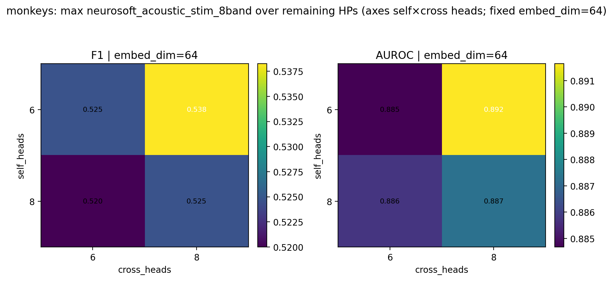
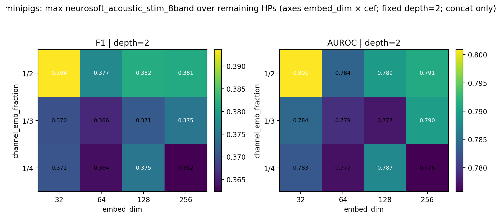

# Model Capacity / Size Ablation (Intrasession Multisubject)

**Status:** Completed
**Date started:** 2026-08-05
**Parent experiment:** [Class-Weight Smoothing (Intrasession Multisubject)](20260729-LS-class-weight-smoothing.md) ([opt-HP baselines](20260727-LS-intrasession-opt-baselines.md))
**Follow-up experiments:** [Focal Loss (Intrasession Multisubject)](20260807-LS-focal-loss.md), [Small Capacity + Focal Loss (Intrasession Multisubject)](20260811-LS-capacity-focal.md)
**Tags:** sweep, minipigs, monkeys, neurosoft, 8band, intrasession, multisubject, capacity, embed_dim, depth, heads, overfitting, auditory_decoding

## Background

Prior multisubject intrasession 8-band runs show strong overfitting.
Species-optimal hyperparameters were frozen in the
[opt-HP baselines](20260727-LS-intrasession-opt-baselines.md) and lightly
tuned with
[class-weight smoothing](20260729-LS-class-weight-smoothing.md). Those
baselines use a large default POYO capacity (`embed_dim=256`, `depth=4`,
self/cross heads `8/8`).

This experiment asks whether **reducing model capacity** improves max
validation F1 by limiting excess expressive power. Paired unfinished
WandB grid sweeps vary size knobs under the preferred CW smoothing per
species. Analysis uses **fold 0 only** (ignore other folds / incomplete
grid cells) and reports the **best** HP combination by max val F1—not
averages across runs—then compares that best set to the fold-0 opt and
CW baselines.

Minipigs use concat tokenization (`per_channel_resample_cnn`) and
additionally sweep `channel_emb_fraction`; monkeys use add
(`per_channel_resample_cnn_add`), so that factor does not apply.

## Question

Which combination of POYO-EEG size parameters (`embed_dim`, `depth`,
attention heads, and for minipigs `channel_emb_fraction`) maximizes
validation metrics for multisubject intrasession 8-band auditory
decoding, and how does that best configuration compare to the prior
opt-HP and class-weight baselines?

## Hypothesis

Smaller capacity reduces excess expressive power that drives
overfitting, so max val F1 improves (or at least does not degrade) as we
move away from large defaults (`embed_dim=256`, `depth=4`) for both
species; `channel_emb_fraction` is a minipigs-only concat detail and is
not expected to dominate the capacity choice.

## Experiment

### Setup

- **Project:** `auditory_decoding`
- **Group:** `NEUROSOFT_INTRASESSION_MULTISUBJ`
- **Sweep IDs:** `ov9f1g0n` (minipigs), `104ze4mt` (monkeys) — both still
  **RUNNING** / unfinished at report time
- **Species detection:** WandB run tags (`minipigs` / `monkeys`)
- **Task / metric prefix:** `val/neurosoft_acoustic_stim_8band_*`
  (report **max** summary / history values)
- **Split:** `intrasession-block` (fixed)
- **Fold:** **0 only** (folds > 0 ignored; some fold-0 cells may be missing)
- **Finished fold-0 runs:** 124 minipigs + 60 monkeys = 184
- **Baselines (fold 0, default size 256/4/8/8):**
  - Opt-HP no CW: minipigs `skkz2nec`, monkeys `ljqfklu4`
    ([20260727](20260727-LS-intrasession-opt-baselines.md))
  - CW preferred smoothing: minipigs `wj09rzw3` (s=0.75), monkeys
    `vv4a5uv7` (s=1.0)
    ([20260729](20260729-LS-class-weight-smoothing.md))

**Varied (scientific — model size):**

| Parameter | Minipigs | Monkeys |
|-----------|----------|---------|
| `model.embed_dim` | 32, 64, 128, 256 | 32, 64, 128, 256 |
| `model.depth` | 2, 4 | 2, 4 |
| `model.self_heads` | 6, 8 | 6, 8 |
| `model.cross_heads` | 6, 8 | 6, 8 |
| `model.tokenizer.channel_emb_fraction` | 1/2, 1/3, 1/4 (concat only) | — (add tokenizer) |

**Also in grid (secondary):** `weight_decay` ∈ {0.08, 0.1} (minipigs) or
{0.08, 0.3} (monkeys).

**Fixed context (species-specific from prior optima + CW):**

| Species | Tokenizer | atn_dropout | lr | CW smoothing | grad_clip |
|---------|-----------|-------------|-----|--------------|-----------|
| minipigs | `per_channel_resample_cnn` (concat) | 0.2 | 2.75e-5 | 0.75 | 0.5 |
| monkeys | `per_channel_resample_cnn_add` (add) | 0.4 | 2.5e-5 | 1.0 | 1.0 |

Primary analysis: **best run per species by max val F1**, compared to
fold-0 baselines. Heatmaps illustrate the grid (cell = max metric over
remaining HPs; one parameter fixed, two on the axes)—not mean trends.

### Launch command

```bash
# Minipigs
wandb agent <entity>/auditory_decoding/ov9f1g0n

# Monkeys
wandb agent <entity>/auditory_decoding/104ze4mt
```

### Key config overrides

Capacity grid above; CW smoothing fixed to preferred values from
[class-weight smoothing](20260729-LS-class-weight-smoothing.md).

## Results

### Summary

Best reduced-size configs beat both prior fold-0 baselines on max val F1
(and AUROC). Minipigs peak at a much smaller model (`embed_dim=32`,
`depth=2`, heads 6×6, `cef=1/2`). Monkeys peak at mid width
(`embed_dim=64`, `depth=4`, heads 6×8)—not the default `256`.

### Metrics

#### Best model-size configuration per species (max val F1)

| Species | embed_dim | depth | self_heads | cross_heads | channel_emb_fraction | weight_decay | F1 | AUROC | Precision | Recall | Balanced acc | Run |
|---------|-----------|-------|------------|-------------|----------------------|--------------|----|-------|-----------|--------|--------------|-----|
| minipigs | 32 | 2 | 6 | 6 | 1/2 | 0.08 | 0.3936 | 0.8009 | 0.4049 | 0.3954 | 0.3954 | poyo_eeg_neurosoft_8band (`ncx1been`) |
| monkeys | 64 | 4 | 6 | 8 | — | 0.30 | 0.5382 | 0.8916 | 0.5356 | 0.5485 | 0.5485 | poyo_eeg_neurosoft_8band (`zrvjtixp`) |

#### Best capacity vs fold-0 baselines (delta = best − baseline)

| Species | Baseline | Baseline F1 | Best F1 | ΔF1 | Baseline AUROC | Best AUROC | ΔAUROC | Baseline run |
|---------|----------|-------------|---------|-----|----------------|------------|--------|--------------|
| minipigs | opt (no CW) | 0.3627 | 0.3936 | +0.0309 | 0.7825 | 0.8009 | +0.0184 | `skkz2nec` |
| minipigs | CW s=0.75 | 0.3765 | 0.3936 | +0.0172 | 0.7849 | 0.8009 | +0.0160 | `wj09rzw3` |
| monkeys | opt (no CW) | 0.4964 | 0.5382 | +0.0419 | 0.8800 | 0.8916 | +0.0117 | `ljqfklu4` |
| monkeys | CW s=1.0 | 0.5041 | 0.5382 | +0.0341 | 0.8847 | 0.8916 | +0.0069 | `vv4a5uv7` |

Baselines use default size `embed_dim=256`, `depth=4`, heads `8/8`
(minipigs baseline `channel_emb_fraction≈1/4`). Capacity sweeps already
include the preferred CW smoothing, so the CW row is the fairest
same-recipe control.

#### Best F1 at each (embed_dim, depth) [max over other HPs]

| Species | depth\embed_dim | 32 | 64 | 128 | 256 |
|---------|-----------------|----|----|-----|-----|
| minipigs | 2 | **0.3936** | 0.3770 | 0.3817 | 0.3814 |
| minipigs | 4 | 0.3927 | 0.3674 | 0.3777 | 0.3767 |
| monkeys | 2 | 0.5231 | 0.5327 | 0.5264 | 0.5223 |
| monkeys | 4 | 0.5226 | **0.5382** | 0.5359 | 0.5137 |

### Analysis

```bash
uv run python analysis/20260805-LS-model-capacity.py
# optional: reuse cached CSVs
uv run python analysis/20260805-LS-model-capacity.py --cached
```

### Figures













## Conclusions

Best reduced-size configs beat both prior fold-0 baselines on max val F1
(and AUROC). Minipigs prefer a much smaller model (`embed_dim=32`,
`depth=2`, heads 6×6, `cef=1/2`); monkeys prefer mid width
(`embed_dim=64`) at full depth (`4`) with heads 6×8—not the default
`256`. Hypothesis is supported at the **best-config** level: moving away
from the large default improves peak validation metrics for both
species under this unfinished fold-0 grid.

Caveat: best runs also differ on secondary knobs (minipigs `cef`
1/4→1/2; monkeys often `weight_decay` 0.08→0.3), so the gain is not a
pure width/depth ablation against an otherwise identical recipe.

## Notes for future experiments

- Combine a **smaller capacity** model (best configs from this report)
  with **focal loss** to test a combined effect; see
  [focal loss](20260807-LS-focal-loss.md) and the follow-up
  [small capacity + focal](20260811-LS-capacity-focal.md) (no clear
  combined win; prefer small-cap CE).
- Optionally freeze the best size configs found here when sweeping γ.
- Sweeps were unfinished at report time; re-check missing fold-0 cells
  if any critical `(embed_dim, depth, heads)` combinations remain absent.
