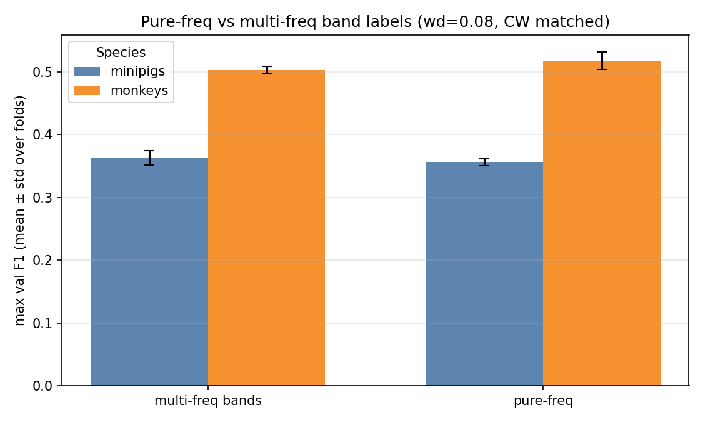
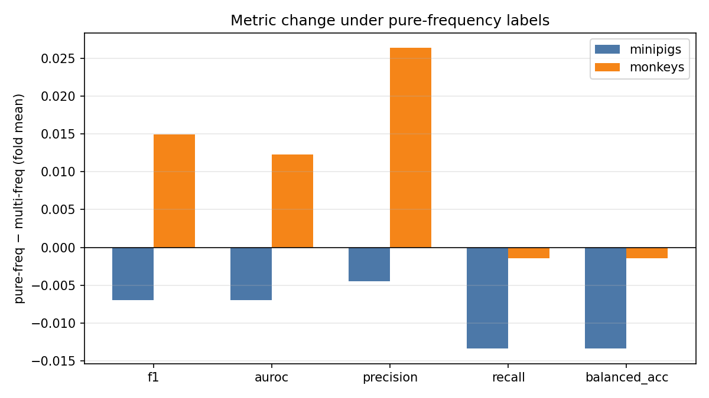

# Pure-Frequency Labels vs Multi-Frequency Bands

**Status:** Completed
**Date started:** 2026-08-05
**Parent experiment:** [Class-Weight Smoothing (Intrasession Multisubject)](20260729-LS-class-weight-smoothing.md)
**Follow-up experiments:** TBD
**Tags:** sweep, minipigs, monkeys, neurosoft, 8band, intrasession, multisubject, pure_freq, class_mapping, auditory_decoding

## Background

Prior multisubject intrasession work used
`neurosoft_acoustic_stim_8band`, where each of the 8 class labels
aggregates **multiple** stimulus frequencies (see
`configs/tasks/neurosoft_acoustic_stim_8band.yaml`). This follow-up keeps
the same 8 label names but maps **one frequency per label**:

| Frequency | Label |
|-----------|-------|
| 500 Hz | low_bass |
| 800 Hz | mid_bass |
| 1000 Hz | low_mids |
| 2000 Hz | midrange |
| 5000 Hz | high_mids |
| 8000 Hz | low_treble |
| 10000 Hz | mid_treble |
| 20000 Hz | high_treble |

(The dedicated single-freq task YAML no longer exists; mapping is recovered
from run `diff.patch`.) HPs and CW settings match the
[class-weight smoothing](20260729-LS-class-weight-smoothing.md) optima.

## Question

With species-optimal hyperparameters fixed for multisubject intrasession
decoding, does assigning one frequency per class label improve max val
F1 / AUROC / precision / recall vs the original multi-frequency 8-band
grouping?

## Hypothesis

Intra-band variability in the original grouping can exceed inter-band
differences and hurt discriminability; single-frequency labels should be
easier to decode and improve validation metrics. These conditions may
**not be directly comparable**, however: the multi-frequency banding can
include more stimulus trials (more training data) than the pure-frequency
subset.

## Experiment

### Setup

- **Project:** `auditory_decoding`
- **Group:** `NEUROSOFT_INTRASESSION_MULTISUBJ`
- **Pure-freq sweeps:** `w8y76p9g` (minipigs), `xtnzcpor` (monkeys)
- **Multi-freq CW baselines:** `w74jfier` (minipigs, smoothing=0.75),
  `nxx4a4pn` (monkeys, smoothing=1.0)
- **Species detection:** WandB run tags (`minipigs` / `monkeys`; also
  `pure_freq`)
- **Task / metric prefix:** `val/neurosoft_acoustic_stim_8band_*`
  (same task name; mapping differs)
- **Split:** `intrasession-block`
- **Folds:** 0, 1, 2
- **Primary:** `weight_decay=0.08`; `class_weights.mode=auto` with
  species-optimal smoothing
- **Finished pure-freq runs:** 6 + 6 (incl. secondary wd)

**Varied (scientific):** class mapping — multi-frequency bands vs
pure-frequency labels.

**Also in pure-freq grid (secondary):** `weight_decay` ∈ {0.08, 0.10}
(minipigs) or {0.08, 0.30} (monkeys).

**Fixed:** species-optimal tokenizer / dropout / lr / grad clip /
batch size; CW mode auto + optimal smoothing.

### Launch command

```bash
# Minipigs
wandb agent <entity>/auditory_decoding/w8y76p9g

# Monkeys
wandb agent <entity>/auditory_decoding/xtnzcpor
```

### Key config overrides

Species optima + CW smoothing; class mapping restricted to the eight
single frequencies above (via edited `neurosoft_acoustic_stim_8band`
mapping on the cluster).

## Results

### Summary

Hypothesis is **supported for monkeys** (fold-mean F1 **+3.0%**, AUROC
and precision up) and **not for minipigs** (fold-mean F1 **−1.9%**,
within/near multi-freq fold noise). Absolute performance remains higher
in monkeys. Interpret cautiously given unequal training-set size under
the two mappings.

### Metrics

#### Best pure-freq configuration per species (max single-run val F1, wd=0.08)

| Species | fold | F1 | AUROC | Precision | Recall | Balanced acc | Run |
|---------|------|----|-------|-----------|--------|--------------|-----|
| minipigs | 0 | 0.3613 | 0.7675 | 0.3686 | 0.3613 | 0.3613 | poyo_eeg_neurosoft_8band (`4rqo2sup`) |
| monkeys | 0 | 0.5277 | 0.8987 | 0.5390 | 0.5219 | 0.5219 | poyo_eeg_neurosoft_8band (`br8pc3eb`) |

#### Fold mean ± std (`wd=0.08`, CW-matched)

| Species | label scheme | n | F1 | AUROC | Precision | Recall | Balanced acc |
|---------|--------------|---|----|-------|-----------|--------|--------------|
| minipigs | multi-freq bands | 3 | 0.3633±0.0116 | 0.7754±0.0085 | 0.3646±0.0120 | 0.3701±0.0111 | 0.3701±0.0111 |
| minipigs | pure-freq | 3 | 0.3563±0.0054 | 0.7684±0.0022 | 0.3601±0.0081 | 0.3567±0.0054 | 0.3567±0.0054 |
| monkeys | multi-freq bands | 3 | 0.5029±0.0062 | 0.8838±0.0026 | 0.5013±0.0050 | 0.5200±0.0059 | 0.5200±0.0059 |
| monkeys | pure-freq | 3 | 0.5178±0.0142 | 0.8961±0.0032 | 0.5276±0.0117 | 0.5185±0.0124 | 0.5185±0.0124 |

#### Pure − multi (fold means)

| Species | ΔF1 | ΔAUROC | ΔPrecision | ΔRecall |
|---------|-----|--------|------------|---------|
| minipigs | −0.0070 (−1.9%) | −0.0069 (−0.9%) | −0.0045 (−1.2%) | −0.0134 (−3.6%) |
| monkeys | +0.0149 (+3.0%) | +0.0123 (+1.4%) | +0.0263 (+5.3%) | −0.0014 (−0.3%) |

#### Full primary grid

| Species | scheme | fold | F1 | AUROC | Precision | Recall | Balanced acc | Run |
|---------|--------|------|----|-------|-----------|--------|--------------|-----|
| minipigs | multi-freq | 0 | 0.3765 | 0.7849 | 0.3780 | 0.3829 | 0.3829 | `wj09rzw3` |
| minipigs | multi-freq | 1 | 0.3548 | 0.7727 | 0.3550 | 0.3627 | 0.3627 | `srby6m1h` |
| minipigs | multi-freq | 2 | 0.3585 | 0.7685 | 0.3607 | 0.3647 | 0.3647 | `4xee5g6m` |
| minipigs | pure-freq | 0 | 0.3613 | 0.7675 | 0.3686 | 0.3613 | 0.3613 | `4rqo2sup` |
| minipigs | pure-freq | 1 | 0.3571 | 0.7710 | 0.3590 | 0.3580 | 0.3580 | `3xdwhszv` |
| minipigs | pure-freq | 2 | 0.3506 | 0.7669 | 0.3526 | 0.3508 | 0.3508 | `wxzaxil0` |
| monkeys | multi-freq | 0 | 0.5041 | 0.8847 | 0.5019 | 0.5190 | 0.5190 | `vv4a5uv7` |
| monkeys | multi-freq | 1 | 0.4962 | 0.8809 | 0.4960 | 0.5146 | 0.5146 | `sm9y8hg1` |
| monkeys | multi-freq | 2 | 0.5085 | 0.8857 | 0.5060 | 0.5263 | 0.5263 | `5up66nyf` |
| monkeys | pure-freq | 0 | 0.5277 | 0.8987 | 0.5390 | 0.5219 | 0.5219 | `br8pc3eb` |
| monkeys | pure-freq | 1 | 0.5016 | 0.8926 | 0.5156 | 0.5048 | 0.5048 | `jfuyagu9` |
| monkeys | pure-freq | 2 | 0.5243 | 0.8969 | 0.5283 | 0.5290 | 0.5290 | `yhfguuwe` |

### Analysis

```bash
uv run python analysis/20260805-LS-pure-frequency-labels.py
```

### Figures





## Conclusions

Hypothesis **partially supported**, with a species split and a data-size
caveat:

- **Monkeys:** pure-freq helps on fold-mean F1 (**0.518 vs 0.503**,
  +3.0%) and AUROC/precision; max single-run F1 **0.528** (`br8pc3eb`).
- **Minipigs:** no gain — fold-mean F1 **0.356 vs 0.363** (−1.9%); max
  pure-freq F1 **0.361** (`4rqo2sup`) below the multi-freq peak (0.376).
- Gains (or lack thereof) may partly reflect **fewer training trials**
  under pure-freq vs multi-freq banding, not only class separability.

## Notes for future experiments

- Match or record **trial counts / class priors** under both mappings so
  data-volume is controlled or explicitly covaried.
- Restore a checked-in single-freq task YAML for reproducibility.
- Optional: subsample multi-freq bands to the same eight frequencies’
  trial budget as a fairer ablation.
