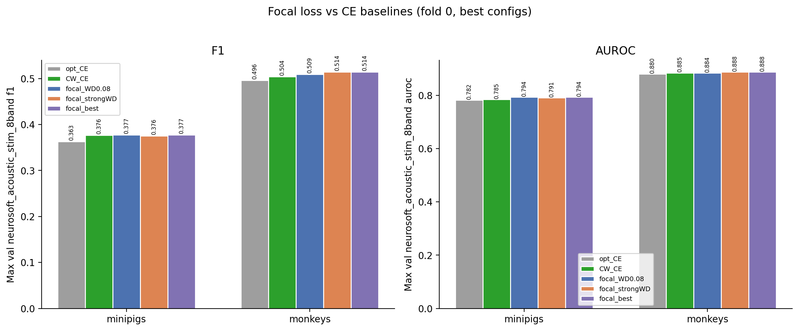
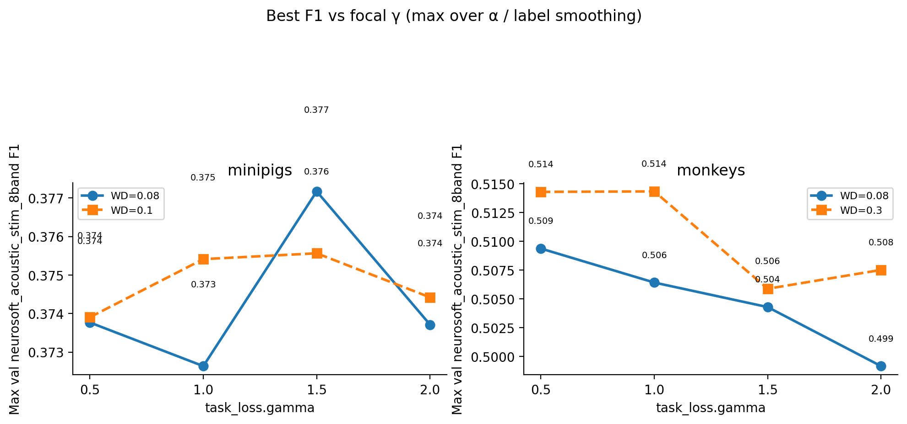
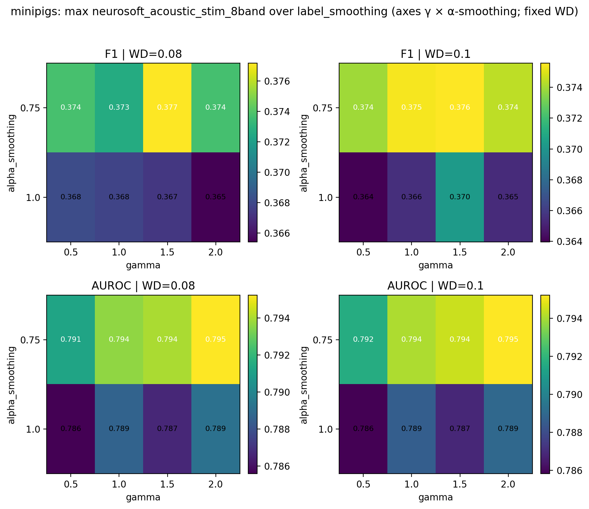
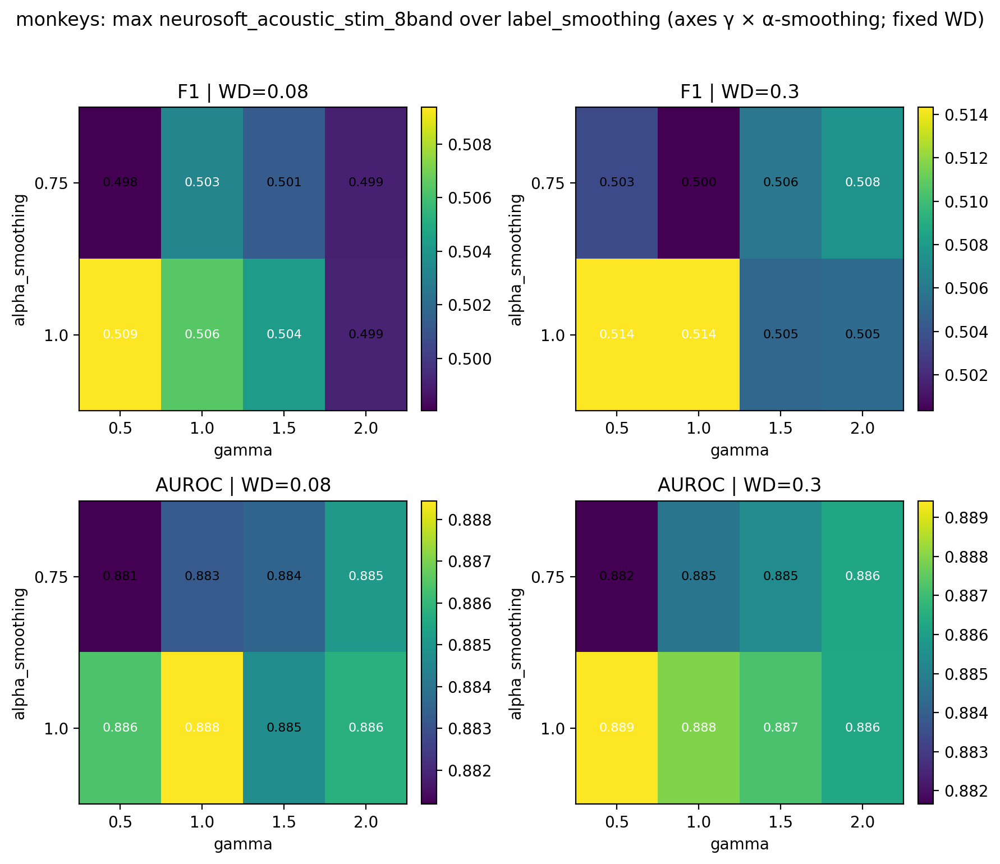

# Focal Loss (Intrasession Multisubject)

**Status:** Completed
**Date started:** 2026-08-07
**Parent experiment:** [Model Capacity / Size Ablation (Intrasession Multisubject)](20260805-LS-model-capacity.md) ([class-weight smoothing](20260729-LS-class-weight-smoothing.md), [opt-HP baselines](20260727-LS-intrasession-opt-baselines.md))
**Follow-up experiments:** [Small Capacity + Focal Loss (Intrasession Multisubject)](20260811-LS-capacity-focal.md)
**Tags:** sweep, minipigs, monkeys, neurosoft, 8band, intrasession, multisubject, focal_loss, gamma, alpha_smoothing, label_smoothing, class_imbalance, auditory_decoding

## Background

Prior multisubject intrasession work addressed class imbalance mainly via
inverse-frequency
[class-weight smoothing](20260729-LS-class-weight-smoothing.md) under CE.
[Model capacity](20260805-LS-model-capacity.md) showed that smaller POYO
size can raise peak validation metrics, and flagged focal loss as a next
imbalance remedy: a focusing parameter γ down-weights confident
predictions so learning concentrates on harder / minority-class examples.

This experiment keeps default capacity (`embed_dim=256`, `depth=4`,
heads `8/8`) and sweeps focal-loss hyperparameters under species-optimal
training HPs, asking whether focal loss improves max val metrics vs the
prior CE baselines, and which focal settings work best at WD=0.08 vs
stronger WD.

## Question

Does focal loss improve max val F1, AUROC, precision, recall, and
balanced accuracy for multisubject intrasession 8-band decoding relative
to the prior CE (opt / class-weight) baselines, and if so, which focal
hyperparameters (`gamma`, `alpha_smoothing`, `label_smoothing`) are best
— at `weight_decay=0.08` and at the stronger WD (0.1 / 0.3)?

## Hypothesis

Focal loss improves validation metrics vs CE baselines by down-weighting
easy examples and focusing learning on harder / minority-class cases; a
mid-to-high focusing parameter (γ ≥ 1) with full or near-full
α-smoothing will outperform weaker focusing (γ = 0.5).

## Experiment

### Setup

- **Project:** `auditory_decoding`
- **Group:** `NEUROSOFT_INTRASESSION_MULTISUBJ`
- **Sweep IDs:** `jotbhxmv` (minipigs), `jwdf3c4z` (monkeys) — both
  **FINISHED**
- **Species detection:** WandB run tags (`minipigs` / `monkeys`)
- **Task / metric prefix:** `val/neurosoft_acoustic_stim_8band_*`
  (report **max** summary / history values)
- **Split:** `intrasession-block` (fixed)
- **Fold:** 0 (fixed in sweep)
- **Finished runs:** 32 minipigs + 32 monkeys = 64
- **Model capacity:** default `256 / 4 / 8 / 8` (same family as CE
  baselines; not the capacity-ablation winners)
- **Baselines (fold 0):**
  - Opt-HP no CW: minipigs `skkz2nec`, monkeys `ljqfklu4`
  - CW preferred smoothing: minipigs `wj09rzw3` (s=0.75), monkeys
    `vv4a5uv7` (s=1.0)

**Varied (scientific — focal loss + WD):**

| Parameter | Minipigs | Monkeys |
|-----------|----------|---------|
| `task_loss.gamma` | 0.5, 1, 1.5, 2 | 0.5, 1, 1.5, 2 |
| `task_loss.alpha_smoothing` | 0.75, 1 | 0.75, 1 |
| `task_loss.label_smoothing` | 0.1, 0.2 | 0.1, 0.2 |
| `hyperparameters.weight_decay` | 0.08, 0.1 | 0.08, 0.3 |

**Fixed context (species-optimal HPs):**

| Species | Tokenizer | atn_dropout | lr | grad_clip |
|---------|-----------|-------------|-----|-----------|
| minipigs | `per_channel_resample_cnn` | 0.2 | 2.75e-5 | 0.5 |
| monkeys | `per_channel_resample_cnn_add` | 0.4 | 2.5e-5 | 1.0 |

Primary analysis: best focal config by max val F1 (overall and per WD
slice), compared to fold-0 CE baselines; WD=0.08 vs strong WD contrast.

### Launch command

```bash
# Minipigs
wandb agent <entity>/auditory_decoding/jotbhxmv

# Monkeys
wandb agent <entity>/auditory_decoding/jwdf3c4z
```

### Key config overrides

Focal grid above (`task_loss.*` + WD); CE `class_weights` not used
(focal uses `alpha: auto` / `alpha_smoothing`).

## Results

### Summary

Focal loss clearly beats the **no-CW** opt baseline, but vs the **CW CE**
control the F1 gain is negligible for minipigs and only modest for
monkeys. Stronger WD helps monkeys with focal; minipigs prefer WD=0.08.
Overall: **small / mixed benefit**, not a large win.

### Metrics

#### Best focal configuration per species (overall max val F1)

| Species | gamma | alpha_smoothing | label_smoothing | weight_decay | F1 | AUROC | Precision | Recall | Balanced acc | Run |
|---------|-------|-----------------|-----------------|--------------|----|-------|-----------|--------|--------------|-----|
| minipigs | 1.5 | 0.75 | 0.1 | 0.08 | 0.3772 | 0.7940 | 0.3762 | 0.3853 | 0.3853 | poyo_eeg_neurosoft_8band (`gebswvlu`) |
| monkeys | 1.0 | 1.0 | 0.1 | 0.30 | 0.5143 | 0.8879 | 0.5126 | 0.5211 | 0.5211 | poyo_eeg_neurosoft_8band (`ubdan13a`) |

#### Best focal @ WD=0.08

| Species | gamma | alpha_smoothing | label_smoothing | F1 | AUROC | Precision | Recall | Balanced acc | Run |
|---------|-------|-----------------|-----------------|----|-------|-----------|--------|--------------|-----|
| minipigs | 1.5 | 0.75 | 0.1 | 0.3772 | 0.7940 | 0.3762 | 0.3853 | 0.3853 | `gebswvlu` |
| monkeys | 0.5 | 1.0 | 0.2 | 0.5094 | 0.8840 | 0.5082 | 0.5182 | 0.5182 | `yfo9dfm9` |

#### Best focal @ strong WD (0.1 / 0.3)

| Species | gamma | alpha_smoothing | label_smoothing | weight_decay | F1 | AUROC | Precision | Recall | Balanced acc | Run |
|---------|-------|-----------------|-----------------|--------------|----|-------|-----------|--------|--------------|-----|
| minipigs | 1.5 | 0.75 | 0.2 | 0.10 | 0.3756 | 0.7911 | 0.3736 | 0.3827 | 0.3827 | `th0iwudh` |
| monkeys | 1.0 | 1.0 | 0.1 | 0.30 | 0.5143 | 0.8879 | 0.5126 | 0.5211 | 0.5211 | `ubdan13a` |

#### Overall best focal vs fold-0 CE baselines

| Species | Baseline | Baseline F1 | Best F1 | ΔF1 | Baseline AUROC | Best AUROC | ΔAUROC | Baseline run |
|---------|----------|-------------|---------|-----|----------------|------------|--------|--------------|
| minipigs | opt (no CW) | 0.3627 | 0.3772 | +0.0144 | 0.7825 | 0.7940 | +0.0115 | `skkz2nec` |
| minipigs | CW s=0.75 | 0.3765 | 0.3772 | +0.0007 | 0.7849 | 0.7940 | +0.0091 | `wj09rzw3` |
| monkeys | opt (no CW) | 0.4964 | 0.5143 | +0.0180 | 0.8800 | 0.8879 | +0.0080 | `ljqfklu4` |
| monkeys | CW s=1.0 | 0.5041 | 0.5143 | +0.0102 | 0.8847 | 0.8879 | +0.0032 | `vv4a5uv7` |

#### WD contrast (best@strong − best@0.08)

| Species | Best@0.08 F1 | Best@strong F1 | ΔF1 | ΔAUROC | Strong WD |
|---------|--------------|----------------|-----|--------|-----------|
| minipigs | 0.3772 | 0.3756 | −0.0016 | −0.0029 | 0.1 |
| monkeys | 0.5094 | 0.5143 | +0.0050 | +0.0040 | 0.3 |

#### Best F1 by species × WD × gamma (max over α / label smoothing)

| Species | WD | γ=0.5 | γ=1.0 | γ=1.5 | γ=2.0 |
|---------|-----|-------|-------|-------|-------|
| minipigs | 0.08 | 0.3738 | 0.3726 | **0.3772** | 0.3737 |
| minipigs | 0.10 | 0.3739 | 0.3754 | **0.3756** | 0.3744 |
| monkeys | 0.08 | **0.5094** | 0.5064 | 0.5043 | 0.4992 |
| monkeys | 0.30 | **0.5143** | **0.5143** | 0.5059 | 0.5075 |

### Analysis

```bash
uv run python analysis/20260807-LS-focal-loss.py
# optional: reuse cached CSVs
uv run python analysis/20260807-LS-focal-loss.py --cached
```

### Figures









## Conclusions

Focal loss clearly beats the **no-CW** opt baseline, but vs the **CW CE**
control the F1 gain is negligible for minipigs (+0.001) and only modest
for monkeys (+0.010). AUROC gains vs CW are small for both. Overall:
**small / mixed benefit**, not a large win.

Optimal focal HPs (this grid):

- **Minipigs:** γ=1.5, α-smoothing=0.75, label-smoothing=0.1, WD=0.08
- **Monkeys:** γ=1.0 (γ=0.5 nearly tied at strong WD), α-smoothing=1.0,
  label-smoothing=0.1, WD=0.3

Stronger WD helps monkeys with focal; minipigs prefer WD=0.08. Hypothesis
is only partially supported: mid γ helps minipigs, but monkeys’ WD=0.08
optimum is weak focusing (γ=0.5), and CW already captures most of the
imbalance benefit that focal adds on this default-capacity recipe.

## Notes for future experiments

- Combine a **smaller capacity** model (from
  [capacity ablation](20260805-LS-model-capacity.md)) with **focal loss**
  to test whether there is a combined effect beyond either change alone;
  see [small capacity + focal](20260811-LS-capacity-focal.md).
- Prefer species-specific focal defaults above if reusing focal without
  a full re-sweep.
