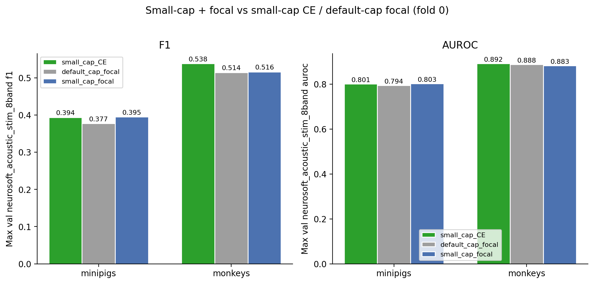
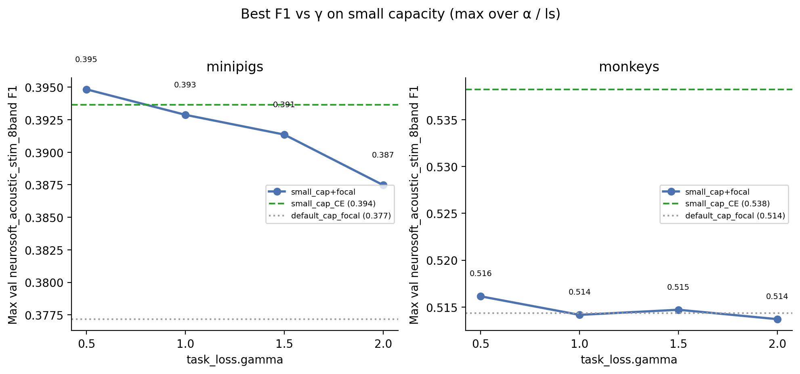
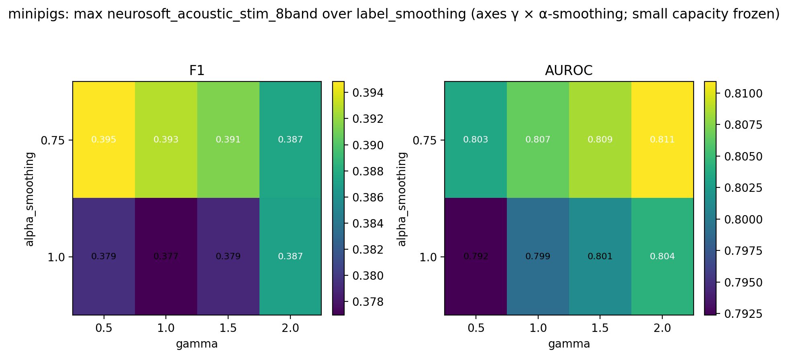
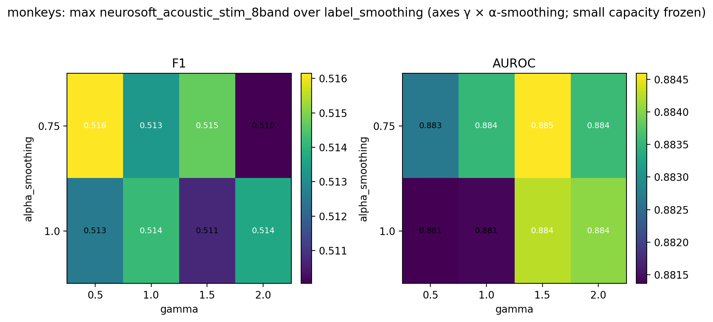

# Small Capacity + Focal Loss (Intrasession Multisubject)

**Status:** Completed
**Date started:** 2026-08-11
**Parent experiment:** [Focal Loss (Intrasession Multisubject)](20260807-LS-focal-loss.md) ([Model Capacity / Size Ablation](20260805-LS-model-capacity.md))
**Follow-up experiments:** TBD
**Tags:** sweep, minipigs, monkeys, neurosoft, 8band, intrasession, multisubject, capacity, focal_loss, gamma, alpha_smoothing, label_smoothing, auditory_decoding

## Background

[Capacity ablation](20260805-LS-model-capacity.md) found smaller POYO
configs raise peak fold-0 max val F1.
[Focal loss](20260807-LS-focal-loss.md) on **default** capacity
(`256/4/8/8`) gave only small / mixed gains vs CW CE.

This experiment freezes each species’ **best small-capacity** recipe and
sweeps focal HPs to test a combined effect, evaluating against both:

1. **Small-capacity CE** winners (capacity report)
2. **Default-capacity focal** winners (focal report)

## Question

With each species’ best small-capacity config frozen, which focal-loss
hyperparameters maximize validation metrics for multisubject intrasession
8-band decoding, and does adding focal loss improve over the
small-capacity CE baseline and over default-capacity focal?

## Hypothesis

Focal loss on the small-capacity recipe yields a combined gain: best max
val F1 exceeds both the small-capacity CE winner and the prior
default-capacity focal best, with mid-range γ (≈1–1.5) preferred.

## Experiment

### Setup

- **Project:** `auditory_decoding`
- **Group:** `NEUROSOFT_INTRASESSION_MULTISUBJ`
- **Sweep IDs:** `bvig2bi8` (minipigs), `weslebt0` (monkeys) — both
  **FINISHED**
- **Species detection:** WandB run tags (`minipigs` / `monkeys`)
- **Task / metric prefix:** `val/neurosoft_acoustic_stim_8band_*`
  (report **max** summary / history values)
- **Split:** `intrasession-block` (fixed)
- **Fold:** 0 (fixed)
- **Finished runs:** 16 + 16 = 32
- **Weight decay:** **0.09** fixed for both species (not the capacity
  winners’ WD 0.08 / 0.30)

**Frozen capacity (from capacity best configs):**

| Species | embed_dim | depth | self/cross heads | channel_emb_fraction | Tokenizer | CW smoothing |
|---------|-----------|-------|------------------|----------------------|-----------|--------------|
| minipigs | 32 | 2 | 6 / 6 | 1/2 | `per_channel_resample_cnn` | 0.75 |
| monkeys | 64 | 4 | 6 / 8 | — | `per_channel_resample_cnn_add` | 1.0 |

**Varied (scientific — focal only):**

| Parameter | Values |
|-----------|--------|
| `task_loss.gamma` | 0.5, 1, 1.5, 2 |
| `task_loss.alpha_smoothing` | 0.75, 1 |
| `task_loss.label_smoothing` | 0.1, 0.2 |

**Baselines (fold 0):**

| Label | Minipigs | Monkeys |
|-------|----------|---------|
| small_cap_CE | `ncx1been` (F1 0.3936) | `zrvjtixp` (F1 0.5382) |
| default_cap_focal | `gebswvlu` (F1 0.3772) | `ubdan13a` (F1 0.5143) |

### Launch command

```bash
# Minipigs
wandb agent <entity>/auditory_decoding/bvig2bi8

# Monkeys
wandb agent <entity>/auditory_decoding/weslebt0
```

### Key config overrides

Frozen size table above; WD=0.09; focal grid over `task_loss.*`.

## Results

### Summary

No clear combined win. Minipigs: combo ≈ small-cap CE (+0.001 F1),
clearly better than default-cap focal (+0.018). Monkeys: combo
**worse** than small-cap CE (−0.022 F1), ≈ default-cap focal (+0.002).
Both species prefer **weak** focusing (γ=0.5), not mid/high γ.
Capacity does the heavy lifting; focal on the small model adds little or
hurts.

### Metrics

#### Best small-cap + focal configuration per species

| Species | gamma | alpha_smoothing | label_smoothing | F1 | AUROC | Precision | Recall | Balanced acc | Run |
|---------|-------|-----------------|-----------------|----|-------|-----------|--------|--------------|-----|
| minipigs | 0.5 | 0.75 | 0.2 | 0.3948 | 0.8028 | 0.3972 | 0.4106 | 0.4106 | poyo_eeg_neurosoft_8band (`8nb2237n`) |
| monkeys | 0.5 | 0.75 | 0.1 | 0.5161 | 0.8827 | 0.5139 | 0.5259 | 0.5259 | poyo_eeg_neurosoft_8band (`ar4uww6o`) |

#### Best combo vs baselines (delta = combo − baseline)

| Species | Baseline | Baseline F1 | Best F1 | ΔF1 | Baseline AUROC | Best AUROC | ΔAUROC | Baseline run |
|---------|----------|-------------|---------|-----|----------------|------------|--------|--------------|
| minipigs | small_cap_CE | 0.3936 | 0.3948 | +0.0012 | 0.8009 | 0.8028 | +0.0019 | `ncx1been` |
| minipigs | default_cap_focal | 0.3772 | 0.3948 | +0.0177 | 0.7940 | 0.8028 | +0.0088 | `gebswvlu` |
| monkeys | small_cap_CE | 0.5382 | 0.5161 | −0.0221 | 0.8916 | 0.8827 | −0.0090 | `zrvjtixp` |
| monkeys | default_cap_focal | 0.5143 | 0.5161 | +0.0018 | 0.8879 | 0.8827 | −0.0053 | `ubdan13a` |

#### Best F1 by gamma (max over α / label smoothing)

| Species | γ=0.5 | γ=1.0 | γ=1.5 | γ=2.0 |
|---------|-------|-------|-------|-------|
| minipigs | **0.3948** | 0.3929 | 0.3914 | 0.3875 |
| monkeys | **0.5161** | 0.5142 | 0.5147 | 0.5137 |

### Analysis

```bash
uv run python analysis/20260811-LS-capacity-focal.py
# optional: reuse cached CSVs
uv run python analysis/20260811-LS-capacity-focal.py --cached
```

### Figures









## Conclusions

Hypothesis **not supported** as a combined gain. Relative to the two
baselines:

- **vs small-cap CE:** minipigs noise-level (+0.001 F1); monkeys clearly
  worse (−0.022 F1).
- **vs default-cap focal:** minipigs clearly better (+0.018); monkeys
  essentially flat (+0.002 F1, AUROC slightly down).

Best focal settings on the small model use **γ=0.5** and
**α-smoothing=0.75** for both species — opposite the mid-γ preference
hypothesized. Prefer **small-capacity CE** (especially for monkeys) as
the stronger recipe; focal adds little once capacity is already reduced.

Caveat: this combo sweep fixed WD=**0.09** for both species, while the
monkey small-cap CE winner used WD=**0.30** — part of the monkey gap may
be WD mismatch, not focal alone.

## Notes for future experiments

- If re-testing focal on small capacity, match the capacity winner’s
  **weight_decay** (especially monkeys WD=0.30) for a cleaner ablation.
- Default recipe going forward: keep species-best **small capacity**;
  treat focal as optional / low priority unless a WD-matched re-run
  shows a clear gain.
