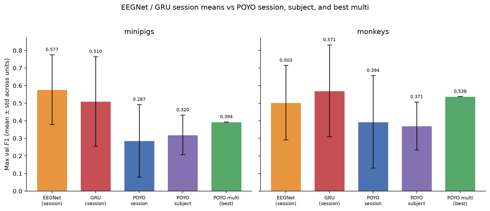
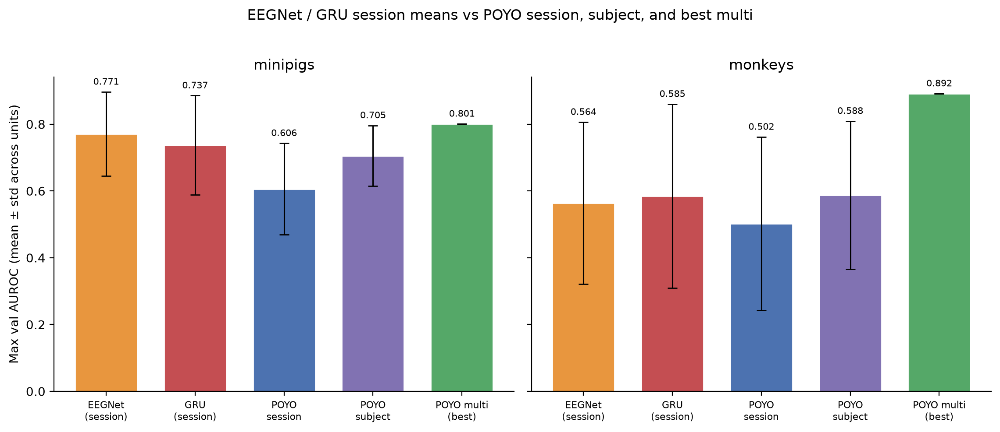
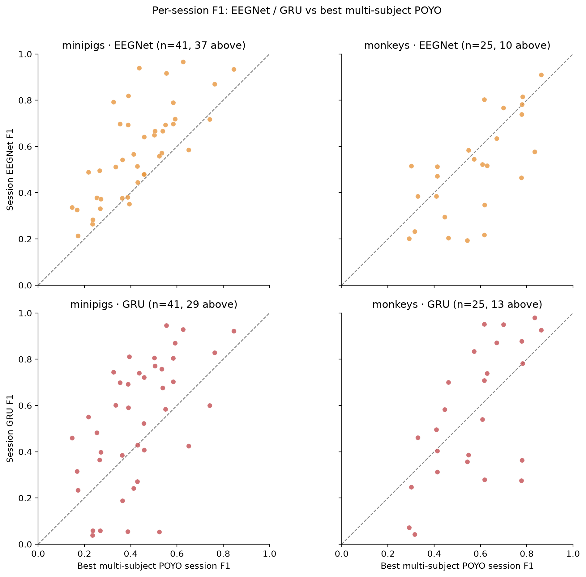
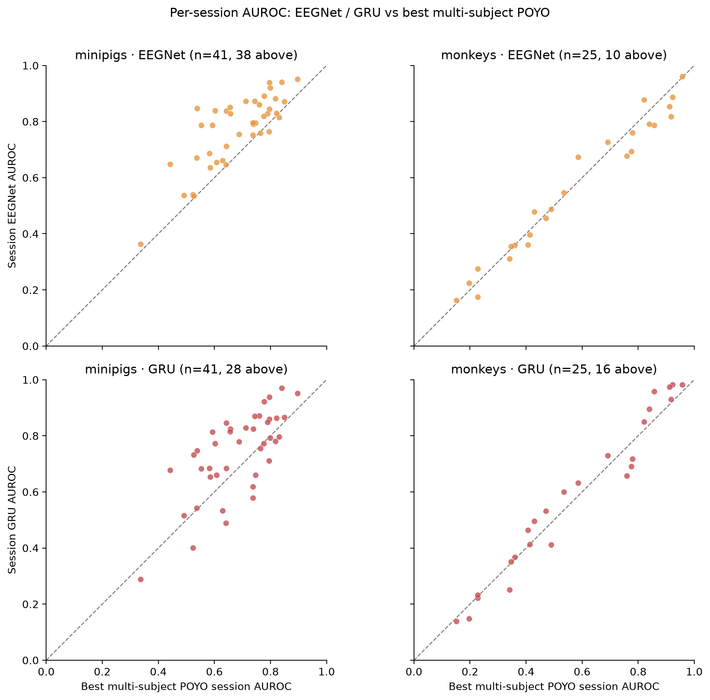
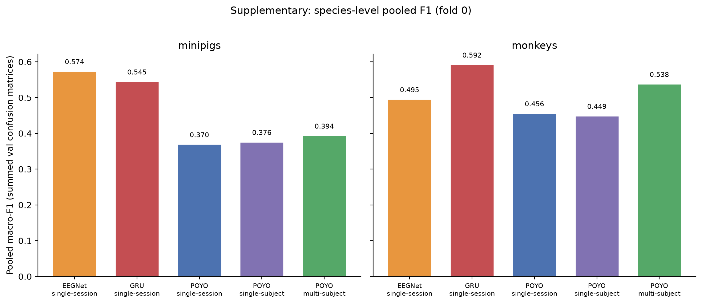
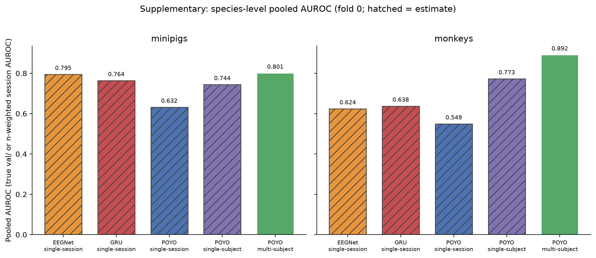
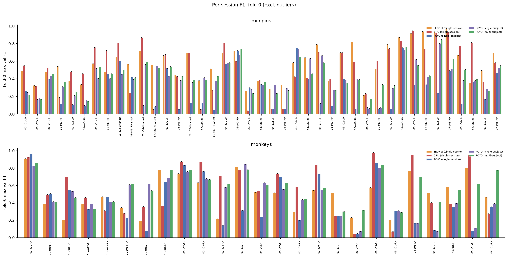
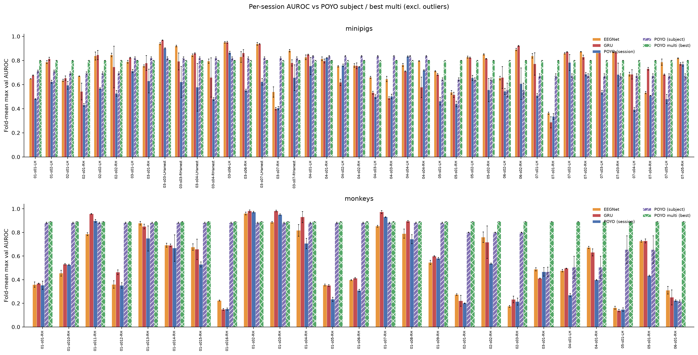

# Session-Level EEGNet / GRU vs POYO (8-band)

**Status:** Completed
**Date started:** 2026-08-18
**Parent experiment:** [Intrasession Optimal-HP Training Paradigm Baselines](20260727-LS-intrasession-opt-baselines.md)
**Follow-up experiments:** [Multi-subject EEGNet / GRU-CNN HP search](../inbox/20260831-LS-eegnet-gru-multisubj-hp.md)
**Tags:** neurosoft, 8band, intrasession, singlesession, baseline, eegnet, gru, poyo, auditory_decoding, minipigs, monkeys

## Background

The [opt-HP paradigm baselines](20260727-LS-intrasession-opt-baselines.md)
ranked POYO pooling as single-session < single-subject < multi-subject
(minipigs) and put multi-subject clearly on top for monkeys after
excluding pathological sessions. [Capacity](20260805-LS-model-capacity.md)
then raised the multi-subject ceiling (best fold-0 F1 **0.394 / 0.538**).

Those comparisons are all within POYO. This report adds **non-foundation**
session-level baselines — EEGNet and a bidirectional GRU — from
`NEUROSOFT_INTRASESSION_SINGLESESS`. Each EEGNet/GRU/POYO-session run
trains and evaluates on **one recording**, so those three are
protocol-matched. Transformer POYO typically needs more training data
than CNN/RNN baselines, so that matched session comparison is an unfair
low-data test; single-subject and
multi-subject POYO are the fairer high-data references, even though they
are not protocol-matched to session EEGNet/GRU.

## Question

How do **fold-0** session-averaged EEGNet and GRU max-val metrics
compare to (1) opt-HP **single-session** POYO, (2) opt-HP
**single-subject** POYO (`val_session/` per recording), and (3) the
**best multi-subject** POYO (reduced-capacity fold-0 winners;
`val_session/` per recording)? Primary scoreboard is the unweighted
mean±std **across sessions**. Pooled `val/` is supplementary, and only
where a single model actually spans multiple sessions.

## Hypothesis

Transformer-based POYO typically needs more training data than CNN/RNN
models, so comparing it to EEGNet/GRU at the **single-session**
(low-data) regime is unfair.
Given enough data — single-subject or, especially, **multi-subject**
pooling — POYO should **outperform** those traditional session-level
baselines on **both F1 and AUROC**.

## Experiment

### Setup

- **Project:** `auditory_decoding`
- **Species detection:** WandB run tags (`minipigs` / `monkeys`)
- **Task / metric prefix:** `val/neurosoft_acoustic_stim_8band_*`
  (report **max** summary / history values)
- **Split:** `intrasession-block` (fixed)

| Condition | Source | Primary aggregation (fold 0) |
|-----------|--------|------------------------------|
| EEGNet single-session | group `NEUROSOFT_INTRASESSION_SINGLESESS`, tags `baselines`+`eegnet` | mean±std of per-session `val/` max (excl. outliers) |
| GRU single-session | same group, tags `baselines`+`gru` | same |
| POYO single-session | opt-HP sweeps `hiyb4224` / `h5gf9jn1` ([20260727](20260727-LS-intrasession-opt-baselines.md)) | same |
| POYO single-subject | opt-HP sweeps `4k9zt970` / `aycfxm9b` | mean±std of per-session `val_session/` history-max (excl. outliers) |
| POYO multi-subject | capacity fold-0 winners `ncx1been` / `zrvjtixp` ([20260805](20260805-LS-model-capacity.md)) | same as single-subject |

**Fold:** **0 only** for every condition (EEGNet / GRU / single-session POYO
previously used a 3-fold mean; that is dropped so the comparison
matches the capacity winners).

**Session outliers:** missing F1 or fold-0 F1 ≥ 0.99 (same rule as
[20260727](20260727-LS-intrasession-opt-baselines.md)). Two monkey
sessions (`sub-02_ses-04/05` RH) are excluded; none for minipigs.
Finished primary session runs: 41×3 models (minipigs) and 27×3
(monkeys) on fold 0. POYO single-subject: 7 minipigs + 6 monkeys (fold 0).

**Session-level model configs:**

| Model | Config | Notes |
|-------|--------|--------|
| POYO-EEG | opt-HP singlesess (resample CNN; species HPs from parent) | `bs=128`, patience 50 |
| EEGNet | `configs/experiment/auditory_decoding/eegnet_neurosoft_8band_intrasession_singlesess.yaml` | opt-HP: F1=8, D=2, F2=16; `lr=0.015`, `wd=0.018`, `bs=16`, patience 20 |
| GRU | `configs/experiment/auditory_decoding/gru_neurosoft_8band_intrasession_singlesess.yaml` | opt-HP: 2-layer bidirectional, hidden 128; `lr=0.0015`, `wd=0.018`, `bs=16`, patience 20 |

Repo YAMLs for EEGNet/GRU are minipigs-templated; monkey runs in the
group use the same architectures with `neurosoft_monkeys` data / tags.
EEGNet/GRU HPs were selected by a prior hyperparameter search (values
above). Non-opt POYO in the same group (45 minipig runs) is excluded
from the primary tables.

### Launch command

```bash
# EEGNet / GRU (session grid via Hydra sweeper on recording_ids)
uv run python main.py experiment=auditory_decoding/eegnet_neurosoft_8band_intrasession_singlesess -m
uv run python main.py experiment=auditory_decoding/gru_neurosoft_8band_intrasession_singlesess -m

# POYO references (already reported)
wandb agent <entity>/auditory_decoding/hiyb4224   # single-session minipigs
wandb agent <entity>/auditory_decoding/h5gf9jn1   # single-session monkeys
wandb agent <entity>/auditory_decoding/4k9zt970   # single-subject minipigs
wandb agent <entity>/auditory_decoding/aycfxm9b   # single-subject monkeys
# best multi-subject: ncx1been / zrvjtixp from capacity sweep ov9f1g0n / 104ze4mt
```

### Key config overrides

See YAMLs above. POYO uses species-optimal tokenizer / lr / WD / dropout
from the [HP search](20260717-LS-intrasession-multisubj-hp.md); EEGNet
and GRU use HPs selected by a prior search (architecture, `lr`, `wd`
in the session YAMLs).

## Results

### Summary

All numbers below are **fold 0**, unweighted mean±std **across
sessions** (n=41 minipigs, n=25 monkeys after outlier exclusion).
On the **matched session protocol**, EEGNet and GRU beat opt-HP
single-session POYO on F1 for both species (minipigs EEGNet 0.578 vs POYO 0.281;
monkeys GRU 0.565 vs POYO 0.406). They also beat **single-subject**
POYO on the same session-mean (`val_session/`). Versus the **best
multi-subject** POYO: minipig EEGNet still leads on both metrics (F1
0.578 vs 0.432; AUROC 0.772 vs 0.683); monkey GRU is essentially tied
with multi-subject POYO on F1 (0.565 vs 0.573) and AUROC (0.582 vs
0.577).

**Pooled** metrics (all validation trials mixed) are supplementary.
Pooled **F1** is reconstructed for every condition by summing the
validation confusion matrix at each run’s max-F1 epoch. Pooled
**AUROC** is the true run `val/` only for multi-subject POYO (one
model, scores mixed). For EEGNet / GRU / single-session POYO / single-subject POYO,
scores are not stored; the bar is a trial-count-weighted mean of
per-run AUROCs (hatched).

Session-level F1 and AUROC can disagree, especially in monkeys: several
high-F1 sessions have AUROC near 0.35. Minipig session AUROC is more
consistent with the F1 ranking (EEGNet 0.772, GRU 0.744, POYO single-session
0.607).

### Metrics

#### Session EEGNet / GRU vs POYO single-session, single-subject, and multi-subject

Aggregation: **fold 0**, unweighted mean±std **across sessions** of
max-val metrics (excl. outliers). EEGNet / GRU / POYO single-session use that
recording’s `val/` max. POYO single-subject and POYO multi-subject use
`val_session/` history-max on the same recordings.

| Species | Condition | n | F1 | AUROC | Precision | Recall | Balanced acc |
|---------|-----------|---|----|-------|-----------|--------|--------------|
| minipigs | EEGNet single-session | 41 | 0.5785±0.2008 | 0.7725±0.1243 | 0.6485±0.1708 | 0.5885±0.1933 | 0.5885±0.1933 |
| minipigs | GRU single-session | 41 | 0.5301±0.2673 | 0.7441±0.1486 | 0.5697±0.2722 | 0.5523±0.2416 | 0.5523±0.2416 |
| minipigs | POYO single-session | 41 | 0.2808±0.2125 | 0.6066±0.1417 | 0.3199±0.2339 | 0.3241±0.1880 | 0.3241±0.1880 |
| minipigs | POYO single-subject | 41 | 0.4131±0.1717 | 0.6710±0.1239 | 0.4560±0.1755 | 0.4301±0.1670 | 0.4301±0.1670 |
| minipigs | POYO multi-subject | 41 | 0.4318±0.1641 | 0.6829±0.1251 | 0.5051±0.1460 | 0.4519±0.1507 | 0.4519±0.1507 |
| monkeys | EEGNet single-session | 25 | 0.5048±0.2113 | 0.5622±0.2433 | 0.6105±0.1942 | 0.5260±0.1962 | 0.5260±0.1962 |
| monkeys | GRU single-session | 25 | 0.5653±0.2817 | 0.5822±0.2772 | 0.6115±0.2796 | 0.5987±0.2534 | 0.5987±0.2534 |
| monkeys | POYO single-session | 25 | 0.4065±0.2715 | 0.5054±0.2612 | 0.4501±0.2661 | 0.4484±0.2457 | 0.4484±0.2457 |
| monkeys | POYO single-subject | 25 | 0.4838±0.2271 | 0.5363±0.2657 | 0.5228±0.2264 | 0.5125±0.2034 | 0.5125±0.2034 |
| monkeys | POYO multi-subject | 25 | 0.5725±0.1726 | 0.5766±0.2569 | 0.6263±0.1492 | 0.5883±0.1646 | 0.5883±0.1646 |

POYO multi-subject session means are `val_session/` history-max on `ncx1been` /
`zrvjtixp`. Fold-0-only single-session POYO is close to the 3-fold means in
[20260727](20260727-LS-intrasession-opt-baselines.md) but not identical.

#### Δ F1 / AUROC: session EEGNet or GRU minus each POYO reference

| Species | Baseline | − POYO single-session | − POYO single-subject | − POYO multi-subject |
|---------|----------|-----------------------|-----------------------|----------------------|
| minipigs | EEGNet | +0.298 / +0.166 | +0.165 / +0.102 | +0.147 / +0.090 |
| minipigs | GRU | +0.249 / +0.138 | +0.117 / +0.073 | +0.098 / +0.061 |
| monkeys | EEGNet | +0.098 / +0.057 | +0.021 / +0.026 | −0.068 / −0.014 |
| monkeys | GRU | +0.159 / +0.077 | +0.082 / +0.046 | −0.007 / +0.006 |

#### Supplementary: species-level pooled metrics (fold 0)

Pooled F1 / precision / recall are computed from the **sum of
validation confusion matrices** at each run’s max-F1 epoch, then
macro-averaged over classes with support (this matches WandB’s
session F1 on a single run). That concatenates hard predictions.
It is protocol-matched in *aggregation* (all val trials) but not in
*training*: EEGNet / GRU / single-session POYO contribute one model per
recording; single-subject POYO one model per animal; multi-subject POYO one model
for the species.

Pooled AUROC cannot be recovered from a confusion matrix. Multi-subject
POYO uses the true mixed-trial `val/` AUROC. Every other condition uses
the trial-count-weighted mean of that run’s history-max AUROC (hatched
in the figure).

| Species | Condition | n models | n val trials | Pooled F1 | Pooled / est. AUROC | Precision | Recall |
|---------|-----------|----------|--------------|-----------|---------------------|-----------|--------|
| minipigs | EEGNet single-session | 41 | 7002 | 0.5738 | 0.7948† | 0.5845 | 0.5682 |
| minipigs | GRU single-session | 41 | 7002 | 0.5450 | 0.7639† | 0.5644 | 0.5379 |
| minipigs | POYO single-session | 41 | 7002 | 0.3696 | 0.6322† | 0.4050 | 0.3609 |
| minipigs | POYO single-subject | 7 | 7002 | 0.3761 | 0.7443† | 0.3810 | 0.3750 |
| minipigs | POYO multi-subject | 1 | — | 0.3936 | 0.8009 | 0.4049 | 0.3954 |
| monkeys | EEGNet single-session | 25 | 5073 | 0.4954 | 0.6244† | 0.5080 | 0.4922 |
| monkeys | GRU single-session | 25 | 5073 | 0.5922 | 0.6375† | 0.6269 | 0.5816 |
| monkeys | POYO single-session | 25 | 5073 | 0.4560 | 0.5494† | 0.4901 | 0.4510 |
| monkeys | POYO single-subject | 6 | 5170 | 0.4489 | 0.7728† | 0.4778 | 0.4766 |
| monkeys | POYO multi-subject | 1 | — | 0.5382 | 0.8916 | 0.5356 | 0.5485 |

† Trial-count-weighted mean of per-run max AUROC, not a single ROC on
concatenated scores. Monkey single-subject POYO includes the two outlier
sessions inside `sub-02`’s subject-level CM (5170 vs 5073 trials).

On this pooled-F1 scoreboard, session EEGNet (minipigs) and GRU
(monkeys) still beat multi-subject POYO. Multi-subject POYO keeps the
highest **true** pooled AUROC (0.801 / 0.892). The hatched EEGNet
minipig AUROC (0.795) is close to that ceiling but is not the same
estimator.

#### Excluded single-session outliers

| Species | Model | Session | F1 | Reason |
|---------|-------|---------|----|--------|
| monkeys | EEGNet, GRU, POYO | `sub-02_ses-04_task-AcousStim_acq-RH_desc-raw` | 1.00 | F1 ≥ 0.99 |
| monkeys | EEGNet, GRU | `sub-02_ses-05_task-AcousStim_acq-RH_desc-raw` | 1.00 | F1 ≥ 0.99 |
| monkeys | POYO | `sub-02_ses-05_task-AcousStim_acq-RH_desc-raw` | missing | missing F1 |

### Analysis

```bash
uv run python analysis/20260818-LS-singlesess-eegnet-gru-baselines.py
# optional: reuse cached CSVs
uv run python analysis/20260818-LS-singlesess-eegnet-gru-baselines.py --cached
```

### Figures









Each point is one recording. X is that session’s **history-max**
`val_session/` F1 or AUROC on the best multi-subject POYO run (fold 0:
`ncx1been` / `zrvjtixp`). Points above the identity line beat
multi-subject POYO on that same session. Fold-0 counts above identity:
F1 EEGNet 37/41 and 10/25, GRU 29/41 and 13/25; AUROC EEGNet 39/41 and
11/25, GRU 30/41 and 16/25 (minipigs / monkeys).

**Supplementary — species-level pooled metrics:** all five conditions.
F1 is from summed confusion matrices. AUROC bars are hatched when they
are n-weighted session AUROCs rather than a true mixed-trial ROC.





**Supplementary — per-session bars (excl. outliers, fold 0):** EEGNet /
GRU / single-session POYO, plus **single-subject POYO** and **best
multi-subject POYO** `val_session/` scores for the same recording.





## Conclusions

The hypothesis that high-data POYO should **outperform** session
EEGNet/GRU on **both** F1 and AUROC is **not supported** on fold-0
session-mean F1 or AUROC. Session-level POYO is the expected unfair
low-data loss.

- **Matched session protocol (low data):** EEGNet and GRU outperform
  single-session POYO on mean F1 and AUROC for both species — the expected
  unfair comparison for a transformer trained in a low-data regime.
- **Vs single-subject POYO (session-mean `val_session/`):** session
  EEGNet/GRU still win on F1 and AUROC for both species. Single-subject
  pooling is not a high enough data regime for POYO to outperform the
  traditional baselines.
- **Vs best multi-subject POYO (session-mean `val_session/`):** minipig
  EEGNet remains higher on F1 (Δ +0.147) and AUROC (Δ +0.090). Monkey
  GRU is tied with multi-subject POYO on F1 (0.565 vs 0.573) and AUROC
  (0.582 vs 0.577); EEGNet is slightly behind on both. Matched
  per-session scatters: on F1, most minipig sessions sit above identity
  (EEGNet 37/41, GRU 29/41) while monkeys favor multi-subject POYO vs
  EEGNet (10/25 above) and are split vs GRU (13/25); on AUROC, minipig
  baselines win most sessions (39/41, 30/41) and monkeys track the
  identity line (11/25, 16/25 above).
- **Pooled metrics (supplementary):** summing max-F1 confusion
  matrices gives a species-level F1 for every condition. Minipig
  EEGNet (0.574) and monkey GRU (0.592) still beat multi-subject POYO
  F1 (0.394 / 0.538). True mixed-trial AUROC exists only for
  multi-subject POYO (0.801 / 0.892) and remains the ranking ceiling;
  hatched AUROCs are n-weighted session means, not concatenated ROCs.
- **Caveats:** session vs pooled protocols differ; EEGNet/GRU HPs were
  tuned but patience is 20 vs POYO 50; monkey session F1 can look
  strong while AUROC is near chance (see supplementary per-session
  AUROC).

**Interpretation (F1 vs AUROC).** High AUROC with lower F1 means POYO
ranks positives above negatives well, but the default hard-decision
threshold (typically 0.5) is a poor operating point — or the scores
are uncalibrated. AUROC is threshold-free ranking; F1 is computed
after converting probabilities into class labels. In an 8-class
problem that default cut is rarely optimal, so False Positives /
False Negatives inflate even when ranking is strong.

Pooling still improves POYO relative to session-level POYO. Averaged
across sessions **or** pooled via summed confusion matrices, it has
not produced an F1 that clearly beats these session-level CNN/RNN
baselines (monkey GRU leads pooled F1; monkey multi is a session-mean
tie). The capacity run’s **true pooled** AUROC remains the ranking
ceiling; hatched AUROCs in the supplementary figure are a different
estimator.

## Notes for future experiments

- **Tune classification thresholds:** search per-class probability
  thresholds (cross-validation) to maximize F1 instead of using 0.5.
- **Calibrate scores:** if probabilities cluster at the extremes or
  the middle, apply Platt scaling or isotonic regression before
  thresholding.
- **Class imbalance:** F1 depends on precision/recall; for rare
  bands, report Precision-Recall AUC (PR-AUC) as a complement to
  AUROC.
- Train **EEGNet and GRU at single-subject and multi-subject** pooling
  so the architecture comparison is protocol-matched to the POYO thread.
- Inspect monkey sessions with **high F1 and low AUROC** (possible
  collapse / class imbalance artifacts) before using session F1 as a
  scoreboard.
- Treat session-level EEGNet (minipigs) and GRU (monkeys) as a
  **practical F1 ceiling** that pooled POYO still needs to beat, after
  threshold/calibration work.
