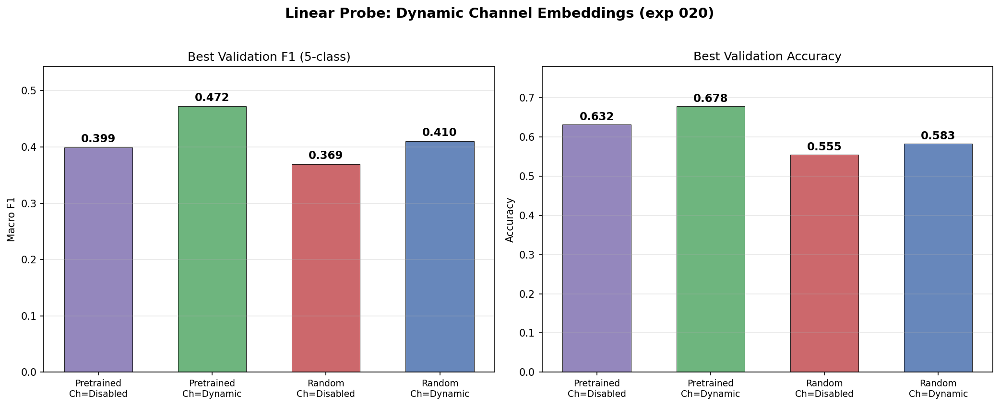
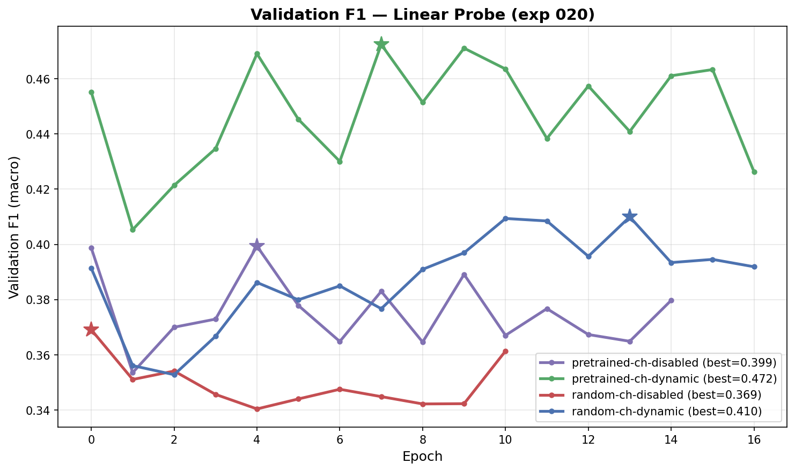
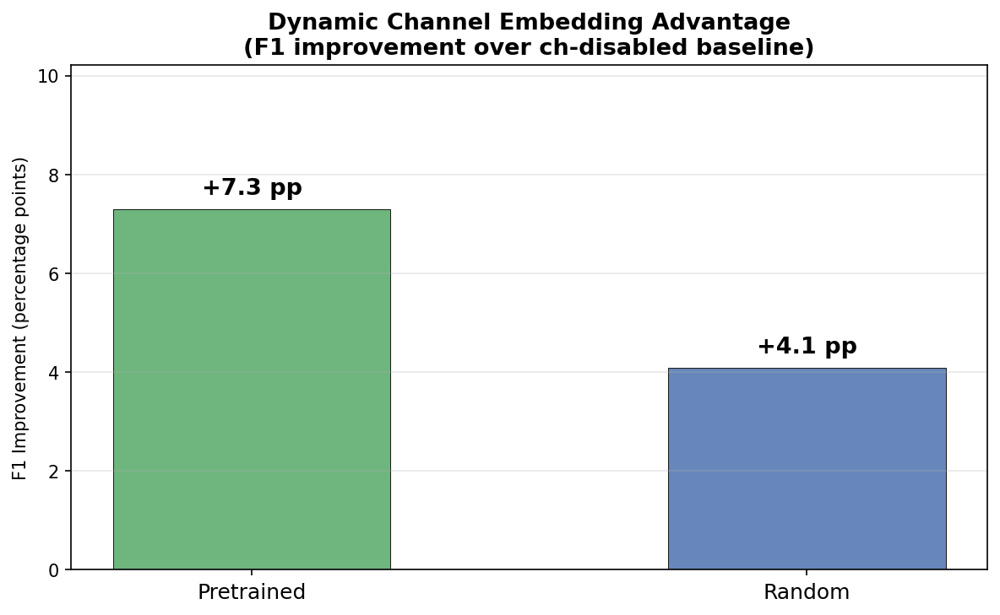
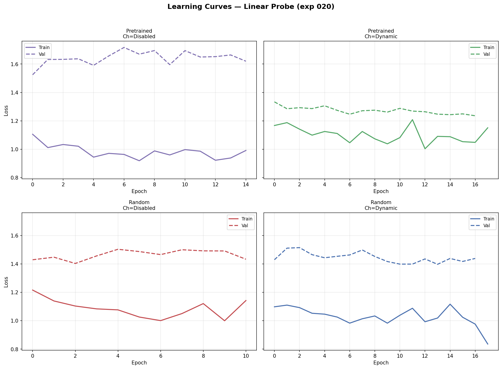

# Linear Probing: Dynamic Channel Embeddings

**Status:** Completed
**Date started:** 2026-07-28
**Parent experiment:** [Dynamic Channel Embedding Analysis](../experiments/019-dynamic-channel-embedding-analysis.md)
**Follow-up experiments:** [CWT CNN with Dynamic Channel Embeddings](../experiments/021-cwt-cnn-dynamic-channel-emb.md), [KempSleep Baselines and Finetuning](../experiments/022-kemp-baselines-finetune-cwt-dynch.md)

## Background

Experiment 019 visualized the backbone and channel embeddings from the dynamic
channel embedding models (exp 018) and found that:

1. The dynamic model's backbone embeddings show more geometric structure than
   the disabled baseline, but this structure does **not** clearly align with
   sleep stage boundaries (partially refuted).
2. The dynamic channel embeddings do **not** cluster by electrode type — both
   channels are entangled along an arch (refuted).
3. Sleep stage labels show band-like organization along the channel embedding
   arch, suggesting the channel encoder captures brain-state-related statistics
   (partially supported).

Visualization alone cannot determine whether the dynamic model's
representations are actually better for downstream sleep staging. A linear
probe test — freezing the backbone and training only a linear classification
head — directly measures how much discriminative information for sleep staging
exists in the pretrained representations, without the confound of finetuning
overwriting features.

This is the same methodology used in experiment 008, which showed that
CWT-CNN pretraining gave a substantial +15 pp F1 advantage in linear probing,
confirming that reconstruction pretraining can learn sleep-stage-relevant
features.

## Question

Does the dynamic channel embedding model (exp 018) produce backbone
representations with more linearly separable sleep stage information than
the disabled baseline or random initialization?

## Hypothesis

The dynamic model's substantially better reconstruction loss (0.11 vs 0.40)
should translate into at least a modest advantage in linear probing F1, even
though the embedding visualizations were not conclusive. If the dynamic model
shows no linear probe advantage over disabled, it would suggest that the
reconstruction improvement comes from the channel encoder capturing low-level
signal structure rather than learning discriminative brain-state features in
the backbone.

## Experiment

### Setup

- **Model:** POYOEEGModel, embed_dim=256, depth=4, ResampleCNN tokenizer
  (same architecture as exp 018)
- **Data:** KempSleepEDF2013, intersubject split, fold 0 (validation set for
  evaluation)
- **Task:** 5-class sleep staging linear probe — freeze backbone, train only
  a linear classification head
- **Conditions:**

| Condition              | channel_emb_mode | Init       | Source checkpoint                      |
| ---------------------- | ---------------- | ---------- | -------------------------------------- |
| random-ch-disabled     | `disabled`       | Random     | None                                   |
| random-ch-dynamic      | `dynamic`        | Random     | None                                   |
| pretrained-ch-disabled | `disabled`       | Pretrained | exp 018 `pretrain_dynch_ch-disabled`   |
| pretrained-ch-dynamic  | `dynamic`        | Pretrained | exp 018 `pretrain_dynch_ch-dynamic`    |

- **Training:** lr=1e-3, batch_size=512, max_epochs=100, early stopping on
  val F1 (patience=10), only the linear head is trainable
- **Hardware:** 1× GPU (linear probing is lightweight)

### Launch command

```bash
# --- SLURM: 4 jobs total (2 pretrained + 2 random) ---

# Pretrained backbone conditions (2 jobs: ch-disabled, ch-dynamic):
uv run python main.py experiment=sleep_staging/poyo_kemp_linear_probe_dynch \
    run.init_mode=pretrained -m

# Random-init backbone conditions (2 jobs: ch-disabled, ch-dynamic):
uv run python main.py experiment=sleep_staging/poyo_kemp_linear_probe_dynch \
    run.init_mode=random run.pretrained_checkpoint=null -m
```

Each command submits 2 SLURM jobs via Hydra multirun, sweeping
`model.channel_emb_mode` over `disabled` and `dynamic`. The experiment config
(`poyo_kemp_linear_probe_dynch`) selects the matching exp 018 checkpoint per
channel mode for the pretrained runs.

### Key config overrides

- Base experiment: `sleep_staging/poyo_kemp_linear_probe_dynch` (dedicated exp
  020 config; extends the exp 008 linear probe setup)
- `model/tokenizer=per_channel_resample_cnn` (matches exp 018 architecture)
- `model/session_emb=disabled` (matches exp 018 — no session embeddings)
- `model.channel_emb_mode` swept over `disabled` / `dynamic`
- `run.pretrained_transfer_mode=permissive` (checkpoint from
  MaskedPOYOEEGModel loaded into POYOEEGModel; non-matching keys skipped)
- `run.freeze_pretrained=true` / `run.freeze_backbone=true` (freeze backbone
  for linear probing)
- Single fold (fold 0) only

### WandB

- **Project:** `foundry_finetuning`
- **Group:** `KEMP_LINEAR_PROBE_DYNCH`

| Condition              | Run name                             | Run ID     |
| ---------------------- | ------------------------------------ | ---------- |
| pretrained-ch-disabled | `kemp_lp_020_pretrained_ch_disabled` | `zmg07ep4` |
| pretrained-ch-dynamic  | `kemp_lp_020_pretrained_ch_dynamic`  | `osqqcdrj` |
| random-ch-disabled     | `kemp_lp_020_random_ch_disabled`     | `t54gr0yj` |
| random-ch-dynamic      | `kemp_lp_020_random_ch_dynamic`      | `ip8xktxl` |

Note: the two dynamic runs show `state=failed` (SLURM timeout) but completed
enough epochs to reach early-stopping-quality results and are usable.

## Results

### Summary

The dynamic channel embedding model produces backbone representations with
substantially more linearly separable sleep stage information than the disabled
baseline. The pretrained dynamic condition achieves the highest linear probe
F1 (0.472), beating pretrained disabled (0.399) by **+7.3 pp** — a wide margin
for a linear probe comparison. The dynamic advantage holds even without
pretraining: random dynamic (0.410) beats random disabled (0.369) by +4.1 pp.

Pretraining also helps within each channel mode, but the dynamic channel
embedding is the larger factor: the dynamic advantage (+7.3 pp pretrained,
+4.1 pp random) exceeds the pretraining advantage (+6.2 pp dynamic, +3.0 pp
disabled).

### Metrics

| Condition              | Val F1 | Val Acc | Val Loss | Best F1 Epoch | Max Epoch | Run ID     |
| ---------------------- | -----: | ------: | -------: | ------------: | --------: | ---------- |
| pretrained-ch-dynamic  | 0.4724 |  0.6782 |   1.2356 |             7 |        17 | `osqqcdrj` |
| random-ch-dynamic      | 0.4100 |  0.5829 |   1.3971 |            13 |        17 | `ip8xktxl` |
| pretrained-ch-disabled | 0.3994 |  0.6319 |   1.5246 |             4 |        14 | `zmg07ep4` |
| random-ch-disabled     | 0.3691 |  0.5550 |   1.4031 |             0 |        10 | `t54gr0yj` |

**Pairwise F1 comparisons:**

| Comparison                           | ΔF1 (pp) |
| ------------------------------------ | -------: |
| Dynamic vs Disabled (pretrained)     |    +7.3  |
| Pretrained vs Random (dynamic)       |    +6.2  |
| Dynamic vs Disabled (random)         |    +4.1  |
| Pretrained vs Random (disabled)      |    +3.0  |

### Analysis

**Analysis script:** `analysis/020_linear_probe_dynamic_channel_emb.py`

```bash
uv run python analysis/020_linear_probe_dynamic_channel_emb.py
```

### Figures

**F1 and accuracy comparison across all 4 conditions:**



**Validation F1 learning curves:**



**Dynamic channel embedding F1 advantage over disabled baseline:**



**Train/val loss curves per condition:**



## Conclusions

**Hypothesis supported.** The dynamic channel embedding model's better
reconstruction loss (0.11 vs 0.40 in exp 018) does translate into meaningfully
better linear probe performance for downstream sleep staging. The pretrained
dynamic backbone achieves 0.472 F1 versus 0.399 for pretrained disabled —
a +7.3 pp advantage that confirms the dynamic model learns more discriminative
features in its backbone, not just better channel-level signal reconstruction.

This result resolves the ambiguity from experiment 019, where embedding
visualizations showed more geometric structure in the dynamic model but
inconclusive sleep-stage separability (and actually worse silhouette scores).
The linear probe demonstrates that the dynamic model's representations are
genuinely more useful for classification, even though this advantage is not
easily visible in 2D projections.

The fact that dynamic embeddings also help in the random-init condition
(+4.1 pp) suggests that the `RelativeChannelEncoder` architecture itself
provides a useful inductive bias for sleep staging — it is not purely a
pretraining interaction effect.

## Notes for future experiments

- **Finetuning is the next step.** Now that linear probing confirms the
  pretrained dynamic backbone captures discriminative features, full
  finetuning (or progressive unfreezing) should amplify the advantage. The
  +7.3 pp linear probe gap may translate into an even larger finetuned gap
  if the dynamic model's features are better starting points for
  gradient-based adaptation.
- **Compare with CWT-CNN linear probe results from experiment 008.** That
  experiment showed a +15 pp F1 advantage for CWT-CNN pretraining; the
  dynamic channel embedding's +7.3 pp is smaller but uses a different
  tokenizer (ResampleCNN). A direct comparison holding the tokenizer
  constant would clarify whether the channel embedding or tokenizer
  contributes more.
- The dynamic advantage in the random-init condition (+4.1 pp) suggests the
  `RelativeChannelEncoder` provides architectural benefits beyond what it
  learns during pretraining — worth investigating whether the channel
  encoder's cross-channel attention acts as an implicit data augmentation
  or regularization mechanism.
