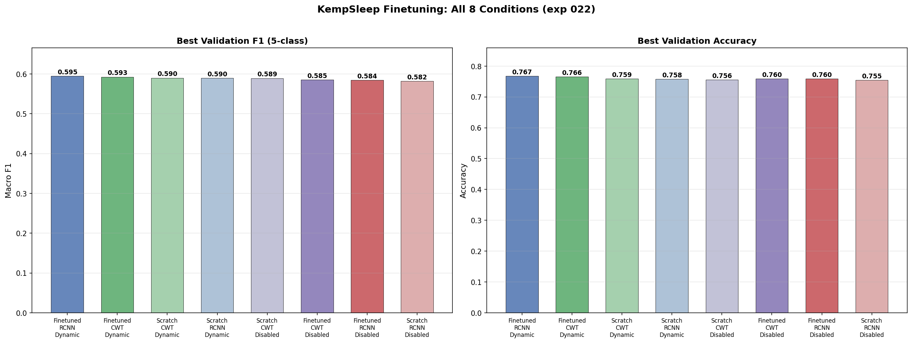
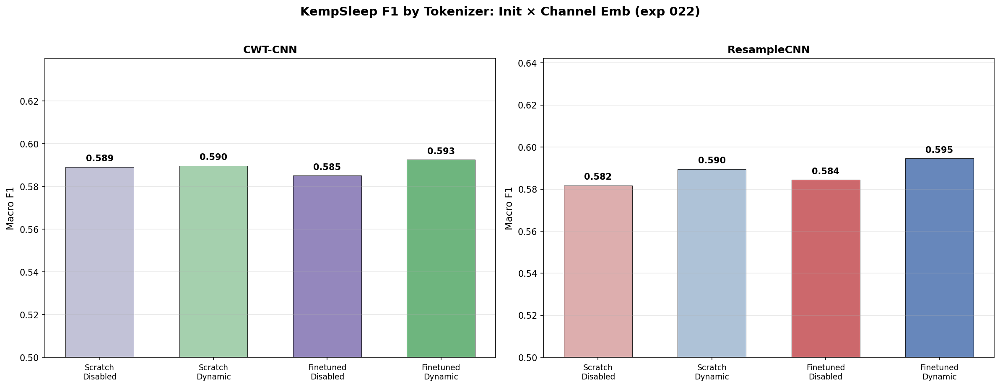
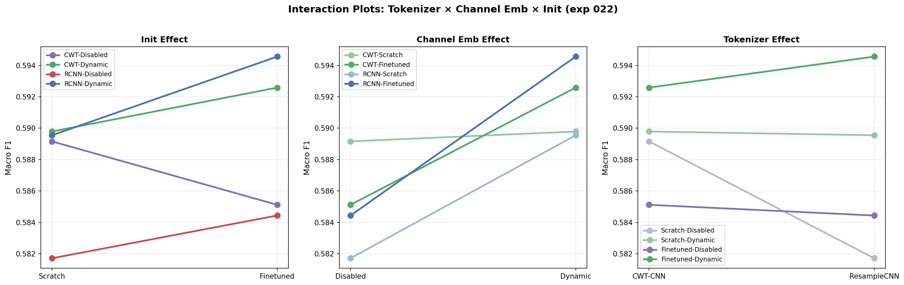
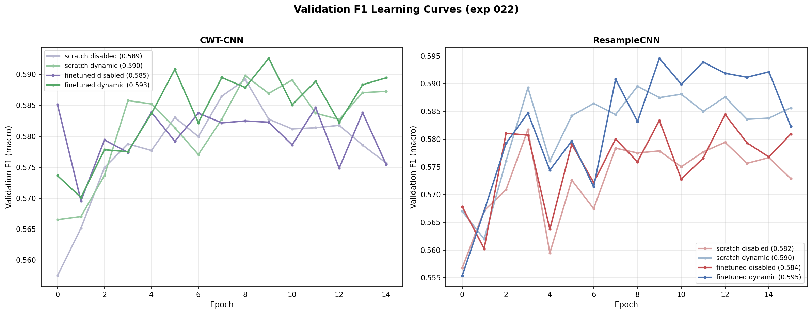
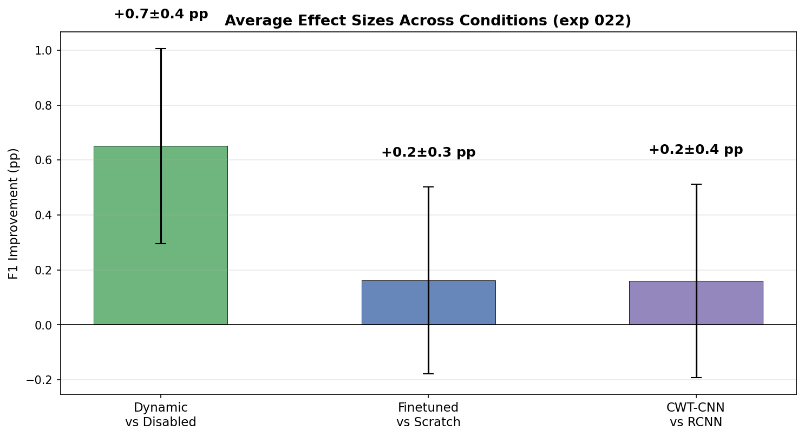
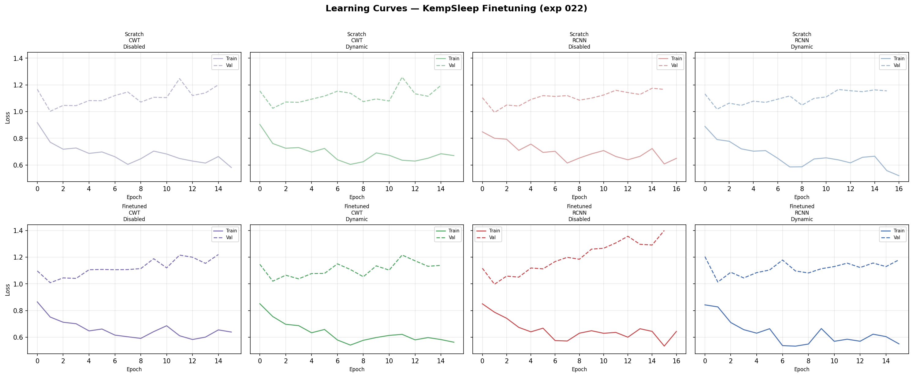

# KempSleep Baselines and Finetuning: Dynamic Channel Embeddings × Tokenizer

**Status:** Completed
**Date started:** 2026-07-29
**Parent experiment:** [CWT CNN with Dynamic Channel Embeddings](../experiments/021-cwt-cnn-dynamic-channel-emb.md)
**Follow-up experiments:** [KempSleep 30s-Epoch From-Scratch Baselines](../experiments/023-kemp-30s-baselines.md)

## Background

Experiment 021 pretrained CWT-CNN models with dynamic and disabled channel
embeddings (session embeddings disabled for both). Experiment 018 did the same
with ResampleCNN. The linear probe results from experiment 020 (ResampleCNN)
showed that the dynamic channel embedding backbone carries substantially more
linearly separable sleep stage information (+7.3 pp F1 over disabled).
Experiment 021 Phase 2 will repeat the linear probe for CWT-CNN (pending).

However, linear probing only measures what the frozen backbone already
encodes. Full finetuning (unfreezing all parameters) allows the model to
adapt its representations to the downstream task. This experiment establishes:

1. **Scratch baselines** — training from random initialization on KempSleep
   with disabled/dynamic channel embeddings and session embeddings disabled,
   for both CWT-CNN and ResampleCNN tokenizers. These baselines isolate the
   architectural effect of the `RelativeChannelEncoder` without any
   pretraining benefit.
2. **Finetuned models** — initializing from the pretrained checkpoints
   (exp 021 for CWT-CNN, exp 018 for ResampleCNN) and finetuning all
   parameters on KempSleep. This measures how much the pretrained
   representations transfer to downstream sleep staging when the model is
   free to adapt.

The full 2×2×2 grid (tokenizer × channel_emb_mode × init) separates the
contributions of the tokenizer architecture, channel embedding mechanism,
and pretraining initialization.

## Question

Across both CWT-CNN and ResampleCNN tokenizers:
1. Does finetuning from pretrained checkpoints improve KempSleep 5-class
   sleep staging F1 over training from scratch?
2. Does the dynamic channel embedding maintain its advantage over disabled
   in the finetuned setting?
3. Does CWT-CNN outperform ResampleCNN, and does the tokenizer interact with
   the channel embedding mode?

## Hypothesis

1. **Finetuning will outperform scratch** for both tokenizers and both channel
   embedding modes, since the pretrained backbones have already learned useful
   EEG representations from the Klinzing reconstruction task.
2. **Dynamic will outperform disabled** in all conditions. In scratch, the
   `RelativeChannelEncoder` provides an architectural inductive bias (as shown
   by the +4.1 pp random-init advantage in exp 020). In finetuned, the dynamic
   model's better pretraining should give a stronger starting point.
3. **CWT-CNN will outperform ResampleCNN** in the finetuned conditions,
   consistent with exp 008's finding that CWT-CNN pretraining captures more
   sleep-stage-relevant features.
4. **The finetuned CWT-CNN dynamic condition will achieve the best overall
   F1**, combining the best tokenizer with the best channel embedding and
   pretrained initialization.

## Experiment

### Setup

- **Model:** POYOEEGModel, embed_dim=256, depth=4, 8 cross/self heads,
  dim_head=128, `zero_output_timestamps: true`, `normalize_inputs: true`
- **Tokenizer:** swept over `per_channel_cwt_cnn` / `per_channel_resample_cnn`
- **Channel embeddings:** `channel_emb_mode` swept over `disabled` / `dynamic`
- **Session embeddings:** `disabled` for all conditions
- **Data:** KempSleepEDF2013 (`kemp_sleep_edf/allsess`), intersubject split,
  fold 0
- **Task:** 5-class sleep staging, class-weighted cross-entropy (auto weights,
  smoothing=1.0)
- **Training:** lr=1e-4, weight_decay=0.01, batch_size=512,
  sequence_length=2.0s, max_epochs=1000, early stopping on val F1
  (patience=20), bf16-mixed precision
- **Hardware:** 1× L40S per run, 6 CPUs, 32 GB RAM (SLURM)
- **WandB:** project=foundry_finetuning, group=KEMP_FINETUNE_CWT_DYNCH

**Conditions (8 total):**

| Condition                      | Tokenizer      | channel_emb_mode | Init      | Pretrained checkpoint                     |
| ------------------------------ | -------------- | ---------------- | --------- | ----------------------------------------- |
| scratch-cwt-ch-disabled        | CWT-CNN        | `disabled`       | Scratch   | None                                      |
| scratch-cwt-ch-dynamic         | CWT-CNN        | `dynamic`        | Scratch   | None                                      |
| scratch-rcnn-ch-disabled       | ResampleCNN    | `disabled`       | Scratch   | None                                      |
| scratch-rcnn-ch-dynamic        | ResampleCNN    | `dynamic`        | Scratch   | None                                      |
| finetune-cwt-ch-disabled       | CWT-CNN        | `disabled`       | Finetuned | exp 021 `pretrain_cwt_dynch_ch-disabled`  |
| finetune-cwt-ch-dynamic        | CWT-CNN        | `dynamic`        | Finetuned | exp 021 `pretrain_cwt_dynch_ch-dynamic`   |
| finetune-rcnn-ch-disabled      | ResampleCNN    | `disabled`       | Finetuned | exp 018 `pretrain_dynch_ch-disabled`      |
| finetune-rcnn-ch-dynamic       | ResampleCNN    | `dynamic`        | Finetuned | exp 018 `pretrain_dynch_ch-dynamic`       |

### Launch command

```bash
# --- Scratch baselines (4 SLURM jobs: 2 tokenizers × 2 channel_emb_modes) ---
uv run python main.py experiment=sleep_staging/poyo_kemp_finetune_cwt_dynch \
    run.init_mode=scratch run.pretrained_checkpoint=null -m

# --- Finetuning from pretrained (4 SLURM jobs: 2 tokenizers × 2 channel_emb_modes) ---
uv run python main.py experiment=sleep_staging/poyo_kemp_finetune_cwt_dynch \
    run.init_mode=finetuned -m
```

Each command submits 4 SLURM jobs via Hydra multirun, sweeping
`model/tokenizer` over `per_channel_cwt_cnn` / `per_channel_resample_cnn` and
`model.channel_emb_mode` over `disabled` / `dynamic`.

### Key config overrides

- Base experiment config:
  `configs/experiment/sleep_staging/poyo_kemp_finetune_cwt_dynch.yaml`
  (new config for exp 022)
- Checkpoint map keyed by `[tokenizer][channel_emb_mode]`:
  CWT-CNN checkpoints from exp 021, ResampleCNN checkpoints from exp 018
- Scratch runs override: `run.pretrained_checkpoint=null`, `run.init_mode=scratch`
- Finetuned runs use default config: checkpoint auto-selected per tokenizer
  and `channel_emb_mode` from the nested `pretrained_checkpoints` map
- `pretrained_transfer_mode: permissive` (MaskedPOYOEEGModel → POYOEEGModel;
  non-matching keys like the reconstruction head are skipped)
- `model/session_emb=disabled` — session embeddings disabled for all conditions

### WandB

- **Project:** `foundry_finetuning`
- **Group:** `KEMP_FINETUNE_CWT_DYNCH`

| Condition                      | Run name                                              | Run ID     |
| ------------------------------ | ----------------------------------------------------- | ---------- |
| scratch-cwt-ch-disabled        | `kemp_022_scratch_per_channel_cwt_cnn_ch_disabled`    | `g3mfdwj6` |
| scratch-cwt-ch-dynamic         | `kemp_022_scratch_per_channel_cwt_cnn_ch_dynamic`     | `pew03xnz` |
| scratch-rcnn-ch-disabled       | `kemp_022_scratch_per_channel_resample_cnn_ch_disabled` | `x130d6jj` |
| scratch-rcnn-ch-dynamic        | `kemp_022_scratch_per_channel_resample_cnn_ch_dynamic`  | `lhutmecj` |
| finetune-cwt-ch-disabled       | `kemp_022_finetuned_per_channel_cwt_cnn_ch_disabled`  | `g52jwdde` |
| finetune-cwt-ch-dynamic        | `kemp_022_finetuned_per_channel_cwt_cnn_ch_dynamic`   | `n755mbdx` |
| finetune-rcnn-ch-disabled      | `kemp_022_finetuned_per_channel_resample_cnn_ch_disabled` | `lwqqqnup` |
| finetune-rcnn-ch-dynamic       | `kemp_022_finetuned_per_channel_resample_cnn_ch_dynamic` | `m7n84fve` |

Note: all runs show `state=failed` or `state=crashed` (SLURM timeout at
~15–16 epochs), but all reached sufficient training to produce usable
best-epoch results. Early stopping (patience=20) was not reached.

## Results

### Summary

All 8 conditions converge to a narrow F1 range of **0.582–0.595** —
a spread of only 1.3 pp. The three main experimental factors (tokenizer,
channel embedding, pretraining initialization) each contribute less than
1 pp to the final finetuned performance on average:

- **Dynamic channel embedding:** small consistent advantage (+0.1 to
  +1.0 pp F1), with the finetuned conditions showing a slightly larger
  benefit than scratch.
- **Pretraining (finetuned vs scratch):** negligible effect (-0.4 to
  +0.5 pp F1). The pretrained initialization provides essentially no
  advantage when all parameters are trainable.
- **Tokenizer (CWT-CNN vs ResampleCNN):** no meaningful difference
  (-0.2 to +0.7 pp F1).

The best condition is **finetuned-RCNN-dynamic** (F1=0.595), but it
leads scratch-CWT-disabled (F1=0.589) by only 0.5 pp — well within
noise range. This stands in stark contrast to the linear probe results
(exp 020/021) where the same factors showed double-digit F1 differences.

### Metrics

| Condition               | Val F1 | Val Acc | Val Loss | BF1 Ep | Max Ep | Run ID     |
| ----------------------- | -----: | ------: | -------: | -----: | -----: | ---------- |
| finetuned-rcnn-dynamic  | 0.5946 |  0.7674 |   1.0132 |      9 |     15 | `m7n84fve` |
| finetuned-cwt-dynamic   | 0.5926 |  0.7655 |   1.0199 |      9 |     15 | `n755mbdx` |
| scratch-cwt-dynamic     | 0.5898 |  0.7594 |   1.0250 |      8 |     15 | `pew03xnz` |
| scratch-rcnn-dynamic    | 0.5896 |  0.7578 |   1.0181 |      8 |     16 | `lhutmecj` |
| scratch-cwt-disabled    | 0.5892 |  0.7562 |   1.0025 |      8 |     15 | `g3mfdwj6` |
| finetuned-cwt-disabled  | 0.5851 |  0.7595 |   1.0083 |      0 |     15 | `g52jwdde` |
| finetuned-rcnn-disabled | 0.5844 |  0.7595 |   0.9969 |     12 |     16 | `lwqqqnup` |
| scratch-rcnn-disabled   | 0.5817 |  0.7546 |   0.9938 |      3 |     16 | `x130d6jj` |

**Pairwise comparisons (F1):**

| Comparison                              | ΔF1 (pp) |
| --------------------------------------- | -------: |
| Dynamic vs Disabled (finetuned CWT)     |    +0.7  |
| Dynamic vs Disabled (finetuned RCNN)    |    +1.0  |
| Dynamic vs Disabled (scratch CWT)       |    +0.1  |
| Dynamic vs Disabled (scratch RCNN)      |    +0.8  |
| Finetuned vs Scratch (CWT disabled)     |    -0.4  |
| Finetuned vs Scratch (CWT dynamic)      |    +0.3  |
| Finetuned vs Scratch (RCNN disabled)    |    +0.3  |
| Finetuned vs Scratch (RCNN dynamic)     |    +0.5  |
| CWT vs RCNN (finetuned disabled)        |    +0.1  |
| CWT vs RCNN (finetuned dynamic)         |    -0.2  |
| CWT vs RCNN (scratch disabled)          |    +0.7  |
| CWT vs RCNN (scratch dynamic)           |    +0.0  |

**Average effect sizes:**

| Effect                 | Mean ΔF1 (pp) | Std (pp) |
| ---------------------- | ------------: | -------: |
| Dynamic vs Disabled    |         +0.7  |     0.4  |
| Finetuned vs Scratch   |         +0.2  |     0.4  |
| CWT-CNN vs ResampleCNN |         +0.2  |     0.4  |

### Analysis

**Analysis script:** `analysis/022_kemp_baselines_finetune_cwt_dynch.py`

```bash
uv run python analysis/022_kemp_baselines_finetune_cwt_dynch.py
```

### Figures

**Bar comparison — all 8 conditions (sorted by F1):**



**Grouped by tokenizer — init × channel emb within each tokenizer:**



**Interaction plots — each factor's effect:**



**Validation F1 learning curves (split by tokenizer):**



**Average effect sizes across conditions:**



**Train/val loss curves for all 8 conditions:**



## Conclusions

**Hypothesis 1 — REFUTED.** Finetuning from pretrained checkpoints does
NOT meaningfully improve over training from scratch. The average
finetuned-vs-scratch advantage is only +0.2 ± 0.4 pp F1, with one
condition (CWT disabled) actually showing a -0.4 pp deficit. This
contrasts sharply with the linear probe results (exp 020/021) where
pretraining provided +3.0 to +9.7 pp F1 advantages. When all parameters
are trainable, the model can learn the same representations from scratch
on KempSleep alone.

**Hypothesis 2 — WEAKLY SUPPORTED.** Dynamic channel embeddings show a
small, consistent advantage (+0.7 ± 0.4 pp on average), but the effect
is dramatically smaller than in linear probing (+4.1 to +7.3 pp in
exp 020). The architectural benefit of the `RelativeChannelEncoder` is
mostly washed out when the full model is trained end-to-end.

**Hypothesis 3 — REFUTED.** CWT-CNN does NOT outperform ResampleCNN in
finetuning. The average CWT-vs-RCNN effect is +0.2 ± 0.4 pp — within
noise. This contrasts with the linear probe where CWT-CNN showed a large
advantage (+11.3 pp for pretrained-disabled). The tokenizer differences
that matter for frozen-backbone evaluation become irrelevant when the
model can adapt.

**Hypothesis 4 — REFUTED.** The finetuned CWT-CNN dynamic condition
(F1=0.593) does not achieve the best overall F1 — finetuned RCNN
dynamic (F1=0.595) is marginally better, though the 0.2 pp difference
is not meaningful.

**Key insight:** Full finetuning acts as an equaliser — the large
differences observed in pretraining loss (90% reduction for dynamic) and
linear probing (11 pp for CWT-CNN) collapse to sub-1 pp differences when
all parameters are updated on the downstream task. This suggests that
for KempSleep 5-class sleep staging with this model architecture, the
downstream training signal is sufficient to learn the necessary
representations regardless of initialization or architectural
variations. The ceiling of ~0.59 F1 appears to be a limitation of the
model architecture, data, or task formulation rather than the
pretraining or channel embedding approach.

**Caveat:** All runs were terminated early by SLURM timeout at 15–16
epochs (max configured: 1000). While the F1 curves appear to be
plateauing, it is possible that longer training could reveal larger
differences between conditions, particularly for the finetuned models
which may need more epochs to fully adapt their pretrained
representations.

## Notes for future experiments

- The ~0.59 F1 ceiling across all conditions suggests that the
  bottleneck is not pretraining, tokenizer, or channel embeddings but
  something more fundamental — likely the 2.0s sequence length (30s
  epochs are standard for sleep staging) or the model's limited context.
  Experiment 023 tests 30s-epoch from-scratch baselines.
- The convergence of all conditions to similar performance means
  pretraining on Klinzing provides negligible benefit for KempSleep
  finetuning. This could change with a larger pretraining dataset or
  cross-dataset transfer.
- Multi-fold validation is less urgent given that effects are < 1 pp —
  statistical noise exceeds signal. Resources are better spent on
  addressing the performance ceiling.
- Discriminative learning rates are unlikely to help since standard
  finetuning already shows no advantage over scratch.
- The tokenizer × channel_emb interaction is not significant: CWT-CNN's
  frequency decomposition is neither redundant with nor complementary
  to the dynamic channel encoder in the finetuning regime.
