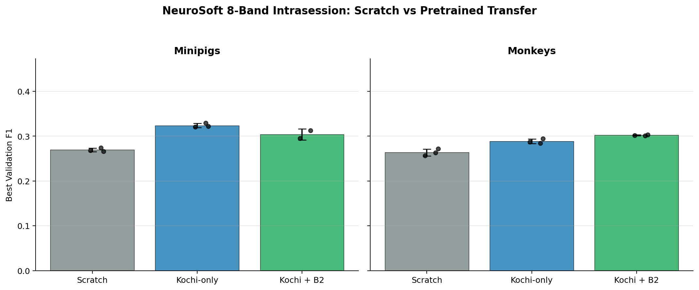
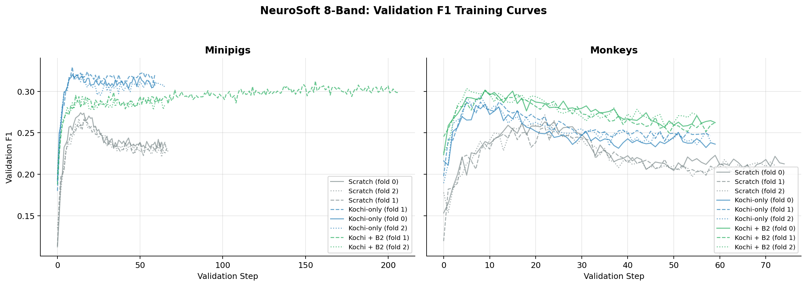
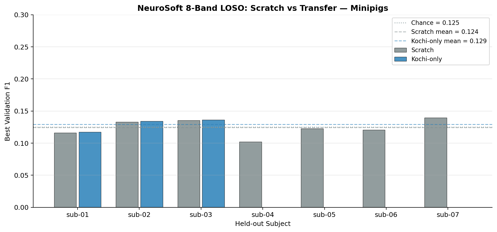
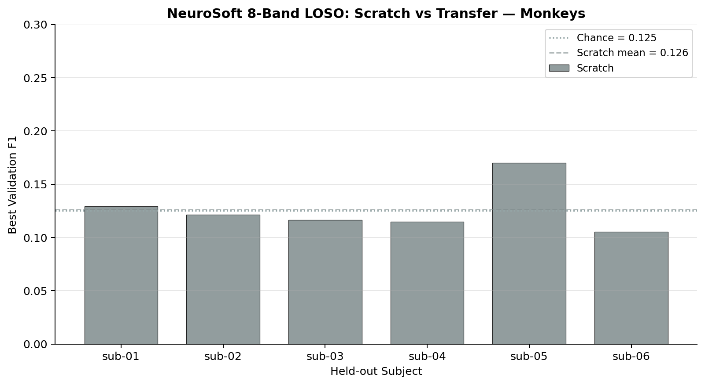

# Leak-Fixed iEEG Pretraining for Neurosoft Transfer

**Status:** Completed
**Date started:** 2026-08-14
**Parent experiment:** [Information Leak Fixes: Channel Encoder Masking + Signal Zeroing + Tokenizer Comparison](../05-pretraining-parameter-exploration/20260812-MS-channel-encoder-leak-fix-impact.md)
**Follow-up experiments:** [NeuroSoft Intrasession Multisubject From-Scratch Baselines](20260817-MS-neurosoft-intrasession-baselines.md), [NeuroSoft Leave-One-Subject-Out From-Scratch Baselines](20260817-MS-neurosoft-loso-baselines.md)
**Tags:** pretraining, mae, ieeg, kochi, neurosoft, data_composition, channel_encoder, information_leak, signal_zeroing, cwt_cnn

## Background

The [information-leak fix experiment](../05-pretraining-parameter-exploration/20260812-MS-channel-encoder-leak-fix-impact.md)
showed that masking channel-encoder pooling and zeroing masked raw signal remove
large decoder-side shortcuts.  Both are now the default and must be retained for
all new pretraining.  Although the fixes substantially increase reconstruction
loss, they do not materially change performance on the project's existing EEG
downstream suite.

The earlier [paradigm-diversity experiment](../02-data-scaling/20260807-MS-paradigm-diversity-pretrain.md)
trained Kochi-containing models before these fixes.  It found that Kochi did not
help the usual sleep, motor-imagery, and P300 benchmarks, but those are not the
target of this work.  This experiment instead creates two leak-fixed initializers
for the forthcoming Neurosoft iEEG benchmark: a source-specific Kochi model and
a higher-volume model that combines Kochi with B2's three EEG sources (Klinzing,
Shirazi, and Pavlov).

The decisive outcome will be Neurosoft 8-band acoustic-stimulus F1, measured in
a separate downstream experiment alongside a matched no-pretraining baseline.
Reconstruction loss is recorded only as a training diagnostic; its scale is not
comparable with pre-fix runs.

## Question

For Neurosoft iEEG acoustic-stimulus decoding, does leak-fixed pretraining on
Kochi alone or on Kochi plus the B2 EEG sources provide the strongest transfer
initialization relative to no pretraining?

## Hypothesis

Both leak-fixed pretrained initializations will improve Neurosoft validation F1
over a matched no-pretraining control.  Kochi-only pretraining will provide the
stronger transfer initialization because its variable-channel, iEEG-oriented
source is closer to the intended target than the additional scalp-EEG sources;
the higher-volume Kochi + B2 model may trade this source specificity for broader
signal diversity.

## Experiment

### Setup

- **Model:** Masked POYO EEG with CWT-CNN tokenizer, dynamic channel embeddings,
  disabled session embeddings, and both leak fixes enabled (defaults:
  `disable_channel_encoder_token_mask=false`, `zero_masked_signal=true`).
- **Data:** Kochi Visual Naming alone, or Kochi plus B2's Klinzing, Shirazi, and
  Pavlov datasets.  The mixed arm contains substantially more channel-hours, so
  this comparison tests source configuration rather than modality alone.
- **Task:** MAE masked reconstruction with TemporalBlockMasking
  (`mask_ratio=0.5`, `block_size=10`).
- **Training:** 400k maximum steps; batch size 64; learning rate 1e-4; 2k-step
  warmup followed by cosine decay; bf16 mixed precision; intersubject
  validation; early-stopping patience 10.
- **WandB:** project `foundry_pretraining`, group `IEEG_LEAK_FIXED_PRETRAIN`.
- **Evaluation:** Full supervised finetuning on paired, architecture-matched
  NeuroSoft recipes. Each initialization is evaluated for minipigs and monkeys
  over three `intrasession-block` folds (12 jobs) and every fixed LOSO subject
  assignment (seven minipigs plus six monkeys per initialization; 26 jobs),
  alongside the paired from-scratch baselines. The 38 downstream transfer jobs
  use `val/neurosoft_acoustic_stim_8band_f1` as their primary metric; the
  existing EEG downstream suite is intentionally out of scope.
- **Checkpoint selection:** Use the best validation checkpoint from each
  completed pretraining run, not its final training-state checkpoint:

| Initialization | Checkpoint | Strict transfer validation |
| --- | --- | --- |
| Kochi-only | `${oc.env:SCRATCH}/runs/IEEG_LEAK_FIXED_PRETRAIN/pretrain_ieeg_kochi_fixed/checkpoints/best-step315000-val_loss_0.6941.ckpt` | Verified: 93 loaded; 0 missing or mismatched |
| Kochi + B2 | `${oc.env:SCRATCH}/runs/IEEG_LEAK_FIXED_PRETRAIN/pretrain_ieeg_kochi_b2_fixed/checkpoints/best-step200000-val_loss_0.2815.ckpt` | Verified: 93 loaded; 0 missing or mismatched |

The downstream configurations preserve the pretraining architecture
(CWT-CNN concat tokenizer, dynamic channels, disabled session embeddings,
256-dimensional backbone). `run.pretrained_transfer_mode=strict` is retained
so a missing or shape-incompatible transferable tensor aborts before training
rather than silently producing a partial initialization.

### Launch command

```bash
# Kochi-only, leak-fixed iEEG pretraining
uv run python main.py experiment=pretraining/poyo_masking_seqlen_sweep \
  data=openneuro/kochi_only \
  run.name=pretrain_ieeg_kochi_fixed \
  run.group=IEEG_LEAK_FIXED_PRETRAIN -m

# Kochi plus the three B2 EEG datasets, with the same leak-fixed setup
uv run python main.py experiment=pretraining/poyo_masking_seqlen_sweep \
  data=openneuro/three_dataset_pretrain \
  data.dataset_kwargs.brainsets=[klinzing_sleep_ds005555,shirazi_hbnr1_ds005505,pavlov_verbal_wm_ds003655,kochi_visualnaming_ds006914] \
  run.name=pretrain_ieeg_kochi_b2_fixed \
  run.group=IEEG_LEAK_FIXED_PRETRAIN -m

# Downstream finetuning: each command submits three independent block folds.
# The quoted run.name keeps Hydra's fold interpolation intact in the shell.
uv run python main.py experiment=auditory_decoding/neurosoft_8band_intrasession_scratch_minipigs \
  run.pretrained_checkpoint="$SCRATCH/runs/IEEG_LEAK_FIXED_PRETRAIN/pretrain_ieeg_kochi_fixed/checkpoints/best-step315000-val_loss_0.6941.ckpt" \
  'run.name=neurosoft_8b_intrasession_kochi_fixed_minipigs_fold${hyperparameters.fold_number}' \
  run.group=NEUROSOFT_8B_INTRASESSION_PRETRAIN_TRANSFER_MINIPIGS -m

uv run python main.py experiment=auditory_decoding/neurosoft_8band_intrasession_scratch_monkeys \
  run.pretrained_checkpoint="$SCRATCH/runs/IEEG_LEAK_FIXED_PRETRAIN/pretrain_ieeg_kochi_fixed/checkpoints/best-step315000-val_loss_0.6941.ckpt" \
  'run.name=neurosoft_8b_intrasession_kochi_fixed_monkeys_fold${hyperparameters.fold_number}' \
  run.group=NEUROSOFT_8B_INTRASESSION_PRETRAIN_TRANSFER_MONKEYS -m

uv run python main.py experiment=auditory_decoding/neurosoft_8band_intrasession_scratch_minipigs \
  run.pretrained_checkpoint="$SCRATCH/runs/IEEG_LEAK_FIXED_PRETRAIN/pretrain_ieeg_kochi_b2_fixed/checkpoints/best-step200000-val_loss_0.2815.ckpt" \
  'run.name=neurosoft_8b_intrasession_kochi_b2_fixed_minipigs_fold${hyperparameters.fold_number}' \
  run.group=NEUROSOFT_8B_INTRASESSION_PRETRAIN_TRANSFER_MINIPIGS -m

uv run python main.py experiment=auditory_decoding/neurosoft_8band_intrasession_scratch_monkeys \
  run.pretrained_checkpoint="$SCRATCH/runs/IEEG_LEAK_FIXED_PRETRAIN/pretrain_ieeg_kochi_b2_fixed/checkpoints/best-step200000-val_loss_0.2815.ckpt" \
  'run.name=neurosoft_8b_intrasession_kochi_b2_fixed_monkeys_fold${hyperparameters.fold_number}' \
  run.group=NEUROSOFT_8B_INTRASESSION_PRETRAIN_TRANSFER_MONKEYS -m

# LOSO transfer finetuning. Each minipig command submits seven held-out
# subjects; each monkey command submits six. Snapshots are stored on shared
# scratch and the arrays run in the long partition.
FOUNDRY_SNAPSHOT_ROOT=/network/scratch/s/sobralm/foundry-launches \
  uv run python main.py experiment=auditory_decoding/neurosoft_8band_loso_scratch_minipigs \
  run.pretrained_checkpoint="$SCRATCH/runs/IEEG_LEAK_FIXED_PRETRAIN/pretrain_ieeg_kochi_fixed/checkpoints/best-step315000-val_loss_0.6941.ckpt" \
  'run.name=neurosoft_8b_loso_kochi_fixed_minipigs_${data.held_out_subject}' \
  run.group=NEUROSOFT_8B_LOSO_PRETRAIN_TRANSFER_MINIPIGS \
  +hydra.launcher.additional_parameters.partition=long -m

FOUNDRY_SNAPSHOT_ROOT=/network/scratch/s/sobralm/foundry-launches \
  uv run python main.py experiment=auditory_decoding/neurosoft_8band_loso_scratch_monkeys \
  run.pretrained_checkpoint="$SCRATCH/runs/IEEG_LEAK_FIXED_PRETRAIN/pretrain_ieeg_kochi_fixed/checkpoints/best-step315000-val_loss_0.6941.ckpt" \
  'run.name=neurosoft_8b_loso_kochi_fixed_monkeys_${data.held_out_subject}' \
  run.group=NEUROSOFT_8B_LOSO_PRETRAIN_TRANSFER_MONKEYS \
  +hydra.launcher.additional_parameters.partition=long -m

FOUNDRY_SNAPSHOT_ROOT=/network/scratch/s/sobralm/foundry-launches \
  uv run python main.py experiment=auditory_decoding/neurosoft_8band_loso_scratch_minipigs \
  run.pretrained_checkpoint="$SCRATCH/runs/IEEG_LEAK_FIXED_PRETRAIN/pretrain_ieeg_kochi_b2_fixed/checkpoints/best-step200000-val_loss_0.2815.ckpt" \
  'run.name=neurosoft_8b_loso_kochi_b2_fixed_minipigs_${data.held_out_subject}' \
  run.group=NEUROSOFT_8B_LOSO_PRETRAIN_TRANSFER_MINIPIGS \
  +hydra.launcher.additional_parameters.partition=long -m

FOUNDRY_SNAPSHOT_ROOT=/network/scratch/s/sobralm/foundry-launches \
  uv run python main.py experiment=auditory_decoding/neurosoft_8band_loso_scratch_monkeys \
  run.pretrained_checkpoint="$SCRATCH/runs/IEEG_LEAK_FIXED_PRETRAIN/pretrain_ieeg_kochi_b2_fixed/checkpoints/best-step200000-val_loss_0.2815.ckpt" \
  'run.name=neurosoft_8b_loso_kochi_b2_fixed_monkeys_${data.held_out_subject}' \
  run.group=NEUROSOFT_8B_LOSO_PRETRAIN_TRANSFER_MONKEYS \
  +hydra.launcher.additional_parameters.partition=long -m
```

### Key config overrides

| Config / override | Purpose |
| --- | --- |
| `configs/experiment/pretraining/poyo_masking_seqlen_sweep.yaml` | Leak-fixed CWT-CNN pretraining recipe and standard 400k-step budget |
| `data=openneuro/kochi_only` | Kochi-only source-specific initialization |
| `data=openneuro/three_dataset_pretrain` | B2 source list used as the base for the mixed arm |
| `data.dataset_kwargs.brainsets=[...]` | Adds Kochi to B2 without duplicating a data config |
| `run.group=IEEG_LEAK_FIXED_PRETRAIN` | Isolates the two checkpoints for later retrieval |
| `run.pretrained_checkpoint=<best checkpoint>` | Initializes each downstream finetuning run from the selected pretraining arm |
| `run.pretrained_transfer_mode=strict` | Requires an exact match for every transferable backbone tensor before training |
| `run.group=NEUROSOFT_8B_INTRASESSION_PRETRAIN_TRANSFER_MINIPIGS` | Groups the two initializations × three folds for minipigs |
| `run.group=NEUROSOFT_8B_INTRASESSION_PRETRAIN_TRANSFER_MONKEYS` | Groups the two initializations × three folds for monkeys |
| `run.group=NEUROSOFT_8B_LOSO_PRETRAIN_TRANSFER_MINIPIGS` | Groups both initializations over seven held-out minipig subjects |
| `run.group=NEUROSOFT_8B_LOSO_PRETRAIN_TRANSFER_MONKEYS` | Groups both initializations over six held-out monkey subjects |
| `hydra.launcher.additional_parameters.partition=long` | Uses the required long partition for the LOSO production arrays |

## Results

### Summary

Pretraining jobs submitted after three-batch GPU smoke tests completed cleanly:

- Kochi-only: SLURM job `10375080` (`pretrain_ieeg_kochi_fixed`)
- Kochi + B2: SLURM job `10375081` (`pretrain_ieeg_kochi_b2_fixed`)

Strict downstream checkpoint-load validation passed for both checkpoints and
both species configurations: all 93 transferable tensors load exactly, with
zero missing or shape-mismatched tensors. The 11 excluded tensors are the
pretraining/task-specific components deliberately outside the transfer policy.

Downstream finetuning submitted on 2026-08-18 (three folds per array):

| Initialization | Species | WandB / output group | SLURM array |
| --- | --- | --- | --- |
| Kochi-only | Minipigs | `NEUROSOFT_8B_INTRASESSION_PRETRAIN_TRANSFER_MINIPIGS` | `10402288` (`_0`–`_2`) |
| Kochi-only | Monkeys | `NEUROSOFT_8B_INTRASESSION_PRETRAIN_TRANSFER_MONKEYS` | `10402329` (`_0`–`_2`) |
| Kochi + B2 | Minipigs | `NEUROSOFT_8B_INTRASESSION_PRETRAIN_TRANSFER_MINIPIGS` | `10402335` (`_0`–`_2`) |
| Kochi + B2 | Monkeys | `NEUROSOFT_8B_INTRASESSION_PRETRAIN_TRANSFER_MONKEYS` | `10402339` (`_0`–`_2`) |

LOSO strict transfer validation also passed for both checkpoints and both
species (93 loaded transferable tensors; zero missing or mismatched).

LOSO finetuning submitted on 2026-08-18 to the `long` partition:

| Initialization | Species | WandB / output group | SLURM array | Immutable snapshot bundle |
| --- | --- | --- | --- | --- |
| Kochi-only | Minipigs | `NEUROSOFT_8B_LOSO_PRETRAIN_TRANSFER_MINIPIGS` | `10402889` (`_0`–`_6`) | `/network/scratch/s/sobralm/foundry-launches/20260818T183152_NEUROSOFT_8B_LOSO_PRETRAIN_TRANSFER_MINIPIGS_da3e9e92_299ef08f` |
| Kochi-only | Monkeys | `NEUROSOFT_8B_LOSO_PRETRAIN_TRANSFER_MONKEYS` | `10402891` (`_0`–`_5`) | `/network/scratch/s/sobralm/foundry-launches/20260818T183226_NEUROSOFT_8B_LOSO_PRETRAIN_TRANSFER_MONKEYS_da3e9e92_47d3870b` |
| Kochi + B2 | Minipigs | `NEUROSOFT_8B_LOSO_PRETRAIN_TRANSFER_MINIPIGS` | `10402897` (`_0`–`_6`) | `/network/scratch/s/sobralm/foundry-launches/20260818T183337_NEUROSOFT_8B_LOSO_PRETRAIN_TRANSFER_MINIPIGS_da3e9e92_88769676` |
| Kochi + B2 | Monkeys | `NEUROSOFT_8B_LOSO_PRETRAIN_TRANSFER_MONKEYS` | `10402903` (`_0`–`_5`) | `/network/scratch/s/sobralm/foundry-launches/20260818T183415_NEUROSOFT_8B_LOSO_PRETRAIN_TRANSFER_MONKEYS_da3e9e92_8a102ca5` |

The initial LOSO submission failed for 22 of 26 jobs due to a Hydra struct
validation error: the LOSO scratch experiment configs did not include
`pretrained_checkpoint` in their `run:` section, so the packed snapshot
launcher rejected the `run.pretrained_checkpoint=...` override when
re-composing the sweep config on the compute node. Four Kochi-only Minipig
jobs (`10402889_0`–`_3`, subjects sub-01 through sub-04) completed before the
failure window.

Fix: added `pretrained_checkpoint: null` to both LOSO experiment configs
(commit `e2f86ea`). Re-launched the 22 failed jobs on 2026-08-18, but these
were subsequently cancelled on 2026-08-19 due to a data staging bug. The LOSO
transfer evaluation has been dropped; only the 4 completed Kochi-only Minipig
runs (sub-01–sub-04) remain.

| Initialization | Species | WandB / output group | SLURM array | Subjects | Status |
| --- | --- | --- | --- | --- | --- |
| Kochi-only | Minipigs | `NEUROSOFT_8B_LOSO_PRETRAIN_TRANSFER_MINIPIGS` | `10408396` (`_0`–`_2`) | sub-05, sub-06, sub-07 | Cancelled |
| Kochi-only | Monkeys | `NEUROSOFT_8B_LOSO_PRETRAIN_TRANSFER_MONKEYS` | `10408397` (`_0`–`_5`) | sub-01–sub-06 | Cancelled |
| Kochi + B2 | Minipigs | `NEUROSOFT_8B_LOSO_PRETRAIN_TRANSFER_MINIPIGS` | `10408400` (`_0`–`_6`) | sub-01–sub-07 | Cancelled |
| Kochi + B2 | Monkeys | `NEUROSOFT_8B_LOSO_PRETRAIN_TRANSFER_MONKEYS` | `10408402` (`_0`–`_5`) | sub-01–sub-06 | Cancelled |

### Metrics

#### Intrasession transfer comparison (best val F1, 3 block folds)

| Species | Scratch | Kochi-only | Kochi + B2 |
| --- | --- | --- | --- |
| Minipigs | 0.2695 ± 0.0041 (n=3) | **0.3238 ± 0.0049** (n=3) | 0.3037 ± 0.0124 (n=2) |
| Monkeys | 0.2638 ± 0.0076 (n=3) | 0.2887 ± 0.0052 (n=3) | **0.3021 ± 0.0012** (n=3) |

Relative improvement over scratch:

| Species | Kochi-only | Kochi + B2 |
| --- | --- | --- |
| Minipigs | +20% (+0.054 absolute) | +13% (+0.034 absolute) |
| Monkeys | +9% (+0.025 absolute) | +15% (+0.038 absolute) |

Note: Kochi + B2 minipig fold 0 did not complete; the mean is from 2 folds.

#### LOSO scratch vs transfer comparison

LOSO scratch baselines (from [the paired LOSO baseline experiment](20260817-MS-neurosoft-loso-baselines.md))
are now available for all subjects, enabling a direct comparison.

**Species-level summary:**

| Species | Condition | Mean F1 ± Std | Subjects |
| --- | --- | --- | --- |
| Minipigs | Scratch | 0.1241 ± 0.0131 | 7 |
| Minipigs | Kochi-only | 0.1292 ± 0.0104 | 3 (sub-01–03) |
| Monkeys | Scratch | 0.1262 ± 0.0228 | 6 |

Only three Kochi-only minipig transfer runs completed before the remaining
LOSO jobs were cancelled. No monkey or Kochi + B2 LOSO transfer runs are
available. The paired per-subject comparison on these three shared subjects:

| Subject | Scratch | Kochi-only | Delta |
| --- | --- | --- | --- |
| sub-01 | 0.1159 | 0.1172 | +0.0013 |
| sub-02 | 0.1330 | 0.1344 | +0.0014 |
| sub-03 | 0.1356 | 0.1360 | +0.0004 |
| **Mean** | **0.1281** | **0.1292** | **+0.0010** |

The Kochi-only transfer delta on these three subjects is negligible
(+0.001 F1), well within noise. Both scratch and transfer hover at
eight-class chance level (0.125), confirming that pretraining does not
meaningfully lift LOSO performance in the available data.

### Analysis

```bash
uv run python analysis/041_neurosoft_intrasession_loso_results.py
```

Pretraining loss curves remain available via:

```bash
uv run python analysis/038_ieeg_leak_fixed_pretraining.py
```

### Figures









## Conclusions

Hypothesis partially confirmed. Both leak-fixed pretrained initializations
improve intrasession NeuroSoft F1 over the matched scratch control for both
species — pretraining consistently helps. However, the predicted Kochi-only
advantage holds only for minipigs (+20% vs +13% for Kochi + B2). For monkeys,
the pattern reverses: Kochi + B2 provides stronger transfer (+15%) than
Kochi-only (+9%), suggesting the additional scalp-EEG volume benefits the
monkey-specific channel geometry more than source specificity does.

With the LOSO scratch baselines now available, the picture for cross-subject
generalization is clear: pretraining provides **no meaningful LOSO benefit**.
The 3 paired Kochi-only minipig subjects show a negligible +0.001 F1 delta
over scratch, and both conditions sit at eight-class chance level (~0.125).
The intrasession transfer benefit (+9–20% over scratch) does not carry over
to the leave-one-subject-out regime, where subject-specific channel layouts
and physiology dominate the signal.

## Notes for future experiments

- Investigate whether the pretraining transfer delta persists at a higher
  baseline F1 using Laura's optimized downstream recipe (higher capacity,
  Resample-CNN), to determine whether the benefit is architecture-dependent or
  additive.
- The at-chance LOSO results for both scratch and pretrained models suggest that
  cross-subject generalization may require explicit channel-alignment strategies
  or substantially more training subjects rather than pretraining alone.
