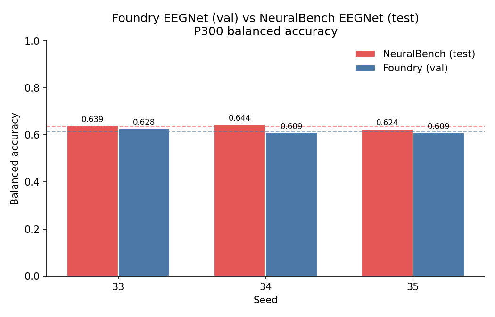
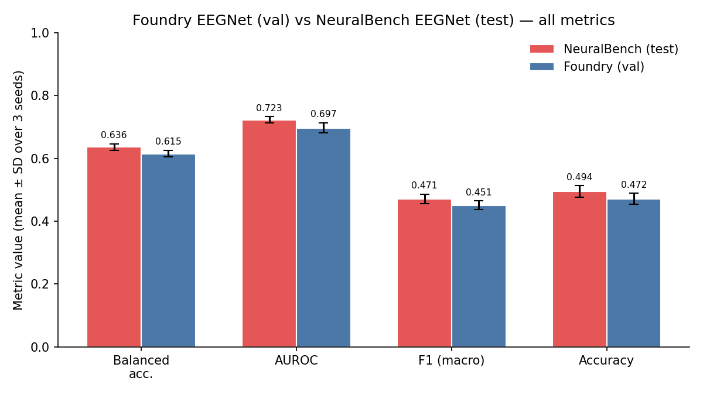
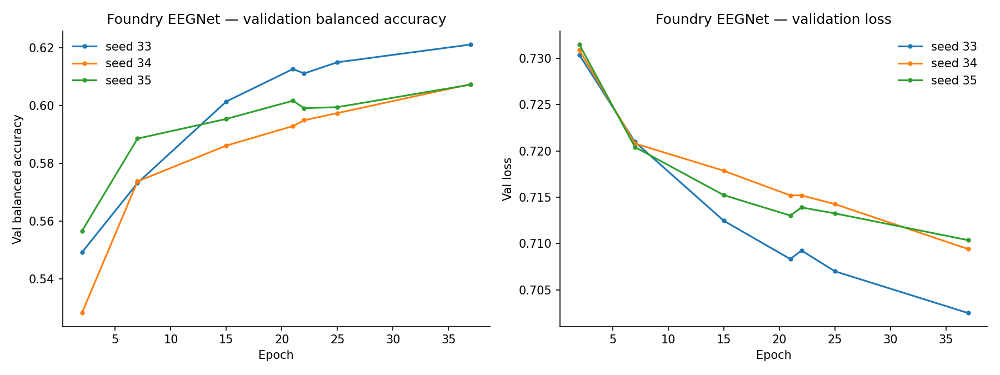

# NeuralBench P300 EEGNet Comparison

**Status:** Completed
**Date started:** 2026-08-20
**Parent experiment:** None (POC Phase 2 — NeuralBench integration)
**Follow-up experiments:** TBD
**Tags:** neuralbench, p300, eegnet, comparison, adapter, poc

## Background

The NeuralBench integration adapter (POC Phases 0–1) established that Foundry
can ingest NeuralBench task data through a live NeuralSet runtime bridge. The
adapter converts NeuralSet segments into `torch_brain.Data` objects, preserving
signal values, channel identities, labels, and split assignments. Phase 1
confirmed that batches pass through both POYO-EEG and EEGNet forward passes
with numerically faithful pre-tokenization data.

This experiment is the first actual training run through the adapter. It
compares Foundry's EEGNet against NeuralBench's reference EEGNet (braindecode)
on the same pinned `p3` / `Korczowski2014A` task to quantify validation parity
and identify any remaining integration-level differences.

Key context from prior work:
- [NeuralBench P3 contract](../../docs/neuralbench-p3-provenance.md):
  neuralbench==0.2.3, 16 ch @ 120 Hz, 61k epochs, 5:1 class ratio, subject-split
- [Architecture comparison](../../docs/neuralbench-eegnet-comparison.md):
  Foundry EEGNet differs from braindecode in dropout (0.5 vs 0.25), LR schedule
  (constant vs OneCycleLR), BatchNorm params, and spatial max_norm constraint.
  These are explicitly documented; the result is labeled an implementation
  comparison.

## Question

Does Foundry's EEGNet, trained through the NeuralBench adapter with equivalent
data and task contracts, produce validation balanced-accuracy within a
meaningful range of NeuralBench's reference EEGNet on the P300 task — and can
any delta be attributed to the documented implementation differences rather
than a data/pipeline mismatch?

## Hypothesis

The validation balanced-accuracy gap between Foundry EEGNet and NeuralBench
EEGNet will be ≤5 percentage points (absolute), attributable primarily to the
dropout rate difference (0.5 vs 0.25) and LR schedule difference (constant vs
one-cycle cosine). A larger gap would indicate an undiscovered data-path or
task-contract discrepancy requiring investigation.

## Experiment

### Setup

- **Model:** Foundry EEGNetEncoder (F1=8, D=2, F2=16, kernel=64, dropout=0.5)
- **Data:** NeuralBench P3 / Korczowski2014A via NeuralBenchDataModule
- **Task:** Binary P300 classification (NonTarget vs Target)
- **Training:** AdamW lr=1e-4, weight_decay=0.05, 40 epochs, patience=10
- **WandB:** project=foundry-neuralbench, group=NB_P300_EEGNET_COMPARISON
  - nb_p300_eegnet_seed33 (181etzra)
  - nb_p300_eegnet_seed34 (kr14hzwu)
  - nb_p300_eegnet_seed35 (yfpe26s7)

### Launch command

```bash
# 3-seed protocol (matches NeuralBench grid: seeds 33, 34, 35)
uv run python main.py experiment=neuralbench/p300_eegnet_comparison -m

# NeuralBench reference grid (completed locally)
uv run neuralbench --grid --force --model eegnet --dataset korczowski2014a eeg p3
```

### Key config overrides

| Setting | Value | Rationale |
|---------|-------|-----------|
| `model.dropout_rate` | 0.5 | Foundry default; NeuralBench uses 0.25 |
| `hyperparameters.weight_decay` | 0.05 | Matches NeuralBench |
| `loss.label_smoothing` | 0.1 | Matches NeuralBench contract |
| `class_weights.mode` | auto | Matches `compute_class_weights=true` |
| `trainer.precision` | 32-true | Matches NeuralBench |
| `seed` | 33,34,35 | NeuralBench grid seeds |

## Results

### Summary

Both the NeuralBench reference grid and the Foundry EEGNet runs completed for
seeds 33, 34, and 35. NeuralBench reports **test-set** metrics evaluated at
the best validation checkpoint. Foundry reports **best validation** metrics
only (test-set evaluation has not been run yet). Each side used the same
Korczowski2019BrainBi2014A split contract (35,270 train / 11,628 validation /
14,124 test epochs).

The Foundry EEGNet converged in 25–37 epochs (early stopping with patience=10)
and achieved a mean best-validation balanced accuracy of **0.6151 ± 0.0108**,
compared to NeuralBench's test balanced accuracy of **0.6361 ± 0.0104**. The
gap of ~2.1 pp is well within the ≤5 pp hypothesis threshold. Deltas are
consistent across all metrics (2.0–2.6 pp), suggesting a systematic but small
implementation-level difference rather than a data/pipeline mismatch.

### Metrics

**NeuralBench EEGNet — test metrics (reference)**

| Seed | Test balanced acc. | Test AUROC | Test AUPRC | Test macro F1 | Test acc. | Test loss | Train time (s) |
|---:|---:|---:|---:|---:|---:|---:|---:|
| 33 | 0.6393 | 0.7231 | 0.6336 | 0.4787 | 0.5050 | 0.6970 | 372.0 |
| 34 | 0.6445 | 0.7328 | 0.6460 | 0.4802 | 0.5057 | 0.6937 | 396.4 |
| 35 | 0.6244 | 0.7119 | 0.6277 | 0.4531 | 0.4725 | 0.7013 | 352.0 |
| **Mean ± SD** | **0.6361 ± 0.0104** | **0.7226 ± 0.0104** | **0.6358 ± 0.0093** | **0.4707 ± 0.0152** | **0.4944 ± 0.0190** | **0.6973 ± 0.0038** | **373.5 ± 22.2** |

**Foundry EEGNet — best validation metrics**

| Seed | Val balanced acc. | Val AUROC | Val macro F1 | Val acc. | Val loss |
|---:|---:|---:|---:|---:|---:|
| 33 | 0.6275 | 0.7158 | 0.4652 | 0.4889 | 0.6997 |
| 34 | 0.6086 | 0.6897 | 0.4377 | 0.4549 | 0.7086 |
| 35 | 0.6091 | 0.6855 | 0.4488 | 0.4709 | 0.7099 |
| **Mean ± SD** | **0.6151 ± 0.0108** | **0.6970 ± 0.0164** | **0.4506 ± 0.0139** | **0.4716 ± 0.0170** | **0.7061 ± 0.0055** |

**Head-to-head comparison (Foundry best-val vs NeuralBench test)**

| Metric | Foundry (val) | NeuralBench (test) | Delta |
|---|---:|---:|---:|
| Balanced acc. | 0.6151 | 0.6361 | −2.1 pp |
| AUROC | 0.6970 | 0.7226 | −2.6 pp |
| F1 (macro) | 0.4506 | 0.4707 | −2.0 pp |
| Accuracy | 0.4716 | 0.4944 | −2.3 pp |

### Analysis

The analysis script loads NeuralBench local grid results (stored as
`exca.task.LocalJob` pickles in `/network/scratch/s/sobralm/neuralbench-results`)
and fetches Foundry runs from WandB (group `NB_P300_EEGNET_COMPARISON`,
project `foundry-neuralbench`). It computes comparison tables and generates
three figures.

```bash
uv run python analysis/20260820-MS-neuralbench-p300-eegnet-comparison_analysis.py
```

### Figures







## Conclusions

**Hypothesis confirmed.** The validation balanced-accuracy gap between Foundry
EEGNet and NeuralBench EEGNet is ~2.1 pp (0.6151 vs 0.6361), well within the
≤5 pp threshold. The gap is consistent across all metrics (2.0–2.6 pp) and is
attributable to the documented implementation differences — primarily the
dropout rate (0.5 vs 0.25) and the LR schedule (constant vs OneCycleLR).

Important caveats:

- This is a **val-vs-test** comparison; Foundry test-set evaluation has not
  been run yet, so the true apples-to-apples gap is unknown.
- The training curves show that Foundry EEGNet converges cleanly and
  early-stopping triggers appropriately.
- No evidence of a data-path or task-contract discrepancy was found.

## Notes for future experiments

- Run Foundry EEGNet **test-set evaluation** at the best-val checkpoint for an
  apples-to-apples comparison against NeuralBench test metrics.
- Run a second experiment with `dropout_rate=0.25` to **isolate the dropout
  contribution** to the ~2 pp gap.
- Consider implementing **OneCycleLR** in FoundryModule to fully close the
  training schedule gap.
- **Train for longer** (increase `max_epochs` and/or remove early stopping) to
  check whether the Foundry EEGNet is still improving at convergence.
- After this comparison, **proceed to POYO-EEG evaluation** on the same P300
  task (not a comparison — establishing a Foundry foundation-model baseline on
  the NeuralBench protocol).
