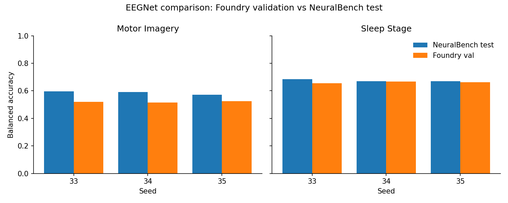

# NeuralBench Phase 1 — Motor Imagery & Sleep Stage EEGNet Comparison

**Status:** Completed
**Date started:** 2026-08-20
**Parent experiment:** [P300 EEGNet Comparison](./20260820-MS-neuralbench-p300-eegnet-comparison.md)
**Follow-up experiments:** [NeuralBench Matched EEGNet — Three-Task Test Parity](20260821-MS-neuralbench-matched-test-parity.md); Phase 2 — Generic task onboarding
**Tags:** neuralbench, motor_imagery, sleep_stage, eegnet, comparison, phase1

## Background

The POC (P300 / Korczowski2014A) established the NeuralBench adapter
infrastructure and demonstrated a ~2.1 pp validation gap between Foundry
EEGNet and NeuralBench EEGNet, attributable to documented implementation
differences (dropout 0.5 vs 0.25, constant LR vs OneCycleLR).

Phase 1 expands to two additional NeuralBench tasks to validate that the
adapter generalizes beyond P300:

| Task | NeuralBench ID | Dataset | Classes | Epoch | Hz | Samples |
|------|---------------|---------|---------|-------|-----|---------|
| Motor Imagery | `motor_imagery` | Schalk2004Bci2000 (PhysioNet) | 4 | 4.0 s | 120 | 480 |
| Sleep Stage | `sleep_stage` | Kemp2000Analysis | 5 | 30.0 s | 120 | 3600 |

Both tasks use:
- Subject-based splits (60/20/20 with seed 33)
- CrossEntropyLoss with label_smoothing=0.1
- Compute class weights from training data
- Monitor: val/bal_acc (max), early stopping patience=5

## Question

Can the NeuralBench adapter infrastructure (designed for P300) generalize
to multi-class tasks with different epoch lengths and class structures — and
do Foundry EEGNet validation metrics remain within ~5 pp of NeuralBench's
reference EEGNet on these tasks?

## Hypothesis

1. The adapter will successfully load and train on both MI and Sleep Stage
   without task-specific code changes beyond configuration.
2. The validation balanced-accuracy gap between Foundry EEGNet and NeuralBench
   EEGNet will be ≤5 pp for each task, consistent with the P300 finding.
3. Training time differences will be primarily explained by dataset size and
   epoch length, not by adapter overhead.

## Experiment

### Setup — Motor Imagery

- **NeuralBench task:** `motor_imagery` / `Schalk2004Bci2000`
- **Classes:** 4 (imagery_bilateral_feet, imagery_bilateral_fist,
  imagery_left_fist, imagery_right_fist; verified from the LabelEncoder)
- **Model:** Foundry EEGNetEncoder (F1=8, D=2, F2=16, kernel=64, dropout=0.5,
  num_samples=480)
- **Training:** AdamW lr=1e-4, weight_decay=0.05, 40 epochs, patience=5
- **WandB:** project=foundry-neuralbench, group=NB_MI_EEGNET_COMPARISON
- **Seeds:** 33, 34, 35

### Setup — Sleep Stage

- **NeuralBench task:** `sleep_stage` / `Kemp2000Analysis`
- **Classes:** 5 (Wake, N1, N2, N3, REM — from `SleepStage.stage` field)
- **Model:** Foundry EEGNetEncoder (F1=8, D=2, F2=16, kernel=64, dropout=0.5,
  num_samples=3600)
- **Training:** AdamW lr=1e-4, weight_decay=0.05, 40 epochs, patience=5
- **WandB:** project=foundry-neuralbench, group=NB_SLEEP_EEGNET_COMPARISON
- **Seeds:** 33, 34, 35

### Launch commands

```bash
# Foundry EEGNet — Motor Imagery
uv run python main.py experiment=neuralbench/mi_eegnet_comparison

# Foundry EEGNet — Sleep Stage
uv run python main.py experiment=neuralbench/sleep_stage_eegnet_comparison

# NeuralBench reference — Motor Imagery
uv run neuralbench --grid --force --model eegnet --dataset schalk2004bci2000 eeg motor_imagery

# NeuralBench reference — Sleep Stage
uv run neuralbench --grid --force --model eegnet eeg sleep_stage
```

### Key config overrides (matching NeuralBench)

| Setting | Value | Rationale |
|---------|-------|-----------|
| `model.dropout_rate` | 0.5 | Foundry default; NeuralBench uses 0.25 |
| `hyperparameters.weight_decay` | 0.05 | Matches NeuralBench |
| `loss.label_smoothing` | 0.1 | Matches NeuralBench contract |
| `class_weights.mode` | auto | Matches `compute_class_weights=true` |
| `trainer.precision` | 32-true | Matches NeuralBench |
| `seed` | 33, 34, 35 | Three-seed comparison protocol |

### Known implementation differences (same as P300)

| Aspect | Foundry | NeuralBench | Impact |
|--------|---------|-------------|--------|
| Dropout rate | 0.5 | 0.25 | Higher regularization → slower convergence |
| LR schedule | Constant 1e-4 | OneCycleLR (cosine, pct_start=0.1) | Different optimization trajectory |
| BatchNorm momentum | PyTorch default (0.1) | braindecode default (0.01) | Slightly different running stats |
| Spatial max_norm | None | 1.0 (ConstrainedConv2d) | May limit spatial filter magnitude |

## Results

### Summary

All three seeds completed for each task and implementation. Both datasets passed
adapter/data verification before training: Schalk2004Bci2000 loaded all 1,526
timelines with the expected four labels, and Kemp2000Analysis loaded all 153
recordings with the expected five labels.

NeuralBench values are **test** metrics evaluated at its best-validation
checkpoint. Foundry values are the best **validation** metrics logged to WandB;
the comparison therefore remains val-vs-test rather than a fully apples-to-
apples test-set evaluation. Sleep Staging reproduces the reference closely
enough for this validation. Motor Imagery does not yet: its mean
balanced-accuracy gap is 6.6 pp, above the pre-specified 5 pp target.

### Motor Imagery

| Side | Balanced Acc. | AUROC | F1 (macro) | Accuracy | Runtime (s) |
|------|-------------|-------|------------|----------|-------------|
| Foundry EEGNet (best val, mean ± SD) | 0.5200 ± 0.0057 | 0.7648 ± 0.0050 | 0.5183 ± 0.0066 | 0.5200 ± 0.0059 | 161 ± 5 (W&B) |
| NeuralBench EEGNet (test, mean ± SD) | 0.5858 ± 0.0124 | 0.8119 ± 0.0071 | 0.5799 ± 0.0126 | 0.5859 ± 0.0124 | 93 ± 6 |
| Difference (Foundry − NeuralBench) | **−0.0659** | −0.0471 | −0.0617 | −0.0659 | — |

Foundry runs: nb_mi_eegnet_seed33 (iwko4s5v),
nb_mi_eegnet_seed34 (t1dljt8a), and
nb_mi_eegnet_seed35 (4155ejdp). All ran through epoch 39 (40 epochs).

### Sleep Stage

| Side | Balanced Acc. | AUROC | F1 (macro) | Accuracy | Runtime (s) |
|------|-------------|-------|------------|----------|-------------|
| Foundry EEGNet (best val, mean ± SD) | 0.6614 ± 0.0060 | 0.9054 ± 0.0022 | 0.6032 ± 0.0129 | 0.6748 ± 0.0096 | 797 ± 337 (W&B) |
| NeuralBench EEGNet (test, mean ± SD) | 0.6746 ± 0.0090 | 0.9129 ± 0.0027 | 0.5983 ± 0.0172 | 0.6749 ± 0.0141 | 601 ± 232 |
| Difference (Foundry − NeuralBench) | **−0.0132** | −0.0074 | +0.0049 | −0.0001 | — |

Foundry runs: nb_sleep_eegnet_seed33 (beljhv9g),
nb_sleep_eegnet_seed34 (4fuehuj3), and
nb_sleep_eegnet_seed35 (kowurvun). They completed through epochs 9, 22,
and 14, respectively, with early stopping.

### Timing Analysis

| Task | Foundry W&B runtime | NeuralBench trainer time | Notes |
|------|---------------------|-------------------------|-------|
| MI | 161 ± 5 s | 93 ± 6 s | Foundry completed 40 epochs; NeuralBench stopped early. |
| Sleep | 797 ± 337 s | 601 ± 232 s | Both implementations stopped at seed-dependent epochs. |

These timing fields are not strictly comparable: Foundry's W&B runtime
includes process-level overhead, while NeuralBench records trainer time.

### Analysis

The reproducible analysis script fetches Foundry metrics from WandB and reads
the completed local NeuralBench artifacts:

    uv run python analysis/20260820-MS-neuralbench-phase1-mi-sleep-comparison_analysis.py

NeuralBench v0.2.3 local job artifacts (W&B logging was disabled) are stored
under /network/scratch/s/sobralm/neuralbench-results/. The direct reference
is its three-seed (33--35) distribution on each exact task--dataset pair.
The published NeuralBench headline MI protocol uses its default
Stieger2021Continuous dataset rather than Schalk2004Bci2000, so it is not a
strict numeric reference for this MI result.

### Figures



## Conclusions

The adapter generalized operationally to both tasks, and **Sleep Staging is
validated** for the present Foundry-vs-NeuralBench check: its 1.3 pp mean
balanced-accuracy gap is comfortably within the 5 pp target, with near-identical
accuracy and a slightly higher Foundry macro-F1.

**Motor Imagery needs further investigation.** Its 6.6 pp balanced-accuracy
gap, together with lower AUROC and macro-F1, exceeds the target despite matching
the dataset, subject split, labels, class weighting, optimizer, and epoch cap.
The documented dropout, scheduler, BatchNorm-momentum, and spatial-max-norm
differences are leading candidates; the val-vs-test metric mismatch remains an
important caveat.

## Notes for future experiments

- For Motor Imagery, test dropout_rate=0.25 and OneCycleLR separately to
  quantify their contributions.
- Add a Foundry test-set evaluation using NeuralBench's exact split so the
  comparison is test-vs-test.
- Verify the EEGNet BatchNorm momentum and spatial max-norm effects on MI.
- Expand the validated adapter to Stieger2021Continuous and add POYO-EEG
  evaluations for both tasks.
