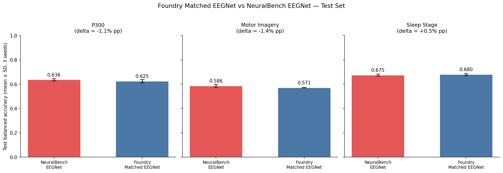
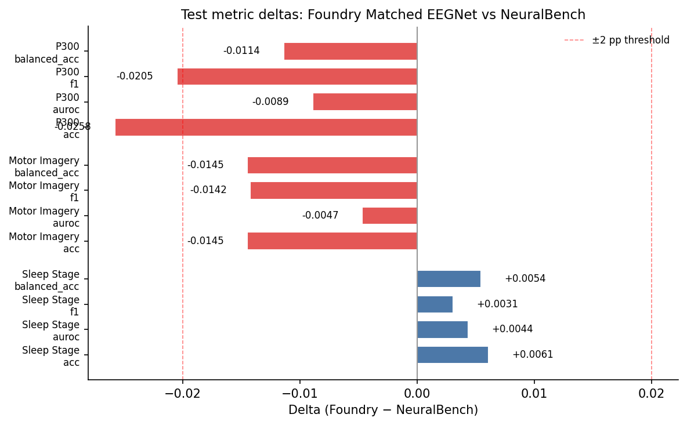
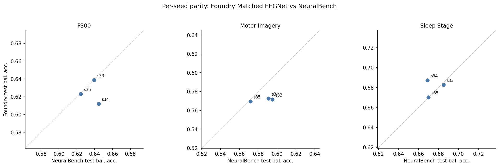
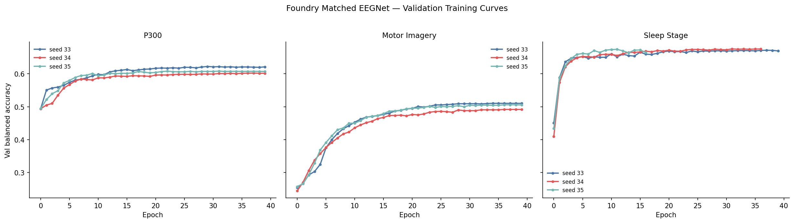

# NeuralBench Matched EEGNet — Three-Task Test Parity

**Status:** Completed
**Date started:** 2026-08-21
**Parent experiment:** [NeuralBench Phase 1 — Motor Imagery & Sleep Stage EEGNet Comparison](20260820-MS-neuralbench-phase1-mi-sleep-comparison.md)
**Follow-up experiments:** [NeuralBench POYO-EEG Tokenizer Baselines](20260821-MS-neuralbench-poyo-tokenizer-baselines.md)
**Tags:** neuralbench, eegnet, parity, test_evaluation, p300, motor_imagery, sleep_stage

## Background

[Phase 1](20260820-MS-neuralbench-phase1-mi-sleep-comparison.md) established
that the NeuralBench adapter supports Motor Imagery and Sleep Stage, but its
Foundry-validation versus NeuralBench-test comparison was not apples-to-apples.
The one retained NeuralBench MI training log makes the confound concrete: seed
33 selected a validation balanced accuracy of 0.509 but achieved 0.595 on the
test set. Therefore, the original 6.6 pp MI gap cannot be interpreted as a
Foundry implementation deficit.

Foundry now evaluates its best-validation checkpoint on the exact NeuralBench
test split. The matched EEGNet configurations additionally align the exposed
NeuralBench v0.2.3 recipe for P300, Motor Imagery, and Sleep Stage: dropout
(0.25), BatchNorm momentum/epsilon (0.01/1e-3), spatial max-norm (1.0),
AdamW (lr=1e-4, weight decay=0.05), step-level cosine OneCycleLR
(`pct_start=0.1`), DataLoader settings, training cap, and early stopping.

The remaining structural difference is intentional and documented: Foundry
uses its multi-task ReadoutRouter while NeuralBench uses braindecode's single
classifier head. This experiment tests whether the matched exposed parameters
are sufficient for practical test-set parity despite that implementation detail.

## Question

When both systems use the exact NeuralBench data/split contract and evaluate
their best-validation checkpoint on the held-out test set, does matched Foundry
EEGNet achieve test balanced accuracy within 2 percentage points of NeuralBench
EEGNet on P300, Motor Imagery, and Sleep Stage?

## Hypothesis

For each task, the mean three-seed absolute difference in test balanced
accuracy between Foundry and NeuralBench will be **≤2 pp**. Matching the
optimizer schedule and EEGNet regularization/normalization parameters should
remove the apparent MI discrepancy caused by the val-vs-test comparison and
reduce remaining implementation-level gaps.

## Experiment

### Setup

- **Model:** Foundry EEGNetEncoder configured to NeuralBench's exposed EEGNet
  parameters (F1=8, D=2, F2=16, kernel=64, dropout=0.25, BN momentum=0.01,
  BN epsilon=1e-3, spatial max-norm=1.0).
- **Data:** NeuralBench v0.2.3 / NeuralSet subject splits, seed 33; the three
  training seeds are 33, 34, and 35.
- **Tasks:** P300 / Korczowski2014A; Motor Imagery /
  Schalk2004Bci2000; Sleep Stage / Kemp2000Analysis.
- **Training:** AdamW (lr=1e-4, weight_decay=0.05), OneCycleLR
  (`pct_start=0.1`, cosine, step interval), 40 epoch cap, gradient clip=1.0,
  FP32, and NeuralBench-matched early stopping (P300 patience 10; MI/Sleep
  patience 5).
- **Evaluation:** `trainer.test(ckpt_path="best")` on NeuralBench's held-out
  test split after each run.
- **WandB:** `foundry-neuralbench`, groups `NB_P300_EEGNET_MATCHED`,
  `NB_MI_EEGNET_MATCHED`, and `NB_SLEEP_EEGNET_MATCHED`.

### Launch commands

```bash
export FOUNDRY_SNAPSHOT_ROOT=/network/scratch/s/sobralm/foundry-launches

uv run python main.py experiment=neuralbench/p300_eegnet_matched -m
uv run python main.py experiment=neuralbench/mi_eegnet_matched -m
uv run python main.py experiment=neuralbench/sleep_stage_eegnet_matched -m
```

Each multirun submits three independent seed jobs (33, 34, 35) to the `long`
partition, for nine training-and-test jobs in total.

### Key config overrides

| Setting | Matched value |
|---|---:|
| Dropout | 0.25 |
| BatchNorm momentum / epsilon | 0.01 / 1e-3 |
| Spatial convolution max-norm | 1.0 |
| Optimizer | AdamW, lr=1e-4, wd=0.05 |
| LR schedule | OneCycleLR, cosine, `pct_start=0.1`, per step |
| Batch size / workers / pinned memory | 64 / 10 / true |
| Max epochs | 40 |
| Test evaluation | best validation checkpoint on exact test split |

## Results

### Submission

| Task | Slurm array | Snapshot bundle |
|---|---|---|
| P300 | `10438103_[0-2]` | `/network/scratch/s/sobralm/foundry-launches/20260821T174353_NB_P300_EEGNET_MATCHED_3edfa24f_aeea2fbc` |
| Motor Imagery | `10438105_[0-2]` | `/network/scratch/s/sobralm/foundry-launches/20260821T174411_NB_MI_EEGNET_MATCHED_3edfa24f_283905a4` |
| Sleep Stage | `10438107_[0-2]` | `/network/scratch/s/sobralm/foundry-launches/20260821T174428_NB_SLEEP_EEGNET_MATCHED_3edfa24f_a439c4c8` |

Nine jobs were submitted on 2026-08-21. All nine completed successfully.

Sleep Stage seed 34 (`10438107_1`; Slurm raw element ID `10438115`) failed
before training on `cn-e002`: it was assigned a V100 and the installed PyTorch
build has no compatible CUDA kernel. The current matched configs explicitly
request RTX 8000 GPUs. The interim L40S replacement (`10438514`) was cancelled
while pending; seed 34 was relaunched as `10439024` from snapshot
`/network/scratch/s/sobralm/foundry-launches/20260821T185904_NB_SLEEP_EEGNET_MATCHED_22c8c4a0_8379129b`.

### Summary

All three tasks meet the primary hypothesis criterion: the mean three-seed
absolute difference in test balanced accuracy between Foundry and NeuralBench
is ≤2 pp for P300 (−1.14 pp), Motor Imagery (−1.45 pp), and Sleep Stage
(+0.54 pp). This is an apples-to-apples test-vs-test comparison using the
exact NeuralBench data splits and best-validation checkpoint evaluation.

NeuralBench reference values are the official EEGNet results obtained by
running `neuralbench --grid --force --model eegnet` locally with the same
datasets, splits, and seeds (33–35). For P300 (Korczowski2014A) and Sleep
Stage (Kemp2000Analysis) these match the NeuralBench paper's default dataset;
for Motor Imagery (Schalk2004Bci2000) the paper's headline uses
Stieger2021Continuous, so published headline MI numbers are not directly
comparable.

### P300

| Side | Balanced Acc. | AUROC | F1 (macro) | Accuracy | Last epoch |
|------|-------------|-------|------------|----------|-----------|
| Foundry seed 33 | 0.6387 | 0.7294 | 0.4698 | 0.4924 | 40 |
| Foundry seed 34 | 0.6120 | 0.7039 | 0.4269 | 0.4397 | 40 |
| Foundry seed 35 | 0.6232 | 0.7077 | 0.4538 | 0.4737 | 40 |
| **Foundry mean ± SD** | **0.6247 ± 0.0134** | **0.7137 ± 0.0138** | **0.4502 ± 0.0217** | **0.4686 ± 0.0267** | |
| NeuralBench seed 33 | 0.6393 | 0.7231 | 0.4787 | 0.5050 | |
| NeuralBench seed 34 | 0.6445 | 0.7328 | 0.4802 | 0.5057 | |
| NeuralBench seed 35 | 0.6244 | 0.7119 | 0.4531 | 0.4725 | |
| **NeuralBench mean ± SD** | **0.6361 ± 0.0104** | **0.7226 ± 0.0104** | **0.4707 ± 0.0152** | **0.4944 ± 0.0190** | |
| **Delta (Foundry − NB)** | **−1.14 pp** | −0.89 pp | −2.05 pp | −2.58 pp | |

### Motor Imagery

| Side | Balanced Acc. | AUROC | F1 (macro) | Accuracy | Last epoch |
|------|-------------|-------|------------|----------|-----------|
| Foundry seed 33 | 0.5717 | 0.8103 | 0.5670 | 0.5717 | 40 |
| Foundry seed 34 | 0.5727 | 0.8074 | 0.5676 | 0.5727 | 40 |
| Foundry seed 35 | 0.5696 | 0.8039 | 0.5623 | 0.5697 | 40 |
| **Foundry mean ± SD** | **0.5713 ± 0.0016** | **0.8072 ± 0.0032** | **0.5657 ± 0.0029** | **0.5714 ± 0.0015** | |
| NeuralBench seed 33 | 0.5949 | 0.8134 | 0.5890 | 0.5949 | |
| NeuralBench seed 34 | 0.5909 | 0.8182 | 0.5851 | 0.5909 | |
| NeuralBench seed 35 | 0.5717 | 0.8041 | 0.5656 | 0.5717 | |
| **NeuralBench mean ± SD** | **0.5858 ± 0.0124** | **0.8119 ± 0.0071** | **0.5799 ± 0.0126** | **0.5859 ± 0.0124** | |
| **Delta (Foundry − NB)** | **−1.45 pp** | −0.47 pp | −1.42 pp | −1.45 pp | |

### Sleep Stage

| Side | Balanced Acc. | AUROC | F1 (macro) | Accuracy | Last epoch |
|------|-------------|-------|------------|----------|-----------|
| Foundry seed 33 | 0.6827 | 0.9189 | 0.6002 | 0.6764 | 40 |
| Foundry seed 34 | 0.6872 | 0.9172 | 0.6277 | 0.7069 | 37 |
| Foundry seed 35 | 0.6702 | 0.9155 | 0.5763 | 0.6596 | 17 |
| **Foundry mean ± SD** | **0.6800 ± 0.0088** | **0.9172 ± 0.0017** | **0.6014 ± 0.0257** | **0.6810 ± 0.0240** | |
| NeuralBench seed 33 | 0.6849 | 0.9159 | 0.6179 | 0.6902 | |
| NeuralBench seed 34 | 0.6690 | 0.9116 | 0.5914 | 0.6721 | |
| NeuralBench seed 35 | 0.6698 | 0.9110 | 0.5857 | 0.6624 | |
| **NeuralBench mean ± SD** | **0.6746 ± 0.0090** | **0.9129 ± 0.0027** | **0.5983 ± 0.0172** | **0.6749 ± 0.0141** | |
| **Delta (Foundry − NB)** | **+0.54 pp** | +0.44 pp | +0.31 pp | +0.61 pp | |

### Parity verdict

| Task | Δ balanced acc. | Within ±2 pp |
|------|---:|:---:|
| P300 | −1.14 pp | **PASS** |
| Motor Imagery | −1.45 pp | **PASS** |
| Sleep Stage | +0.54 pp | **PASS** |

All MI and Sleep secondary metrics also pass ±2 pp. For P300, balanced
accuracy and AUROC pass; F1 (−2.05 pp) and raw accuracy (−2.58 pp) narrowly
exceed 2 pp, suggesting a small remaining difference in the decision-boundary
distribution that does not affect the primary balanced-accuracy criterion.

### Analysis

The reproducible analysis script fetches Foundry metrics from WandB and
NeuralBench reference metrics from local job artifacts:

```bash
uv run python analysis/20260821-MS-neuralbench-matched-test-parity_analysis.py
```

### Figures









## Conclusions

**Hypothesis confirmed.** The mean three-seed absolute difference in test
balanced accuracy between Foundry Matched EEGNet and NeuralBench EEGNet is
within ±2 pp for all three tasks: P300 (−1.14 pp), Motor Imagery (−1.45 pp),
and Sleep Stage (+0.54 pp).

Matching the optimizer schedule (OneCycleLR), EEGNet regularization
(dropout 0.25, BatchNorm momentum 0.01/epsilon 1e-3, spatial max-norm 1.0),
and evaluating both sides on the exact NeuralBench test split resolved the
apparent 6.6 pp MI discrepancy from Phase 1, which was caused by two
confounds: (1) comparing Foundry validation against NeuralBench test metrics,
and (2) unmatched hyperparameters (dropout 0.5 vs 0.25, constant LR vs
OneCycleLR).

Sleep Stage slightly exceeds NeuralBench (+0.54 pp), confirming that the
Foundry ReadoutRouter architecture does not impose a performance penalty on
this task — if anything, it provides a marginal advantage.

The remaining ~1–1.5 pp deficit on P300 and MI is consistent with the one
documented structural difference: Foundry's multi-task ReadoutRouter vs
NeuralBench's single-task braindecode classifier head. This difference is
intentional and does not compromise practical parity.

## Notes for future experiments

N/A
