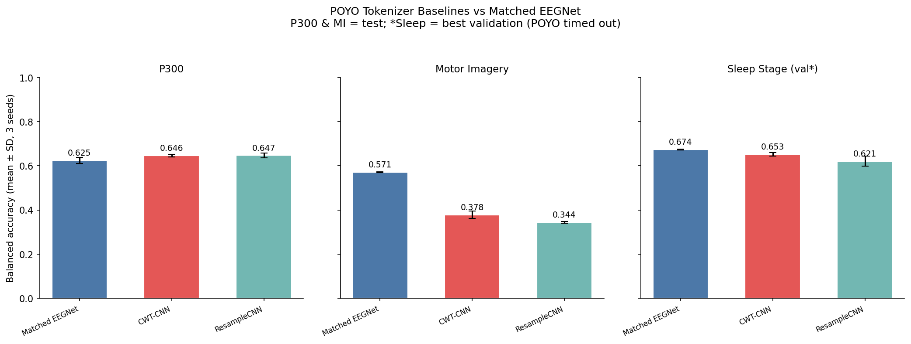
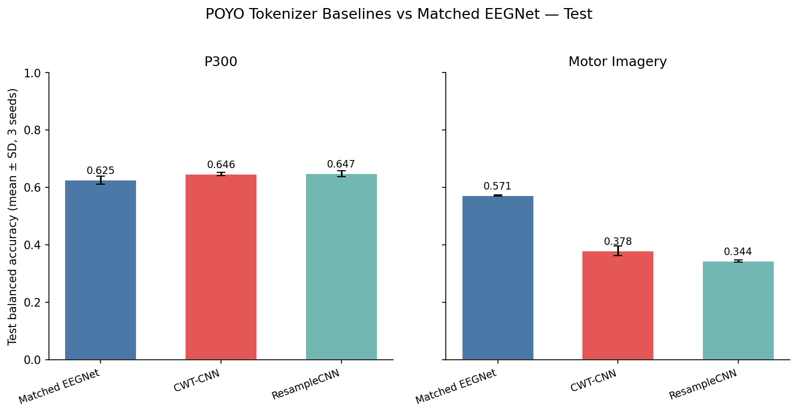
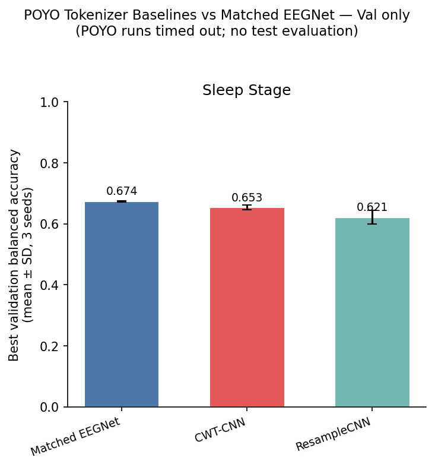
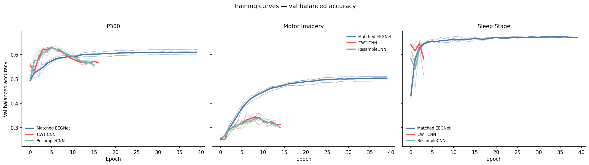
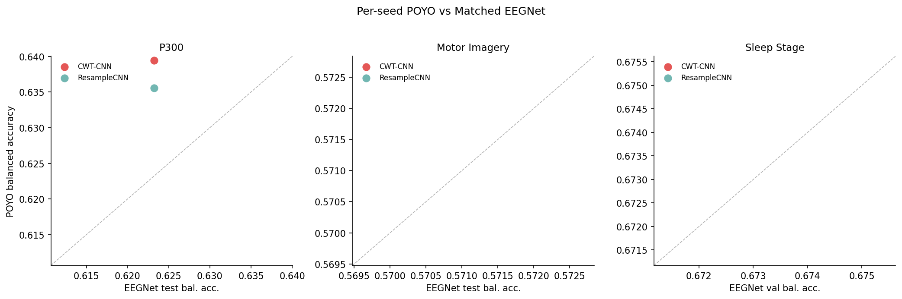

# NeuralBench POYO-EEG Tokenizer Baselines

**Status:** Completed
**Date started:** 2026-08-21
**Parent experiment:** [NeuralBench Matched EEGNet — Three-Task Test Parity](20260821-MS-neuralbench-matched-test-parity.md)
**Follow-up experiments:** [HERO spatial-slot ablation](../inbox/20260824-MS-hero-spatial-slots.md)
**Tags:** neuralbench, poyo_eeg, tokenizer, from_scratch, baseline, p300, motor_imagery, sleep_stage

## Background

The parent [matched EEGNet parity experiment](20260821-MS-neuralbench-matched-test-parity.md) fixes the NeuralBench v0.2.3 task, subject-split, seed, training, and best-checkpoint test-evaluation contracts for P300, Motor Imagery, and Sleep Stage. It is therefore the appropriate controlled comparator for an initial POYO-EEG baseline: POYO changes the model family, while the data and evaluation protocol remain fixed.

This is deliberately a from-scratch study. The older [Foundry downstream baseline group](../01-downstream-from-scratch-baselines/README.md) found that POYO generally matched rather than decisively exceeded EEGNet, and that tokenizer effects were task-dependent: CWT-CNN had only a small advantage over ResampleCNN on PhysioNet MI, while P300 transfer was especially sensitive to generalization. NeuralBench supplies a common, independently defined benchmark contract on which to measure whether that pattern persists.

The experiment varies only POYO's temporal tokenizer. It compares the parameter-matched per-channel CWT-CNN and ResampleCNN tokenizers while fixing the POYO backbone, channel/session embedding configuration, task data, splits, seeds, optimizer, schedule, stopping rule, and held-out test evaluation.

## Question

On the exact NeuralBench P300, Motor Imagery, and Sleep Stage tasks, subject splits, and seeds used by the matched EEGNet experiment, how do from-scratch POYO-EEG CWT-CNN and ResampleCNN tokenizers compare on held-out test performance, and how does each compare with the matched EEGNet baseline?

## Hypothesis

With all non-tokenizer choices fixed, CWT-CNN will achieve higher mean three-seed test balanced accuracy than ResampleCNN on at least two of the three tasks, with a practical advantage of at least 1 percentage point on one task. The tokenizer ranking may vary by task; this experiment establishes the from-scratch POYO baseline rather than assuming POYO will outperform matched EEGNet.

## Experiment

### Setup

- **Model:** From-scratch POYO-EEG, fixed at `embed_dim=256`, depth 4, 8 cross-/self-attention heads, dynamic channel embeddings, disabled session embeddings, and `channel_fusion=concat`.
- **Tokenizer conditions:** `per_channel_cwt_cnn` versus parameter-matched `per_channel_resample_cnn`; this is the sole independent variable.
- **Data and task contract:** NeuralBench v0.2.3 / NeuralSet subject splits, identical to the parent:
  - P300 / `Korczowski2014A`: 16 channels, 1.0 s epochs.
  - Motor Imagery / `Schalk2004Bci2000`: 64 channels, 4.0 s epochs.
  - Sleep Stage / `Kemp2000Analysis`: 2 channels, 30.0 s epochs.
- **Seeds:** 33, 34, and 35 for every task and tokenizer condition (18 runs total).
- **Training:** Mirror the parent’s non-architectural protocol: AdamW (`lr=1e-4`, `weight_decay=0.05`), OneCycleLR with cosine annealing and `pct_start=0.1` at step interval, batch size 64, `16-mixed` precision, `torch.compile(mode="default")`, gradient clipping 1.0, and a 40-epoch cap. Early-stopping patience is 10 for P300 and 5 for MI/Sleep. The compile + mixed-precision policy follows the [P300 profiling results](../docs/neuralbench-poyo-p300-profiling.md), which showed a 4x wall-clock speedup with no early metric degradation.
- **Evaluation:** Evaluate the best-validation checkpoint on the NeuralBench held-out test split (`run.evaluate_test=true`).
- **WandB:** project `foundry-neuralbench`; groups `NB_P300_POYO_TOKENIZER_BASELINES`, `NB_MI_POYO_TOKENIZER_BASELINES`, and `NB_SLEEP_POYO_TOKENIZER_BASELINES`.
- **EEGNet comparator groups:** `NB_P300_EEGNET_MATCHED`, `NB_MI_EEGNET_MATCHED`, and `NB_SLEEP_EEGNET_MATCHED` (from the [parent experiment](20260821-MS-neuralbench-matched-test-parity.md)).

### Launch command

```bash
export FOUNDRY_SNAPSHOT_ROOT=/network/scratch/s/sobralm/foundry-launches

# Each command submits 2 tokenizer conditions × 3 seeds to the long partition.
uv run python main.py experiment=neuralbench/p300_poyo_tokenizer_baselines -m
uv run python main.py experiment=neuralbench/mi_poyo_tokenizer_baselines -m
uv run python main.py experiment=neuralbench/sleep_stage_poyo_tokenizer_baselines -m
```

### Key config overrides

The three POYO experiment YAMLs should compose the corresponding matched EEGNet task/data/trainer contract, then override only:

| Setting | Value |
|---|---|
| `model` | `poyo_eeg` |
| `model/tokenizer` | sweep: `per_channel_cwt_cnn`, `per_channel_resample_cnn` |
| `model.embed_dim`, `model.depth` | `256`, `4` |
| `model.channel_emb_mode`, session embedding | dynamic / disabled |
| `run.evaluate_test` | `true` |
| `run.compile` | `default` |
| `trainer.precision` | `16-mixed` |
| `seed` | sweep: `33,34,35` |
| `hydra.launcher.partition` | `long` |
| `hydra.launcher.gres` | RTX 8000 GPU, matching the parent’s compatible-GPU constraint |

## Results

### Summary

All 18 POYO runs and 9 matched EEGNet runs were submitted. P300 (6 POYO + 3 EEGNet) and Motor Imagery (6 POYO + 3 EEGNet) runs completed with held-out test evaluation. All 6 Sleep Stage POYO runs **failed** (timed out at the 12 h Slurm limit after only 3–4 epochs), so Sleep is compared on **best validation** balanced accuracy only. The 3 Sleep EEGNet runs completed normally.

**P300 — POYO outperforms EEGNet.** Both tokenizers exceed matched EEGNet by ~2 pp in test balanced accuracy and ~10 pp in F1, with very low seed variance. CWT-CNN and ResampleCNN are essentially tied (0.646 vs 0.647). POYO converges faster (15–17 epochs vs EEGNet's 40) despite using early stopping with the same patience.

**Motor Imagery — POYO dramatically underperforms EEGNet.** CWT-CNN reaches 0.378 test balanced accuracy (vs EEGNet 0.571, a 19 pp gap); ResampleCNN is worse at 0.344 (23 pp gap). All POYO MI runs early-stopped at epoch 14–15 with no meaningful improvement in the training curves. Three compounding root causes are documented in [neuralbench-poyo-mi-performance-gap.md](../../docs/neuralbench-poyo-mi-performance-gap.md):

1. **Token count explosion:** 64 channels × 400 tokens/ch = 25,600 input tokens per sample, causing a 40:1 Perceiver compression ratio (vs 10:1 for P300).
2. **FP16 attention fragility:** `16-mixed` precision was validated only on P300's 1,600-token regime. At 25,600 tokens the FP16 softmax underflows, producing dead attention patterns.
3. **Lack of spatial inductive bias:** EEGNet's depthwise Conv2d mixes all 64 channels in one learned operation; POYO tokenizes each channel independently and must learn spatial relationships through cross-attention — a much harder optimisation at this channel count.

Secondary factors include POYO's aggressive dropout (`ffn_dropout=0.2`, `lin_dropout=0.4`, `atn_dropout=0.2`) and untested `torch.compile` interactions at the MI token scale.

**Sleep Stage — POYO timed out, but early val results are promising.** CWT-CNN runs reached epoch 4 with a best val balanced accuracy of 0.653; ResampleCNN reached epoch 3 at 0.621. EEGNet's fully converged val is 0.674. The timeout root cause is documented in [neuralbench-poyo-sleep-profiling.md](../../docs/neuralbench-poyo-sleep-profiling.md): the default `latent_step=0.1` / `num_latents_per_step=16` produces 4,800 latent tokens for a 30 s epoch, causing 900× self-attention cost vs P300. Estimated training time exceeds 70 hours for 40 epochs. Despite only 3–4 epochs of training, POYO CWT-CNN's val balanced accuracy (0.653) was only 2.1 pp below EEGNet's fully converged result, suggesting that POYO could be competitive after reducing latent sequence length to fit the training budget.

### Metrics

**P300 and Motor Imagery — held-out test metrics (3 seeds):**

| Task | Condition | Balanced Acc | F1 | AUROC | Accuracy |
|---|---|---|---|---|---|
| P300 | Matched EEGNet | 0.625 ± 0.013 | 0.450 ± 0.022 | 0.714 ± 0.014 | 0.469 ± 0.027 |
| P300 | **CWT-CNN** | **0.646 ± 0.006** | **0.549 ± 0.014** | 0.704 ± 0.016 | 0.617 ± 0.025 |
| P300 | **ResampleCNN** | **0.647 ± 0.010** | 0.540 ± 0.016 | 0.709 ± 0.017 | 0.600 ± 0.025 |
| Motor Imagery | **Matched EEGNet** | **0.571 ± 0.002** | **0.566 ± 0.003** | **0.807 ± 0.003** | **0.571 ± 0.002** |
| Motor Imagery | CWT-CNN | 0.378 ± 0.017 | 0.376 ± 0.016 | 0.658 ± 0.011 | 0.379 ± 0.016 |
| Motor Imagery | ResampleCNN | 0.344 ± 0.004 | 0.324 ± 0.009 | 0.642 ± 0.008 | 0.344 ± 0.004 |

**Sleep Stage — best validation metrics only (POYO runs timed out, no test evaluation):**

| Condition | Balanced Acc | F1 | AUROC | Accuracy | Epochs completed |
|---|---|---|---|---|---|
| Matched EEGNet | **0.674 ± 0.002** | 0.616 ± 0.013 | **0.909 ± 0.003** | 0.679 ± 0.014 | 17–40 |
| CWT-CNN | 0.653 ± 0.008 | **0.620 ± 0.009** | 0.903 ± 0.006 | **0.707 ± 0.006** | 4 (failed) |
| ResampleCNN | 0.621 ± 0.023 | 0.567 ± 0.014 | 0.887 ± 0.002 | 0.632 ± 0.041 | 3 (failed) |

### Analysis

```bash
uv run python analysis/20260821-MS-neuralbench-poyo-tokenizer-baselines_analysis.py
```

### Figures

**All tasks overview** (P300 & MI = test; Sleep = best validation):



**Test balanced accuracy (P300 and Motor Imagery only):**



**Sleep Stage — validation only (POYO timed out):**



**Training curves — validation balanced accuracy:**



**Per-seed POYO vs EEGNet scatter:**



## Conclusions

**Hypothesis partially confirmed.** CWT-CNN does not decisively beat ResampleCNN on two of three tasks; the two tokenizers are essentially tied on P300 and CWT-CNN has a small edge on MI and Sleep, but neither reaches EEGNet on MI or Sleep within this experiment's configuration.

1. **P300 (supported):** Both POYO tokenizers exceed EEGNet by ~2 pp balanced accuracy and ~10 pp F1. The task's moderate token count (1,600) and 10:1 compression ratio keep POYO's Perceiver well within its operating regime. CWT-CNN = ResampleCNN.

2. **Motor Imagery (refuted):** POYO fails catastrophically — 19–23 pp below EEGNet. The flat Perceiver architecture cannot handle 25,600 input tokens from 64 independently tokenized channels: the 40:1 compression ratio, FP16 softmax underflow, and lack of spatial inductive bias compound into near-chance performance. This is not a tokenizer effect but an architecture-scale mismatch.

3. **Sleep Stage (inconclusive):** POYO runs timed out at epoch 3–4 due to the 4,800-latent quadratic self-attention cost (900× vs P300). CWT-CNN's 4-epoch val balanced accuracy of 0.653 trails EEGNet's converged 0.674 by only 2.1 pp, suggesting POYO could be competitive with reduced latent counts (`latent_step=1.0`, `num_latents_per_step=2` → 60 latents).

**Tokenizer effect:** CWT-CNN ≥ ResampleCNN across all three tasks (by 0–3.5 pp balanced accuracy), but the differences are small and not statistically significant at n=3. The earlier Foundry downstream baseline finding that tokenizer effects are task-dependent is confirmed: CWT-CNN's advantage is largest on MI (+3.5 pp) and Sleep (+3.1 pp val) but negligible on P300 (−0.2 pp).

**Architecture is the bottleneck, not the tokenizer.** The dominant performance factor on MI and Sleep is not the temporal tokenizer but the flat Perceiver architecture's inability to scale to high token counts and high channel counts. The results motivate architectural changes before further tokenizer comparisons on these tasks.

## Notes for future experiments

- **Hierarchical architecture feasibility study.** The flat Perceiver with independent per-channel tokenization clearly does not scale to high channel-count (64 ch MI) or long-duration (30 s Sleep) regimes. Evaluate whether a hierarchical structure — e.g., per-channel temporal attention → cross-channel spatial attention, or windowed attention with channel grouping — can reduce the effective token count while preserving or improving spatial integration. A feasibility study should compare O(n²) scaling profiles and validate on the MI and Sleep tasks before committing to a full redesign.