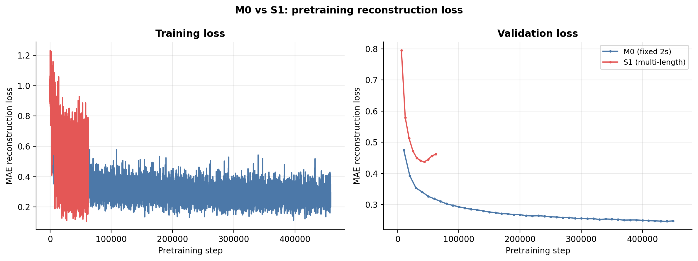

# Multi-Length Pretraining: Do Varied Temporal Scales Produce More Versatile Representations?

**Status:** Completed
**Date started:** 2026-08-11
**Parent experiment:** [Data Scaling Group](../02-data-scaling/README.md) (builds on B2 sweet spot)
**Follow-up experiments:** TBD
**Tags:** pretraining, mae, masked, sequence_length, multi_scale, cwt_cnn, dynamic_ch

> **Restarted (2026-08-14):** This experiment uses `channel_emb_mode="dynamic"`,
> which was affected by an information leak in the `RelativeChannelEncoder`
> (the encoder pooled over masked tokens, giving the decoder a shortcut). The completed
> [leak fix ablation](20260812-MS-channel-encoder-leak-fix-impact.md) confirmed
> that both fixes should remain enabled. The restarted
> run uses explicit `disable_channel_encoder_token_mask=false` and
> `zero_masked_signal=true` overrides in the shared pretraining config and the
> distinct `MASKING_SEQLEN_LEAK_FIXED` WandB/checkpoint group.

## Background

The [data scaling experiments](../02-data-scaling/README.md) established B2
(Klinzing + Shirazi + Pavlov, ~37k ch·h) as the pretraining sweet spot. All runs
used fixed 2s windows, but the downstream tasks span vastly different temporal
scales: P300 detection uses 1s epochs, motor imagery uses ~4s trials, and sleep
staging uses 30s epochs. The group's
[open questions](../02-data-scaling/README.md#open-questions) flag this mismatch
explicitly: "Representations learned on 2s windows may miss longer-range temporal
structure critical for sleep staging (spindles, K-complexes, slow waves)."

Sleep staging in particular requires recognizing features at multiple timescales:
sleep spindles (~0.5–2s), K-complexes (~1s), and slow-wave oscillations (0.5–4 Hz,
spanning seconds). A model trained only on 2s windows can capture spindles and
K-complexes but never sees full slow-wave cycles or the broader temporal context
that human scorers use. Conversely, P300 signals are sub-second, so 2s windows
include substantial irrelevant context.

This experiment tests whether training on **mixed-length windows**
(1s, 2s, 5s, 10s simultaneously) produces representations that transfer
better across the full downstream task spectrum compared to fixed 2s pretraining.
Each batch randomly selects one window length; all samples within that batch share
the same duration.

The same structural changes as the masking sweep apply: intersubject validation
and 400k max steps with patience=10 early stopping.

## Question

Does exposing the model to varied temporal scales during pretraining — from 1s
snippets up to 10s windows — produce representations that transfer better than
fixed-2s pretraining across downstream tasks with different temporal requirements?

## Hypothesis

Multi-length pretraining (S1) will outperform the fixed-2s baseline (M0) on
sleep staging (where 10s context captures slow-wave structure), perform
comparably on motor imagery (where 2s is adequate), and improve on P300
(where 1s windows are a closer match to the downstream epoch length). The
improvement on sleep staging will be larger for linear probes (representation
quality) than for finetuning (where the model can adapt).

Expected: S1 Kemp Sleep LP > M0 Kemp Sleep LP by at least +0.03 F1.

## Experiment

### Setup

- **Model:** POYO CWT-CNN + dynamic channel embeddings, session_emb disabled
- **Data:** B2 = Klinzing + Shirazi + Pavlov (`three_dataset_pretrain.yaml`)
- **Task:** MAE pretraining (masked reconstruction)
- **Training:** 400k max steps, batch_size=16 × accumulate_grad_batches=4
  (effective batch_size=64), lr=1e-4, warmup 2k + cosine decay over 398k steps,
  bf16-mixed, intersubject validation, early stopping patience=10
- **Window lengths:** [1.0, 2.0, 5.0, 10.0] — per-batch random selection
- **WandB:** `foundry_pretraining`, group `MASKING_SEQLEN_LEAK_FIXED`

### Code changes (implemented)

1. **`VariableLengthBatchSampler`** (`foundry/data/samplers.py`) — batch sampler
   that randomly selects a window length per batch from the configured list.
2. **Tokenization** (`foundry/models/poyo_eeg.py`) — derive actual window duration
   from the data sample instead of using the fixed `self.sequence_length`.
3. **Fixed-count dynamic latent grid** (`foundry/models/poyo_eeg.py`) — keep the
   number of latent time bins constant (20) and scale the step size proportionally
   to actual duration, always producing 320 latents regardless of window length.
4. **`NeuralDataModule` wiring** (`foundry/data/datamodules/base.py`) — use
   `VariableLengthBatchSampler` when `window_lengths` is provided.
5. **CWT token caching fix** (`foundry/models/embeddings/temporal/base.py`) —
   removed `_cached_target_tokens` that would incorrectly reuse the first batch's
   token count for all subsequent batches with different durations.

### Pretraining run

| Run | window_lengths | mask_ratio | block_size | Notes |
|-----|:-:|:---:|:---:|-------|
| S1 (multi-length) | [1, 2, 5, 10] | 0.5 | 10 | All 4 window sizes, per-batch random selection, bs=16×accum=4 |

Compared against M0 (baseline, fixed 2s) from the
[masking parameter sweep](./20260811-MS-masking-parameter-sweep.md).

### Launch command — Pretraining

```bash
# S1: Multi-length pretraining
uv run python main.py experiment=pretraining/poyo_masking_seqlen_sweep \
  data=openneuro/three_dataset_pretrain \
  +data.window_lengths=[1.0,2.0,5.0,10.0] \
  hyperparameters.sequence_length=10.0 \
  hyperparameters.batch_size=16 \
  trainer.accumulate_grad_batches=4 \
  run.name=pretrain_S1_multilength_leak_fixed run.group=MASKING_SEQLEN_LEAK_FIXED -m
```

### Launch commands — Downstream evaluation

After pretraining, evaluate on 3 tasks × 2 modes × 3 folds = 18 runs. These
were submitted on 2026-08-18 to the `long` partition with
`FOUNDRY_SNAPSHOT_ROOT=/network/scratch/s/sobralm/foundry-launches`:

```bash
# Kemp Sleep
uv run python main.py experiment=sleep_staging/kemp_finetune_from_data_scaling \
  run.pretrain_run_name=pretrain_S1_multilength_leak_fixed run.pretrain_group=MASKING_SEQLEN_LEAK_FIXED -m
uv run python main.py experiment=sleep_staging/kemp_linear_probe_from_data_scaling \
  run.pretrain_run_name=pretrain_S1_multilength_leak_fixed run.pretrain_group=MASKING_SEQLEN_LEAK_FIXED -m

# PhysioNet MI
uv run python main.py experiment=motor_imagery/physionet_finetune_from_data_scaling \
  run.pretrain_run_name=pretrain_S1_multilength_leak_fixed run.pretrain_group=MASKING_SEQLEN_LEAK_FIXED -m
uv run python main.py experiment=motor_imagery/physionet_linear_probe_from_data_scaling \
  run.pretrain_run_name=pretrain_S1_multilength_leak_fixed run.pretrain_group=MASKING_SEQLEN_LEAK_FIXED -m

# Brain Invaders P300
uv run python main.py experiment=p300/brain_invaders_finetune_from_data_scaling \
  run.pretrain_run_name=pretrain_S1_multilength_leak_fixed run.pretrain_group=MASKING_SEQLEN_LEAK_FIXED -m
uv run python main.py experiment=p300/brain_invaders_linear_probe_from_data_scaling \
  run.pretrain_run_name=pretrain_S1_multilength_leak_fixed run.pretrain_group=MASKING_SEQLEN_LEAK_FIXED -m
```

### Downstream evaluation submissions

#### Attempt 1 (cancelled — staging bug)

First submission on 2026-08-18 from commit `82591abe` was cancelled due to a
data staging bug. All arrays below were killed.

| Task | Mode | Slurm array (cancelled) |
|---|---|---|
| Kemp Sleep | Finetune | `10408257_[0-2]` |
| Kemp Sleep | Linear probe | `10408259_[0-2]` |
| PhysioNet MI | Finetune | `10408263_[0-2]` |
| PhysioNet MI | Linear probe | `10408266_[0-2]` |
| Brain Invaders P300 | Finetune | `10408268_[0-2]` |
| Brain Invaders P300 | Linear probe | `10408270_[0-2]` |

#### Attempt 2 (current)

Resubmitted on 2026-08-19 from Git commit `db327161` (staging fix applied).
All arrays use the same pretrained checkpoint at
`/network/scratch/s/sobralm/runs/MASKING_SEQLEN_LEAK_FIXED/pretrain_S1_multilength_leak_fixed/checkpoints/last.ckpt`
and contain folds 0–2.

| Task | Mode | Slurm array | Immutable snapshot bundle |
|---|---|---|---|
| Kemp Sleep | Finetune | `10417388_[0-2]` | `/network/scratch/s/sobralm/foundry-launches/20260819T181300_KEMP_FT_DATA_SCALING_db327161_0d64870a` |
| Kemp Sleep | Linear probe | `10417390_[0-2]` | `/network/scratch/s/sobralm/foundry-launches/20260819T181317_KEMP_LP_DATA_SCALING_db327161_2de427dc` |
| PhysioNet MI | Finetune | `10417391_[0-2]` | `/network/scratch/s/sobralm/foundry-launches/20260819T181335_PHYSIONET_FT_DATA_SCALING_db327161_f941e98b` |
| PhysioNet MI | Linear probe | `10417392_[0-2]` | `/network/scratch/s/sobralm/foundry-launches/20260819T181352_PHYSIONET_LP_DATA_SCALING_db327161_092cedb0` |
| Brain Invaders P300 | Finetune | `10417393_[0-2]` | `/network/scratch/s/sobralm/foundry-launches/20260819T181409_BI_P300_FT_DATA_SCALING_db327161_61a24828` |
| Brain Invaders P300 | Linear probe | `10417394_[0-2]` | `/network/scratch/s/sobralm/foundry-launches/20260819T181425_BI_P300_LP_DATA_SCALING_db327161_eebbec23` |

### Key config overrides

| Config | Purpose |
|--------|---------|
| `configs/experiment/pretraining/poyo_masking_seqlen_sweep.yaml` | Base pretraining config (intersubject, patience=10, 400k steps) |
| `configs/data/openneuro/three_dataset_pretrain.yaml` | B2 data (3 brainsets) |

### Key comparisons

- **S1 vs M0:** Same data, same masking, but mixed-length vs fixed-2s. Isolates the effect of temporal scale diversity.
- **S1 on Kemp Sleep vs S1 on P300:** Tests whether multi-length pretraining helps tasks at both ends of the temporal spectrum or only one.
- **S1 LP vs S1 FT:** Tests whether the diversity benefit is more visible in frozen representations (LP) or also in finetuning.

### Risks and mitigations

- **Memory budget.** With CWT-CNN at target_token_rate=100, a 10s window produces
  1000 tokens/channel. Using batch_size=16 with accumulate_grad_batches=4 keeps
  the effective batch size at 64 while fitting within L40S (48GB) memory.
- **Val loss is not directly comparable across lengths.** Batches at different
  lengths have different reconstruction difficulties. Consider logging per-length
  val loss for diagnostics.

## Results

### Summary

The multi-length pretraining run (S1) converged much faster than the fixed-2s
baseline (M0): early stopping triggered at ~63k steps versus M0's ~458k,
reaching a best validation loss of 0.437 versus 0.246. The higher absolute
loss is expected given the harder mixed-length reconstruction task, but the
rapid early-stopping may indicate the mixed-length validation landscape was
noisier or that the model plateaued quickly.

Downstream evaluation had **severe coverage gaps**: all Brain Invaders P300
runs crashed instantly (~49s each, likely a config/compatibility issue with
the multi-length checkpoint), and all Kemp Sleep finetuning runs failed for
both S1 and M0 (same DataLoader/timeout failures seen in the masking sweep).
Only PhysioNet MI has complete 3-fold coverage for both conditions; Kemp Sleep
linear probe has 3 M0 folds and 2 S1 folds.

### Metrics

Best validation F1 across finished folds (mean ± SD):

| Task | Mode | M0: fixed 2s | S1: multi-length | Δ (S1 − M0) |
|---|---|---:|---:|---:|
| PhysioNet MI | Finetune | 0.8842 ± 0.0422 (n=3) | 0.8794 ± 0.0454 (n=3) | −0.0048 |
| PhysioNet MI | Linear probe | 0.6527 ± 0.0381 (n=3) | 0.6571 ± 0.0091 (n=3) | +0.0044 |
| Kemp Sleep | Linear probe | 0.6362 ± 0.0108 (n=3) | 0.6274 ± 0.0035 (n=2) | −0.0088 |
| Kemp Sleep | Finetune | no finished folds | no finished folds | — |
| Brain Invaders P300 | Finetune | 0.3337 ± 0.0210 (n=3) | all crashed | — |
| Brain Invaders P300 | Linear probe | 0.3001 ± 0.0169 (n=3) | all crashed | — |

Pretraining reconstruction loss: M0 best val = 0.246 (458k steps),
S1 best val = 0.437 (63k steps).

**Run-state inventory:** 30 downstream runs found (15 M0 + 8 S1 finished;
3 M0 + 4 S1 failed). The 6 Brain Invaders P300 S1 runs were not found in
WandB at all (Slurm shows all 6 crashed in ~49s before logging any metrics).

### Analysis

```bash
uv run python analysis/20260811-MS-multi-length-pretraining_analysis.py
```

### Figures



## Conclusions

**Inconclusive.** The only task with complete 3-fold coverage (PhysioNet MI)
shows S1 is effectively neutral versus M0: −0.005 on finetuning, +0.004 on
linear probing, both well within noise given the standard deviations. Kemp
Sleep linear probe (the primary target of the hypothesis) shows a small
negative delta (−0.009), but with only 2 S1 folds this is not reliable. The
hypothesis predicted S1 would improve Kemp Sleep by at least +0.03 F1; the
available evidence does not support this, but the missing data (P300
completely, Sleep FT completely, one Sleep LP fold) prevents a firm verdict.

The dramatically shorter S1 pretraining (63k vs 458k steps) is itself
noteworthy — the mixed-length regime may have caused noisier validation
signals that triggered early stopping prematurely, meaning S1 may not have
had sufficient training to develop multi-scale representations.

## Notes for future experiments

- This dimension of exploration (varied temporal scales during pretraining)
  is **paused** until other aspects of the pipeline are better understood
  and stabilized — particularly the downstream evaluation failures (Kemp
  Sleep finetuning, P300 compatibility with non-standard checkpoints) that
  prevented a clean comparison here.
