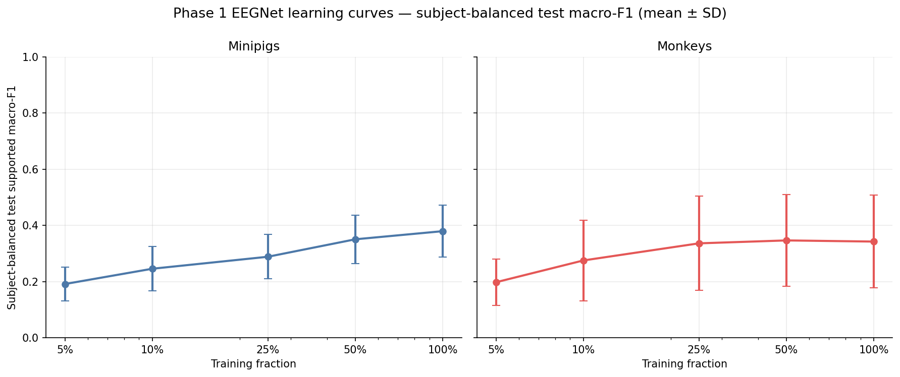
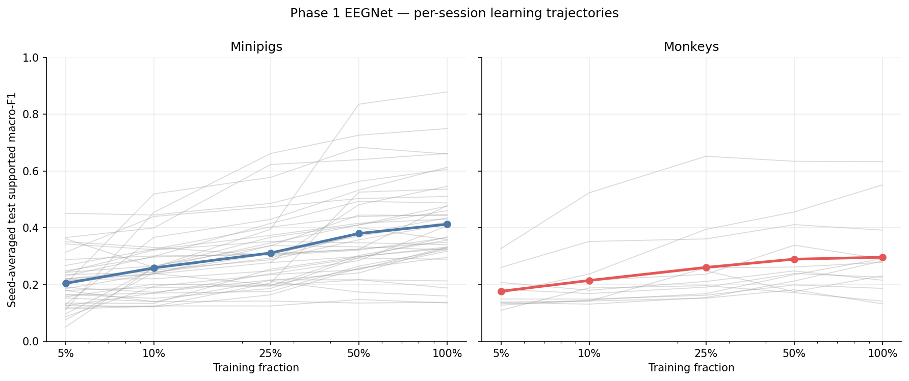
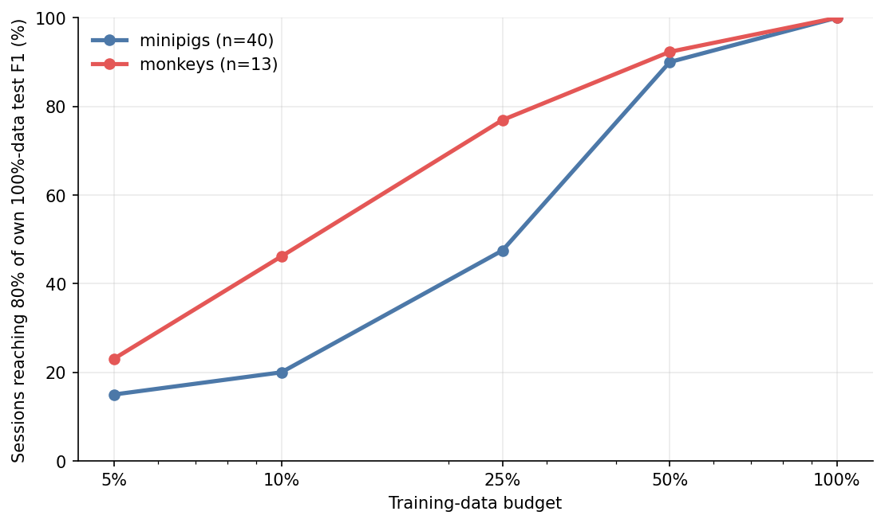
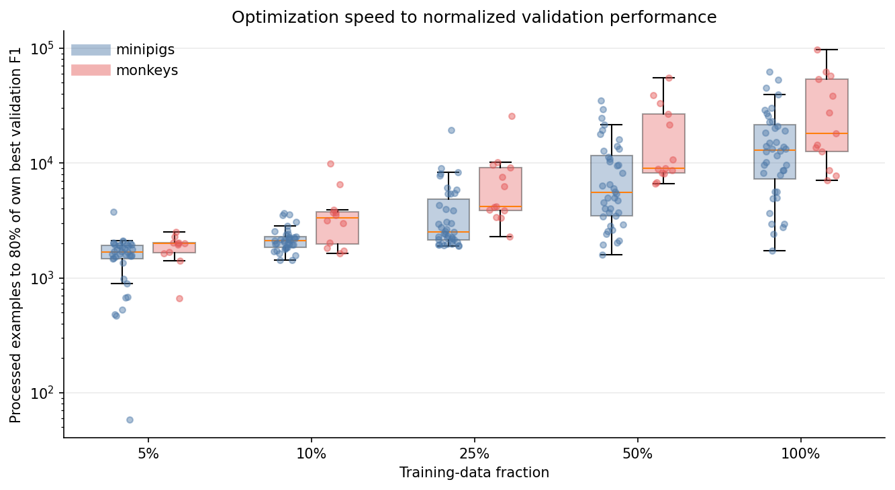

# Phase 1 -- EEGNet Single-Session Learning Curves

**Status:** In Progress
**Date started:** 2026-08-26
**Parent experiment:** [NeuroSoft Supervised-Pretraining Protocol and Data Audit](20260826-neurosoft-supervised-pretraining-protocol.md)
**Follow-up experiments:** [Phase 2 -- Convolution--BiGRU Scratch Pilot](20260828-MS-neurosoft-conv-bigru-pilot.md)
**Tags:** neurosoft, phase1, eegnet, learning-curves, 8band, intrasession-causal, supervised-pretraining

## Background

The [Phase 0 protocol audit](20260826-neurosoft-supervised-pretraining-protocol.md)
frozen eligibility rules, nested fraction manifests, and staged run counts for
NeuroSoft supervised pretraining. Phase 1 measures how much nested causal
training data each eligible single session needs before EEGNet reaches stable
supported-class performance on the fixed `intrasession-causal` evaluation
protocol.

## Question

Does increasing the nested causal training fraction improve supported-class test
macro-F1 and reduce failure to reach the fixed performance target, with
diminishing returns at larger fractions?

## Hypothesis

Increasing nested causal training data improves supported-class test macro-F1
and reduces failure to reach the fixed performance target, with diminishing
returns at larger fractions.

## Experiment

### Setup

- **Eligible recordings:** 53 (40 minipig, 13 monkey) from the Phase 0 audit.
- **Supported cells:** 255 recording/fraction cells (193 minipig, 62 monkey).
- **Jobs:** 765 = 255 cells × 3 seeds (42, 43, 44).
- **Model:** EEGNet (fixed recipe from baseline experiments).
- **Task:** `neurosoft_acoustic_stim_8band` (25 stimuli → 8 frequency bands).
- **Split:** `intrasession-causal`.
- **Fractions:** 5%, 10%, 25%, 50%, 100%.
- **Monitoring:** `val/neurosoft_acoustic_stim_8band_supported_f1`.
- **Test evaluation:** best validation checkpoint.

Hydra experiment configs:

| Species | Config |
|---------|--------|
| Minipigs | `configs/experiment/auditory_decoding/eegnet_neurosoft_8band_learning_curves_minipigs.yaml` |
| Monkeys | `configs/experiment/auditory_decoding/eegnet_neurosoft_8band_learning_curves_monkeys.yaml` |

### Launch command

Production submissions require a clean committed repository, a compute-node-visible
`FOUNDRY_SNAPSHOT_ROOT`, and the normal `python main.py ... -m` workflow on the
`long` partition.

```bash
git status --short  # must print nothing
export FOUNDRY_SNAPSHOT_ROOT=/network/scratch/s/sobralm/foundry-launches

python main.py \
  experiment=auditory_decoding/eegnet_neurosoft_8band_learning_curves_minipigs \
  hydra/launcher=slurm_default \
  -m

python main.py \
  experiment=auditory_decoding/eegnet_neurosoft_8band_learning_curves_monkeys \
  hydra/launcher=slurm_default \
  -m
```

### Key config overrides

See the species-specific Hydra YAML files above. Non-default choices relative to
the singlesession EEGNet baseline:

- `split_type=intrasession-causal`
- `training_fraction_task=neurosoft_acoustic_stim_8band`
- `training_fraction` swept via `phase1_cell` resolver from `docs/neurosoft-phase0-audit.json`
- `training_fraction_seed=${run.seed}`
- `run.project=neurosoft_supervised_pretraining`
- early stopping / checkpoint monitor: `val/neurosoft_acoustic_stim_8band_supported_f1`
- sweep seeds: 42, 43, 44
- validated `flops_per_window` and `flop_method` are required before production
  launch; the configs deliberately refuse to run until those profiling metadata
  are supplied for the realized model/input shape.

### Slurm submission record

| Launch | Slurm job ID | Snapshot bundle path |
|--------|--------------|----------------------|
| Minipigs (`eegnet_neurosoft_8band_learning_curves_minipigs`) | 10521500 (73 array elements, 579 tasks) | `/network/scratch/s/sobralm/foundry-launches/20260827T152641_PHASE1_EEGNET_MINIPIGS_b6c65640_6c083754` |
| Monkeys (`eegnet_neurosoft_8band_learning_curves_monkeys`) | 10521501 (24 array elements, 186 tasks) | `/network/scratch/s/sobralm/foundry-launches/20260827T152736_PHASE1_EEGNET_MONKEYS_b6c65640_6262e1ed` |
| Minipigs RETRY (25 cells, `timeout_min=60`, `tasks_per_node=2`) | 10523079 (38 array elements, 75 tasks) | `/network/scratch/s/sobralm/foundry-launches/20260827T175605_PHASE1_EEGNET_MINIPIGS_cd9e7f24_313dcf8e` |
| Monkeys RETRY (22 cells, `timeout_min=60`, `tasks_per_node=2`) | 10523080 (33 array elements, 66 tasks) | `/network/scratch/s/sobralm/foundry-launches/20260827T175646_PHASE1_EEGNET_MONKEYS_cd9e7f24_6f18a075` |

## Results

### Summary

WandB returned 834 raw records from `PHASE1_EEGNET_MINIPIGS` and
`PHASE1_EEGNET_MONKEYS`. The analysis retained one canonical completed test
result for each session/fraction/seed cell, preferring primary runs over
retries. This yielded 764 complete test results; 69 retry duplicates were
excluded from aggregation. One planned cell was skipped because it had no test
result: monkey `sub-02_ses-02_task-AcousStim_acq-RH_desc-raw`, 100% data,
seed 44 (WandB run `7o69q4ya`, failed).

Subject-balanced test macro-F1 increased monotonically for minipigs from
0.191 at 5% to 0.380 at 100%. Monkeys improved from 0.198 at 5% to 0.336 at
25% and then plateaued at about 0.34. The experiment remains in progress
pending interpretation and conclusions.

### Metrics

Subject-balanced test supported macro-F1 (average seeds → sessions → subjects
→ species; mean ± SD across subjects):

| Training fraction | Minipigs (n=7 subjects) | Monkeys (n=5 subjects) |
|------------------:|--------------------------:|------------------------:|
| 5% | 0.191 ± 0.061 | 0.198 ± 0.083 |
| 10% | 0.246 ± 0.079 | 0.275 ± 0.144 |
| 25% | 0.288 ± 0.079 | 0.336 ± 0.168 |
| 50% | 0.351 ± 0.087 | 0.347 ± 0.163 |
| 100% | 0.380 ± 0.092 | 0.343 ± 0.166 |

Cumulative share of sessions reaching at least 80% of their own 100%-data
test F1:

| Training-data budget | Minipigs (n=40 sessions) | Monkeys (n=13 sessions) |
|---------------------:|--------------------------:|-------------------------:|
| 5% | 15.0% | 23.1% |
| 10% | 20.0% | 46.2% |
| 25% | 47.5% | 76.9% |
| 50% | 90.0% | 92.3% |
| 100% | 100.0% | 100.0% |

The optimization-speed distribution uses all 764 canonical validation
histories. For each run, it records the first validation event reaching 80% of
that run's own eventual best validation F1, measured in processed examples.
The plotted points are seed-averaged session/fraction values; lower values
indicate faster convergence to normalized validation performance, not better
absolute performance.

### Analysis

```bash
uv run python analysis/20260826-MS-neurosoft-eegnet-learning-curves_analysis.py
```

The validation-history cache is stored in `analysis/csv/` and is reused by the
default command. To refresh all validation histories from WandB explicitly:

```bash
uv run python analysis/20260826-MS-neurosoft-eegnet-learning-curves_analysis.py \
  --include-optimization-history
```

### Figures

Subject-balanced learning curves:



Seed-averaged per-session test trajectories:



Cumulative share of sessions reaching 80% of their own full-data test F1:



Distribution of training examples required to reach 80% of each run's own
best validation F1:



## Conclusions

TBD

## Notes for future experiments

TBD
