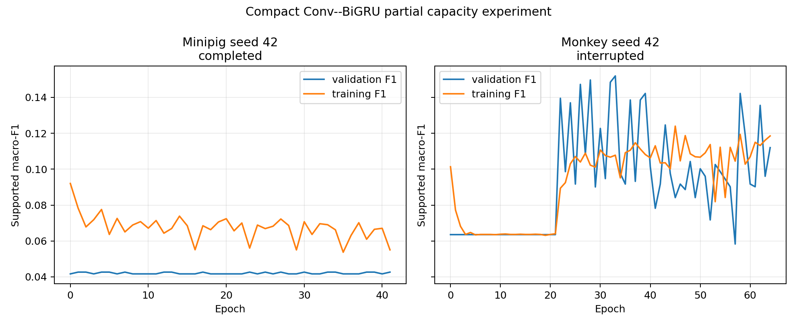

# Phase 2 -- Convolution--BiGRU Compact Capacity Screen

**Status:** Abandoned
**Date started:** 2026-08-31
**Parent experiment:** [Phase 2 -- Convolution--BiGRU Recipe Recovery](20260831-MS-neurosoft-conv-bigru-recipe-recovery.md)
**Follow-up experiments:** TBD
**Tags:** neurosoft, phase2, convolution-bigru, compact, capacity, scratch, intrasession-causal

## Background

The full Conv--BiGRU recipe-recovery screen retained the 510k-parameter,
2-layer, 128-hidden-unit architecture while testing lower learning rates and
lighter regularization. Its completed minipig cells remained at the class-prior
validation F1 despite zero dropout and zero weight decay. That result makes
capacity/conditioning a plausible next cause. It also mirrors the historical
NeuroSoft capacity finding that smaller models can outperform the default
large model on limited data, although that result used POYO under a different
protocol.

This is a capacity-only replay of the original pre-recipe-screen pilot, not a
second recipe search. It holds the pilot data, unweighted loss, optimizer,
precision, split, test protocol, and three full-data seeds fixed. It
deliberately preserves stride 4, so the compact model has the same 250
recurrent time steps as the full model. The only training-relevant intervention
is the compact encoder: adapter 32, temporal channels 64, one bidirectional
GRU layer, and 64 hidden units per direction.

## Question

Does reducing Conv--BiGRU width and recurrent depth restore learnability and
improve supported test macro-F1 on the representative causal minipig and
monkey sessions under the original pre-recipe-screen pilot recipe?

## Hypothesis

The compact Conv--BiGRU will avoid the minipig class-prior collapse, attain
train supported F1 materially above 0.12, and improve the three-seed mean test
macro-F1 over the matched full-model pilot (0.041 minipig; 0.134 monkey). A
successful capacity control will at least match the EEGNet references (0.135
minipig; 0.208 monkey) under this fixed recipe.

## Experiment

### Setup

- **Model:** `NeurosoftConvBiGRU` compact configuration: 32-dimensional
  session adapter, one 64-channel separable temporal block, 1-layer
  bidirectional GRU with 64 hidden units per direction, and the unchanged
  8-logit router. The raw window length, temporal kernel (64), stride (4),
  pooling, transfer boundary, and target-only adapter policy are unchanged.
- **Capacity comparison:** full pilot architecture = adapter 64, temporal
  channels 128, 2-layer 128-hidden BiGRU; compact architecture = 32, 64,
  1-layer 64-hidden. This is expected to reduce the model from approximately
  511k parameters to tens of thousands without changing the input protocol.
- **Data and task:** Full-data, `intrasession-causal` 8-band acoustic-stimulus
  classification on the same audited sessions as the recovery screen:
  minipig `sub-06_ses-02_task-AcousStim_acq-LH_desc-raw` (18 supported model
  channels) and monkey `sub-01_ses-04_task-AcousStim_acq-RH_desc-raw` (29).
- **Training control:** Exactly the original pilot recipe: full data, batch
  size 16, learning rate 0.0015, weight decay 0.018, model dropout 0.3,
  maximum 200 epochs, patience 40, and gradient clipping 1.0. Run seeds 42,
  43, and 44 for each species.
- **Loss:** Unweighted cross-entropy (`class_weights.mode=none`), matching the
  original pilot and Phase-1 EEGNet training; no balancing is introduced.
- **Precision:** `bf16-mixed`, matching the successfully completed pilot.
- **FLOPs:** The compact model must receive a new species-specific
  forward-plus-backward FLOP profile before production accounting. The screen
  deliberately does not copy the full-model FLOP value, so its compute
  callback records windows/time but no FLOP total until that profile is added.
- **Evaluation:** No recipe selection is performed. Each run restores its
  validation-selected checkpoint and evaluates its test split once, exactly as
  the original pilot did.
- **Partial execution record:** Minipig seed 42 completed as
  `conv_bigru_compact_control_mp_sub-06_ses-02_task-AcousStim_acq-LH_desc-raw_s42`
  (`7fb7r2eo`). Monkey seed 42 was deliberately interrupted as
  `conv_bigru_compact_control_mk_sub-01_ses-04_task-AcousStim_acq-RH_desc-raw_s42`
  (`tf6hl7wy`); it has no valid test result. No other declared seeds ran.

### Launch command

Commit these files first, confirm a clean repository, set the shared snapshot
root, and run the three fixed seeds for each species separately.

```bash
git status --short  # must print nothing
export FOUNDRY_SNAPSHOT_ROOT=/network/scratch/s/sobralm/foundry-launches

python main.py \
  experiment=auditory_decoding/neurosoft_conv_bigru_8band_compact_minipigs \
  phase2_compact_recording_id=sub-06_ses-02_task-AcousStim_acq-LH_desc-raw \
  hydra/launcher=local_gpu \
  -m

python main.py \
  experiment=auditory_decoding/neurosoft_conv_bigru_8band_compact_monkeys \
  phase2_compact_recording_id=sub-01_ses-04_task-AcousStim_acq-RH_desc-raw \
  hydra/launcher=local_gpu \
  -m
```

### Key config overrides

- `model=neurosoft_conv_bigru_compact` with adapter 32, temporal channels 64,
  GRU hidden size 64, and one GRU layer;
- the original pilot's fixed LR 0.0015, weight decay 0.018, and model dropout
  0.3;
- unweighted loss, the causal manifests, the checkpoint monitor, and one test
  evaluation from the restored best-validation checkpoint; and
- `bf16-mixed` precision.

### Gate criteria

Consider capacity the likely driver only if the compact control for each
species:

1. has finite metrics and predicts at least two validation classes;
2. raises minipig train supported F1 above 0.12;
3. improves the full-model pilot's corresponding three-seed mean test F1; and
4. matches the stated EEGNet test-F1 reference in both species.

If it still fails to learn the minipig training set, next isolate the
convolutional frontend with a same-split historical-plain-GRU control rather
than decreasing capacity again.

## Results

### Summary

This capacity screen was stopped at the user's direction after the only
completed minipig seed again showed class-prior-level learning. The minipig
compact model early-stopped after 42 epochs: its best validation supported F1
was 0.0427, its peak training supported F1 was 0.0920, and its restored-best
checkpoint test supported F1 was 0.0410. It therefore did not meet the
predeclared minipig training-F1 gate (>0.12) and did not improve the matched
full-model pilot test F1 (0.041).

Monkey seed 42 was stopped during epoch 64, before test evaluation. Its
highest logged validation supported F1 was 0.1519 and its peak training
supported F1 was 0.1240, but this interrupted run is descriptive only and is
not used for a species comparison. Seeds 43--44 for either species were not
run. Consequently, this is not a three-seed capacity result.

### Metrics

| Species | Seed | Outcome | WandB state | Best val supported F1 | Peak train supported F1 | Test supported F1 | Last epoch | WandB run (ID) |
|---|---:|---|---|---:|---:|---:|---:|---|
| Minipig | 42 | Completed | finished | 0.0427 | 0.0920 | 0.0410 | 42 | `conv_bigru_compact_control_mp_…_s42` (`7fb7r2eo`) |
| Monkey | 42 | User-interrupted | failed | 0.1519 | 0.1240 | — | 64 | `conv_bigru_compact_control_mk_…_s42` (`tf6hl7wy`) |

**Execution provenance:** Both seed-42 runs started concurrently on the
local Quadro RTX 8000 from clean immutable snapshots at Git SHA `c07dbd28`.
The minipig snapshot was
`20260831T154749_PHASE2_CONV_BIGRU_COMPACT_CONTROL_c07dbd28_823f6df0`; the
monkey snapshot was
`20260831T154750_PHASE2_CONV_BIGRU_COMPACT_CONTROL_c07dbd28_7ba4dff6`.

### Analysis

The partial-result table and curves are reproducible from WandB with:

```bash
uv run python analysis/20260831-MS-neurosoft-conv-bigru-compact-capacity.py
```

The script writes its cache to
`analysis/csv/20260831-MS-neurosoft-conv-bigru-compact-capacity_partial_runs.csv`.

### Figures



### Root-cause diagnostic (post-abandonment)

A targeted diagnostic identified the actual cause of the minipig collapse.
The compact capacity screen is **superseded by this finding**; the collapse
is not capacity-driven.

**Signal scale mismatch.** The minipig ECoG signal is stored in Volts with
per-channel standard deviation ~7 × 10⁻⁵, roughly 11× smaller than the
monkey signal (std ~8 × 10⁻⁴).

| Species | Per-channel std (median) | Signal range |
|---------|--------------------------|--------------|
| Minipig | 7.0 × 10⁻⁵ | [-8 × 10⁻⁴, 1.1 × 10⁻³] |
| Monkey  | 8.0 × 10⁻⁴ | [-1.3 × 10⁻², 1.3 × 10⁻²] |

**Embedding collapse.** At the minipig signal scale, the session adapter's
`nn.Linear(18, 32)` bias (~0.77 norm) overwhelms the signal-dependent output
(per-dimension std ~10⁻⁵). LayerNorm normalizes the bias-dominated
activations into **identical representations** (cosine similarity = 1.0000
across a balanced batch of 16 examples from 8 classes). The adapter weight
gradient is ~3000× smaller than the bias gradient because `∂L/∂W ∝ x` and
the input is ~10⁻⁴. At lr=0.0015, the weights cannot learn useful spatial
projections within the patience window.

**Overfit diagnostic** (16 examples, 500 Adam steps, compact BiGRU):

| Configuration | Final loss | Accuracy |
|---------------|-----------|----------|
| Baseline (no scaling), lr=0.001 | 2.074 | 18.8% (chance) |
| Input × 10⁴, lr=0.001 | 0.001 | 100% |
| Input × 10⁴, lr=0.0015 | 0.000 | 100% |
| Adapter bias=False, lr=0.001 | 0.005 | 100% |
| Per-channel z-norm, lr=0.001 | 0.001 | 100% |

**Full 50-epoch training** (production recipe, compact BiGRU):

| Scaling | Best val acc | Train acc (final) | Predicted classes |
|---------|-------------|-------------------|-------------------|
| None | 0.206 | 0.199 | 1 (collapsed) |
| ×10⁴ | 0.314 | 0.695 | 8 (all classes) |

With scaling, the full 510K BiGRU also learns (val acc 0.303, train acc
0.966), confirming the fix is orthogonal to capacity.

**Why EEGNet is unaffected.** EEGNet uses `BatchNorm2d` after its first
convolution. BatchNorm normalizes each feature across the batch and is
invariant to global input scale. The Conv-BiGRU uses `LayerNorm`, which
normalizes within each sample, and therefore cannot correct for small
absolute amplitude when the adapter bias dominates.

## Conclusions

The experiment was abandoned before its declared three-seed comparison could
be completed. The sole completed minipig seed failed the learnability gate and
exactly matched the full-model pilot's 0.041 test supported F1; reducing the
architecture did not rescue that seed.

**The post-abandonment diagnostic conclusively shows the minipig collapse is
not caused by model capacity.** It is caused by the interaction between:

1. the tiny minipig ECoG signal scale (~7 × 10⁻⁵ V);
2. the session adapter's `nn.Linear` bias, which dominates the output; and
3. LayerNorm, which normalizes the bias-dominated activations into identical
   representations regardless of input content.

The monkey session works because its signal is ~11× larger, keeping the
signal above the adapter bias floor. **The fix is input normalization, not
capacity reduction.** Any of the following restore full learning:

- Multiply input by a scale factor (e.g. 10⁴)
- Remove the adapter bias (`bias=False`)
- Apply per-channel z-normalization before the adapter

## Notes for future experiments

- Do not treat the interrupted monkey run as a test result or combine it with
  the completed minipig seed.
- The capacity hypothesis is ruled out. Further capacity experiments are not
  needed for the minipig session.
- A follow-up experiment should add input normalization to
  `NeurosoftConvBiGRU` (e.g. per-channel z-scoring in `tokenize`, or a
  learnable `BatchNorm1d` before the adapter) and rerun the pilot or
  recipe-recovery screen on the minipig session.
- Per-channel z-normalization is the most robust option because it generalizes
  across recording setups with different amplifier gains and electrode
  impedances.
- The full BiGRU (510K) shows strong overfitting with scaling (train 96.6%,
  val 30.3%); the compact model may be preferable for small sessions, but
  that comparison is only meaningful after the normalization fix.
- Diagnostic scripts:
  `analysis/20260831_bigru_minipig_diagnostic.py` and
  `analysis/20260831_bigru_signal_scale_fix.py`.
