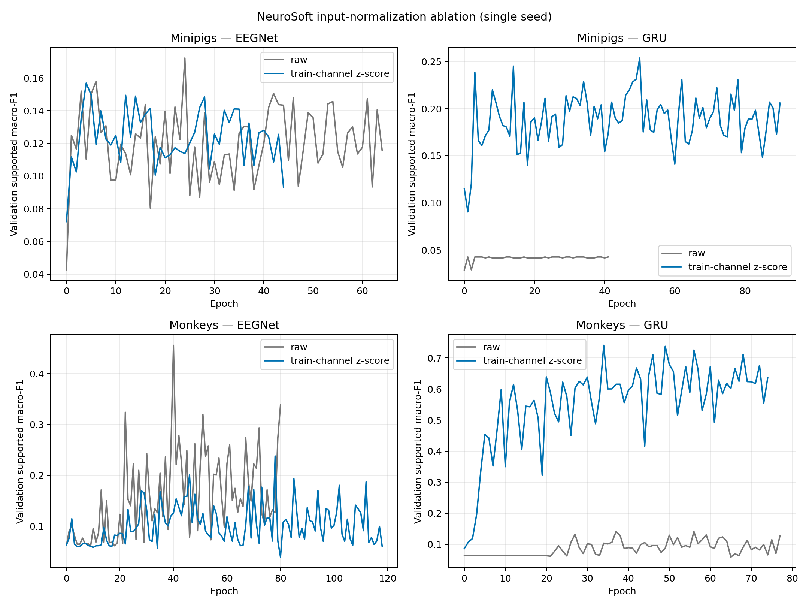

# NeuroSoft Input Normalization Recovery Ablation

**Status:** Completed
**Date started:** 2026-08-31
**Parent experiment:** [Phase 2 -- Convolution--BiGRU Recipe Recovery](20260831-MS-neurosoft-conv-bigru-recipe-recovery.md)
**Follow-up experiments:** [Phase 3 -- NeuroSoft Input-Normalization Seed Replication](20260901-MS-neurosoft-input-normalization-replication.md)
**Tags:** neurosoft, input-normalization, eegnet, convolution-bigru, recovery, ablation, intrasession-causal

## Background

The [Conv--BiGRU recipe-recovery experiment](20260831-MS-neurosoft-conv-bigru-recipe-recovery.md) showed that changing the optimizer recipe did not recover the representative minipig session: every full-sized Conv--BiGRU cell remained at the class-prior validation F1. The subsequent [compact-capacity screen](20260831-MS-neurosoft-conv-bigru-compact-capacity.md) isolated the cause as recording-scale mismatch: tiny raw minipig ECoG values allow the GRU session-adapter bias to dominate before LayerNorm, yielding indistinguishable embeddings. A train-split-only, recording-level per-channel z-score transform was added in commit `9c4d4a4` to address that mechanism.

The initial one-seed screen confirmed the GRU scale-recovery mechanism: per-channel z-scoring raised best validation supported macro-F1 from 0.0427 to 0.2538 for the minipig GRU and from 0.1413 to 0.7403 for the monkey GRU. However, it reduced the peak EEGNet metric, particularly for monkey (0.4559 to 0.2379). EEGNet's BatchNorm makes it relatively insensitive to uniform scale, but per-channel z-scoring additionally reweights and recenters individual electrodes before its spatial convolution.

Phase 2 separates global recording scale correction from per-channel equalization. It adds exactly the four missing train-split-only global-z-score cells—one for each species-model pair at seed 42—to the completed eight-cell comparison. It is validation-only and designed to determine whether amplitude rescue without channel equalization preserves EEGNet while retaining the GRU recovery.

## Question

Across representative causal sessions from both species, does train-split-only global recording z-scoring preserve EEGNet validation performance better than per-channel z-scoring while retaining the GRU recovery?

## Hypothesis

`recording_train_global_zscore` will lift the minipig GRU above its raw class-prior validation regime (about 0.043 supported macro-F1) and attain validation F1 close to the existing per-channel seed-42 condition. Because it applies one scalar mean and scale to the whole recording, it will preserve relative channel amplitudes and therefore attain EEGNet validation F1 above the existing per-channel mode, especially for monkey. If global z-scoring does not preserve EEGNet, the adverse effect is more likely due to the changed optimization/regularization regime than to loss of relative channel scale.

## Experiment

### Setup

- **Models:** `NeurosoftConvBiGRU` (called GRU below) and `EEGNetEncoder`, each trained from scratch.
- **Data:** One 8-band, full-data, audited `intrasession-causal` session per species: minipig `sub-06_ses-02_task-AcousStim_acq-LH_desc-raw` and monkey `sub-01_ses-04_task-AcousStim_acq-RH_desc-raw`.
- **Independent variable:** `data.input_normalization.mode`: `disabled`, `recording_train_global_zscore`, or `recording_train_channel_zscore`. The global mode fits one frozen mean and standard deviation across every supported channel-time sample in a recording's causal-training partition, then broadcasts those scalars to every supported channel. The per-channel mode instead fits one mean and scale per supported channel. Both reuse their train-only statistics unchanged for validation.
- **Controls:** Model, normalization mode, and no other setting vary. Both architectures use batch size 16, learning rate 0.0015, weight decay 0.018, 0.5 s windows, 200 maximum epochs, patience 40, unweighted cross-entropy, seed 42, and `bf16-mixed` precision.
- **Primary metric:** Best `val/neurosoft_acoustic_stim_8band_supported_f1` (validation supported macro-F1), used for early stopping and the 3 x 2 single-seed comparison. Validation curves remain supporting evidence because a best epoch can be noisy.
- **Scope:** Phase 1 completed 8 runs: 2 species x 2 models x raw/per-channel z-score. Phase 2 adds 4 runs: 2 species x 2 models x global z-score. This remains one session per species and one seed, not a performance estimate.
- **Test discipline:** `run.evaluate_test=false`; this experiment answers the requested validation-only question and does not consume the held-out test set.
- **WandB:** project `neurosoft_supervised_pretraining`, group `PHASE2_INPUT_NORMALIZATION_ABLATION`. The completed Phase-1 runs are `1qwq1x7r`, `lx7f8e1t`, `xfo8t5yt`, `l7gek5ps`, `gvpixafp`, `fu7dnhkn`, `cra6xbbd`, and `677tch9g`; Phase 2 adds the four global-z-score runs to that comparison.

### Launch command

Commit this experiment record and configurations, confirm the repository is clean, then run one two-cell multirun for each species locally. The local-GPU launcher creates a snapshot for every cell and, with `max_batch_size=1`, runs them sequentially.

```bash
git status --short  # must print nothing
export FOUNDRY_SNAPSHOT_ROOT=/network/scratch/s/sobralm/foundry-launches

python main.py \
  experiment=auditory_decoding/neurosoft_input_normalization_ablation_minipigs \
  normalization_ablation_recording_id=sub-06_ses-02_task-AcousStim_acq-LH_desc-raw \
  model=eegnet,neurosoft_conv_bigru \
  hydra/launcher=local_gpu \
  -m

python main.py \
  experiment=auditory_decoding/neurosoft_input_normalization_ablation_monkeys \
  normalization_ablation_recording_id=sub-01_ses-04_task-AcousStim_acq-RH_desc-raw \
  model=eegnet,neurosoft_conv_bigru \
  hydra/launcher=local_gpu \
  -m
```

Record the four snapshot paths and WandB run IDs here after the launchers return.

### Launch record

Launched locally on 2026-09-01 with all four cells sharing GPU 0. The parent
processes ran under existing Slurm allocation `10617291`; no new Slurm job was
submitted.

- **Minipigs snapshot:** `/network/scratch/s/sobralm/foundry-launches/20260901T141343_PHASE2_INPUT_NORMALIZATION_ABLATION_b76b1f38_36610cfd`
  - GRU: [`sjd058s0`](https://wandb.ai/poyo-eeg/neurosoft_supervised_pretraining/runs/sjd058s0)
  - EEGNet: [`2ibkohn5`](https://wandb.ai/poyo-eeg/neurosoft_supervised_pretraining/runs/2ibkohn5)
- **Monkeys snapshot:** `/network/scratch/s/sobralm/foundry-launches/20260901T141343_PHASE2_INPUT_NORMALIZATION_ABLATION_b76b1f38_c8249aef`
  - GRU: [`902pw4ml`](https://wandb.ai/poyo-eeg/neurosoft_supervised_pretraining/runs/902pw4ml)
  - EEGNet: [`mpghfxip`](https://wandb.ai/poyo-eeg/neurosoft_supervised_pretraining/runs/mpghfxip)

### Key config overrides

- New experiment configs: `configs/experiment/auditory_decoding/neurosoft_input_normalization_ablation_{minipigs,monkeys}.yaml`.
- Added input-normalization mode: `recording_train_global_zscore`, implemented with one train-only recording-wide mean and standard deviation broadcast across supported channels.
- The Phase-2 config fixes `data.input_normalization.mode=recording_train_global_zscore`; the CLI sweeps only `model=eegnet,neurosoft_conv_bigru` at the existing seed 42.
- Common recovery recipe: `learning_rate=0.0015`, `weight_decay=0.018`, `batch_size=16`, `max_epochs=200`, `patience=40`, `run.seed=42`.
- Validation-only: `run.evaluate_test=false`.

## Results

### Summary

At seed 42, both train-only z-score modes recovered the GRU from the raw
minipig class-prior regime and from the weaker monkey raw baseline. Global
z-scoring preserved EEGNet better than channel-wise z-scoring in both species,
but raw EEGNet remained the strongest condition. This completed the originally
missing global-normalization cells and motivated the linked three-seed
[Phase 3 replication](20260901-MS-neurosoft-input-normalization-replication.md).

### Metrics

Best validation supported macro-F1 for the seed-42 screen, reproduced by the
analysis script:

| Species | Model | Input normalization | Best F1 | Best epoch | WandB run |
|---|---|---|---:|---:|---|
| Minipigs | EEGNet | Raw | 0.1722 | 24 | [EEGNet minipig raw s42 (`1qwq1x7r`)](https://wandb.ai/poyo-eeg/neurosoft_supervised_pretraining/runs/1qwq1x7r) |
| Minipigs | EEGNet | Train-channel z-score | 0.1568 | 4 | [EEGNet minipig channel s42 (`lx7f8e1t`)](https://wandb.ai/poyo-eeg/neurosoft_supervised_pretraining/runs/lx7f8e1t) |
| Minipigs | EEGNet | Train-global z-score | 0.1642 | 6 | [EEGNet minipig global s42 (`2ibkohn5`)](https://wandb.ai/poyo-eeg/neurosoft_supervised_pretraining/runs/2ibkohn5) |
| Minipigs | GRU | Raw | 0.0427 | 1 | [GRU minipig raw s42 (`xfo8t5yt`)](https://wandb.ai/poyo-eeg/neurosoft_supervised_pretraining/runs/xfo8t5yt) |
| Minipigs | GRU | Train-channel z-score | 0.2538 | 50 | [GRU minipig channel s42 (`l7gek5ps`)](https://wandb.ai/poyo-eeg/neurosoft_supervised_pretraining/runs/l7gek5ps) |
| Minipigs | GRU | Train-global z-score | 0.2332 | 19 | [GRU minipig global s42 (`sjd058s0`)](https://wandb.ai/poyo-eeg/neurosoft_supervised_pretraining/runs/sjd058s0) |
| Monkeys | EEGNet | Raw | 0.4559 | 40 | [EEGNet monkey raw s42 (`gvpixafp`)](https://wandb.ai/poyo-eeg/neurosoft_supervised_pretraining/runs/gvpixafp) |
| Monkeys | EEGNet | Train-channel z-score | 0.2379 | 78 | [EEGNet monkey channel s42 (`fu7dnhkn`)](https://wandb.ai/poyo-eeg/neurosoft_supervised_pretraining/runs/fu7dnhkn) |
| Monkeys | EEGNet | Train-global z-score | 0.2810 | 57 | [EEGNet monkey global s42 (`mpghfxip`)](https://wandb.ai/poyo-eeg/neurosoft_supervised_pretraining/runs/mpghfxip) |
| Monkeys | GRU | Raw | 0.1413 | 37 | [GRU monkey raw s42 (`cra6xbbd`)](https://wandb.ai/poyo-eeg/neurosoft_supervised_pretraining/runs/cra6xbbd) |
| Monkeys | GRU | Train-channel z-score | 0.7403 | 34 | [GRU monkey channel s42 (`677tch9g`)](https://wandb.ai/poyo-eeg/neurosoft_supervised_pretraining/runs/677tch9g) |
| Monkeys | GRU | Train-global z-score | 0.7474 | 54 | [GRU monkey global s42 (`902pw4ml`)](https://wandb.ai/poyo-eeg/neurosoft_supervised_pretraining/runs/902pw4ml) |

### Analysis

The completed seed-42 diagnostic is reproducible with:

```bash
uv run python analysis/20260831-MS-neurosoft-input-normalization-ablation_analysis.py
```

It dynamically collects the 12-cell seed-42 WandB group.

### Figures



## Conclusions

The seed-42 evidence supports the stated scale-recovery mechanism: global
z-scoring raises GRU validation F1 far above raw input in both species, and it
is less damaging to EEGNet than per-channel normalization. It does not restore
EEGNet to the raw-input peak, especially for monkey. The subsequently completed
[Phase 3 replication](20260901-MS-neurosoft-input-normalization-replication.md)
confirmed that these condition rankings generalize across the two added seeds.

## Notes for future experiments

- **Completed follow-up:** repeat the full 12-cell validation comparison at
  seeds 43 and 44, then assess mean and per-seed ordering. This work is
  recorded in the linked Phase 3 replication experiment.
