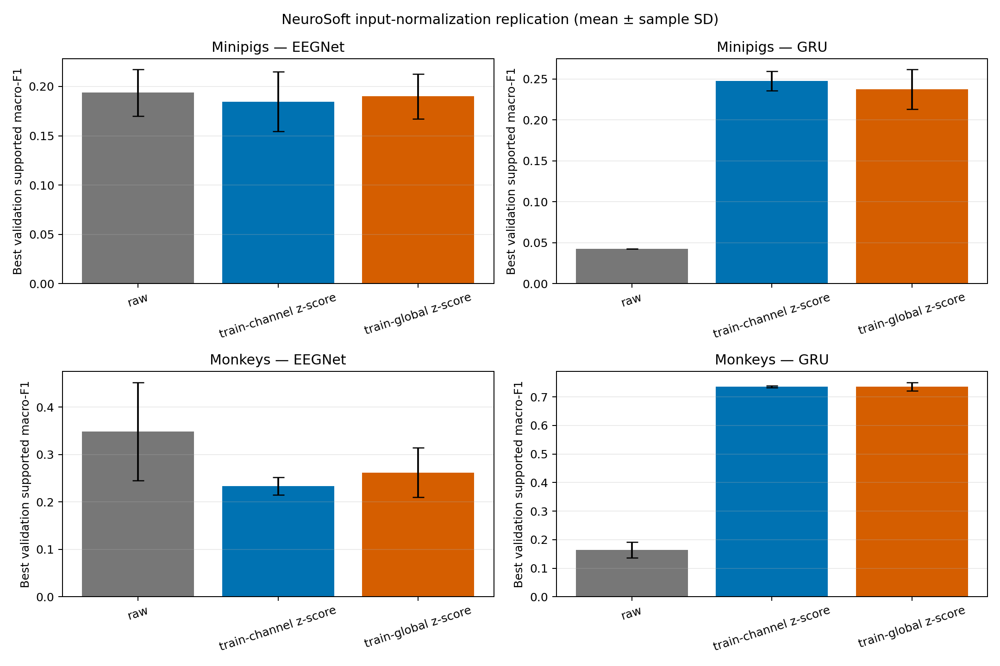

# Phase 3 -- NeuroSoft Input-Normalization Seed Replication

**Status:** Completed
**Date started:** 2026-09-01
**Parent experiment:** [NeuroSoft Input Normalization Recovery Ablation](20260831-MS-neurosoft-input-normalization-ablation.md)
**Follow-up experiments:** [Scratch Baselines Normalization](20260901-MS-scratch-baselines-normalization.md)
**Tags:** neurosoft, input-normalization, eegnet, convolution-bigru, replication, seeds, intrasession-causal

## Background

The parent [single-seed normalization ablation](20260831-MS-neurosoft-input-normalization-ablation.md) completed the 12-cell comparison at seed 42: two species, EEGNet and Conv--BiGRU (GRU), and raw, train-channel-z-score, and train-global-z-score inputs. Global z-scoring recovered the GRU in both species and improved EEGNet relative to channel-wise normalization, but the evidence is a single seed and cannot establish that these rankings are stable.

This phase fills the two missing seeds in the predeclared three-seed protocol. It repeats every seed-42 cell without changing data, split, optimizer, model capacity, precision, or early-stopping criterion. Together with the completed seed-42 cells, it will yield a balanced 2 species x 2 models x 3 normalization modes x 3 seeds validation-only comparison.

## Question

Across seeds 42, 43, and 44, do the relative effects of train-global and train-channel z-scoring on validation supported macro-F1 replicate for EEGNet and GRU in both representative causal sessions?

## Hypothesis

The three-seed mean will preserve the seed-42 ordering: both z-score modes will materially improve GRU over raw input, global z-scoring will match or exceed channel-wise z-scoring for monkey GRU, and global z-scoring will exceed channel-wise z-scoring for EEGNet while remaining below raw EEGNet. Replication failure will be indicated by a reversed mean ordering or by effects that are inconsistent across the two added seeds.

## Experiment

### Setup

- **Models:** `EEGNetEncoder` and `NeurosoftConvBiGRU` (GRU), trained from scratch.
- **Data:** The parent experiment's audited, 8-band, full-data `intrasession-causal` sessions: minipig `sub-06_ses-02_task-AcousStim_acq-LH_desc-raw` and monkey `sub-01_ses-04_task-AcousStim_acq-RH_desc-raw`.
- **Independent variables:** `run.seed` in `{43, 44}` and `data.input_normalization.mode` in `{disabled, recording_train_channel_zscore, recording_train_global_zscore}`. Model and species are retained as balanced comparison factors.
- **Controls:** Parent Hydra configs, batch size 16, learning rate 0.0015, weight decay 0.018, 0.5 s windows, 200 maximum epochs, patience 40, unweighted cross-entropy, and `bf16-mixed` precision are unchanged. Normalization statistics remain fit only on each recording's causal-training partition.
- **Scope:** 24 new cells: 2 species x 2 models x 3 normalization modes x 2 missing seeds. Combined with the completed 12 seed-42 cells, this produces 36 validation-only runs.
- **Primary metric:** Per-run best `val/neurosoft_acoustic_stim_8band_supported_f1`, summarized by species, model, and normalization mode as the three-seed mean and sample standard deviation. Curves are supporting evidence only.
- **Test discipline:** `run.evaluate_test=false`; no held-out test evaluation is consumed.
- **WandB:** project `neurosoft_supervised_pretraining`, group `PHASE3_INPUT_NORMALIZATION_REPLICATION`. Seed-42 parent runs remain in `PHASE2_INPUT_NORMALIZATION_ABLATION` and are included only by the Phase-3 analysis script.

### Launch command

Commit the Phase-3 record, confirm the repository is clean, set a shared snapshot root, and launch one 12-cell multirun per species. The existing configs are reused; no Phase-3 config duplication is required.

```bash
git status --short  # must print nothing
export FOUNDRY_SNAPSHOT_ROOT=/network/scratch/s/sobralm/foundry-launches

python main.py \
  experiment=auditory_decoding/neurosoft_input_normalization_ablation_minipigs \
  normalization_ablation_recording_id=sub-06_ses-02_task-AcousStim_acq-LH_desc-raw \
  model=eegnet,neurosoft_conv_bigru \
  data.input_normalization.mode=disabled,recording_train_channel_zscore,recording_train_global_zscore \
  run.seed=43,44 \
  run.group=PHASE3_INPUT_NORMALIZATION_REPLICATION \
  hydra/launcher=local_gpu \
  -m

python main.py \
  experiment=auditory_decoding/neurosoft_input_normalization_ablation_monkeys \
  normalization_ablation_recording_id=sub-01_ses-04_task-AcousStim_acq-RH_desc-raw \
  model=eegnet,neurosoft_conv_bigru \
  data.input_normalization.mode=disabled,recording_train_channel_zscore,recording_train_global_zscore \
  run.seed=43,44 \
  run.group=PHASE3_INPUT_NORMALIZATION_REPLICATION \
  hydra/launcher=local_gpu \
  -m
```

Record the two snapshot bundle paths and the 24 WandB run names and IDs here after the launchers return.

### Launch record

Launched locally on 2026-09-01 with eight concurrent cells sharing GPU 0 (four
worker slots per species sweep). The parent processes ran under existing Slurm
allocation `10617291`; no new Slurm job was submitted.

- **Minipigs snapshot:** `/network/scratch/s/sobralm/foundry-launches/20260901T143741_PHASE3_INPUT_NORMALIZATION_REPLICATION_cd80a9d1_7251c5ff`
- **Monkeys snapshot:** `/network/scratch/s/sobralm/foundry-launches/20260901T143741_PHASE3_INPUT_NORMALIZATION_REPLICATION_cd80a9d1_13382065`
- **Minipig EEGNet:** raw s43 [`mwmn8x2x`](https://wandb.ai/poyo-eeg/neurosoft_supervised_pretraining/runs/mwmn8x2x), raw s44 [`rz4oz730`](https://wandb.ai/poyo-eeg/neurosoft_supervised_pretraining/runs/rz4oz730); channel s43 [`b8mgqcz6`](https://wandb.ai/poyo-eeg/neurosoft_supervised_pretraining/runs/b8mgqcz6), channel s44 [`hmyhig85`](https://wandb.ai/poyo-eeg/neurosoft_supervised_pretraining/runs/hmyhig85); global s43 [`wxu4n4ec`](https://wandb.ai/poyo-eeg/neurosoft_supervised_pretraining/runs/wxu4n4ec), global s44 [`nq9kbihj`](https://wandb.ai/poyo-eeg/neurosoft_supervised_pretraining/runs/nq9kbihj).
- **Minipig GRU:** raw s43 [`mjzj4tob`](https://wandb.ai/poyo-eeg/neurosoft_supervised_pretraining/runs/mjzj4tob), raw s44 [`wpv7ecv0`](https://wandb.ai/poyo-eeg/neurosoft_supervised_pretraining/runs/wpv7ecv0); channel s43 [`h2j5p5lh`](https://wandb.ai/poyo-eeg/neurosoft_supervised_pretraining/runs/h2j5p5lh), channel s44 [`b66bwtd3`](https://wandb.ai/poyo-eeg/neurosoft_supervised_pretraining/runs/b66bwtd3); global s43 [`xfl90aok`](https://wandb.ai/poyo-eeg/neurosoft_supervised_pretraining/runs/xfl90aok), global s44 [`fsa0gjgm`](https://wandb.ai/poyo-eeg/neurosoft_supervised_pretraining/runs/fsa0gjgm).
- **Monkey EEGNet:** raw s43 [`ppt1ztz0`](https://wandb.ai/poyo-eeg/neurosoft_supervised_pretraining/runs/ppt1ztz0), raw s44 [`6yz8d6b1`](https://wandb.ai/poyo-eeg/neurosoft_supervised_pretraining/runs/6yz8d6b1); channel s43 [`z2wexlq7`](https://wandb.ai/poyo-eeg/neurosoft_supervised_pretraining/runs/z2wexlq7), channel s44 [`5sgss10z`](https://wandb.ai/poyo-eeg/neurosoft_supervised_pretraining/runs/5sgss10z); global s43 [`op5kynka`](https://wandb.ai/poyo-eeg/neurosoft_supervised_pretraining/runs/op5kynka), global s44 [`0wlsb9ef`](https://wandb.ai/poyo-eeg/neurosoft_supervised_pretraining/runs/0wlsb9ef).
- **Monkey GRU:** raw s43 [`c2o7pjz4`](https://wandb.ai/poyo-eeg/neurosoft_supervised_pretraining/runs/c2o7pjz4), raw s44 [`89da04k4`](https://wandb.ai/poyo-eeg/neurosoft_supervised_pretraining/runs/89da04k4); channel s43 [`cvgayoyl`](https://wandb.ai/poyo-eeg/neurosoft_supervised_pretraining/runs/cvgayoyl), channel s44 [`l81jzhma`](https://wandb.ai/poyo-eeg/neurosoft_supervised_pretraining/runs/l81jzhma); global s43 [`o0ikrv2z`](https://wandb.ai/poyo-eeg/neurosoft_supervised_pretraining/runs/o0ikrv2z), global s44 [`rhfrie4u`](https://wandb.ai/poyo-eeg/neurosoft_supervised_pretraining/runs/rhfrie4u).

### Key config overrides

- Reuses `configs/experiment/auditory_decoding/neurosoft_input_normalization_ablation_{minipigs,monkeys}.yaml`.
- Sweeps the three existing input-normalization modes and only the missing seeds, `43,44`.
- Overrides `run.group=PHASE3_INPUT_NORMALIZATION_REPLICATION` to keep the replication runs distinct while preserving the existing run-name interpolation.
- Keeps `run.evaluate_test=false` and all recovery-recipe hyperparameters unchanged.

## Results

### Summary

All 24 replication cells completed successfully, yielding a balanced
three-seed comparison with the parent seed-42 screen. The predicted pattern
replicated: both normalization modes robustly rescued GRU, global z-scoring
matched channel-wise z-scoring for monkey GRU, and global z-scoring improved
EEGNet relative to channel-wise z-scoring while raw EEGNet remained strongest.

### Metrics

Three-seed mean ± sample standard deviation of best validation supported
macro-F1, reproduced by the analysis script:

| Species | Model | Input normalization | Seeds | Mean F1 ± SD |
|---|---|---|---:|---:|
| Minipigs | EEGNet | Raw | 3 | 0.1937 ± 0.0237 |
| Minipigs | EEGNet | Train-channel z-score | 3 | 0.1846 ± 0.0302 |
| Minipigs | EEGNet | Train-global z-score | 3 | 0.1899 ± 0.0227 |
| Minipigs | GRU | Raw | 3 | 0.0427 ± 0.0000 |
| Minipigs | GRU | Train-channel z-score | 3 | 0.2477 ± 0.0120 |
| Minipigs | GRU | Train-global z-score | 3 | 0.2375 ± 0.0244 |
| Monkeys | EEGNet | Raw | 3 | 0.3490 ± 0.1036 |
| Monkeys | EEGNet | Train-channel z-score | 3 | 0.2339 ± 0.0185 |
| Monkeys | EEGNet | Train-global z-score | 3 | 0.2620 ± 0.0521 |
| Monkeys | GRU | Raw | 3 | 0.1642 ± 0.0277 |
| Monkeys | GRU | Train-channel z-score | 3 | 0.7359 ± 0.0038 |
| Monkeys | GRU | Train-global z-score | 3 | 0.7368 ± 0.0145 |

### Analysis

After all 24 Phase-3 cells complete, reproduce the combined 36-run table and figure with:

```bash
uv run python analysis/20260901-MS-neurosoft-input-normalization-replication_analysis.py
```

### Figures



## Conclusions

The hypothesis is confirmed across the three fixed seeds. Input normalization
is necessary for GRU learning in the minipig session and strongly beneficial in
the monkey session. For both EEGNet datasets, global z-scoring consistently
preserves more validation F1 than channel-wise z-scoring, but neither
normalization mode matches raw EEGNet. The remaining uncertainty is external
validity: these are two representative sessions rather than all available
sessions.

## Notes for future experiments

- Run EEGNet and GRU across all eligible minipig and monkey sessions with the
  same raw, train-channel-z-score, and train-global-z-score conditions to test
  whether the replicated two-session ranking generalizes across recordings.
